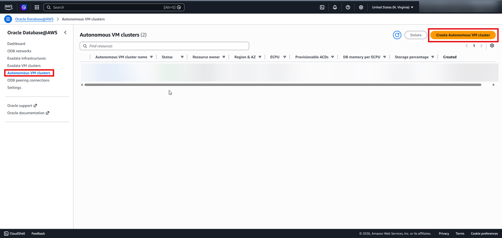
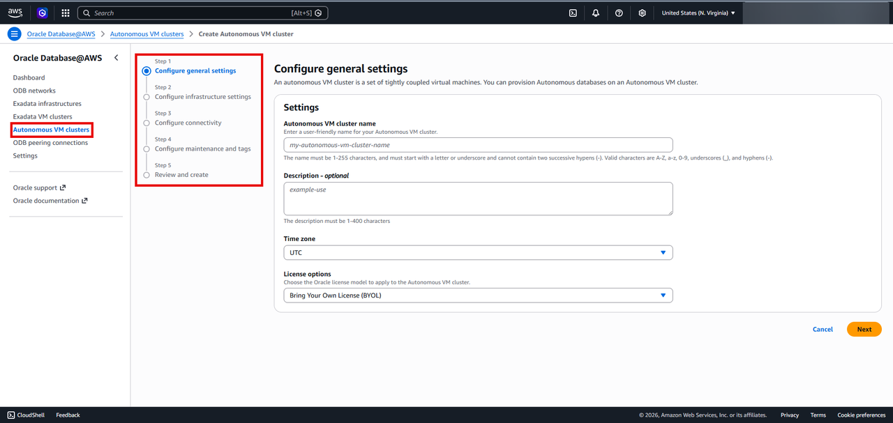
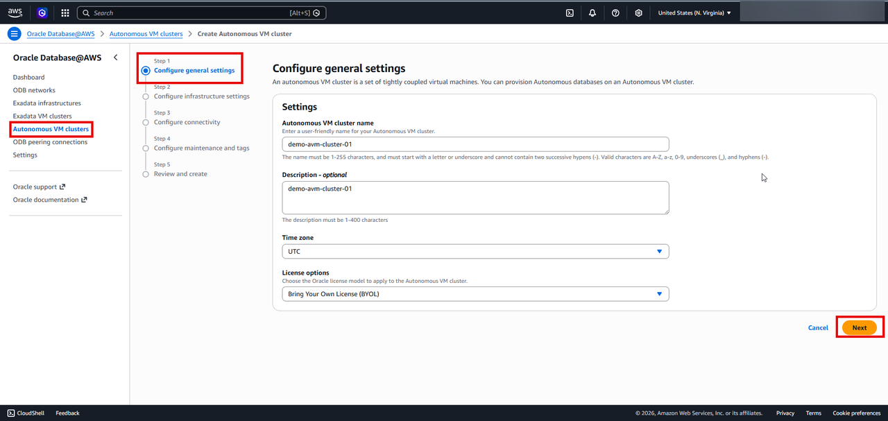
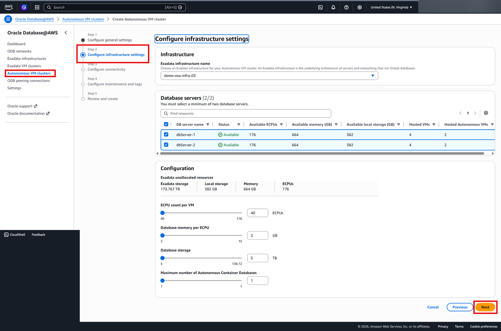
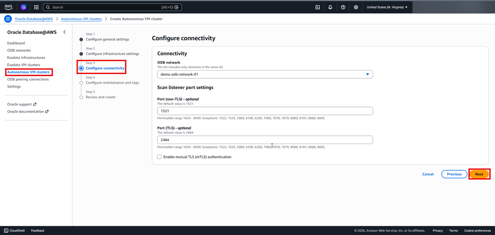
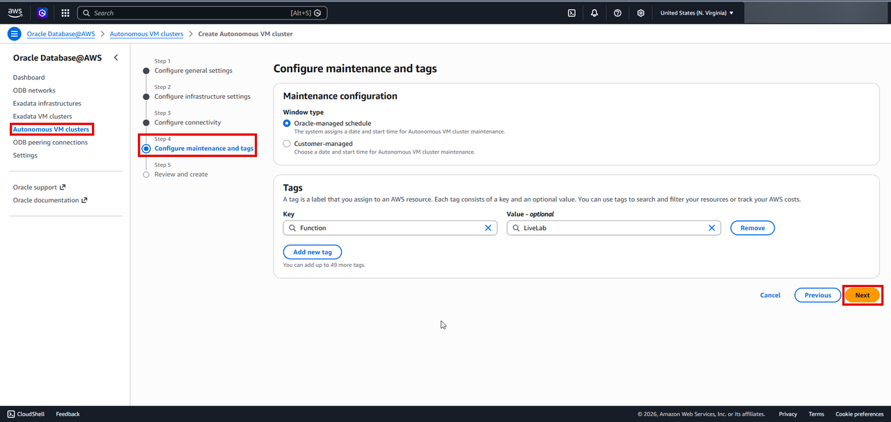
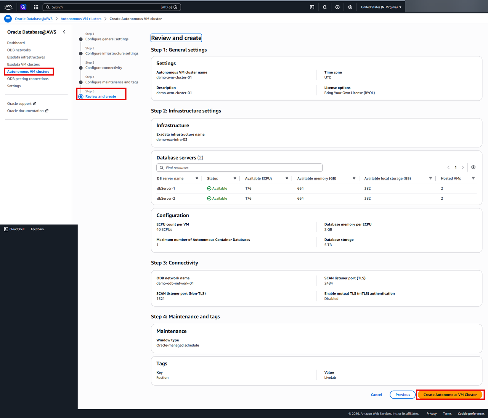
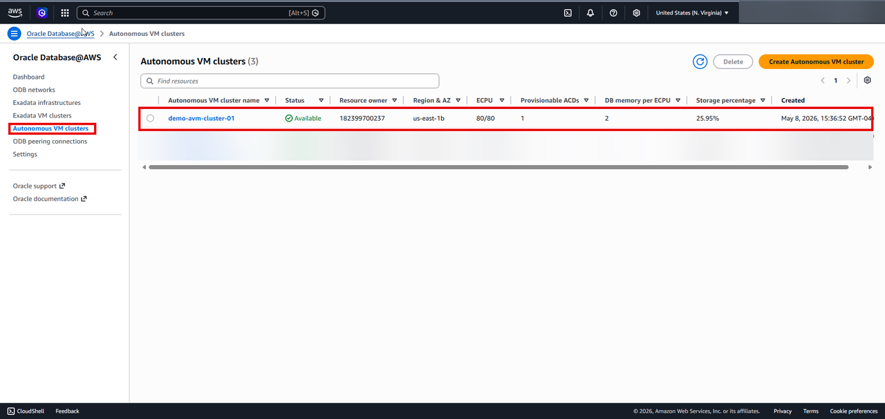
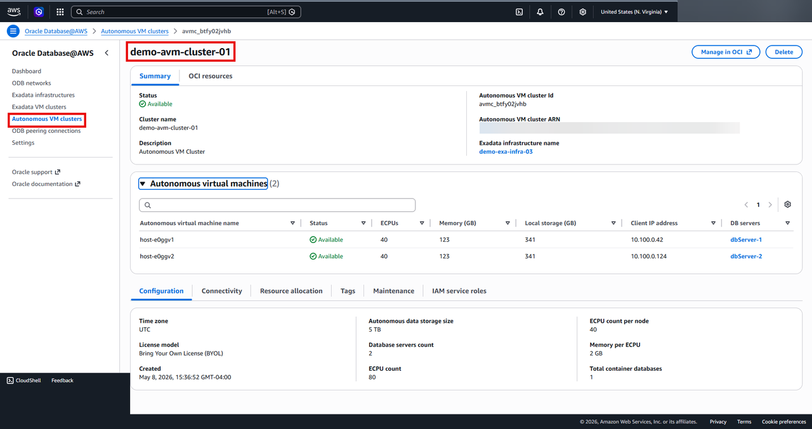

# Create the Required Resources to Create an Oracle Autonomous AI Database on Dedicated Exadata Infrastructure on Oracle AI Database@AWS

## Introduction

This lab walks you through creating an Autonomous VM Cluster which is required for creating an Autonomous AI Database.

**Autonomous VM Cluster** on Oracle AI Database@AWS delivers dedicated Oracle Exadata database infrastructure integrated directly within AWS environments, enabling customers to run Oracle Autonomous AI Database workloads with high performance, isolation, and operational control. Built on Oracle Exadata technology and deployed in AWS data centers, Autonomous VM Clusters provide secure, scalable compute and storage resources optimized for enterprise Oracle databases. Organizations benefit from autonomous automation capabilities—including self-patching, self-tuning, automated backups, and elastic scaling—while seamlessly integrating with AWS-native applications, networking, monitoring, and security services. This architecture helps enterprises modernize mission-critical workloads, improve performance and availability, and simplify database lifecycle management in a multicloud operating model.

 Estimated Time: About 4 hour.

### Objectives

You will login to AWS Console and perform the following task
- Create an Autonomous VM Cluster

## Create an Autonomous VM Cluster

1. Login to [AWS Management Console](https://us-east-1.console.aws.amazon.com/console/home?region=us-east-1) and search for Oracle Database@AWS

    

    >**Security Notice:** To ensure data privacy and security, certain fields on screen captures in this workshop have been redacted. Sensitive fields—such as IP addresses, subscription IDs, and personal identifiers—are obscured using solid gray rectangular boxes.

2. Click on the **Dashboard** to go to Oralce Database@AWS resources dashboard

    

3. From the left hand menu select **Autonomous VM clusters** and click on **Create Autonomous VM cluster**

  

 The **Create Autonomous VM Cluster** page is displayed
  

4. On Steps 1 - **Configure General Settings, enter the following information

 | Field | Value |
 |-------|-------------|
 |Autonomous VM cluster name|demo-avm-cluster-01 |
 |Description - optional|Autonomous VM Cluster |
 |Time zone|UTC |
 |License options|Bring Your Own License (BYOL) |

 

  Click on **Next**

5. On Step 2 - **Configure Infrastructure Settings**, enter the following information

 | Field | Value |
 |-------|-------------|
 |**Infrastructure**|
 |Exadata infrastructure name|demo-exa-infra-03|
 | **Leave everything else as default**|
 
  

  Click on **Next**

6. Step 3 - **Configure Connectivity**, enter the following information
 |Field | Value |
 |------|-------|
 |**Connectivity**|
 | ODB network| demo-odb-network-01|
 |**Scan listener port settings**|
 |Port (non-TLS) - optional|1521|
 |Port (TLS) - optional|2484|

  

 Click on **Next**

7. Step 4 - **Configure maintenance and tags**, Enter the following information

 |Field | Value |
 |------|-------|
 |**Maintenance Configuration**|
 |Window type|Oracle Managed Schedule|
 |**Tags**||
 |Key|Function|
 |Value|LiveLab|

 

  Click on **Next**
8. Step 5 - **Review and create**
  Review all the information that you entered and correct if anything is wrong or missing.
 

 Click on **Create Autonomous VM Cluster**
 >**This step may take upto 4 hours**

9. You can check the status and details of the created Autonomous VM Cluster on the Oracle AI Database@AWS dashboard.
 

 

10. Click the **Home** link in the breadcrumbs to return to the **Home** page in preparation for the next lab.

**Congratulations! You have successfully created Autonomous VM Cluster!**.

**You may now proceed to the next lab.**.

## Learn More
* [Oracle AI Database@AWS](https://docs.oracle.com/en-us/iaas/Content/database-at-aws/oaaws.htm)
* [Autonomous AI Database on Dedicated Exadata Infrastructure](https://docs.oracle.com/en/cloud/paas/autonomous-database/dedicated/adbaa/index.html)

## Acknowledgements
- **Author:** Devinder Singh, Senior Principal Solutions Architect - Multicloud
- **Contributor:** Devinder Singh, Senior Principal Solutions Architect - Multicloud
- **Last Updated By/Date:** Devinder Singh, May 2026

