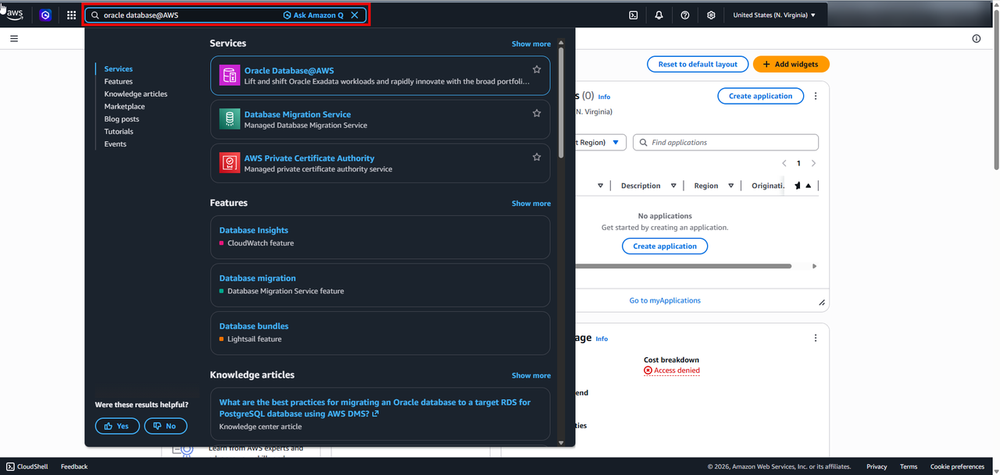
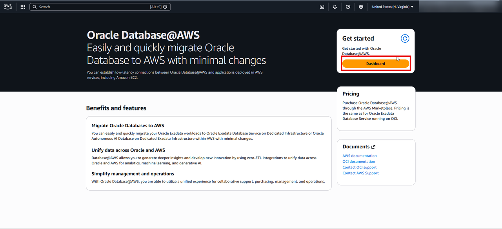
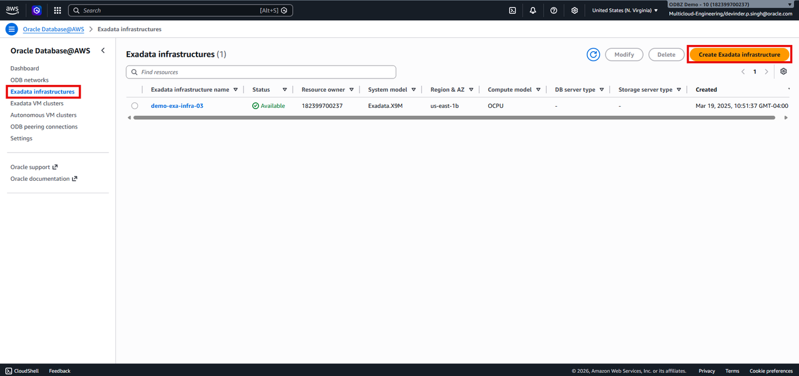
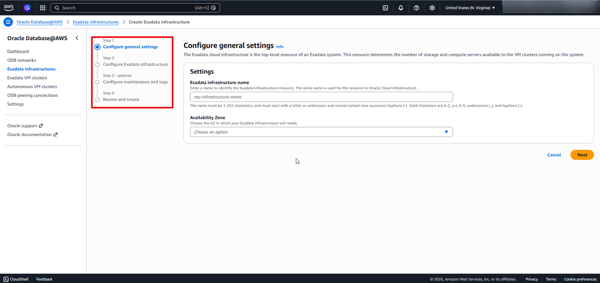
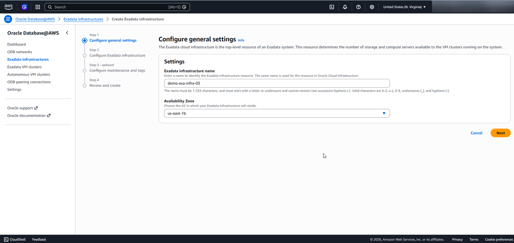
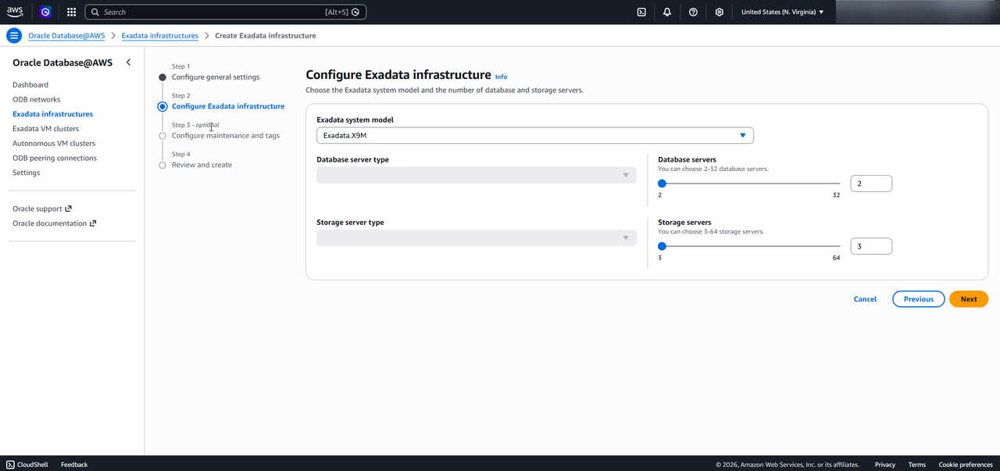
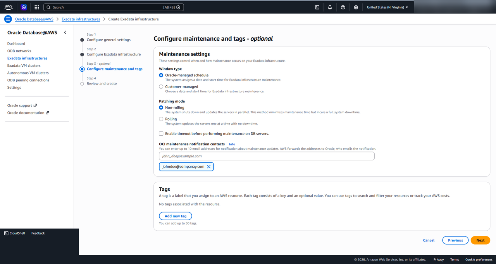
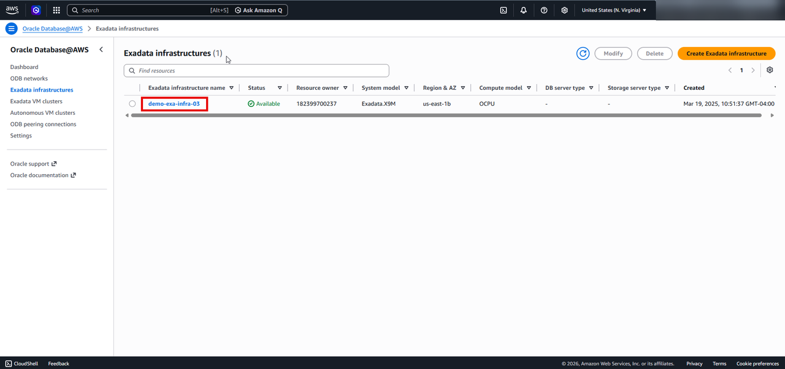

# Create Exadata Infrastructure

## Introduction

This lab walks you through creating Exadata Infrastructure which is required for creating an Autonomous VM cluster.

**Exadata Infrastructure** is Oracle’s engineered database platform that combines high-performance compute, intelligent storage, ultra-low-latency networking, and integrated database software into a single optimized system for running Oracle databases at scale.

 Estimated Time: About an hour.

### Objectives

You will login to AWS Console and perform the following task
- Create an Exadata Infrastructure

## Create an Exadata Infrastructure

1. Login to [AWS Management Console](https://us-east-1.console.aws.amazon.com/console/home?region=us-east-1) and search for Oracle Database@AWS

    

    >**Security Notice:** To ensure data privacy and security, certain fields on screen captures in this workshop have been redacted. Sensitive fields—such as IP addresses, subscription IDs, and personal identifiers—are obscured using solid gray rectangular boxes.

2. Click on the **Dashboard** to go to Oralce Database@AWS resources dashboard
    

3. Select Exadata Infastructure from the left hand menu and then click on Create Exadata Infrastructure
    
    

    The **Create Exadata Infrastructure** page is displayed.

     

4. On Step 1 **Configure general settings**, specify the following details

    - **Exadata infrastructure name:**  `demo-exa-infra-03`
    - **Availability Zone:** `us-east-1b`

    

     Click **Next**

5. On Step 2 **Configure Exadata Infrastructure** specify the following details

    - **Exadata system model:** `Exadata.X9M`
    - **Database server type:** `leave it as default`
    - **Storage server type:** `leave it as default`
    - **Database servers:** `leave it as default`
    - **Storage servers:** `leave it as default`

    

 Click **Next**

6. On Step 3 **Configure maintenance and tags**

    This step is optional

    

    Click **Next**

7. On Step 4 **Review and create**

 Review all the settings and **click** on  **Create Exadata Infrastructure**

 This step can take upto one hour.

 

8. Once the Exadata Infrastructure is created, you can view your Exadata Infrastructure from the Exadata infrastructure list on the Oracle Database@AWS dashboard.
 

9. Click the **Home** link in the breadcrumbs to return to the **Home** page in preparation for the next lab.

**Congratulations! You have successfully created Exadata Infrastructure!**.

**You may now proceed to the next lab.**.

## Learn More
* [Oracle AI Database@AWS](https://docs.oracle.com/en-us/iaas/Content/database-at-aws/oaaws.htm)
* [What is an Oracle Exadata ?](https://docs.oracle.com/en/engineered-systems/exadata-cloud-service/ecscm/exadata-cloud-infrastructure-overview.html)

## Acknowledgements
- **Author:** Devinder Singh, Senior Principal Solutions Architect - Multicloud
- **Contributor:** Devinder Singh, Senior Principal Solutions Architect - Multicloud
- **Last Updated By/Date:** Devinder Singh, May 2026

