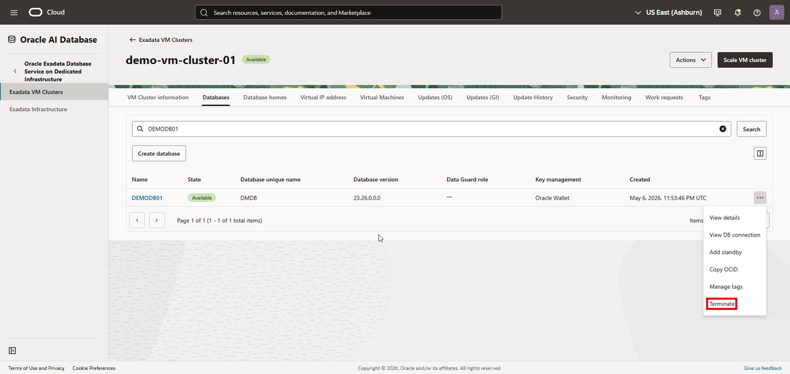
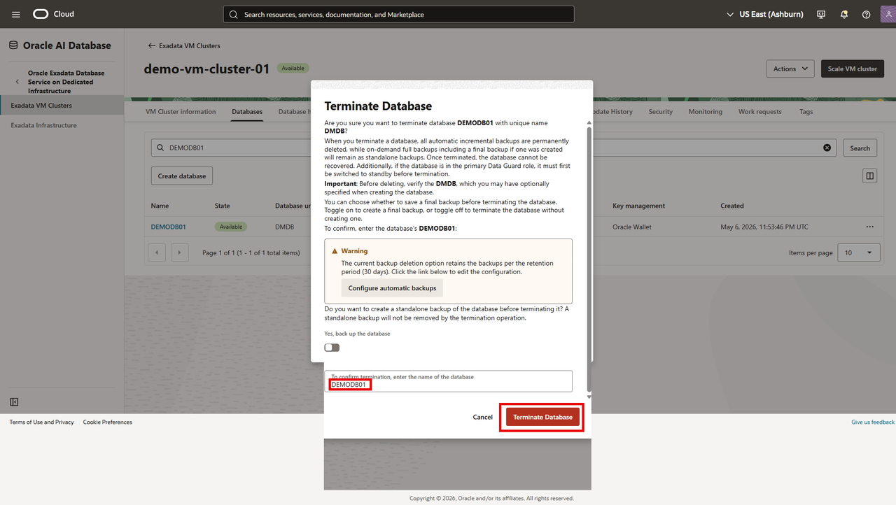
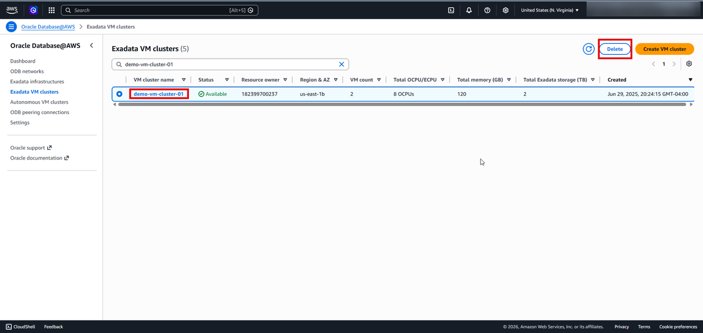
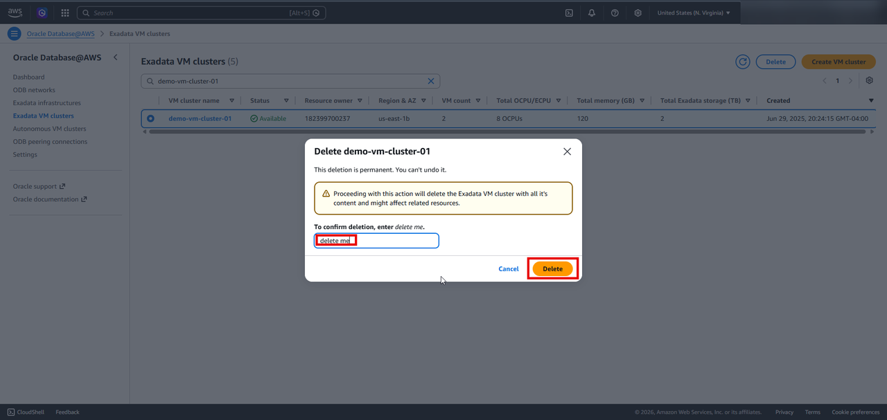
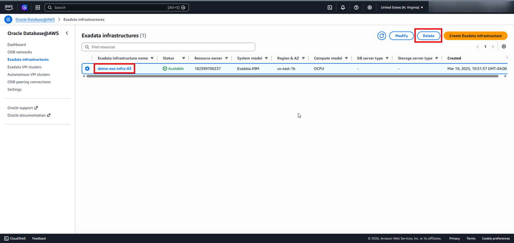
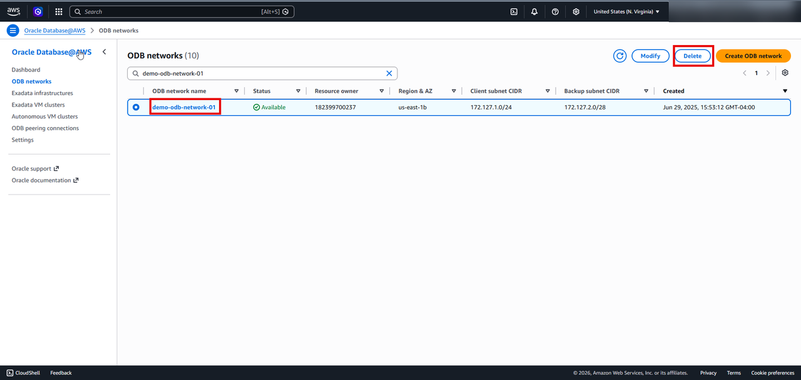
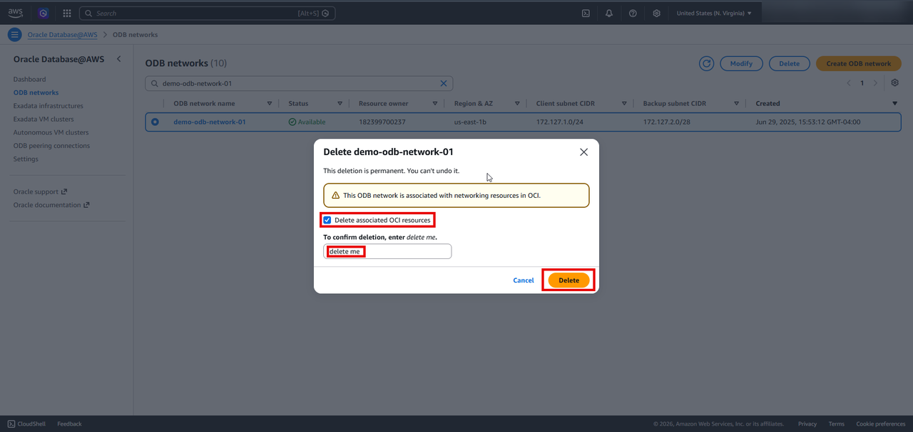

# Clean Up Resources

## Introduction

In this lab, you will delete the resources created in the previous labs. 

Estimated Time: About an 1-2 hours. 

### Objectives

- Delete resources created during the workshop. 

### Prerequisites

This lab assumes you have successfully completed all previous labs.

## Task 1: Delete Exadata Database
 >Exadata Database can be **deleted** only from OCI console  or by using OCI CLI. 

 select your database in OCI Console and from the three dot menu click on Terminate
 

 A warning screen pops up. To safegaurd against accidental deletion of the database, it will ask you to enter the name of the database that you want to delete. 
 click on **Terminate Database** after entering the name of the database that you want to delete. This will  initiate the deletion of your Exadata Database.  

 

## Task 2: Delete Exadata VM Cluster

 >Exadata VM Cluster can be **deleted** only from AWS Console or by using AWS CLI. 

select your Exadata VM Cluster from the Oracle Database@AWS dashboard and click on **delete**

 

 A warning screen pops up, warning that the deletion is permanent. To confirm delete enter **delete me** and click on **Delete** to initiate the deletion of your Exadata VM Cluster.
 

## Task 3: Delete Exadata Infrastructure

>Exadata Infrastructure can be deleted only from the AWS Console or by using AWS CLI. Deleting Exadata VM Cluster is a prerequisites for deleting an Exadata Infrastructure.

select your Exadata Infrastructure from the Oracle Database@AWS dashboard  and click on **delete**
 

A warning screen pops up, warning that the deletion is permanent. To confirm delete enter **delete me** and click on **Delete** to initiate the deletion of your Exadata Infrastrcutruee. 

## Task 4: Delete ODB Network

 >ODB Network deletion is only available through the AWS Console and AWS CLI. Deleting Exadata VM Cluster is a prerequisites for deleting an ODB Network.

 select your ODB Network from the Oracle Database@AWS dashboard and click on **delete**
 

 A warning screen pops up, warning that the deletion is permanent. Check **Delete associated OCI resources**.  To confirm delete enter **delete me** and click on **Delete** to initiate the deletion of your ODB network. 
 

Click the **Home** link in the breadcrumbs to return to the **Home** page in preparation for the next lab.

 **Congratulations! You have completed the workshop!**

## Acknowledgements
- **Author:** Devinder Singh, Sr Principal Soltiuons Architect, Multicloud
- **Last Updated By/Date:** Devinder Singh, May 2026
