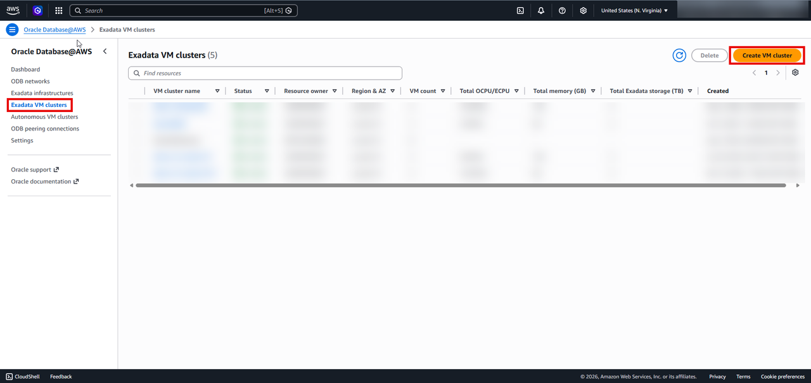
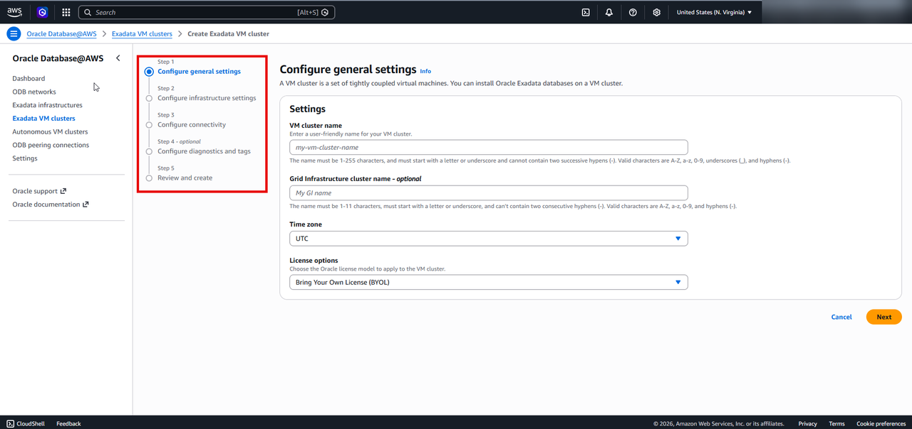
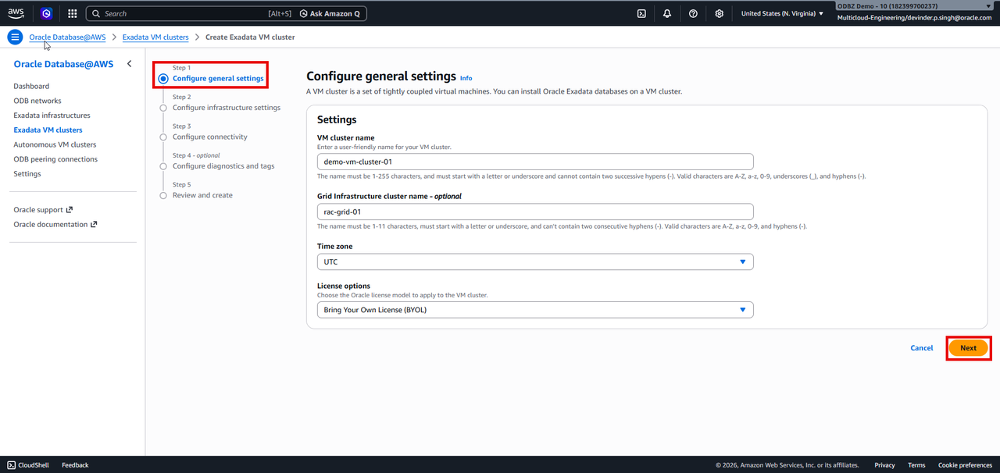
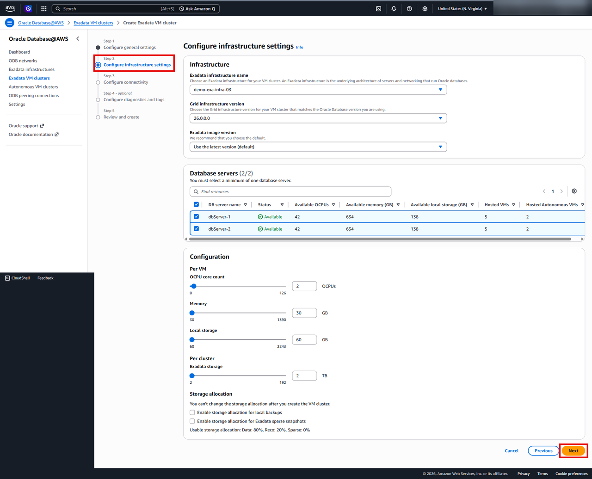
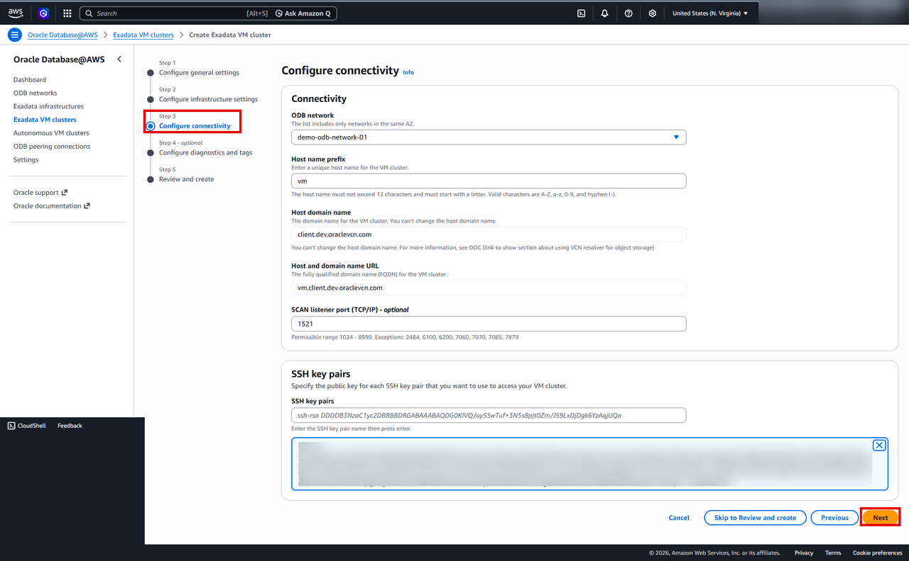
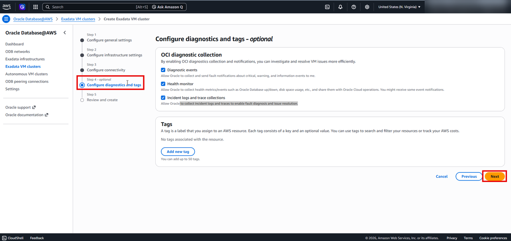
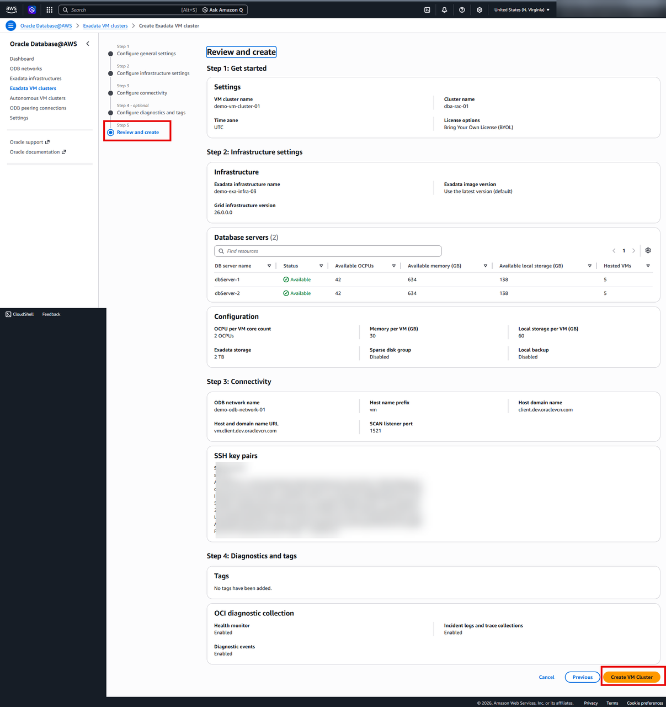
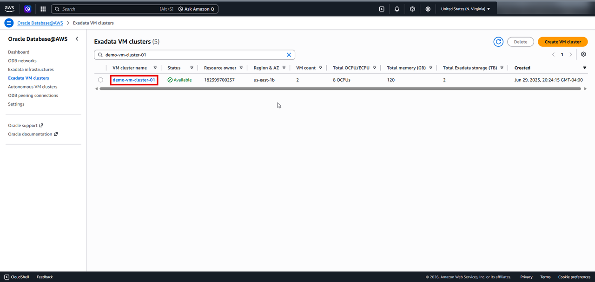

# Create the Required Resources to Create an Oracle Exadata Database Service on Dedicated Infrastructure on Oracle AI Database@AWS

## Introduction

This lab walks you through creating Exadata VM Cluster which is required for creating an Exadata Database. 

An **Exadata VM Cluster** is a managed group of virtual machines running on Oracle Exadata infrastructure that hosts Oracle databases in a highly available, scalable, and performance-optimized environment. A VM Cluster allows organizations to consolidate multiple databases on an Exadata infrastructure while maintaining isolation, flexibility, and cloud-native operations. Administrators can independently scale CPU resources, storage, and database workloads, apply rolling patches with minimal downtime, and use Oracle RAC for high availability. Features such as automated backups, Data Guard integration, and fine-grained resource management make Exadata VM Clusters ideal for mission-critical OLTP, analytics, and mixed database workloads that require extreme performance, resilience, and operational efficiency.

### Objectives

You will login to AWS Console and perform the following task

- Create an Exadata VM Cluster

> **Estimated time:** 4-5 hours.

## Prerequisites

Before starting, ensure the following are in place:

- ✅ An **ODB Network** already exists (with Client subnet CIDR and Backup subnet CIDR configured)
- ✅ An **Oracle Exadata Infrastructure** already exists
- ✅ An **SSH public key** is available to paste into the wizard

> If any of the above are missing, create them first before proceeding.

## Create the Exadata VM Cluster 

1. Login to [AWS Management Console](https://us-east-1.console.aws.amazon.com/console/home?region=us-east-1) and search for Oracle Database@AWS

    

    >**Security Notice:** To ensure data privacy and security, certain fields on screen captures in this workshop have been redacted. Sensitive fields—such as IP addresses, subscription IDs, and personal identifiers—are obscured using solid gray rectangular boxes.

2. Click on the **Dashboard** to go to Oralce Database@AWS resources dashboard
    

3. From the left hand menu select Exdata VM Clusters and click on Create VM cluster
    

 The **Create Exadata VM Cluster** page is displayed.

     

4. Step 1 - **Configure General Settings**

    | Field | Description |
    |-------|-------------|
    | **VM cluster name** | demo-vm-cluster-01 |
    | **Grid infrastructure cluster name** | rac-grid-01 |
    | **Time zone** | Select from the drop-down. Default: **UTC**. |
    | **License type** | Choose **Bring Your Own License (BYOL)** *(default)* or **License Included**. |

    

 Click **Next**

5. Step 2 - **Configure Infrastructure Settings**

       | Field | Description |
       |-------|-------------|
       | **Exadata infrastructure** | demo-exa-infra-03 |
       | **Grid infrastructure version** | 26.0.0.0 |
       | **Exadata image version** | Use the latest version(default) |
       | **Database servers** | Select all the database server. |

**Per-VM Resource Configuration** (adjustable with sliders):

| Resource | Notes |
|-------|-------------|
| **OCPU core count** | Leave it as default |
| **Memory** |  Leave it as default |
| **Local storage** | Leave it as default |

**Per-Cluster Configuration** (adjustable with sliders):

| Resource | Notes|
|----------|-------|
| **Exadata storage** | Leave it as default |

**Optional checkboxes** *(cannot be changed after creation)*:

    - ☐ **Sparse disk group**
    - ☐ **Local backup**

> ⚠️ These two options are **permanent**

    Click **Next**

6. Step 3 - **Configure connectivity**

| Field | Description |
|-------|-------------|
| **ODB network** | demo-odb-network-01 |
| **Host name prefix** | vm |
| **Host domain name** | Read-only — auto-populated for reference. |
| **Host and domain name URL** | Read-only — auto-populated for accuracy checks. |
| **SCAN listener port** | Optional. Default: **1521**. Valid range: **1024–8999** (see excluded ports below). |
| **SSH key pairs** | Paste public key created in the previous Lab |

    Click **Next**

7. Step 4 — **Configure Diagnostics and Tags**

| Option | What It Does |
|--------|--------------|
| **Diagnostic events** | Allows Oracle to send fault notifications (critical, warning, info) to OCI maintenance contacts. |
| **Health monitor** | Allows Oracle to collect health metrics (DB up/down, disk space, etc.) and report to OCI contacts. |
| **Incident logs and trace collections** | Allows Oracle to collect logs and traces for fault diagnostics and issue resolution. |

    Click **Next** 

8. Step 5 — **Review and Create**

  Carefully **review all settings** from all previous steps.
  Use the **Back** button to return and correct anything as needed.
  When satisfied, click **Create Exadata VM cluster** to submit.

> ⏱️ Cluster creation can take **several hours**. Monitor provisioning status from the
> Exadata VM Cluster list on the Oracle AI Database@AWS dashboard.

9. Once the Exadata VM Cluster is created, you can view your Exadata VM Cluster from the Exadata VM Cluster list on the Oracle AI Database@AWS dashboard.

10. Click the **Home** link in the breadcrumbs to return to the **Home** page in preparation for the next lab.

 **Congratulations! You have successfully created Exadata VM Cluster!**.

 **You may now proceed to the next lab.**

## Learn More
* [Oracle AI Database@AWS](https://docs.oracle.com/en-us/iaas/Content/database-at-aws/oaaws.htm)
* [What is an Oracle Exadata ?](https://docs.oracle.com/en/engineered-systems/exadata-cloud-service/ecscm/exadata-cloud-infrastructure-overview.html)

## Acknowledgements
- **Author:** Devinder Singh, Senior Principal Solutions Architect - Multicloud
- **Contributor:** Devinder Singh, Senior Principal Solutions Architect - Multicloud
- **Last Updated By/Date:** Devinder Singh, May 2026
