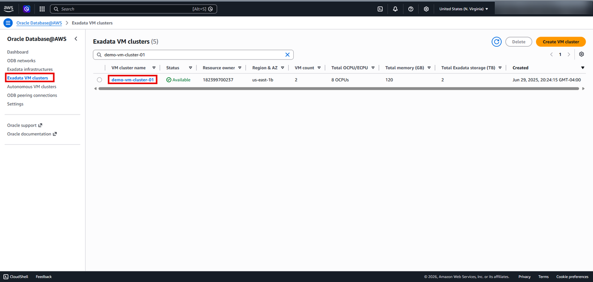
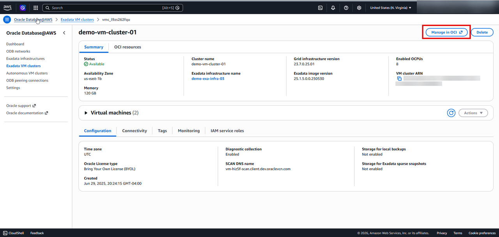
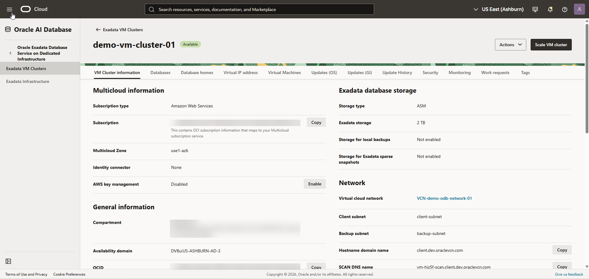
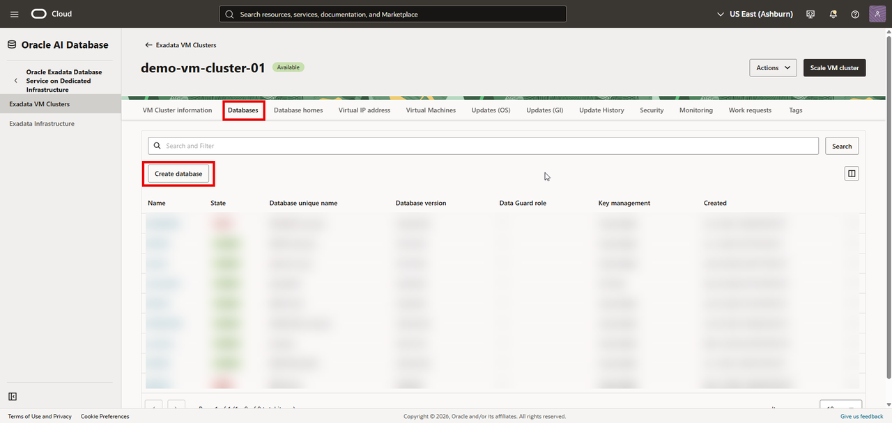
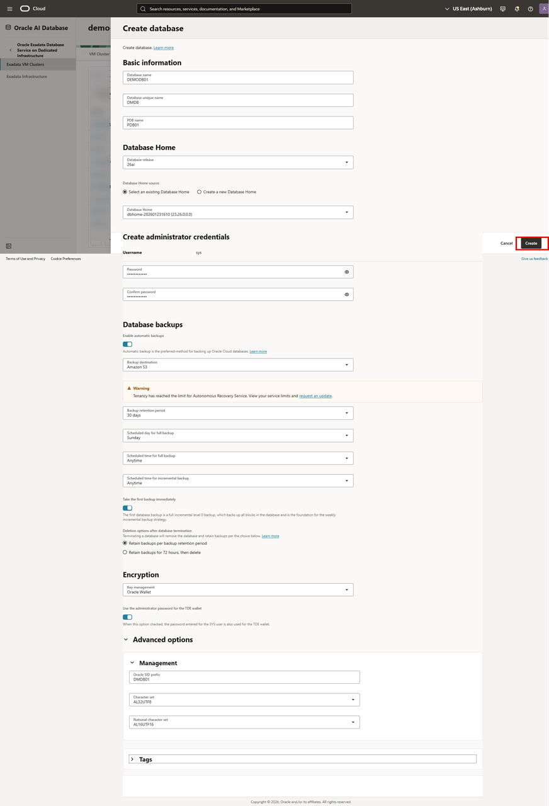
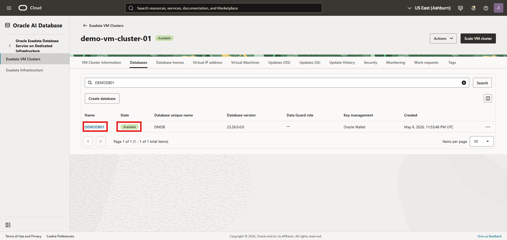

# Creating an Oracle Exadata Database via OCI Console

## Introduction

This lab walks you through creating Exadata Database through OCI Console.

An Exadata Database is an Oracle Database deployed on Oracle Exadata systems, purpose-built to deliver extreme performance, scalability, availability, and efficiency for enterprise workloads. It combines the advanced capabilities of Oracle Database with the intelligent infrastructure of Exadata, enabling organizations to run mission-critical OLTP, analytics, AI, and mixed workloads with significantly improved speed and reliability. Exadata Databases leverage unique optimizations such as Smart Scan, SQL offloading, high-speed RDMA networking, persistent memory, and automated storage management to accelerate query processing and reduce latency.

 Estimated Time: About 30 minutes. 
 
### Objectives

Create an Exadata Database and its components — **Database Home**,
**Container Database (CDB)**, and **Pluggable Database (PDB)** — using the OCI Console.

> **Important:** Exadata Database creation is only available through the **OCI Console** and **OCI CLI**. 

## Prerequisites

Before starting, ensure the following are in place:

- ✅ An **Exadata VM Cluster** that you created in the previous lab in an **Available** state
- ✅ You have access to the **Oracle AI Database@AWS dashboard**
- ✅ You have access to **OCI Console**

---

## Task 1: Navigate to the OCI Console

1. From the **Oracle AI Database@AWS dashboard** or the **Exadata VM Cluster list**
 

 select the Exadata VM Cluster you created in the previous lab and Click the **Manage in OCI** button.

 

> This opens the OCI Console where you can manage your Exadata VM Cluster and create Exadata databases.

 

## Task 2: Create the Database

1. select the **Databases** tab and Click the **Create database**
    

    Complete the following fields on the **Create database** page:

    | Field | Description |
    |-------|-------------|
    | **Database name** | DEMODB01 |
    | **Unique database name** | DMDB |
    | **Database version** | 26ai |
    | **PDB name** | PDB01 |
    | **Select an existing Database Home** | dbhome-202601231610 (23.26.0.0.0)|
    | **Password** | Enter a strong administrator password. |
    | **Confirm password** | Re-enter the password to confirm. |

2. Configure Automatic Backups

    Click **Enable automatic backups** to turn on automatic incremental backups.
    From the **Backup destination** dropdown, select **Amazon S3**

4. Configure the backup schedule: Leave it default

    Deletion options after database termination : Retain backups per backup retention period
5. Encryption : Oracle Wallet

6. Expand the **Advanced options** section and complete the following:

    Oracle SID Prefix : DMDB01

7. Click the **Create** button to submit the database creation request.

    

8. The database **Status** will show **Provisioning** during creation. Once complete, the status changes to **Available**.

    

9. Click the **Home** link in the breadcrumbs to return to the **Home** page in preparation for the next lab.

 **Congratulations! You have successfully created Exadata Database!**.

 **You may now proceed to the next lab.**

## Learn More
* [Oracle AI Database@AWS](https://docs.oracle.com/en-us/iaas/Content/database-at-aws/oaaws.htm)
* [What is an Oracle Exadata ?](https://docs.oracle.com/en/engineered-systems/exadata-cloud-service/ecscm/exadata-cloud-infrastructure-overview.html)

## Acknowledgements
- **Author:** Devinder Singh, Senior Principal Solutions Architect - Multicloud
- **Contributor:** Devinder Singh, Senior Principal Solutions Architect - Multicloud
- **Last Updated By/Date:** Devinder Singh, May 2026
