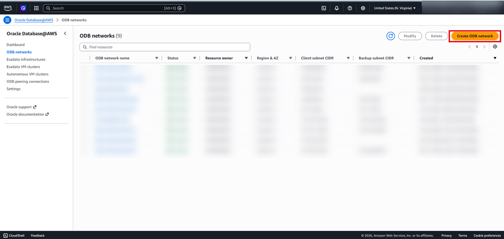
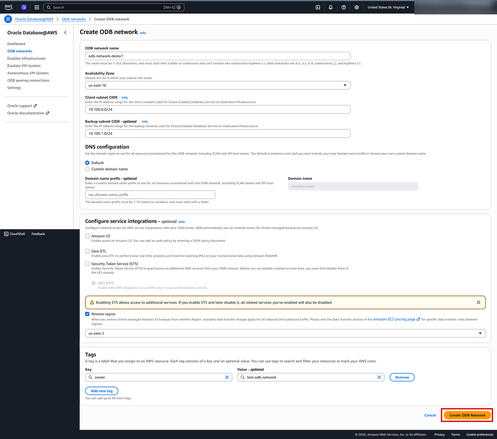
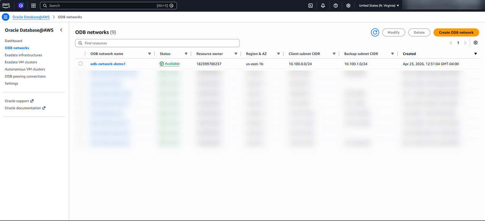

# Create the Required Resources to Create an Oracle Exadata Database Service on Dedicated Infrastructure on Oracle AI Database@AWS

## Introduction

This lab walks you through creating the ODB Network to create an Oracle Exadata Database on Dedicated Infrastructure on Oracle AI Database@AWS.

Estimated Time: 15 minutes

### Objectives

You will login to AWS Console and perform the following task
- Create an ODB Network

## Task 1: Create an ODB network
An ODB network (Oracle Database network) is a core building block in Oracle’s multicloud offerings like Oracle AI Database@AWS.
An ODB network is a private, isolated network environment that hosts Oracle database infrastructure (like Exadata) inside another cloud provider’s data center, and acts as the bridge between that cloud and Oracle Cloud Infrastructure (OCI).
It’s essentially a dedicated network space (with its own CIDR/IP range) where Oracle-managed database resources run.
It maps directly to Oracle’s internal cloud networking (OCI), even though it physically resides in another cloud (e.g., AWS AZ).

In this task, you will create an ODB Network.

1. Login to [AWS Management Console](https://us-east-1.console.aws.amazon.com/console/home?region=us-east-1) and search for Oracle Database@AWS

    

    >**Security Notice:** To ensure data privacy and security, certain fields on screen captures in this workshop have been redacted. Sensitive fields—such as IP addresses, subscription IDs, and personal identifiers—are obscured using solid gray rectangular boxes.
2. Make sure you are in the correct region where you want to create your ODB network. Click on the dashboard to go to Oralce Database@AWS resources dashboard and 
    

3. Select ODB networks from the left hand menu and then click on Create ODB Network
    
    The **Create ODB Network** page is displayed.

4. Enter the following information:
    a. ODB network name: demo-odb-network-01

    b. Availability Zone: us-east-1a

    c. Client subnet CIDR: 172.127.1.0/24

    d. Backup subnet CIDR:172.127.2.0/28 

    e. DNS configuration: select the Default option

    f. Configure service integrations: Amazon S3
    
    g. Restore region: us-east-2
    h. Tags: Key=owner, value-optional=test-odb-network

    Once you have entered required info, click on Create ODB Network.  

    

    This step can take upto to 30 minutes. 

5. Once the ODB network is created, you can view your ODB network from the ODB network list on the Oracle AI Database@AWS dashboard.

    

6. Click the **Home** link in the breadcrumbs to return to the **Home** page in preparation for the next lab.

**Congratulations! You have successfully created ODB Network!**.

**You may now proceed to the next lab.**.

## Learn More
* [Oracle AI Database@AWS](https://docs.oracle.com/en-us/iaas/Content/database-at-aws/oaaws.htm)
* [What is a ODB Network ?](https://docs.oracle.com/en-us/iaas/Content/database-at-aws-exadata-awscr/awscr-create-odb-network.html)

## Acknowledgements
- **Author:** Devinder Singh, Senior Principal Solutions Architect - Multicloud
- **Contributor:** Devinder Singh, Senior Principal Solutions Architect - Multicloud
- **Last Updated By/Date:** Devinder Singh, May 2026
