# Provision an Oracle Autonomous AI Database

## Introduction

This lab walks you through the steps to deploy a Virtual Machine (VM) using the Azure portal so that you can access Database actions in your provisioned Autonomous AI Database.

Estimated Time: 10 minutes

### Objectives

In this lab, you will:

- Deploy a Virtual Machine (VM) in Azure
- Connect to the VM via Remote Desktop Protocol (RDP)
- Access Database Actions from the VM
- Navigate to the SQL Worksheet and run a simple SQL Query

### Prerequisites

- This lab requires the completion of all of the previous labs in the **Contents** menu on the left.

## Task 1: Create a Virtual Machine in Azure Portal

To access your Oracle Autonomous AI Database actions, you must use a "Jump Box" (Virtual Machine or VM) located within the same private network (VNet), as private endpoints are not accessible from the public internet. If you don't have a VM, use the following steps to deploy one.
    
Deploy a Virtual Machine (VM) that can "see" your private Oracle Autonomous AI Database as follows:

1.	On the Azure Portal Home page, search for **Virtual machines**, and then select **+ Create > Virtual machine**.

2.	On the **Basics** tab, specify the following: 
    - **Resource Group:** Select the resource group that contains your database, `training-adb-rg` in our example.
    - **Security type:** `Standard`.
    - **Image:** In our example, we will choose `Windows 11 Pro, version 25H2 - x64 Gen2` (select the option that is appropriate for you).
    - **Size:** Select at least 2 vCPUs and 8 GB RAM for stability. In our example, we chose `Standard_B2as_v2 – vcpus, 8 GiB memory`.
    - **Administrator Account:** Enter a username and a strong password that you can remember.
    - **Public inbound ports:** `Allow selected ports`.
    - **Select inbound ports:** `RDP (3389)`.
    - **Delete public IP and NIC when VM is deleted:** `Checked`.
    - **Licensing:** `Checked`.

        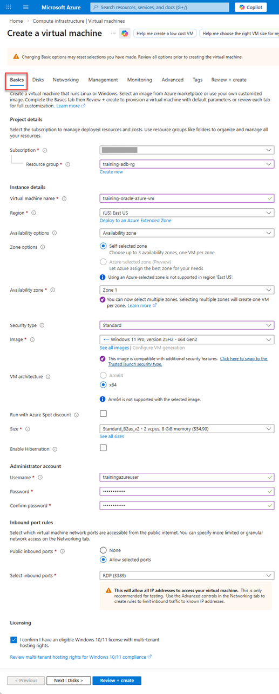

3.	On the **Networking** tab (Critical), specify the following:
    - **Virtual Network:** Select the same VNet where your Oracle Autonomous AI Database is provisioned, `training-oracle-vm` in our example.
    - **Subnet:** Choose a subnet that has routing access to the database's private subnet.

        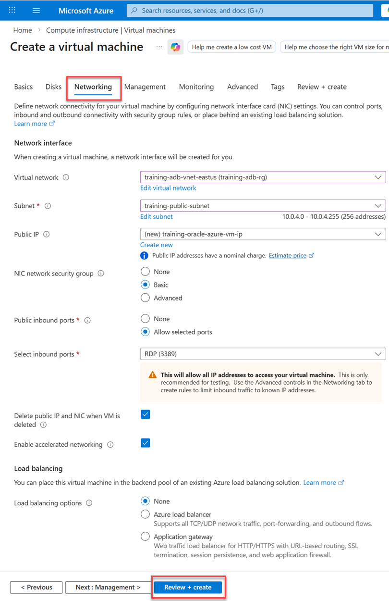

4.	Click the **Review + create** tab. If the `Validation passed` message is displayed, click **Create**. 

     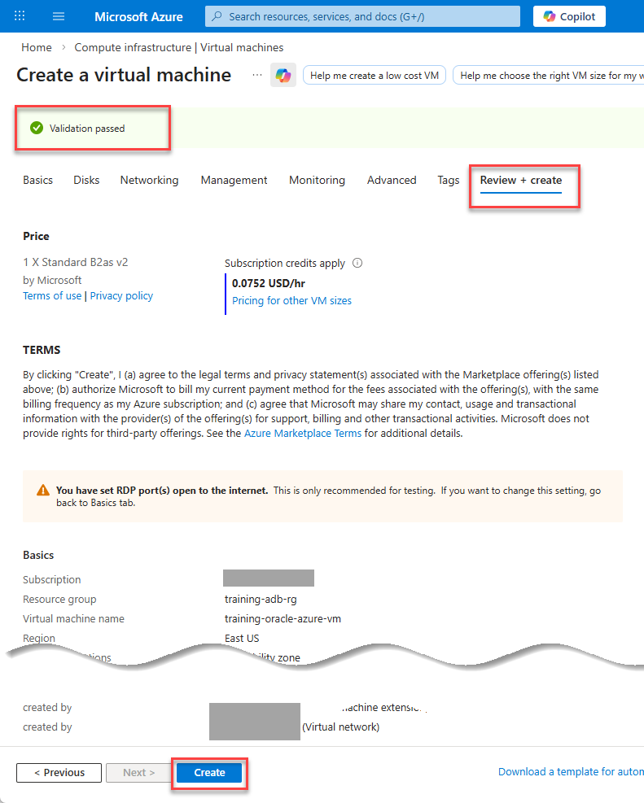

5. When the VM is deployed, a `Your deployment is complete` message is displayed.

    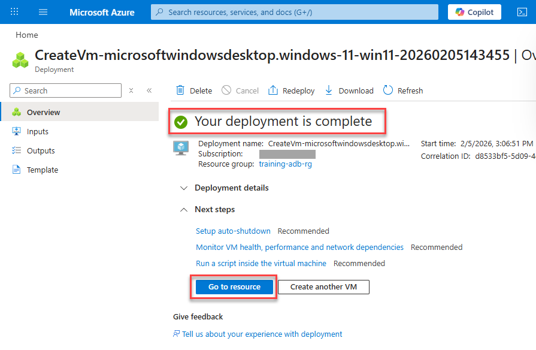

6. Click **Go to resource**. Your VM **Overview** page is displayed. Expand the **Connect** node in the navigation tree, and then click **Connect**.

    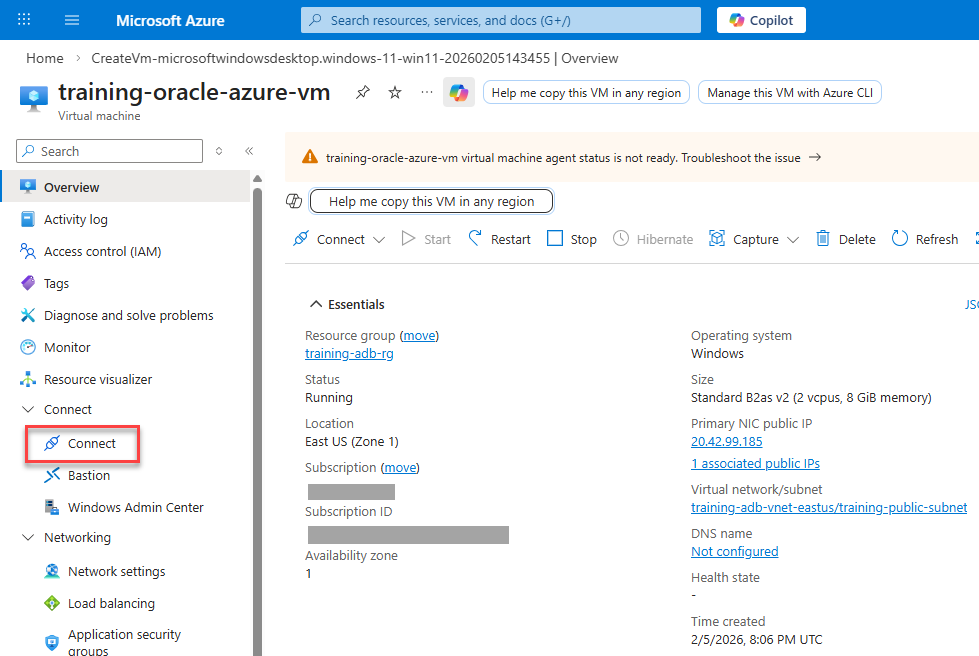

7. On the **Connect** page, click **Check access**.

    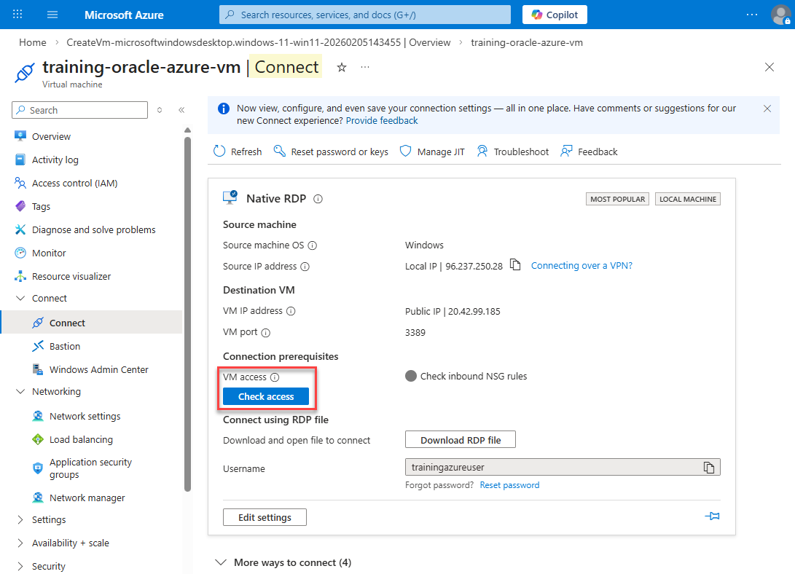

8. A `Port 3389 is accessible from source IP(s)` message is displayed.

    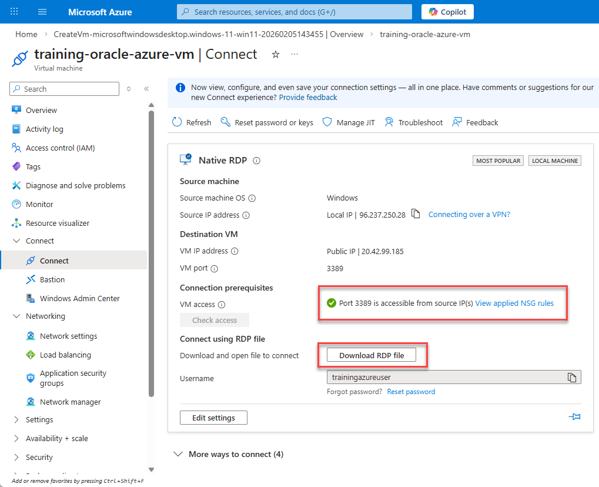

9. In the **Connect using RDP file** section, click **Download RDP file** to obtain the connection details for remote access to your Azure Windows VM; an RDP (.rdp) file or Remote Desktop Protocol, is a pre-configured configuration file that allows you to connect to a Windows Virtual Machine (VM) using the Remote Desktop Protocol. The file will be saved in your default `Downloads` folder as the VM's name such as `training-oracle-azure-vm.rdp` (or with your VM's name, if different).

## Task 2: Connect to the VM via Remote Desktop Protocol (RDP)

>**Note:** To ensure a stable connection to your VM, please disconnect any active VPNs before attempting to connect. Certain VPN configurations may block the specific ports or protocols required for the workshop environment.

Once the VM is **Running**, connect to it from your local computer as follows:

1. Double-click the downloaded `training-oracle-azure-vm.rdp` file to start the remote connection. 
    
    >**Note:** If prompted with a security warning about the remote computer's identity, click **Connect** to continue. If also prompted about the identity of the remote computer cannot be verified, click **Yes** to continue.

2. On the **Enter your credentials** dialog box, enter your VM's credentials, and then click **OK**.

    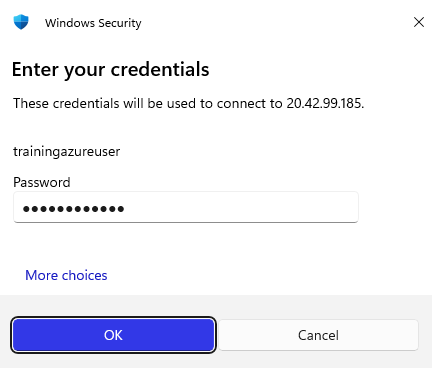

3. The VM is displayed. 

    

## Task 3: Access Database Actions from the VM

Since your VM is now inside the private network, it can resolve the database's private URL.

1. Inside the Remote Desktop session (on the Windows 11 VM), open Microsoft Edge. 

    

2. Paste the Database actions URL from OCI that you saved in **Task 2** into the browser.

3. Sign in as the `ADMIN` user with the password you used when you provisioned your database. 

    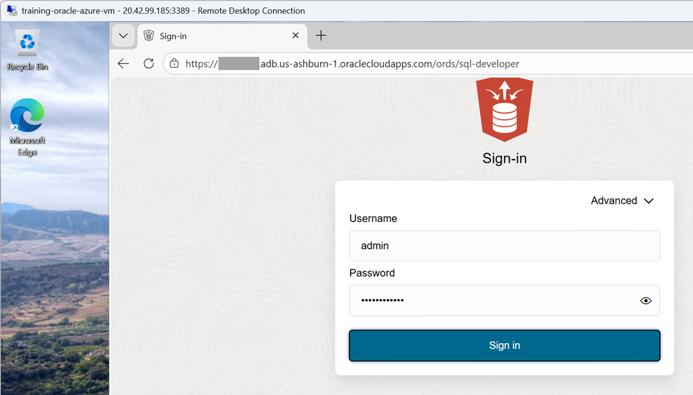
    
    The **Database Actions Launchpad** is displayed. You can now access SQL Worksheet, Data Modeler, and other tools in Data Studio.

4. To access the SQL Worksheet, click the **Development** tab, and then click the **SQL** tab.

    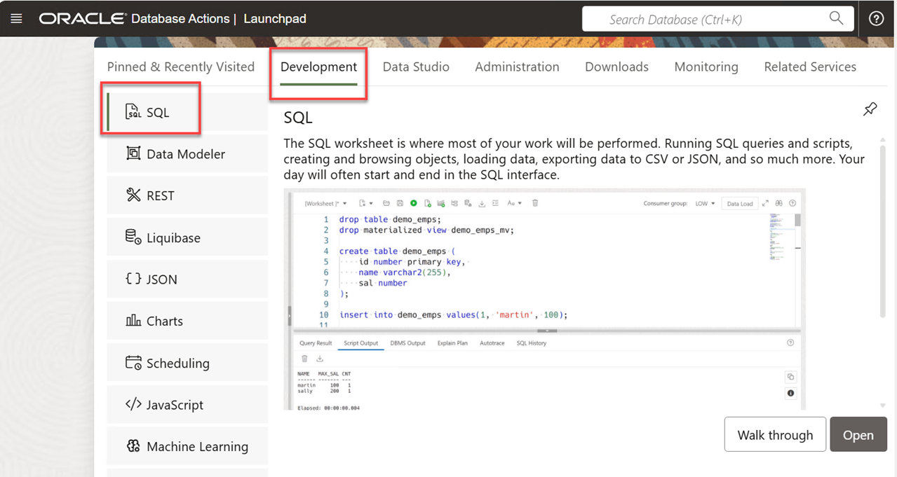

5. Copy the following query, paste it into the SQL Worksheet, and then click the **Run Statement** icon on the toolbar. The results are displayed in the **Query Result** tab.

    ```
    <copy>
    SELECT *
    FROM sh.countries;
    </copy>
    ```
    
    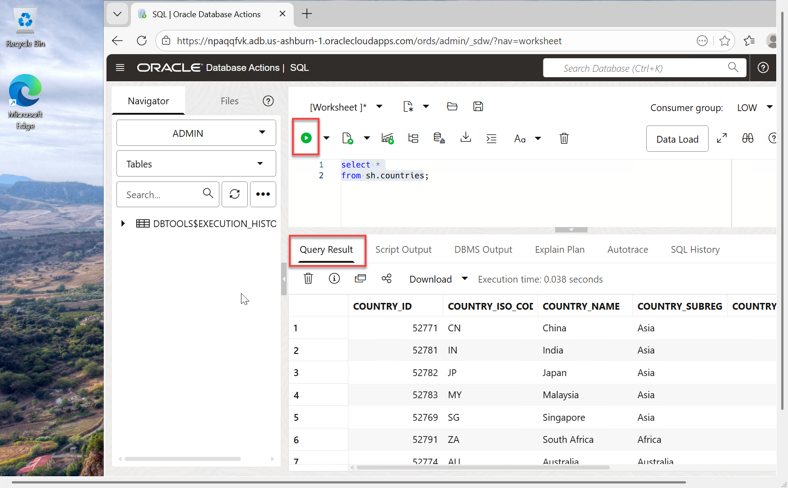

**All Done! You have successfully deployed your Oracle Autonomous AI Database instance and accessed the database in OCI.**

You may now **proceed to the next lab**.

## Learn More
* [Oracle Database@Azure](https://docs.oracle.com/en-us/iaas/Content/database-at-azure/oaa.htm)
* [Create an Autonomous AI Database using the Azure portal](https://docs.oracle.com/en-us/iaas/Content/database-at-azure/azucr-create-autonomous-ai-database.html#GUID-F48CC33E-E53F-44AD-BB36-BE4FC183368E)

## Acknowledgements
- **Author:** Lauran K. Serhal, Consulting User Assistance Developer, Oracle Autonomous AI Database and Multicloud
- **Contributors:**
    * Devinder Singh, SR Principal Solutions Architect - Multicloud
    * Tejus Subrahmanya, Principal Product Manager
* **Last Updated By/Date:** Lauran K. Serhal, February 2026