# Create the Required Resources to Provision an Oracle Autonomous AI Database

## Introduction

This lab walks you through creating the prerequisite resources to provision an Autonomous AI Database using `Oracle Database@Azure`. You will create a resource group, a virtual network (VNet), and a subnet that needs to be delegated to `Oracle.Database/networkAttachement`.

Estimated Time: 15 minutes

### Objectives

You will login to Azure portal and perform the following tasks:
- Create a resource group 
- Create a virtual network
- Add a subnet to the virtual network
- Delegate the subnet to the `Oracle Database@Azure` Service
- Create a public subnet to use when you create the required Virtual Machine (VM)

## Task 1: Create a Resource Group

A resource group in Azure Portal is a logical container that holds related Azure resources such as virtual machines, databases, and storage accounts so they can be managed collectively. Resource groups help organize resources for management, monitoring, and access control based on lifecycle and permissions within a specific Azure subscription.

In this task, you will create a resource group.

1.  Login to [Azure Portal](portal.azure.com). In the **Azure services** section, click the **Resource groups** icon. If the **Resource groups** icon is not displayed, you can search for it using the **Search resources, services, and docs** search field.

    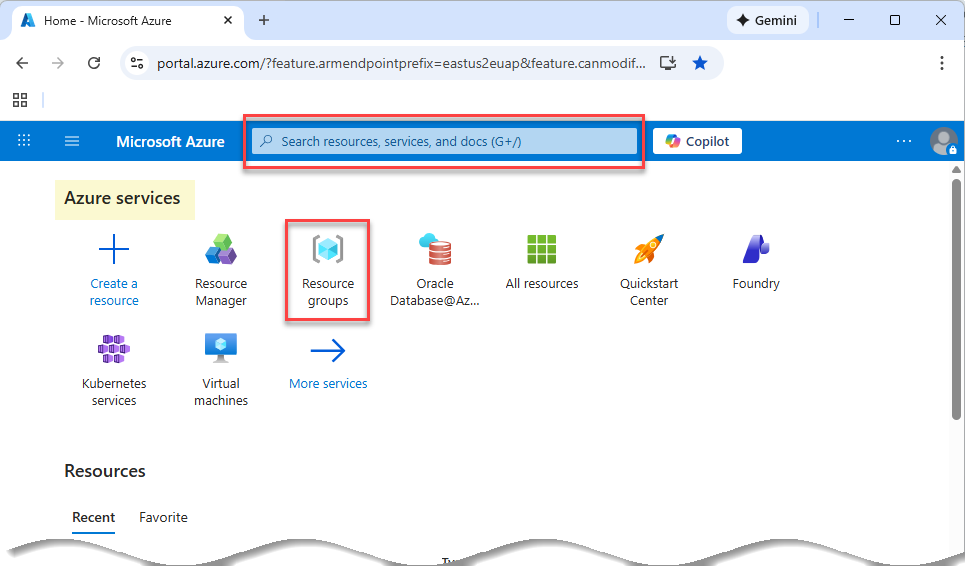

    >**Security Notice:** To ensure data privacy and security, certain fields on screen captures in this workshop have been redacted. Sensitive fields—such as IP addresses, subscription IDs, and personal identifiers—are obscured using solid gray rectangular boxes.

2.	On the **Resource groups** page, click **+ Create**.

    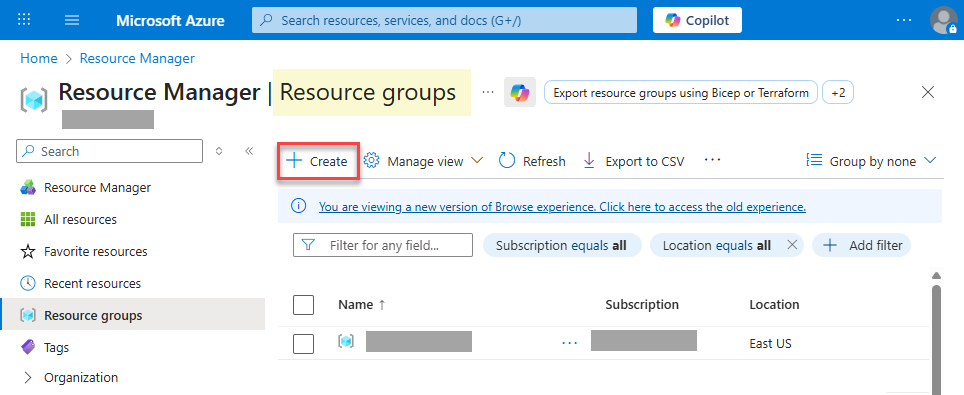

    The **Create a resource group** page is displayed.

    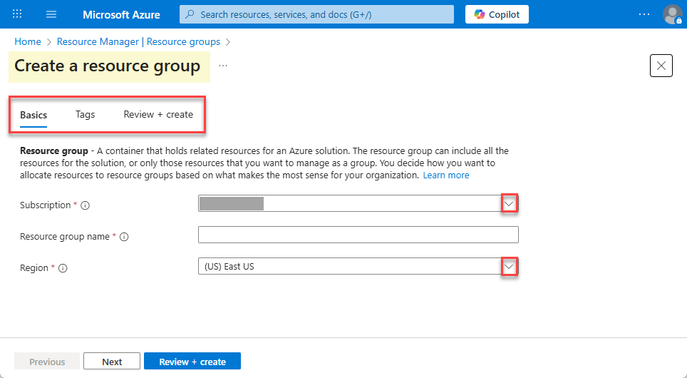

3.	 On the **Basics** tab, specify the following details:
    - **Subscription:** Select your billing subscription from the drop-down list.
    - **Resource group name:** `training-adb-rg`.
    - **Region:** Select your region from the drop-down list.
    
        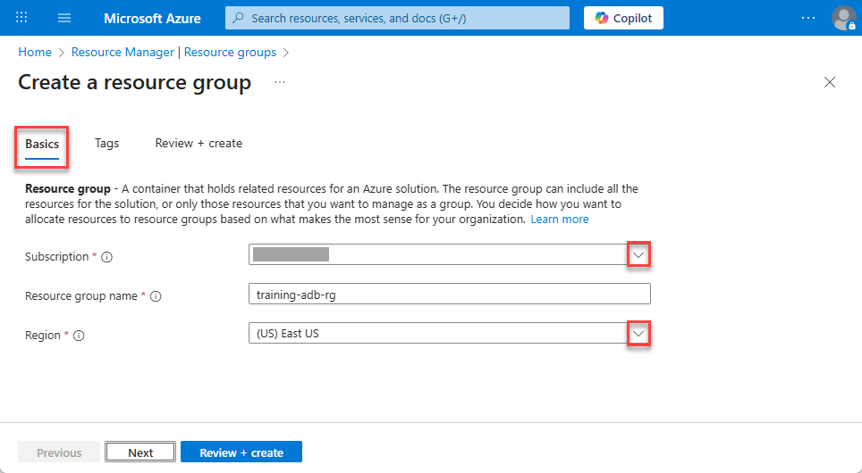

        Click **Next**.

4.  On the **Tags** tab, create the following two tags. Tags are key-value pairs used to organize and manage your resources. 

    - **Tag 1**: Enter or select `Environment` for the name and `Training` for the value.
    - **Tag 2:** Enter or select `Created by` for the name and enter your name for the value.
        
        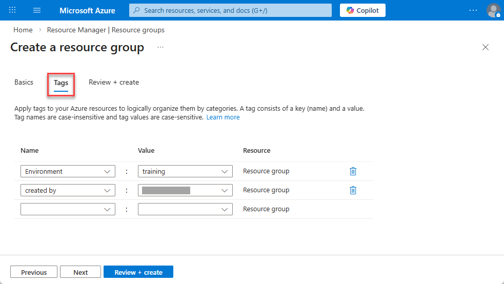

        Click **Next**.

5. The **Review + create** page will validate the input provided in the previous steps. Once Validation is successful, click **Create** to create your new resource group.
    
    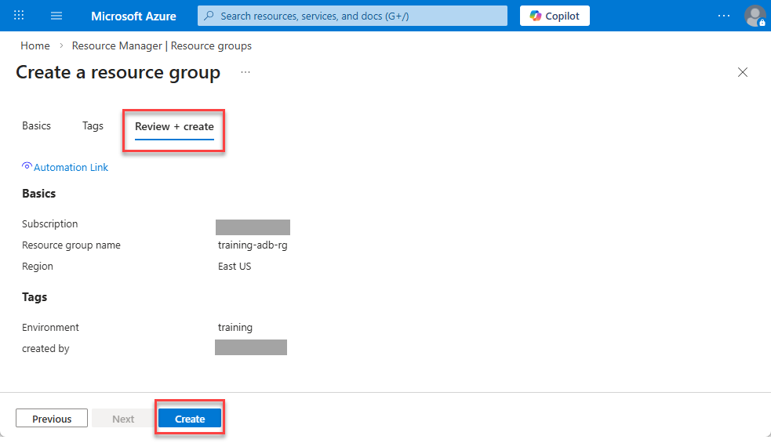

    A **Resource group created** message box is displayed. 

6.	Enter `training` in the **Filter for any field** field to search for the newly created resource group, and then press [Enter].
    The new `training-adb-rg` is displayed. 

    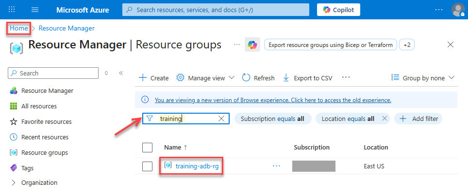

7. Click the **Home** link in the breadcrumbs to return to the Home page in preparation for the next task.

## Task 2:  Create a Virtual Network (VNet)

An Azure Virtual Network (VNet) is the fundamental building block for your private network in the cloud. It is a logically isolated section of the Azure network dedicated to your subscription, allowing resources like Virtual Machines (VMs) to communicate securely with each other, the internet, and on-premises networks. 

1. In the **Azure services** section, click the **Virtual networks** icon. If the **Virtual networks** icon is not displayed, you can search for it using the **Search resources, services, and docs** search field.

    

2. On the **Virtual networks** page, click the **+ Create** button.

    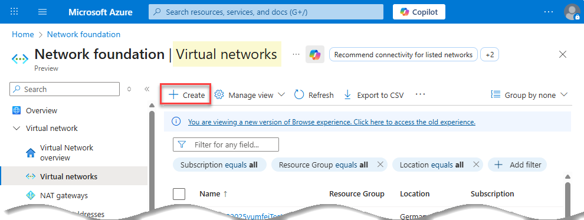

    The **Create virtual network** page is displayed.

3.	In the **Project details** section of the **Basics** tab, specify the following:
    - **Subscription:** Select your billing subscription.
    - **Resource group:** `training-adb-rg`.
    - **Region:** Select your region.

4. In the **Instance details** section of the **Basics** tab, specify the following:
    - **Virtual network name:** **`training-adb-vnet-eastus`**.
    - **Region:** Select your region.

        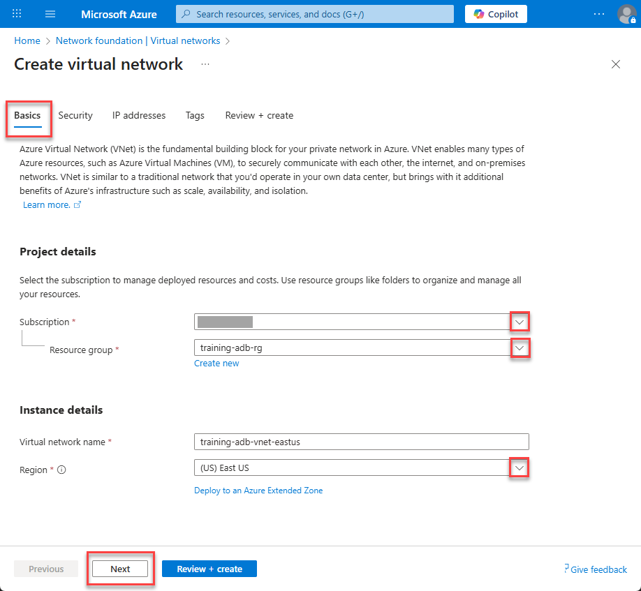

        Click **Next**.

5.  On the **Security** tab. Specify the following:
    - **Virtual network encryption:** Select this checkbox to enable the encryption of the traffic traveling within the VNet.
    - **Azure Bastian:** Unchecked (default). You can select this checkbox if Bastian Server is required to connect to a specific resource later.
    - **Azure Firewall:**  Unchecked (default). Similar to traffic encryption and Bastian service, you can enable the Azure Firewall if required.

        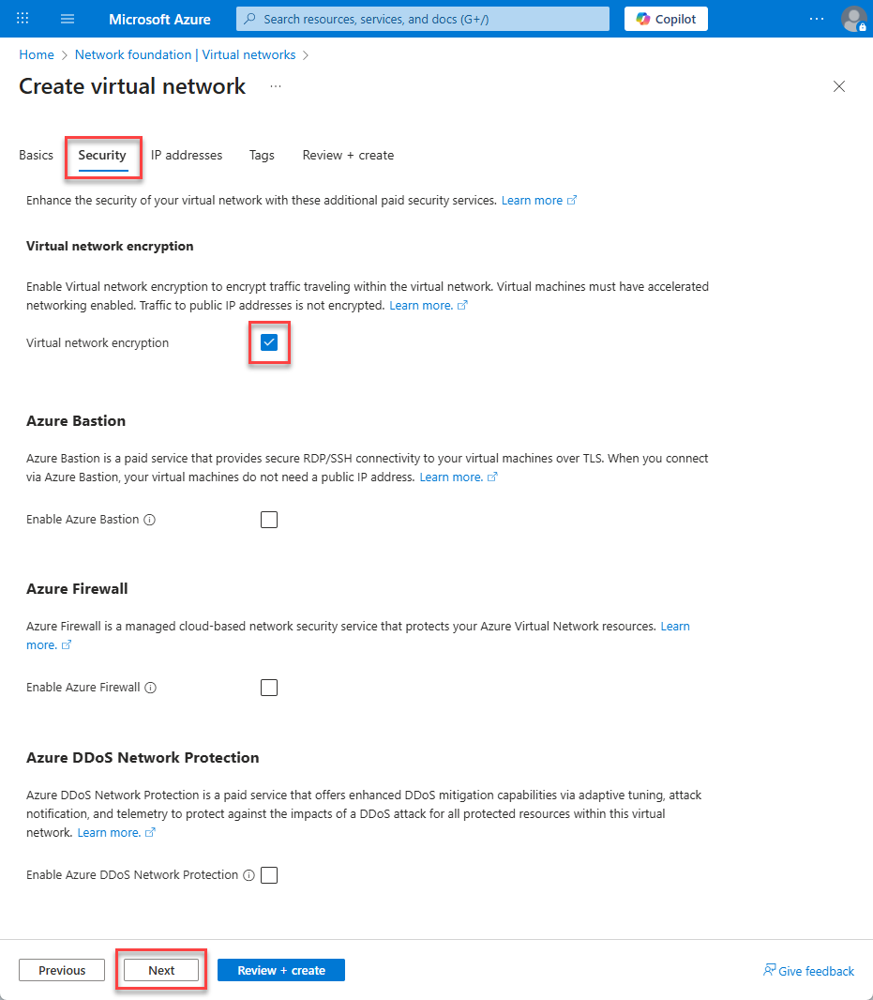

        Click **Next**. 

6. On the **IP addresses** tab, there is an option to add either the `IPV4` or the `IPV6` address space for your network resources. You can select the default IP Address range or provide a new IP range based on your requirement. In our example, accept the default `Add IPv4 address space`.

    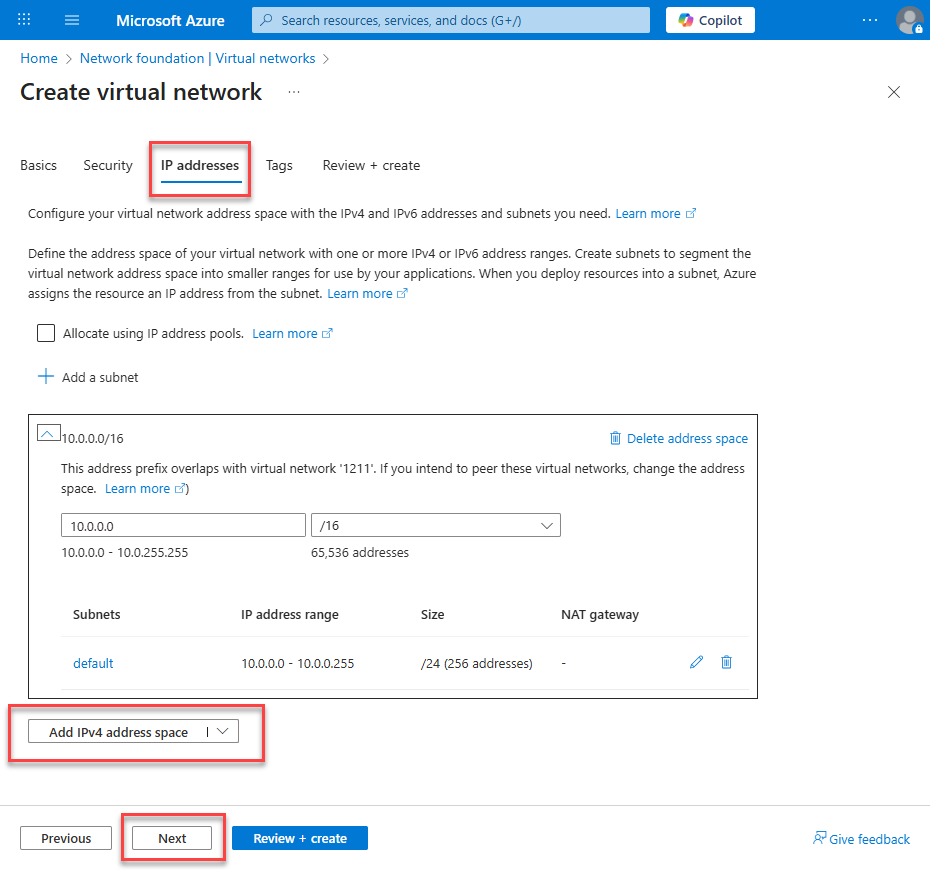

    Click **Next**.

7. Tags are key-value pairs used to organize and manage your resources. Create the following two tags in the **Tags** tab:
    - **Tag 1:** Select `Environment` for the name and `Training` for the value.
    - **Tag 2:** Select `Created by` for the name and your name.
    
        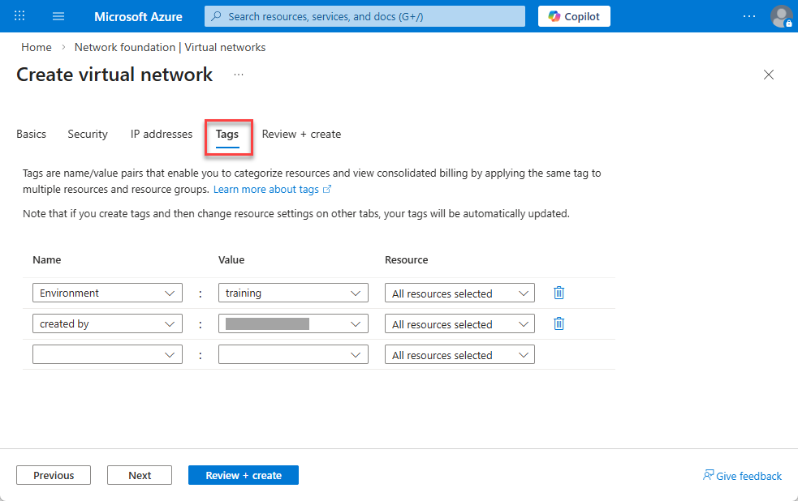

        Click **Next**. 

8. The **Review + create** page will validate the input provided in the previous steps. If validation is successful, click **Create** to create your new virtual network.
    
    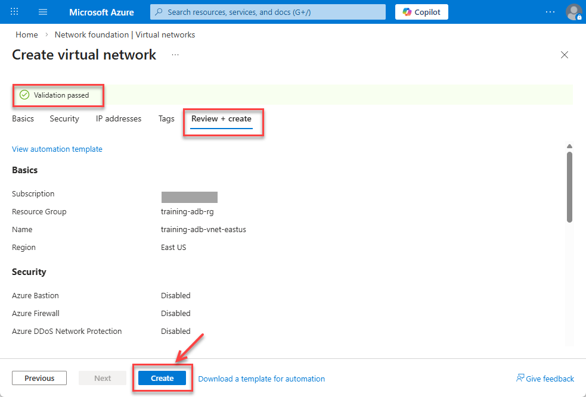

    The `Your deployment is complete` message is displayed on the **Overview** page. In addition, a **Deployment succeeded** message box is displayed briefly.

    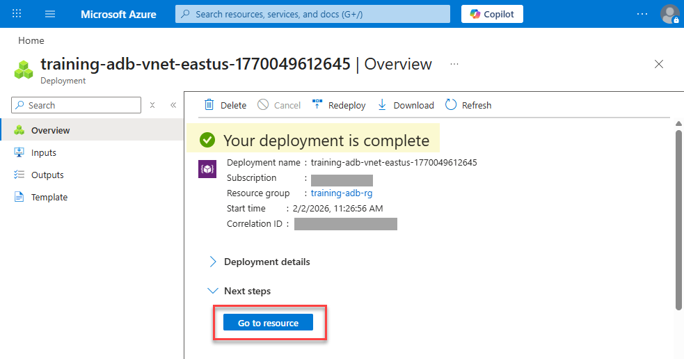

9. Click **Go to resource**.

10. Your new virtual network **Overview** page is displayed.

    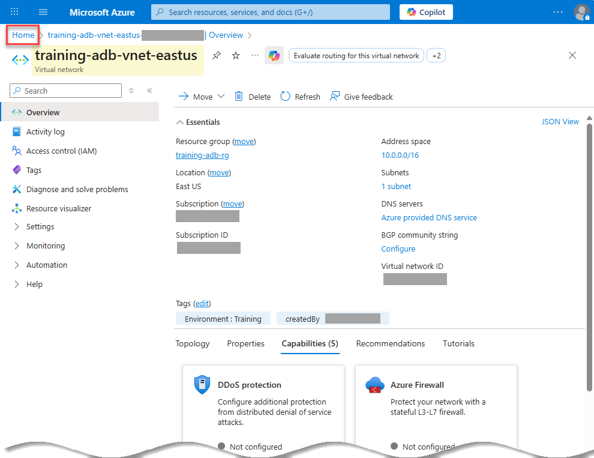

<!-- This is a single-line comment

11. Navigate to **Virtual networks**. Click the **Home** link in the breadcrumbs. In the **Azure services** section, click **Virtual networks**.

    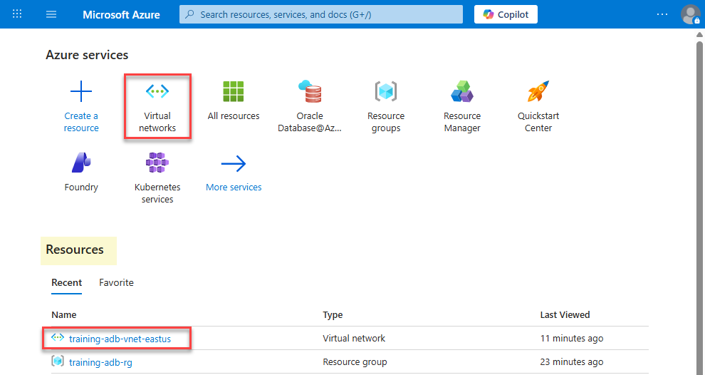

    >**Note:** In the **Resources** section, you can see the two new resources that you created. You can click the links to display the details pages for either resource.

 12. On the **Virtual networks** page, enter `training` in the **Filter for any field** text box. The newly created virtual network is displayed. 

    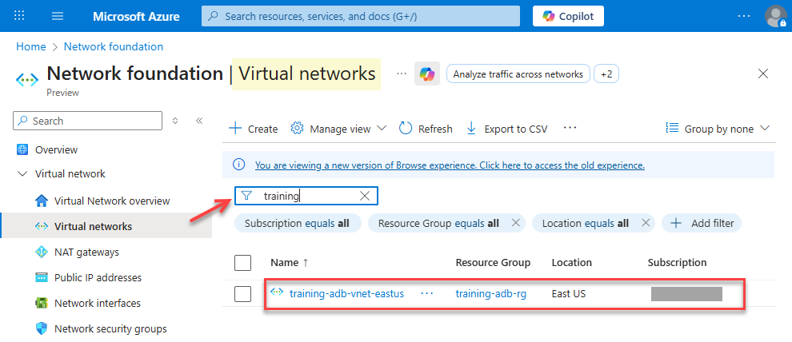

13. Click the network's name link to display its details.

    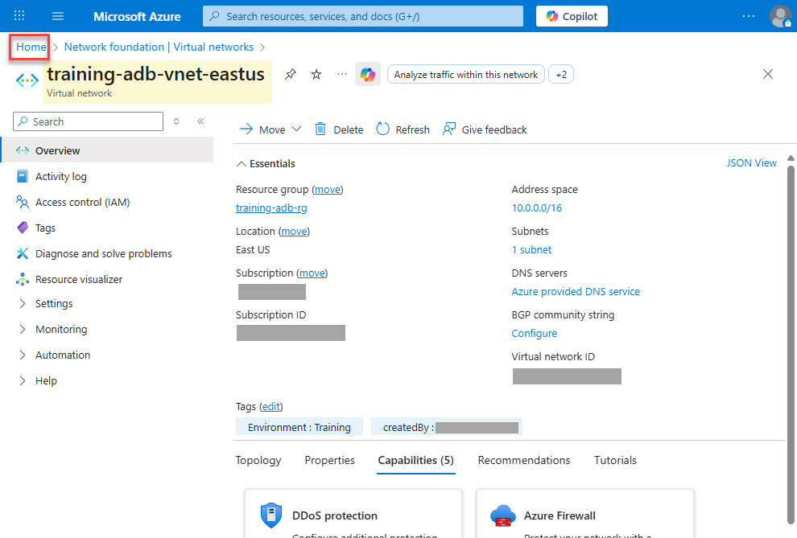
    
    -->

## Task 3: Add a Subnet and Delegate to Oracle Database@Azure Service

Subnets segment a virtual network (VNet) by allocating specific portions of its address space for resource deployment. For Oracle Database@Azure, creating a delegated subnet is a strict prerequisite for provisioning Oracle Exadata VM Clusters, Oracle Exascale VM Clusters, and Oracle Autonomous AI Database Serverless. 

In this task, you will create a new subnet and delegate it to the `Oracle Database@Azure` Service. This delegation grants the Oracle service exclusive authority to manage and deploy resources within that dedicated segment, ensuring seamless integration between Azure networking and Oracle Cloud Infrastructure (OCI). While the Oracle service manages specific network resources within the subnet to ensure stability and performance, you retain full ownership of the overall Virtual Network.

1. You should be already on your virtual network **Overview** page from **Task 2**. 

2. In the navigation tree on the left, click **Settings** > **Subnets**.

    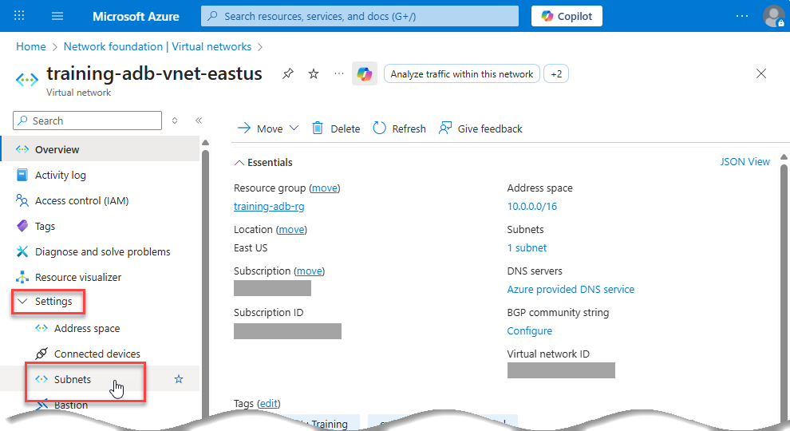

3. On the **Subnets** page, click the **+ Subnet** icon.

    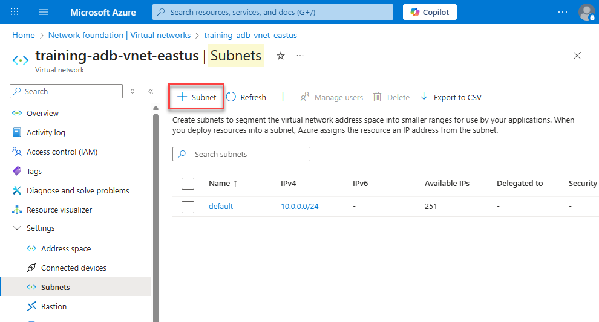

4. On the **Add a subnet** page, specify the following:

    - **Subnet purpose:** Accept the `Default` selection. 
    - **Name:** Enter a meaningful name such as `training-snet-oracle-delegated`.
        
    Accept all the default selections in the **IPv4** section. You typically select an IP address range based on the size of network required for the deployment.

    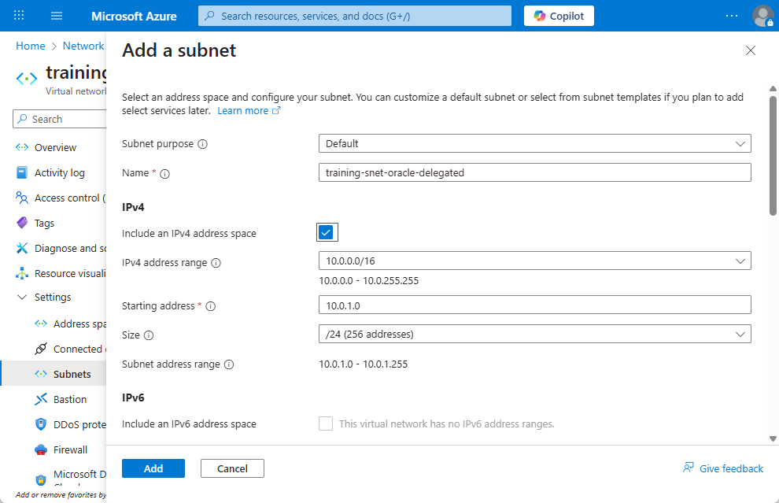

5. Scroll-down the page to the **Subnet Delegation** section. Click the drop-down list, enter `oracle` in the `Filter items` search text box, and then click `Oracle.Database/networkAttachments`.

    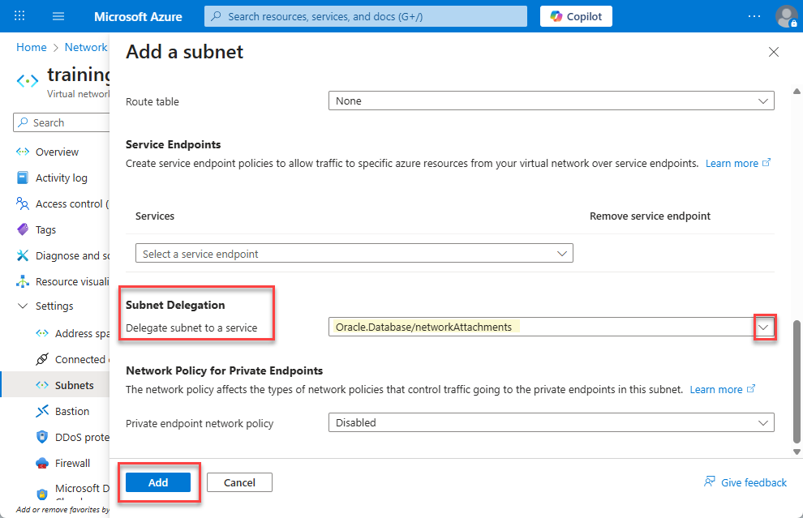

6. Click **Add** to add this subnet to your virtual network. The new subnet is displayed on the page.

    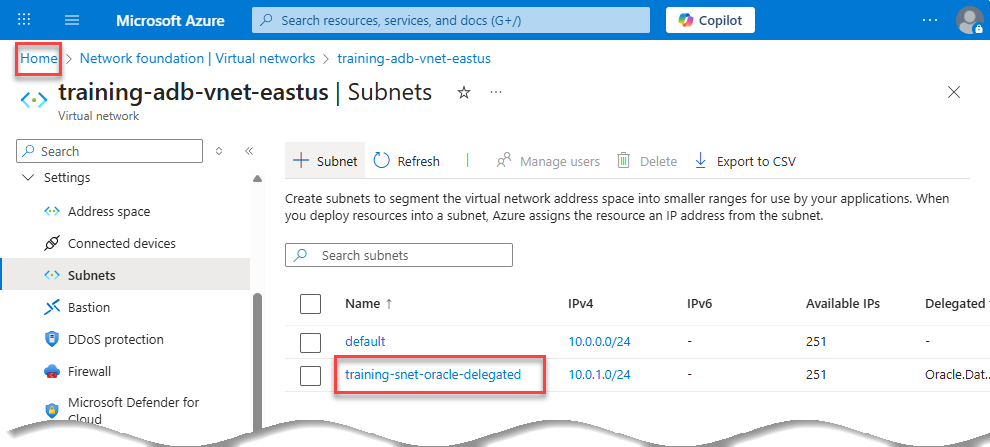

7. Click the **Home** link in the breadcrumbs to return to the **Home** page in preparation for the next lab.

## Task 4: Add a Public Subnet

When you provision your Oracle Autonomous AI Database in Task 2, you will use the **Managed private virtual network IP only** access type. This means your database is only reachable via your private Azure Virtual Network (VNet)—not publicly over the internet. This makes things secure, but it also means you (or your browser) must be inside that private network to reach tools like Database Actions. The easiest way to correct this issue is to create a simple Virtual Machine (VM) in Azure on the same VNet as your database. You will do that in Task 3; however, when you create the VM, you’ll need a public subnet. A public subnet is a section of your Azure network that has an "Internet Gateway". This allows the resources inside it to communicate with the outside world. Let’s create a public subnet that you will use when you create your VM.

1. You should be already on your virtual network **Subnets** page from **Task 3**. 

2. Click the **+ Subnet** icon.

3. On the **Add a subnet** page, specify the following:

    - **Subnet purpose:** Accept the `Default` selection. 
    - **Name:** Enter a meaningful name such as `training-public-subnet`.
    - **Enable private subnet (no default outbound access):** Make sure this checkbox is unchecked in order to create a public subnet.

        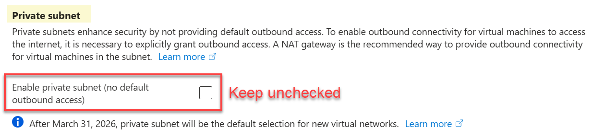
        
    - Accept all the default selections in the **IPv4** section. You typically select an IP address range based on the size of network required for the deployment.

4. Click **Add** to add the public subnet to your virtual network. The new subnet is displayed on the page.

    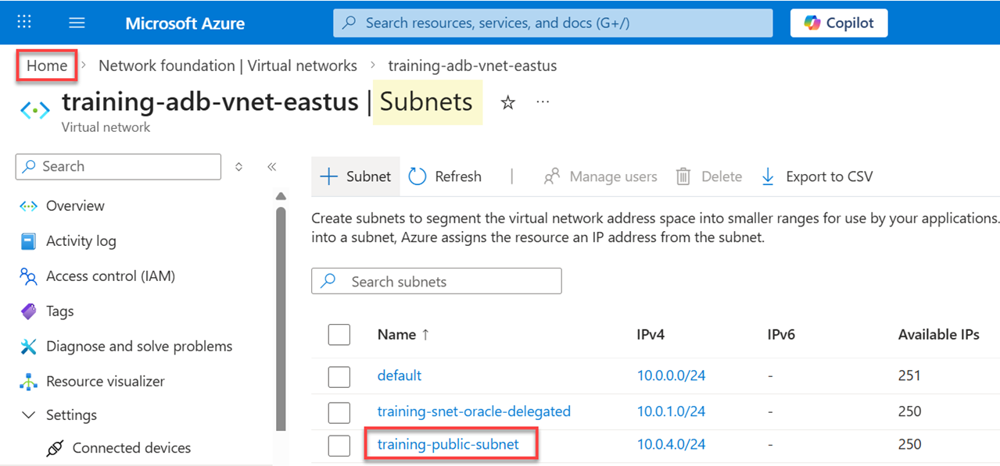

5. Click the **Home** link in the breadcrumbs to return to the **Home** page in preparation for the next lab.

**You are all done! You have successfully created a Resource Group, a Virtual Network, a subnet, and delegated the subnet to the Oracle `Database@Azure Service`**.

You may now proceed to the next lab.

## Learn More
* [Oracle Database@Azure](https://docs.oracle.com/en-us/iaas/Content/database-at-azure/oaa.htm)
* [What is a resource group?](https://learn.microsoft.com/en-us/azure/azure-resource-manager/management/overview#resource-groups)
* [What is Azure Virtual Network?](https://learn.microsoft.com/en-us/azure/virtual-network/virtual-networks-overview)
* [Delegated Subnet Design](https://docs.oracle.com/en-us/iaas/Content/database-at-azure/network-delegated-subnet-design.htm)
* [Add, change, or delete a virtual network subnet](https://learn.microsoft.com/en-us/azure/virtual-network/virtual-network-manage-subnet?tabs=azure-portal)

## Acknowledgements
- **Author:** Lauran K. Serhal, Consulting User Assistance Developer, Oracle Autonomous AI Database and Multicloud
- **Contributors:**
    * Devinder Singh, SR Principal Solutions Architect - Multicloud
    * Sanjay Rahane, Principal Cloud Architect, North America Cloud Engineering Services (CES)
    * Tejus Subrahmanya, Principal Product Manager
* **Last Updated By/Date:** Lauran K. Serhal, February 2026