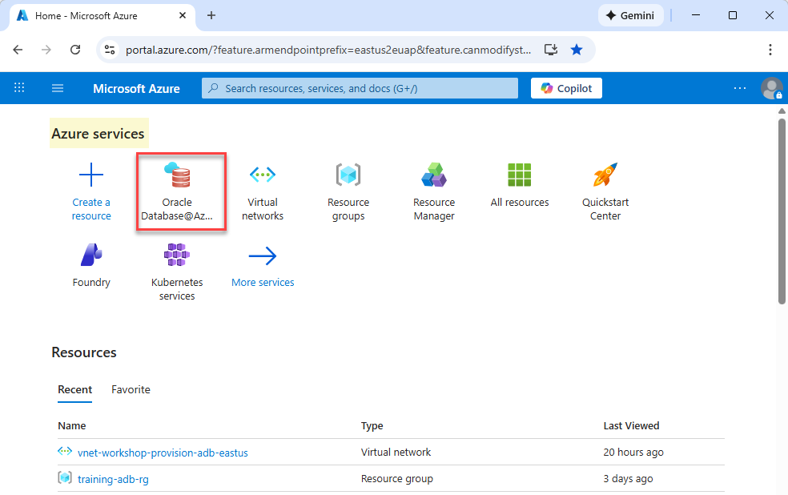
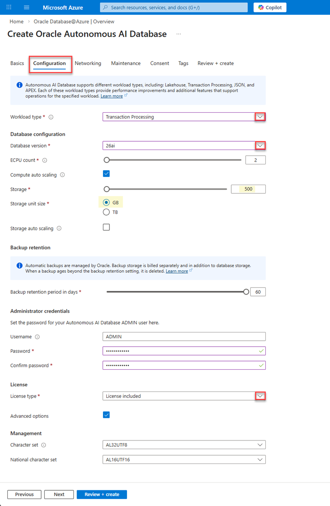
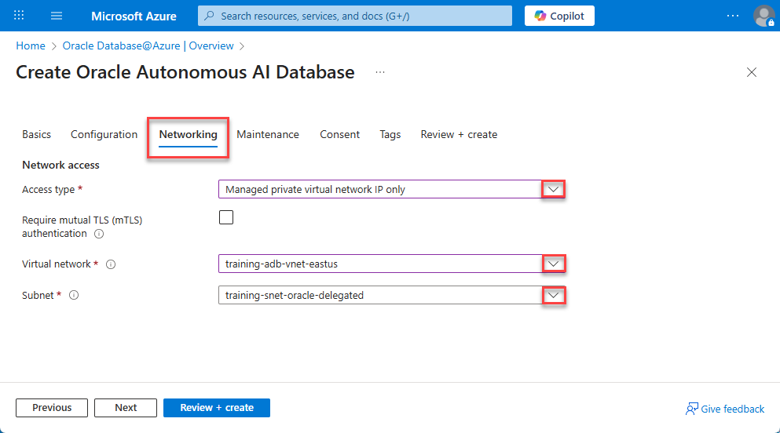
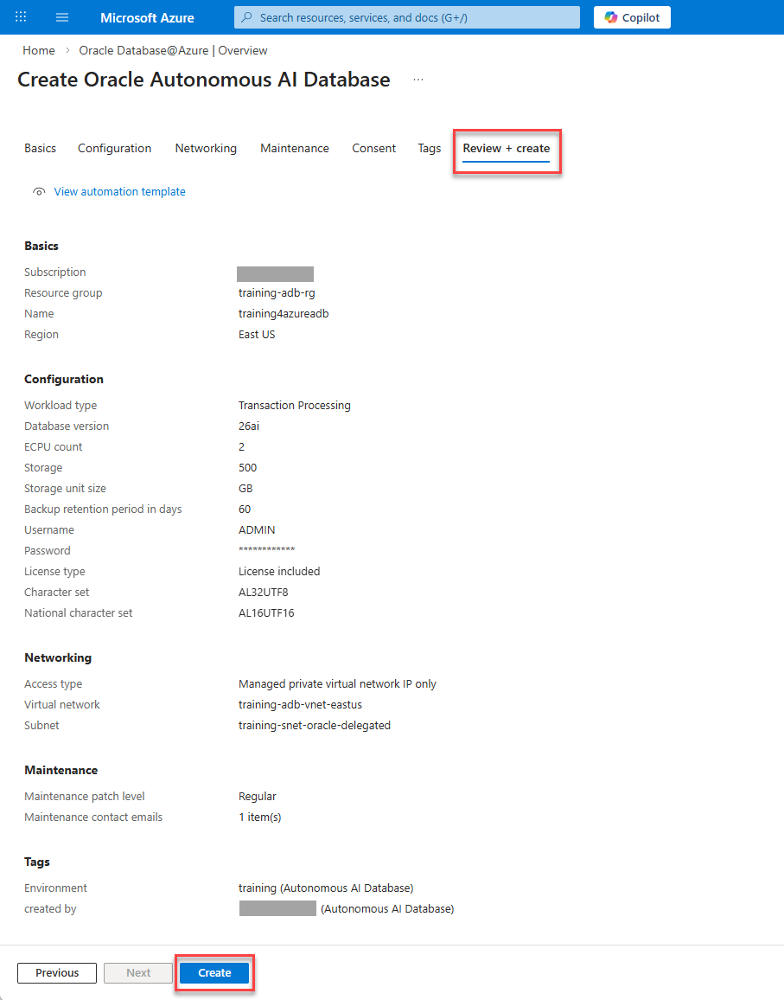
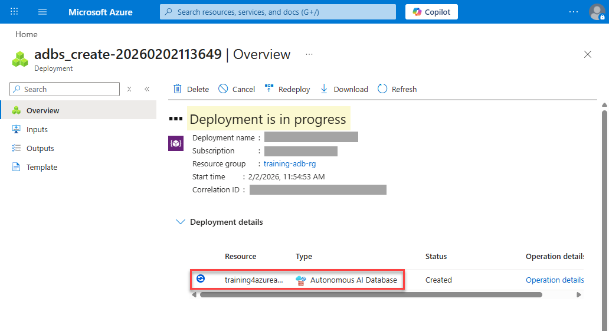
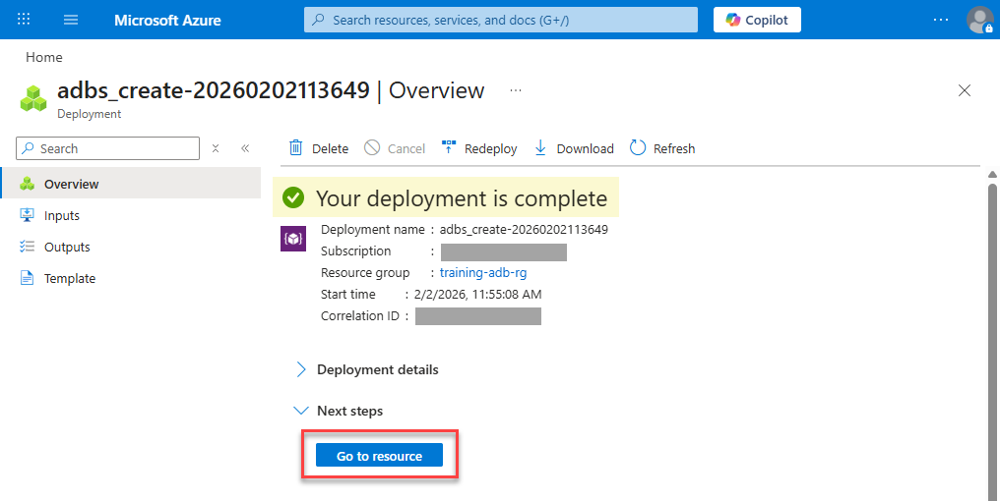
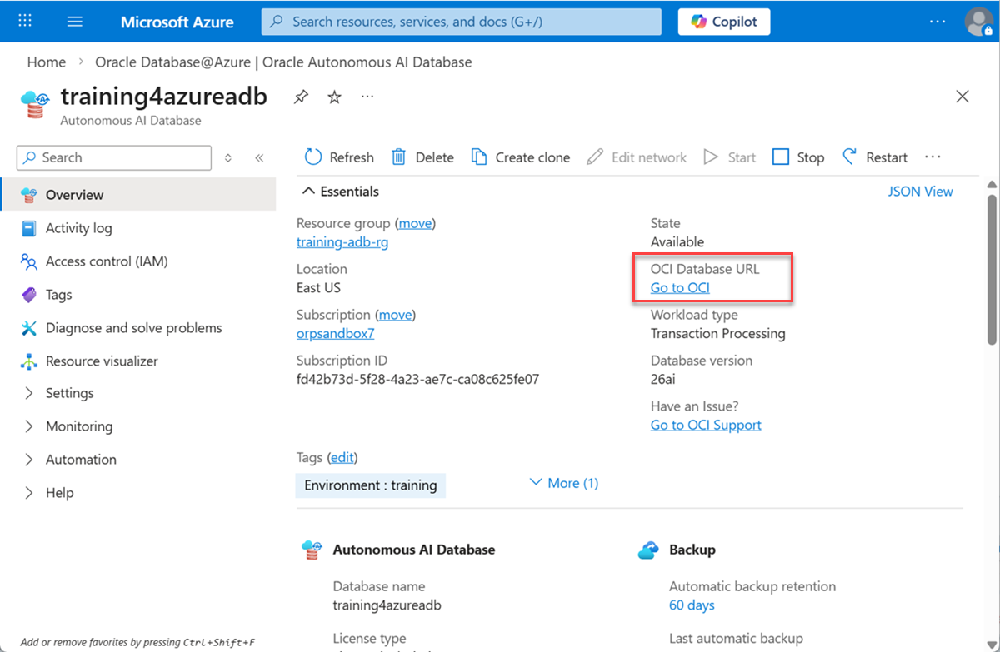
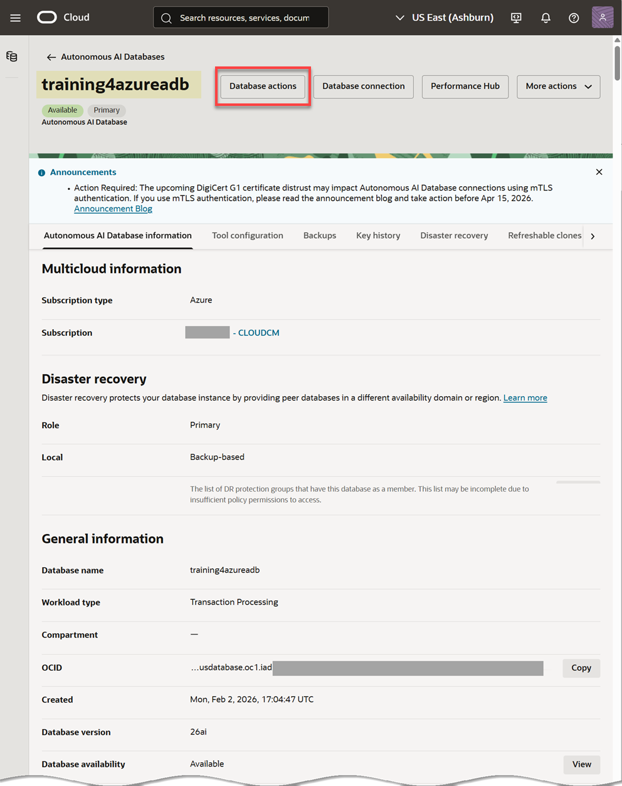

# Provision an Oracle Autonomous AI Database

## Introduction

This lab walks you through the steps to provision an Oracle Autonomous AI Database using the Azure portal.  

Estimated Time: 10 minutes

### Objectives

In this lab, you will:

- Provision an Oracle Autonomous AI Database in `Oracle Database@Azure`
- Place the database in your resource group and Microsoft Azure region
- Configure the database according to your requirements
- Review your Oracle Autonomous AI Database in OCI

### Prerequisites

- This lab requires the completion of **Lab 1: Create the Required Resources** in the **Contents** menu on the left.

## Task 1: Create an Oracle Autonomous AI Database

1.	Login to the [Azure Portal](portal.azure.com) using your credentials, if you are not already logged in. In the **Azure services** section, click the `Oracle Database@Azure` icon.

    

2. On the **Oracle Database@Azure | Overview** page, in the Oracle Autonomous AI Database section, click **Create an Autonomous AI Database**.

    

    >**Note:** Alternatively, you can click **Oracle Autonomous Database Service** from the navigation menu on the left, and then click **+ Create**.

    The **Create Oracle Autonomous AI Database** page is displayed. This is where you'll specify the configuration for your database instance.

3. In the **Basics** tab, specify the following:
    - **Subscription:** Select your billing subscription from the drop-down list.
    - **Resource group:** Select the resource group that you created in **Lab 1 > Task 1**, `training-adb-rg` in our example.
    - **Name:** Enter a meaningful name for your Autonomous AI Database such as **`training4azureadb`**. 
        >**Note:** The value must contain only letters and numbers, starting with a letter. 30 characters max. Spaces, dashes, and underscores are not allowed.    

    - **Region:** Select your region from the drop-down list.
    
        

        Click **Next**.

4. In the **Configuration** tab, specify the following:
    - **Workload type:** Select **`Transaction Processing`** from the drop-down list. Supported workload types include `Lakehouse`, `Transaction Processing`, `JSON`, and `APEX`.
    - **Database version:** Select **`26ai`** from the drop-down list. The other choice is `19c`.
    - **ECPU count:** `2`.
    - **Compute auto scaling:** `checked`.
    - **Storage (TB):** `500 GB`.
    - **Storage auto scaling:** `unchecked`.
    - **Backup retention period in days:** `60`.
    - **Administrator password:** Enter (and confirm) a meaningful password for the `ADMIN` account such as **`Training4ADB`**. **Important:** Make a note of this password as you will need it to perform later tasks.
    
        >**Note:** The password must be between 12 and 30 characters, and contain at least one uppercase letter, one lowercase letter, and one number. The password cannot contain a double quote character (") or the username `ADMIN`. 
    - **License type:** Select **`License included`** from the drop-down list. The other available choice is `Bring your own license (BYOL)`.

    - Click the **Advance options** checkbox to view the available options. Accept the default selections for **Character set** and **National character set**. 

        
    
        Click **Next**.
 
5. In the **Networking** tab, specify the following:
    - **Access type:** `Managed private virtual network IP only`. 
    - **Require mutual TLS (mTLS) authentication:** Unchecked.    
        **Note:** TLS connections allow you to connect to your Oracle Autonomous AI Database without a wallet, if you use a JDBC thin driver with 
        JDK8 or above. TLS connections require you to use an access control list (ACL) or private endpoint.
    
    - **Virtual network:** Select your virtual network that you created in **Lab 1 > Task 2**, `training-adb-vnet-eastus` in our example.
    - **Subnet:** The subnet that you created and added to your virtual network is automatically selected, `training-snet-oracle-delegated` in our example. 
    
        
    
        Click **Next**.

6.  In the **Maintenance** tab, specify the following:
    - **Maintenance patch level:** `Regular`.
    - **Email address:** Enter one or more email addresses to receive operational notices and announcements as well as unplanned maintenance notifications.
    
        

        Click **Next**.

7. In the **Consent** tab, agree to the terms of services, and then click **Next**.

    

    Click **Next**.

8. In the **Tags** tab, provide the following two tags and values: 
    - **Tag 1:** Select `Environment` for the name and `Training` for the value.
    - **Tag 2:** Select `Created by` for the name and your name for the value.
    
        

        Click **Next**.

9. In the the **Review + create** tab, review the information you specified in the **Basics**, **Configuration**, **Networking and Maintenance** and make any corrections, if needed. 

    

10. Click **Create** to initiate the Oracle Autonomous AI Database creation process. The **Deployment is in progress** message is displayed on the page. The deployment could take up to (30) minutes to complete.

    

11. When the deployment is complete, a **Your deployment is complete** message is displayed on the page.

    

12. Click **Go to Resources**. The **Resource group** page is displayed. In the **Filter for any field** text box, enter `training`. The newly provisioned Autonomous AI Database is displayed.

    

## Task 2: Review your Oracle Autonomous AI Database Deployment in OCI

In this task, you will learn how to view your newly provisioned Oracle Autonomous AI Database in OCI. 

1. Click the **Home** link in the breadcrumbs. 

2. In the **Azure services** section, click the `Oracle Database@Azure` icon.

3. On the **Oracle Database@Azure | Overview** page, click the **Oracle Autonomous AI Database** node in the navigation menu on the left. In the **Filter for any field** text box, enter `training`. The newly provisioned Autonomous AI Database is displayed.

    

4. Click the Autonomous AI Database name link to display the **Overview** page. 

5. In the **Essentials** section, click the **Go to OCI** link.

    

6. The **Autonomous AI Database** details page is displayed. 

    
    
**All Done! You have successfully deployed your Oracle Autonomous AI Database instance and it should be available for use in a few minutes.**

You may now **proceed to the next lab**.

## Learn More
* [Oracle Database@Azure](https://docs.oracle.com/en-us/iaas/Content/database-at-azure/oaa.htm)
* [Create an Autonomous AI Database using the Azure portal](https://docs.oracle.com/en-us/iaas/Content/database-at-azure/azucr-create-autonomous-ai-database.html#GUID-F48CC33E-E53F-44AD-BB36-BE4FC183368E)

## Acknowledgements
- **Author:** Lauran K. Serhal, Consulting User Assistance Developer, Oracle Autonomous AI Database - Multicloud
- **Contributors:**
    * Devinder Singh, SR Principal Solutions Architect - Multicloud
    * Tejus Subrahmanya, Principal Product Manager
* **Last Updated By/Date:** Lauran K. Serhal, February 2026