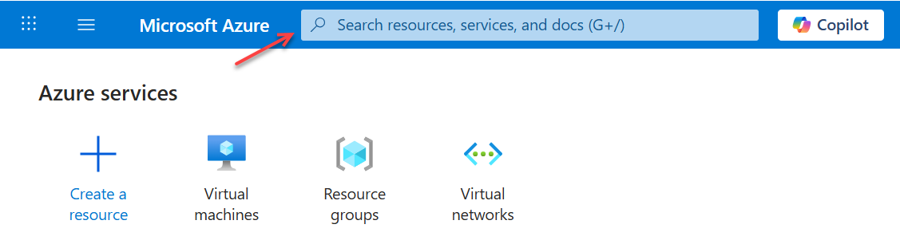
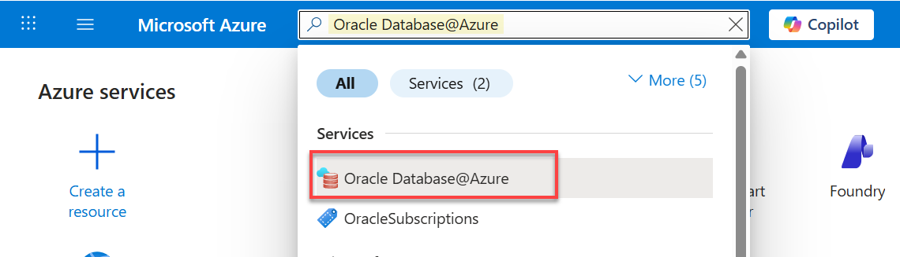

# Create an Oracle Autonomous AI Database

## Introduction

This lab walks you through the steps to create an Oracle Autonomous AI Database using the Azure portal.  

Estimated Time: 10 minutes

### Objectives

In this lab, you will:

- Create an Oracle Autonomous AI Database in `Oracle Database@Azure`
- Place the database in your resource group and Microsoft Azure region
- Configure the database according to your requirements
- Review your Oracle Autonomous AI Database in OCI

### Prerequisites

- All previous labs successfully completed
- Your Azure subscription must be onboarded and linked to an Oracle Cloud Infrastructure (OCI) tenancy.
- You must have a valid OCI user account with permissions to view and manage Autonomous AI Database resources within the OCI console.

## Task 1: Create an Oracle Autonomous AI Database

1.  Login to the [Azure Portal](portal.azure.com) using your credentials, if you are not already logged in. The Microsoft Azure **Home** page is displayed. 

    

2.  In the **Search resources, services, and docs** search field, enter `Oracle Database@Azure`. When it's displayed in the drop-down list, click it.

    

    The **Oracle Database@Azure | Overview** page is displayed.   

3. In the **Oracle Autonomous AI Database** section, click **Create an Autonomous AI Database**.

    

    >**Note:** Alternatively, you can click **Oracle Autonomous AI Database** node from the navigation menu on the left, and then click **+ Create**.

    The **Create Oracle Autonomous AI Database** page is displayed. This is where you'll specify the configuration for your database instance.

4. In the **Basics** tab, specify the following:
    - **Subscription:** Select your billing subscription from the drop-down list.
    - **Resource group:** Select the resource group that you created in **Lab 1 > Task 1**, `training-adb-rg` in our example.
    - **Name:** Enter a meaningful name for your Autonomous AI Database such as **`training4azureadb`**. 
        >**Note:** The value must contain only letters and numbers, starting with a letter. 30 characters max. Spaces, dashes, and underscores are not allowed.    

    - **Region:** Select your region from the drop-down list.
    
        

        Click **Next**.

5. In the **Configuration** tab, specify the following:
    - **Workload type:** Select **`Transaction Processing`** from the drop-down list. Supported workload types include `Lakehouse`, `Transaction Processing`, `JSON`, and `APEX`.
    - **Database version:** Select **`26ai`** from the drop-down list. The other choice is `19c`.
    - **ECPU count:** `2`.
    - **Compute auto scaling:** `checked`.
    - **Storage (TB):** `500 GB`.
    - **Storage auto scaling:** `unchecked`.
    - **Backup retention period in days:** `60`.
    - **Administrator password:** Enter (and confirm) a meaningful password for the `ADMIN` account such as **`Training4ADB`**. **Important:** Make a note of this password as you will need it to perform later tasks.
    
        >**Note:** The value must contain only letters and numbers, starting with a letter. 30 characters max. Spaces, dashes, and underscores are not allowed.

    - **License type:** Select **`License included`** from the drop-down list. The other available choice is `Bring your own license (BYOL)`.

    - Click the **Advance options** checkbox to view the available options. Accept the default selections for **Character set** and **National character set**. 

        
    
        Click **Next**.
 
6. In the **Networking** tab, specify the following:
    - **Access type:** `Managed private virtual network IP only`. 
    - **Require mutual TLS (mTLS) authentication:** Unchecked.    
        **Note:** TLS connections allow you to connect to your Oracle Autonomous AI Database without a wallet, if you use a JDBC thin driver with 
        JDK8 or above. TLS connections require you to use an access control list (ACL) or private endpoint.
    
    - **Virtual network:** Select your virtual network that you created in **Lab 1 > Task 2**, `training-adb-vnet-eastus` in our example.
    - **Subnet:** The subnet that you created and added to your virtual network is automatically selected, `training-snet-oracle-delegated` in our example. 
    
        
    
        Click **Next**.

7.  In the **Maintenance** tab, specify the following:
    - **Maintenance patch level:** `Regular`.
    - **Email address:** Enter one or more email addresses to receive operational notices and announcements as well as unplanned maintenance notifications.
    
        

        Click **Next**.

8. In the **Consent** tab, agree to the terms of services, and then click **Next**.

    

    Click **Next**.

9. In the **Tags** tab, provide the following two tags and values: 
    - **Tag 1:** Select `Environment` for the name and `Training` for the value.
    - **Tag 2:** Select `Created by` for the name and your name for the value.
    
        

        Click **Next**.

10. In the the **Review + create** tab, review the information you specified in the **Basics**, **Configuration**, **Networking and Maintenance** and make any corrections, if needed. 

    

11. Click **Create** to initiate the Oracle Autonomous AI Database creation process. The **Deployment is in progress** message is displayed on the page. The deployment could take up to (30) minutes to complete.

    

12. When the deployment is complete, a **Your deployment is complete** message is displayed on the page.

    

13. Click **Go to Resources**. The **Resource group** page is displayed. In the **Filter for any field** text box, enter `training`. The newly created Autonomous AI Database is displayed.

    

## Task 2: Review your Oracle Autonomous AI Database in OCI

In this task, you will learn how to view your newly created Oracle Autonomous AI Database in OCI. 

1. Click the **Home** link in the breadcrumbs. 

2. In the **Azure services** section, click the `Oracle Database@Azure` icon. Alternatively, you can search for `Oracle Database@Azure` in the **Search resources, services, and docs** search field. 

3. On the **Oracle Database@Azure | Overview** page, click the **Oracle Autonomous AI Database** node in the navigation menu on the left. In the **Filter for any field** text box, enter `training`. The newly created Autonomous AI Database is displayed.

    

4. Click the Autonomous AI Database name link to display the **Overview** page. 

5. Go to the **Essentials** section **> OCI Database URL** field, click the **Go to OCI** link.

    

    **Note:** To click the **Go to OCI** link in the Azure portal and successfully display your created Oracle Autonomous AI Database, you must meet specific identity and configuration requirements such as:
    - **Linked OCI Tenancy:** Your Azure subscription must be onboarded and linked to an Oracle Cloud Infrastructure (OCI) tenancy.
    - **OCI Permissions:** You must have a valid OCI user account with permissions to view and manage Autonomous Database resources within the OCI console.

6. The **Autonomous AI Database** details page within the OCI Console is displayed.  

    

7. Click **Database actions**. The **Database actions** message box is displayed with important information, and the URL to access Database actions. Click **Copy** to copy the URL to a text editor of your choice. You will need this URL later. Next, click **Close**.

    

    To access your Oracle Autonomous AI Database actions, you must use a "Jump Box" (Virtual Machine or VM) located within the same private network (VNet), as private endpoints are not accessible from the public internet. If you try to use the provided URL, you'll get an error message. If you don't have a VM, proceed to **Lab 3** to deploy one.

**All Done! You have successfully deployed your Oracle Autonomous AI Database instance and reviewed the database in OCI.**

You may now proceed to the next lab.

## Learn More
* [Oracle Database@Azure](https://docs.oracle.com/en-us/iaas/Content/database-at-azure/oaa.htm)
* [Create an Autonomous AI Database using the Azure portal](https://docs.oracle.com/en-us/iaas/Content/database-at-azure/azucr-create-autonomous-ai-database.html#GUID-F48CC33E-E53F-44AD-BB36-BE4FC183368E)

## Acknowledgements
- **Author:** Lauran K. Serhal, Consulting User Assistance Developer, Oracle Autonomous AI Database and Multicloud
- **Contributors:**
    * Devinder Singh, SR Principal Solutions Architect - Multicloud
    * Tejus Subrahmanya, Principal Product Manager
* **Last Updated By/Date:** Lauran K. Serhal, February 2026