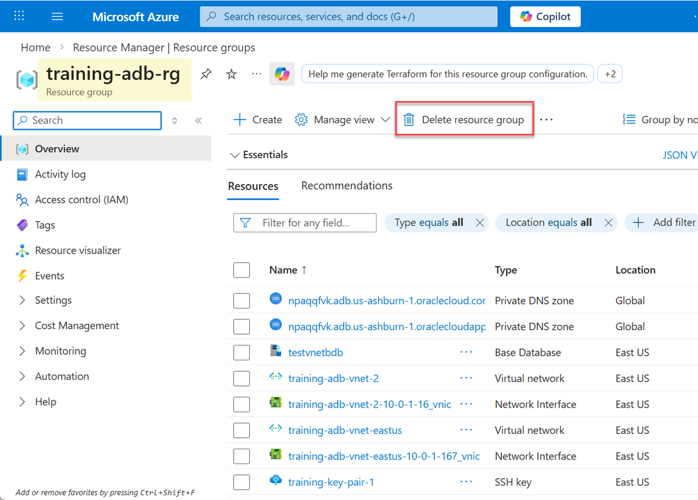
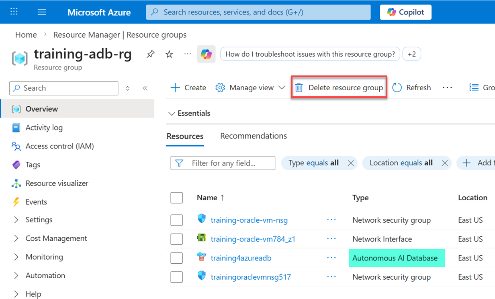
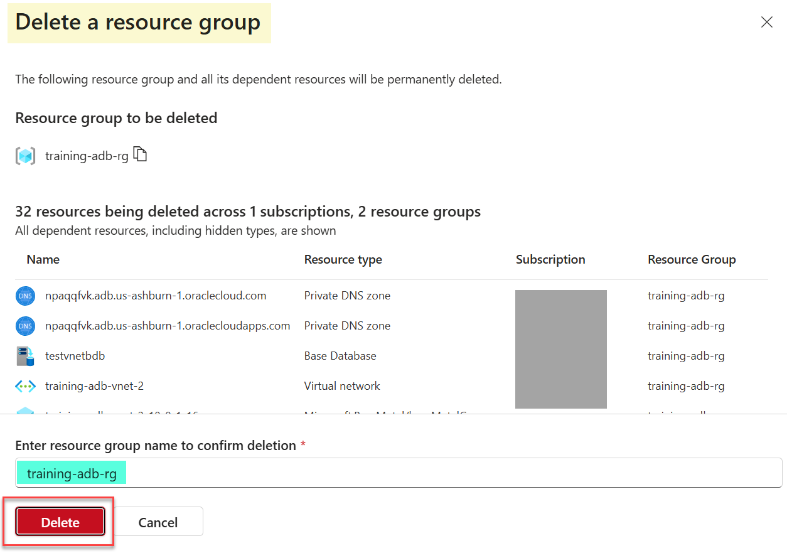

# Clean Up Resources

## Introduction

In this lab, you will learn how to delete the resource group and its resources. When you finish the workshop, it is recommended to delete the entire resource group to ensure all associated services and plans are removed simultaneously to stop billing.

Estimated Time: 5 minutes

### Objectives

- Delete resources

## Task 1: Delete Resources

When no longer needed, you can delete your resource group and all the resources it contains that you created in this workshop such as the virtual network, Oracle Autonomous AI Database, virtual machine and all related resources.

1. On the Azure **Home** page, in the **Azure services** section, click **Resource groups**.

2. On the **Resource groups** page, enter `training` in the **Filter for any field** text box. The `training-adb-rg` resource group is displayed. 

    

3. Click the `training-adb-rg` resource group name link.

    

    Page 2 displays the Oracle Autonomous AI Database.

    

4. At the top of the resource group page, click **Delete resource group**.

5. The **Delete a resource group** page is displayed. In the **Enter resource group name to confirm deletion**, enter `training-adb-rg`, and then click **Delete**.

    

**Congratulations! You have completed the workshop!**

## Acknowledgements
- **Author:** Lauran K. Serhal, Consulting User Assistance Developer, Oracle Autonomous AI Database and Multicloud
- **Last Updated By/Date:** Lauran K. Serhal, February 2026