# Lab 4: Create an Oracle Base Database Service

## Introduction

In this lab, you will create an **Oracle Base Database Service** using Oracle Database@Azure. This service enables you to run Oracle databases natively within Azure, leveraging the integration between Azure and Oracle Cloud Infrastructure (OCI).

Estimated Time: 60 minutes

### Objectives

In this lab, you will:
* Configure and deploy an Oracle Base Database Service
* Set administrative credentials and database parameters
* Verify the successful creation and availability of the database service

### Prerequisites

This lab assumes you have successfully completed all previous labs.

## Task 1: Create an Oracle Base Database Service

1. Log in to the [Azure Portal](https://portal.azure.com/), if you are not already logged in. In the search field at the top, enter `Oracle Database@Azure` and then select it from the results.

2. In the left-hand navigation pane, click **Oracle Base Database Service**, and then click **+ Create**.

      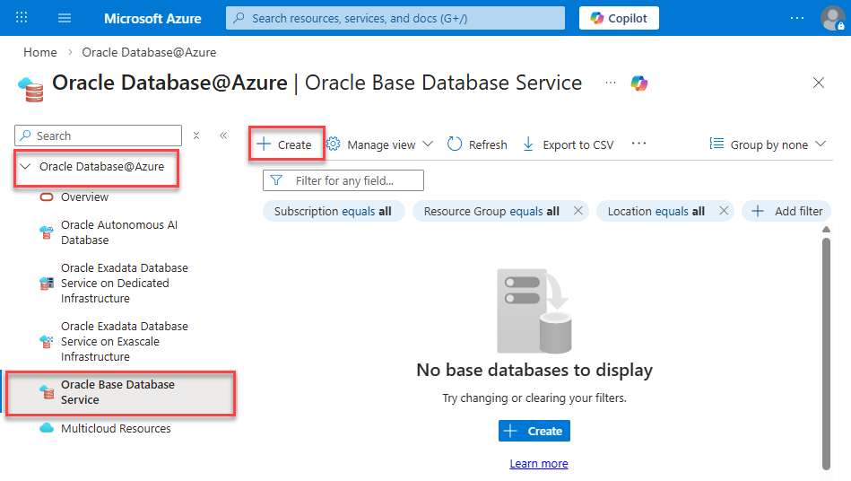

      The **Create Base Database** page is displayed.

3. On the **Basics** tab, specify the following:
      - **Subscription:** Select your Azure subscription.
      - **Resource group:** Choose the resource group you created in **Lab 1**, `training-adb-rg`.
      - **Name:** Enter a unique name for the database such as `trainingbasedb`.
      - **Region:** Select the same region as your Network Anchor.
      - **Resource Anchor:** Select the Resource Anchor you created in **Lab 2**, `training-resource-anchor`.
      - **Availability zone:** Accept the default selection.
      - **Shape:** Accept the default selection, `VM.Standard.x86` in our example. 
      - **Database version:** Choose the latest database version that is available from the drop-down list, `23.9.0.25.07` in our example. 
      - **ECPU count:** Accept the default value, `4`.
      - **Oracle Database edition:** `Enterprise Edition`.
      - **Available data storage (GB):** `256`.
      - **SSH public key source:** `Generate new key pair`. Azure automatically generates a new RSA key pair for you. This key is essential for secure remote access to the database host. You must provide a Key pair name and download the private key (typically a `.pem` file) immediately after creation, as it cannot be retrieved later.
      - **Key pair name:** `training-key-pair-1`.

      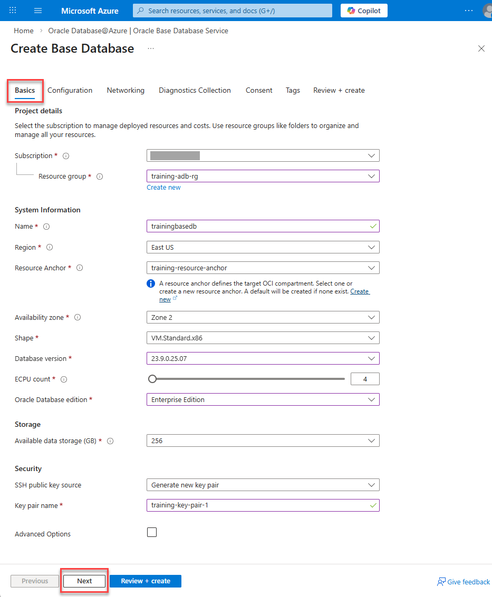
      
      Click **Next**.
      
4. On the **Configuration** tab, specify the following: 
      - **PDB name:** Enter a name for the pluggable database such as `PDB01`. In Oracle, a PDB (Pluggable Database) is a portable collection of schemas, schema objects, and data that functions like an independent, self-contained Oracle database to a client application. It runs within a larger host known as a CDB (Container Database). 
      - **Username:** This is a read-only field. `sys` is the administrator user. 
      - **Password:** Enter a strong password and confirm it. Save the password in a text editor file of your choice as you'll need it later.

      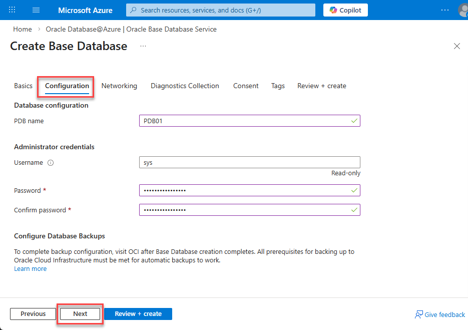

      Click **Next**.

5. On the **Networking** tab, specify the following: 
      - **Resource Anchor:** `training-resource-anchor`.
      - **Network Anchor:** `training-network-anchor`.
      - **Delegated subnet:** `training-snet-oracle-delegated`.
      - **Virtual network:** `training-adb-vnet-2`.
      - **Host name:** `trainingbdb`.
      
      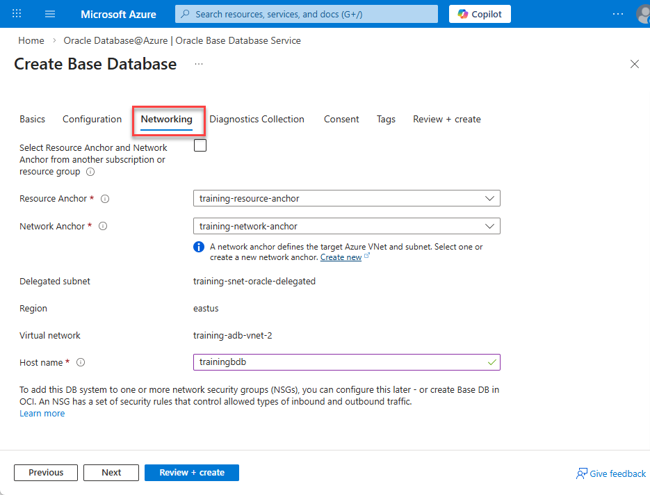

      Click **Next**.

6. On the **Diagnostic Collection** tab, ensure that the two checkboxes are selected, and then click **Next**.

      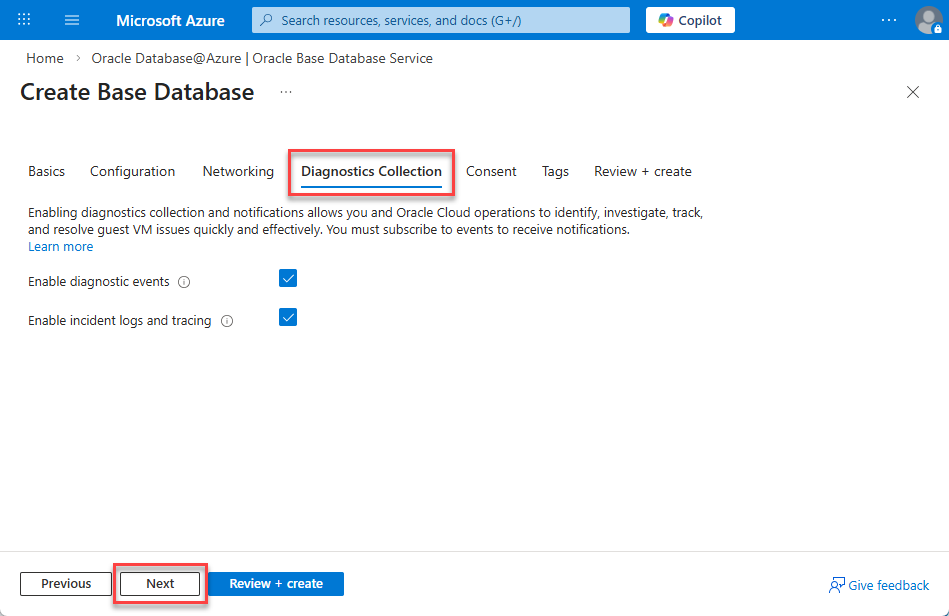

7. On the **Consent** tab, review the Oracle terms of use and privacy policy. Make sure the **I agree to the terms of service** checkbox is checked, and then click **Next**.

      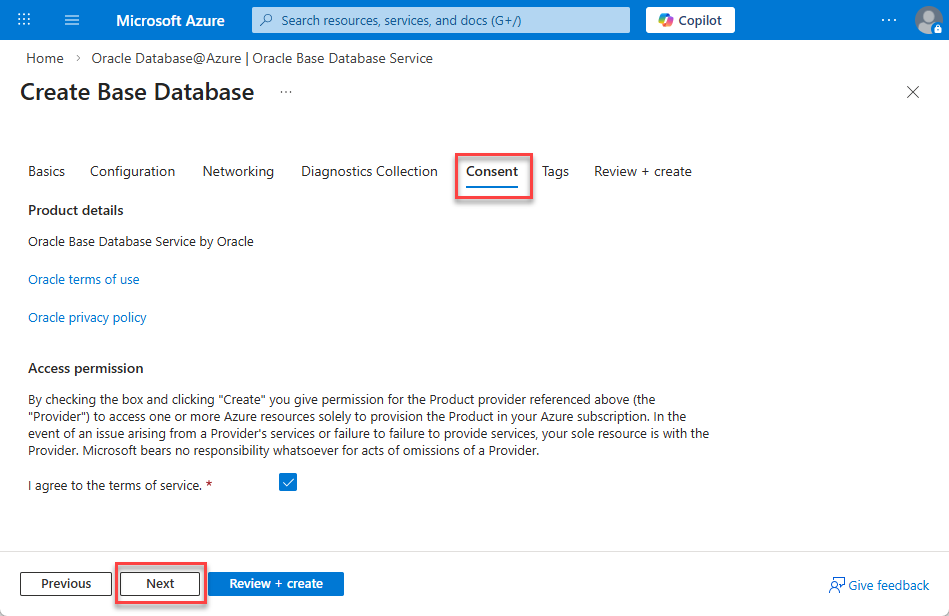

8.  On the **Tags** tab, create the following two tags, and then click **Next**.

      - **Tag 1:** Enter or select **Environment** for the name and **Training** for the value.
      - **Tag 2:** Enter or select **Created by** for the name and enter your name for the value.

      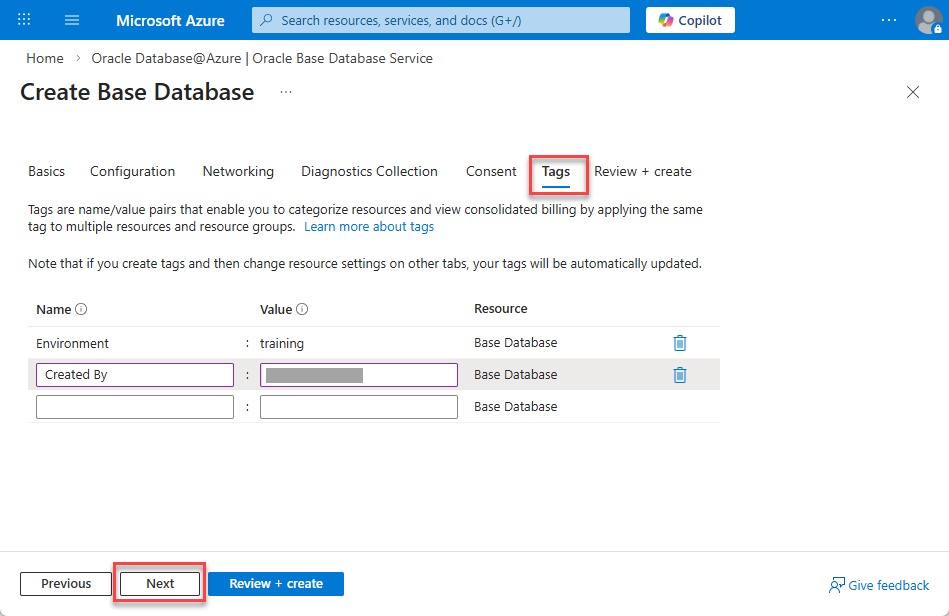

9. The **Review + create** page will validate the input provided in the previous steps. Once validation is successful, click **Create** to create the Base Database Service.
  
      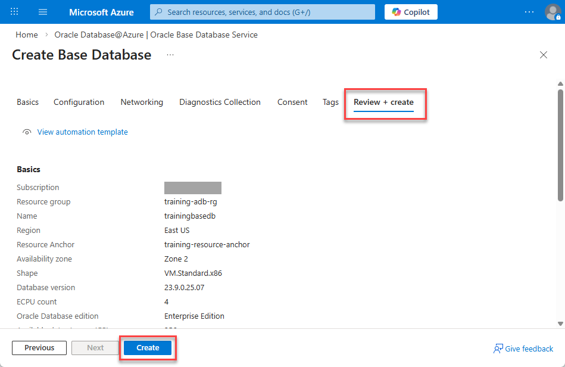

10. The **Generate new key pairs** dialog box is displayed. 

      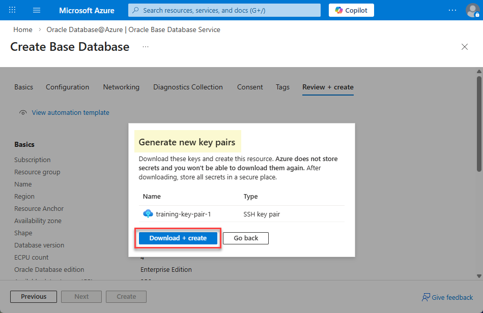

11. Click **Download + create**. The `training-key-pair-1` is downloaded to the Web browser's `Downloads` directory on our MS-Windows machine.

      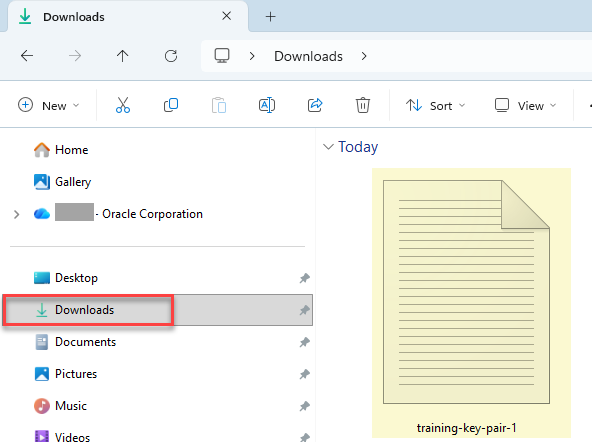

12. The deployment may take up to an hour. Once complete, a "`Your deployment is complete`" message is displayed.

      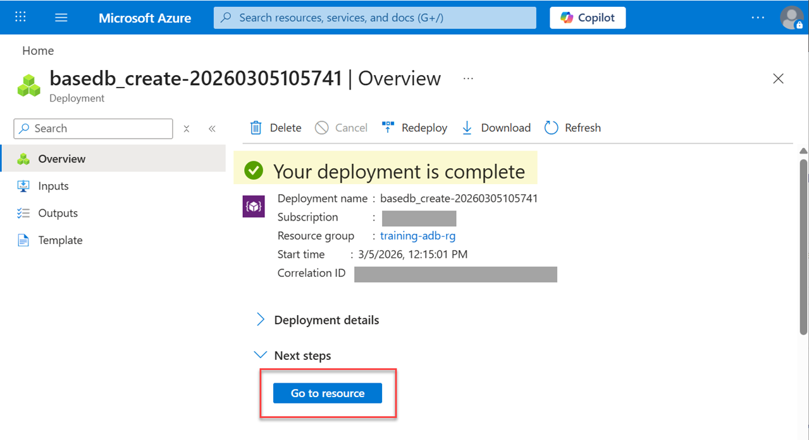

13. Click **Go to resource** to view the details of the created database.

## Task 2: View the Database in OCI

1. On the `trainingbasedb` details page, click **Go to OCI**.

      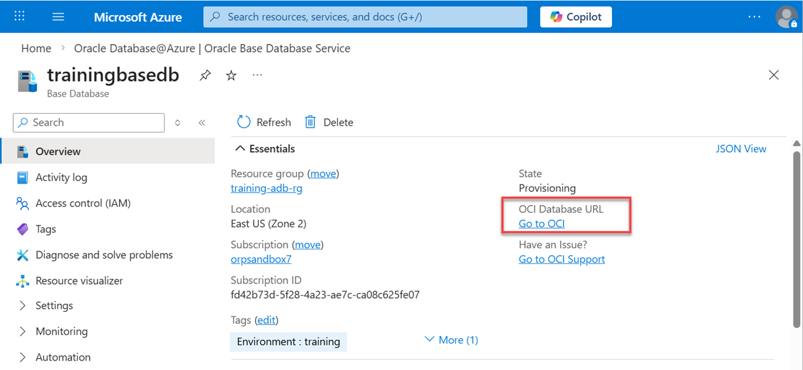

2. On the `trainingbasedb` page in OCI, click the **Databases** tab. 

      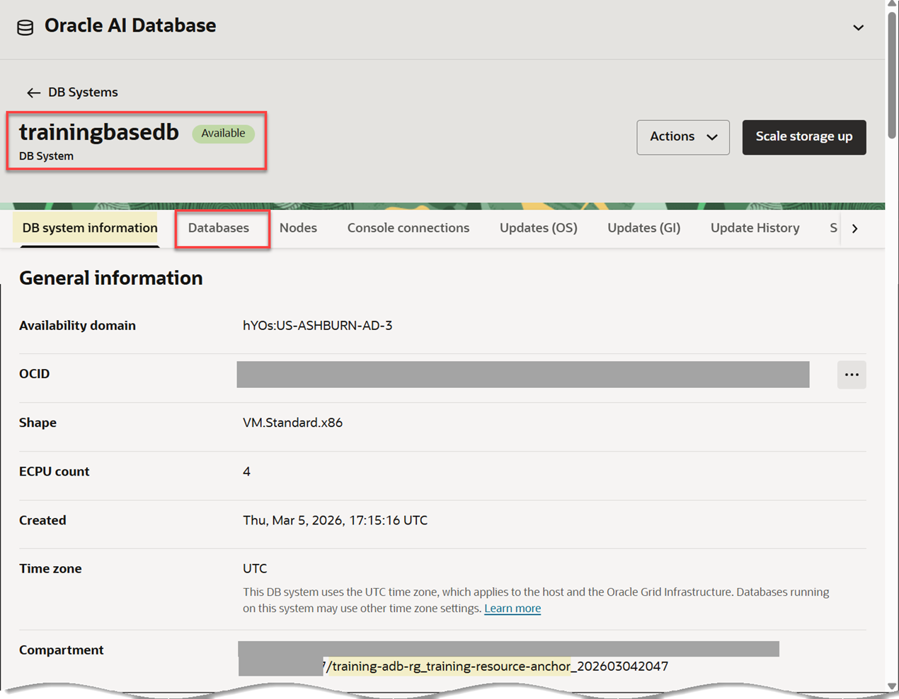

      The **training** database is displayed. 

3. On the row for the **training** database, click the **Actions** icon (ellipsis), and then click **View DB connection** from the context menu.

      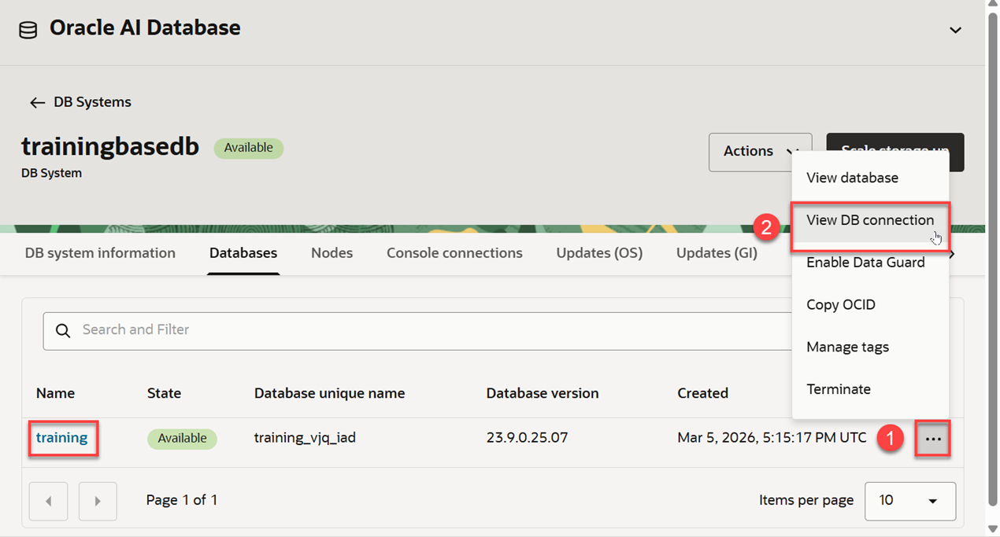

      The **Database Connection** dialog box is displayed.

4. You will need to copy the **Easy Connect** string (and optionally the **Long** string) which you will need when you connect to your database on the VM using SQL Developer in the next lab. On the **Easy Connect** row, click the **Actions** icon, and then select **Copy connection string**. Paste the connection string in a text editor of your choice. You will use this connect string when you connect to the database using SQL Developer on the VM in the next lab. 

      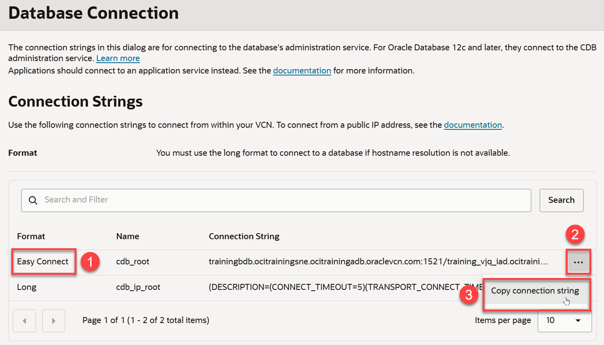

      The first part of the connect string is the hostname (highlighter in blue). The second part of the connect string is the service name (highlighted in yellow).

      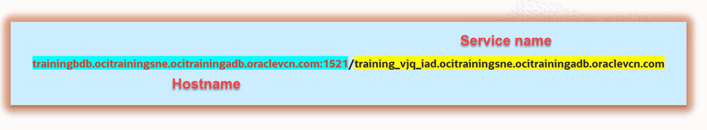

5. You can also copy the **Long** connection string if you need it. On the **Long** row, click the **Actions** icon, and then select **Copy connection string**. Paste the connection string in the same text editor from the previous step.

6. On the **trainingbasedb** page, click the **training** database link. 

7. Click the **Pluggable Databases** tab. The **PDB01** database is displayed.

      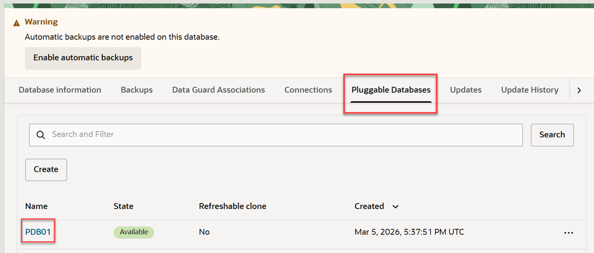

You may now proceed to the next lab.

## Learn More

* [Create an Oracle Base Database Service](https://docs.oracle.com/en-us/iaas/Content/database-at-azure/azucr-create-base-database.html)

## Acknowledgements

* **Author:** Lauran K. Serhal, Consulting User Assistance Developer, Oracle Autonomous AI Database and Multicloud
* **Contributors:** Devinder Singh, Senior Principal Solutions Architect - Multicloud
* **Last Updated By/Date:** Lauran K. Serhal, March 2026