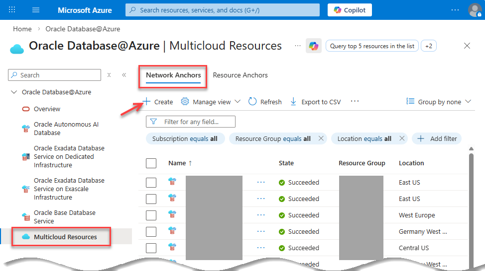
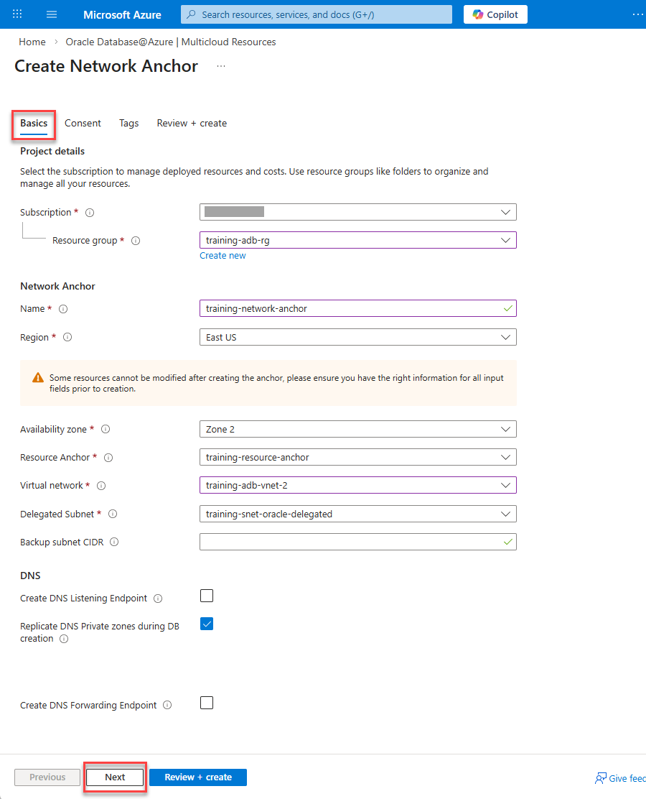
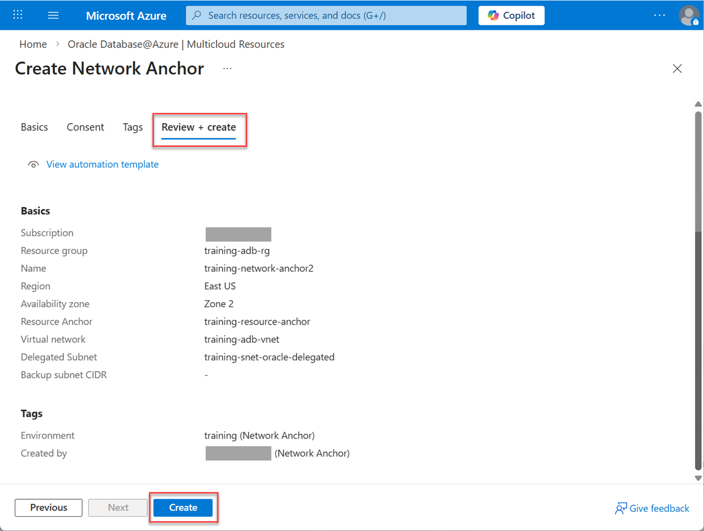

# Lab 3: Create a Network Anchor

## Introduction

In this lab, you will create a **Network Anchor**, a prerequisite for creating an Oracle Base Database Service in Oracle Database@Azure. The Network Anchor establishes the network linkage between Azure and OCI, enabling secure communication for your database services.

Estimated Time: 20 minutes

### Objectives

In this lab, you will:
* Create a Network Anchor in your Azure subscription
* Associate the Network Anchor with your Virtual Network (VNet) and delegated subnet
* Verify the successful creation of the Network Anchor

### Prerequisites

This lab assumes you have successfully completed all previous labs.

## Task 1: Create a Network Anchor

1. Log in to the [Azure Portal](https://portal.azure.com/), if you are not already logged in. In the search field at the top, enter `Oracle Database@Azure` and select it from the results.

2. In the left-hand navigation pane, click on **Multicloud Resources**, and then select the **Network Anchors** tab.

      

3. On the **Network Anchors** page, click **+ Create**.

4. The Network Anchor creation process is a four (4) step process. On the **Basics** tab specify the following: 
      - **Subscription:** Select your Azure subscription.
      - **Resource Group:** Choose the resource group you created in **Lab 1**, `training-adb-rg`.
      - **Name:** Enter a unique name for the Network Anchor such as `training-network-anchor`.
      - **Region:** Select the same region as your VNet.
      - **Availability Zone:** Accept the default availability zone.
      - **Resource Anchor:** Select the Resource Anchor you created in **Lab 2**, `training-resource-anchor`.
      - **Virtual Network:** Select your existing VNet, `training-adb-vnet-2`.
      - **Delegated Subnet:** Select the subnet delegated to `Oracle.Database/networkAttachments`, `training-snet-oracle-delegated`.
      - **Create DNS Listening Endpoint:** Accept the default, unchecked. Enable this option to allow Azure applications to resolve OCI database instance FQDNs.
      - **Replicate DNS Private Zones during DB Creation:** Checked. Enable this option to copy your database’s private DNS zones from OCI to Azure.
      - **Create DNS Forwarding Endpoint:** Accept the default, unchecked. Enable this option to allow OCI services to resolve Azure private FQDNs.

      

      Click **Next**.

5. On the **Consent** tab, review the Oracle terms of use and privacy policy. Make sure the **I agree to the terms of service** checkbox is checked, and then click **Next**.

      

6. On the **Tags** tab, create the following two tags. 
      - **Tag 1:** Enter or select **Environment** for the name and **Training** for the value.
      - **Tag 2:** Enter or select **Created by** for the name and enter your name for the value.

      

      Click **Next**. 
      
7. The **Review + create** page will validate the input provided in the previous steps. Once validation is successful, click **Create** to deploy the Network Anchor.

      

8. The `"Deployment is in progress"` message is displayed. When the deployment is complete, a `"Your deployment is complete`" message is displayed. You can click **Go to resource** to navigate to your resource group and search for the newly created Resource Anchor.

   

## Task 2: Verify Deployment

1. Once the deployment is complete, navigate back to **Home > Oracle Database@Azure > Multicloud Resources > Network Anchors**. 

2. Enter `training` in the **Filter for any field**. 

3. Confirm that your new Network Anchor appears in the list with a status of **Succeeded**.

   

You may now proceed to the next lab.

## Learn More

* [Network Anchor](https://docs.oracle.com/en-us/iaas/Content/database-at-azure/azucr-create-network-anchor-optional.html)

## Acknowledgements

- **Author:** Lauran K. Serhal, Consulting User Assistance Developer, Oracle Autonomous AI Database and Multicloud
- **Contributors:** Devinder Singh, Senior Principal Solutions Architect - Multicloud
- **Last Updated By/Date:** Lauran K. Serhal, March 2026