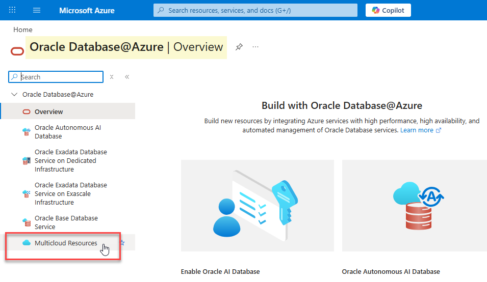
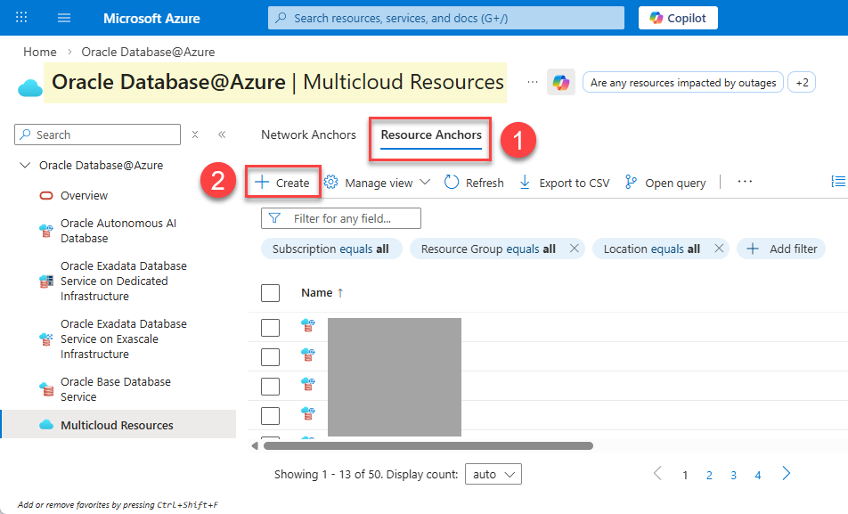
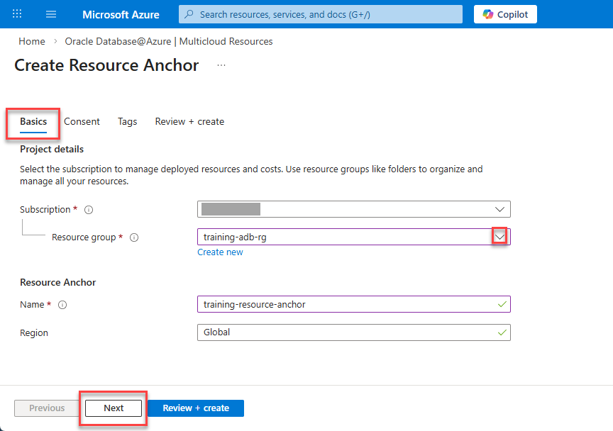
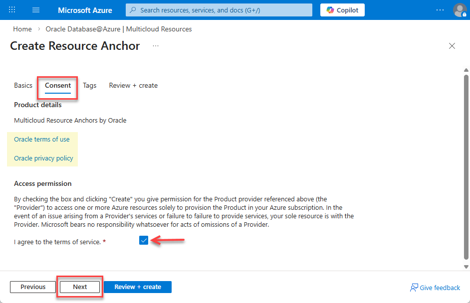
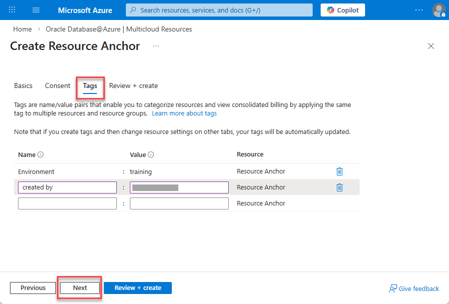
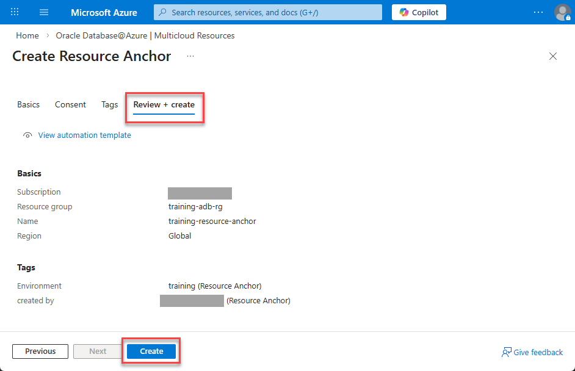

# Lab 2: Create a Resource Anchor

## Introduction

In this lab, you will create a **Resource Anchor**, a prerequisite for creating an Oracle Base Database Service in Oracle Database@Azure. A Resource Anchor is a construct that logically encapsulates Azure resources such as subscriptions and resource groups and binds them to OCI resources such as compartments. This facilitates consistent management and access control across both environments. 

Estimated Time: 5 minutes

### Objectives

In this lab, you will:
* Create a Resource Anchor under your Azure subscription in the resource group created in Lab 1
* Verify the successful creation of the Resource Anchor

### Prerequisites

This lab assumes you have successfully completed all previous labs.

## Task 1: Create a Resource Anchor

1. Log in to the [Azure Portal](https://portal.azure.com/), if you are not already logged in.

2. In the **Azure services** section, click the **Oracle Database@Azure** icon. If the **Oracle Database@Azure** icon is not displayed, you can search for it using the **Search resources, services, and docs** search field. Next, select it from the results.

3. In the left-hand navigation pane, click **Multicloud Resources**. 

    

4. Click the **Resource Anchors** tab, and then click **+ Create**.

    

    The **Create Resource Anchor** page is displayed. 
 
5. On the **Basics** tab, configure the Resource Anchor as follows: 
      - **Subscription:** Select your Azure subscription.
      - **Resource Group:** Select the resource group you created in **Lab 1**, `training-adb-rg`.
      - **Name:** Enter a unique name for the Resource Anchor such as `training-resource-anchor`.
      - **Region:** Resource Anchors are global constructs.

        

        Click **Next**.

6. On the **Consent** tab, review the Oracle terms of use and privacy policy. Make sure that the **I agree to the terms of service** checkbox is selected, and then click **Next**.

    

7. On the **Tags** tab, create the following two tags. 

    - **Tag 1:** Enter or select **Environment** for the name and **Training** for the value.
    - **Tag 2:** Enter or select **Created by** for the name and enter your name for the value.

        

        Click **Next**. 
      
8. The **Review + create** page will validate the input provided in the previous steps. Once Validation is successful, click **Create** to deploy the Resource Anchor.

    

9. The **Deployment is in progress** message is displayed. 

    

   When the deployment is complete, a `"Your deployment is complete"` message is displayed. You can click **Go to resource** to navigate to your resource group and search for the newly created Resource Anchor.

    

## Task 2: Verify Deployment

1. Once the deployment is complete, navigate back to **Home > Oracle Database@Azure > Multicloud Resources > Resource Anchors**. 

2. Enter `training` in the **Filter for any field**. 

3. Confirm that your new Resource Anchor appears in the list with a status of **Succeeded**.

    

You may now proceed to the next lab.

## Learn More

* [Creating a Resource Anchor](https://docs.oracle.com/en-us/iaas/Content/database-at-azure/azucr-create-resource-anchor-optional.html)

## Acknowledgements

* **Author:** Lauran K. Serhal, Consulting User Assistance Developer, Oracle Autonomous AI Database and Multicloud
* **Contributor:** Devinder Singh, Senior Principal Solutions Architect - Multicloud
* **Last Updated By/Date:** Lauran K. Serhal, March 2026