# Create a VM and Access the Database Using SQL Developer

## Introduction

This lab walks you through the steps to deploy a Virtual Machine (VM) using the Azure portal so that you can access your newly created Oracle Base Database Service using Oracle SQL Developer. You will also download and install Oracle SQL Developer on the VM.

Estimated Time: 10 minutes

### Objectives

In this lab, you will:

- Deploy a Virtual Machine (VM) in Azure
- Connect to the VM via Remote Desktop Protocol (RDP)
- Download and install Oracle SQL developer
- Start SQL Developer and run a simple SQL Query

### Prerequisites
- This lab assumes you have successfully completed all previous labs.

## Task 1: Create a Virtual Machine in Azure Portal

To access your Oracle Base Database Service using SQL Developer, you must use a "Jump Box" (Virtual Machine or VM) located within the same private network (VNet), as private endpoints are not accessible from the public internet. If you don't have a VM, use the following steps to deploy one.

1.	On the Azure Portal Home page, search for **Virtual machines**, click the **+ Create** drop-down list, and then select **Virtual machine**.

    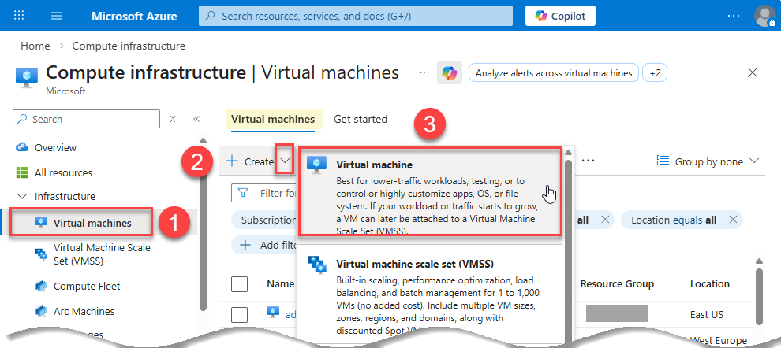

    The **Create a virtual machine** page is displayed.

2.	In the **Project and instance details** sections on the **Basics** tab, specify the following: 
    - **Subscription:** Select your subscription.
    - **Resource group:** `training-adb-rg`.
    - **Virtual machine name:** `training-oracle-base-db-vm`.
    - **Region:** Select your region.        
    - **Availability options:** `Availability zone`.    
    - **Zone options:** Accept the default, `Zone 1` in our example.
    - **Security type:** `Standard`.
    - **Image:** Select the option that is appropriate for you. In our example, we chose `Windows 11 Pro, version 25H2 - x64 Gen2`.
    - **Size:** Select at least 2 vCPUs and 8 GB RAM for stability. In our example, we chose `Standard_B2as_v2 – vcpus, 8 GiB memory`.
    
        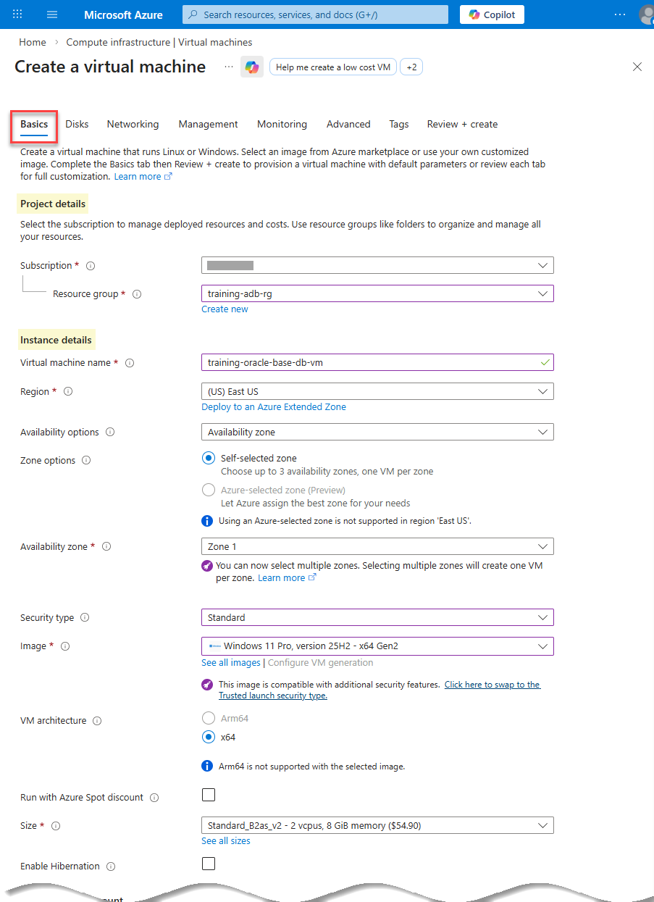

        In the **Administrator account**, **Inbound port rules**, and **Licensing** sections, specify the following:
    - **Administrator Account:** Enter a username and a strong password that you can remember and save them in a text editor of your choice as you'll need them later.
    - **Public inbound ports:** `Allow selected ports`.
    - **Select inbound ports:** `RDP (3389)`.
    - **Licensing:** `Checked`.

        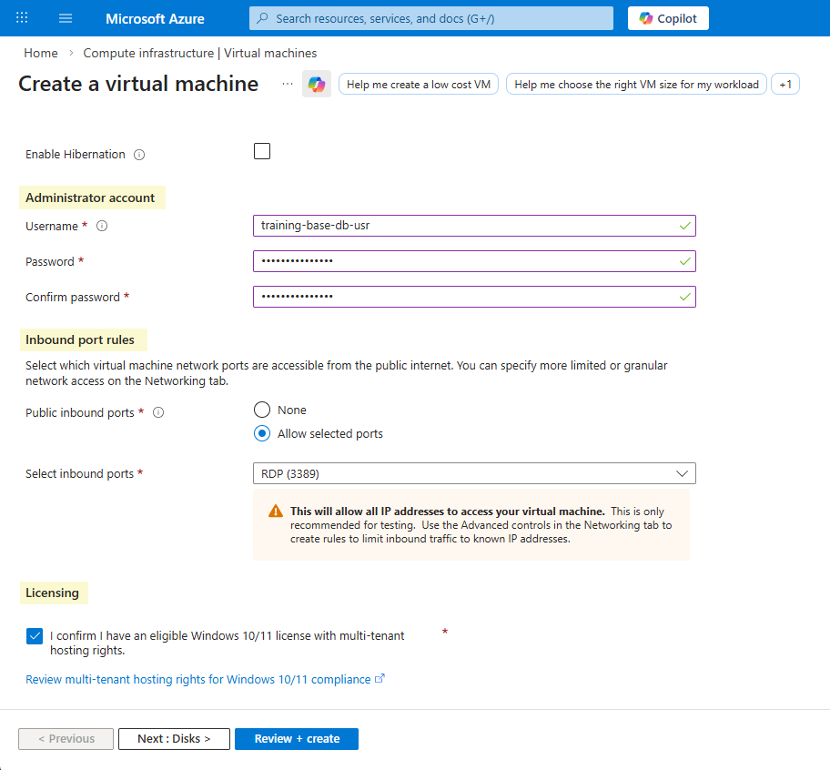

3.	Click the **Networking** tab (critical) and specify the following:
    - **Virtual Network:** Select the same VNet where your Oracle Base Database Service is created, `training-adb-vnet-2`.
    - **Subnet:** Choose the public subnet that was created in Lab 1 > Task 4.
    - **Delete public IP and NIC when VM is deleted:** Checked.

        For the rest of the fields, accept the default selections. 

        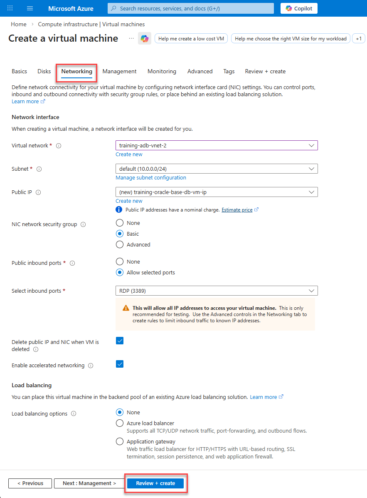

4.	Click **Review + create**. If the `Validation passed` message is displayed, click **Create**. 

    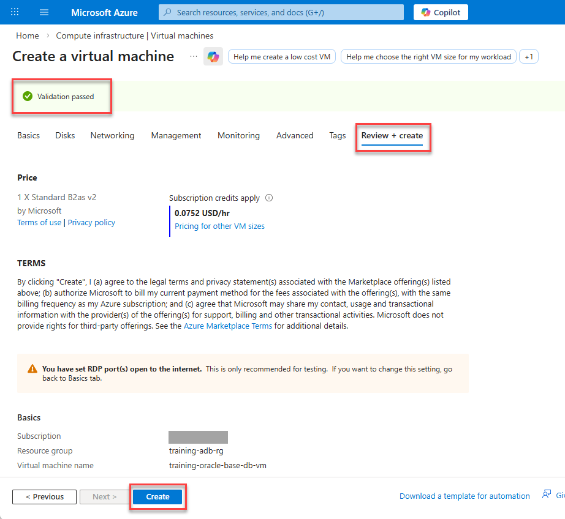

5. When the VM is deployed, a `Your deployment is complete` message is displayed.

    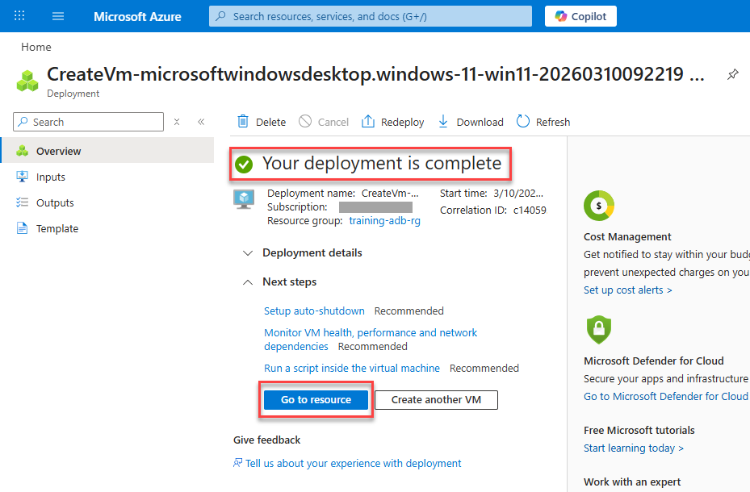

6. Click **Go to resource**. Your VM **Overview** page is displayed. Expand the **Connect** node in the navigation tree, and then click **Connect**. Alteratively, you click the **Connect** drop-down list, and then select **Connect**.

    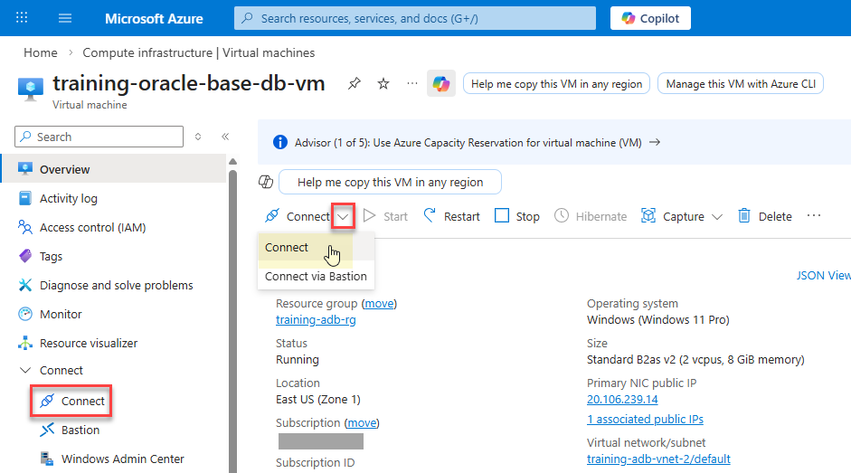

7. On the **Connect** page, click **Check access**.

    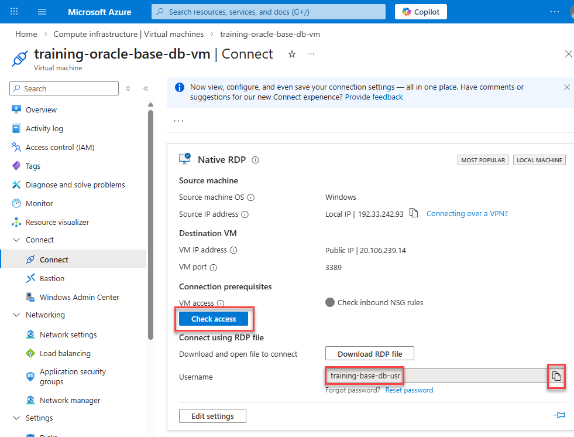

8. The following message is displayed: `Port 3389 is accessible from source IP(s)`.

    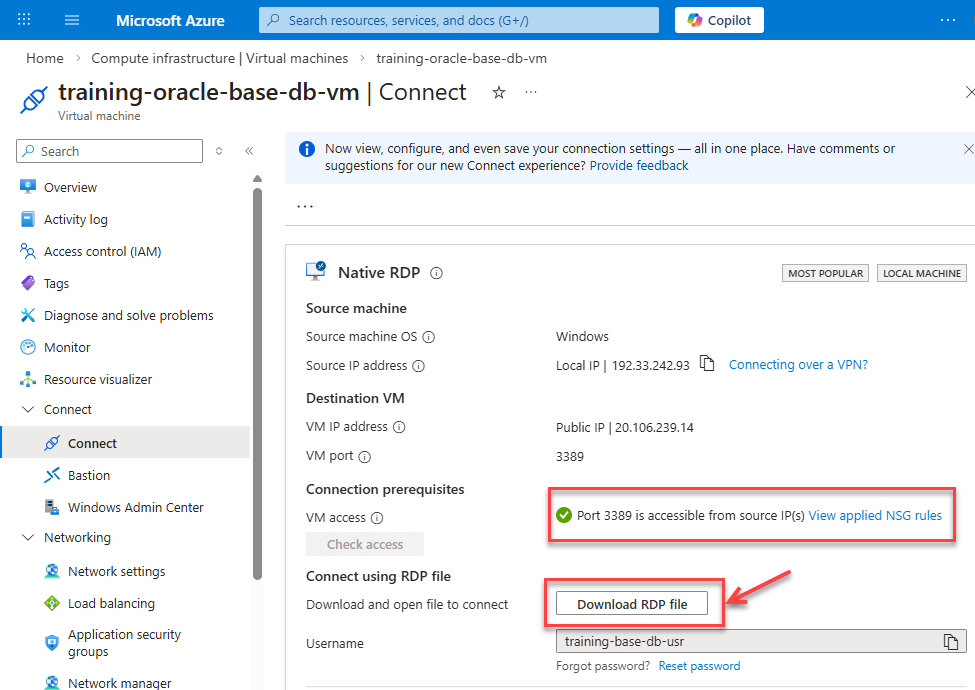

9. In the **Connect using RDP file** section, click **Download RDP file** to obtain the connection details for remote access to your Azure Windows VM; an RDP (.rdp) file or Remote Desktop Protocol, is a pre-configured configuration file that allows you to connect to a Windows Virtual Machine (VM) using the Remote Desktop Protocol. The file will be saved in your default `Downloads` folder as the VM's name such as `training-oracle-base-db-vm.rdp` (or with your VM's name, if different).

    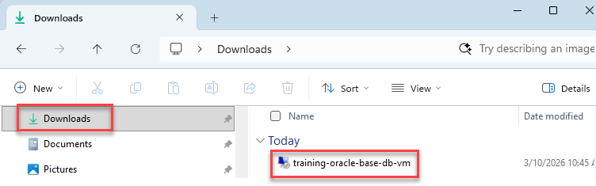

## Task 2: Connect to the VM via Remote Desktop Protocol (RDP)

>**Note:** To ensure a stable connection to your VM, please disconnect any active VPNs before attempting to connect. Certain VPN configurations may block the specific ports or protocols required for the workshop environment.

Once the VM is **Running**, connect to it from your local computer as follows:

1. Double-click the downloaded `training-oracle-base-db-vm.rdp` file to start the remote connection. If "`The publisher of this remote connection can't be identified`" security warning is displayed, click **Connect**.

    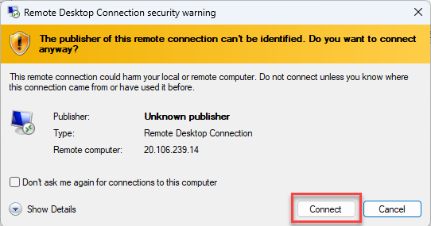

2. On the **Enter your credentials** dialog box, enter your VM's password, and then click **OK**. 

    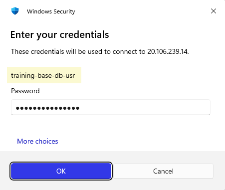

    If "`The identity of the remote computer cannot be verified. Do you want to connect anyway?`" security warning is displayed, click **Yes**.

      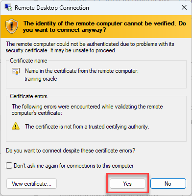

3. The VM is displayed. 

    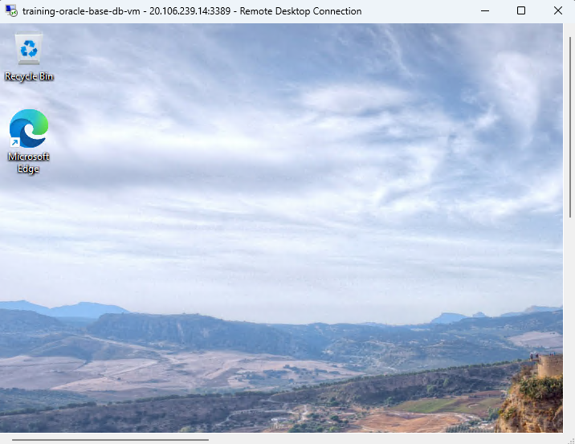

## Task 3: Install Oracle SQL Developer on the VM to Access the Database

Oracle SQL Developer is a graphical version of SQL*Plus that gives database developers a convenient way to perform basic tasks. You can connect to any target Oracle database schema using standard Oracle database authentication. You can then browse, create, edit, and delete (drop) database objects; run SQL statements and scripts; edit and debug PL/SQL code; manipulate and export data; and view and create reports.

In this lab, you will download, extract, and start SQL Developer on your VM.

1. Inside the Remote Desktop session (on the Windows 11 VM), open Microsoft Edge. Download the latest version of Oracle SQL Developer for your own platform from the [Oracle SQL Developer](https://www.oracle.com/database/sqldeveloper/technologies/download/) page to a directory of your choice on your VM. In our example, we are using the MS-Windows platform; therefore, we clicked the **Download** link in the row for the **Windows 64-bit with JDK 17 included**  to download the installation `zip` file.

    

    >**Note:** Make sure you click and read the **Installation Notes** for your own platform. 

    The `.zip` file is downloaded to the **Downloads** directory by default.

    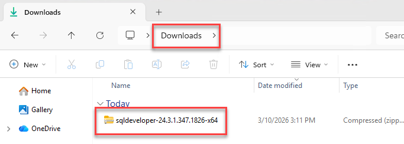

2. Open File Manager and navigate to the **Downloads** folder. Right-click the downloaded file's name, and then select **Extract All** from the context menu. 

    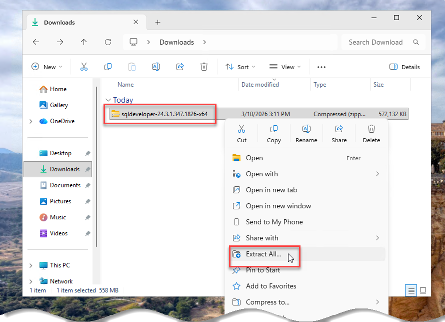  

3. In the **Select a Destination and Extract Files** dialog box, accept the default folder, and then click **Extract**.
   
    Unzipping the SQL Developer kit creates a folder named **sqldeveloper** under our selected folder. 

    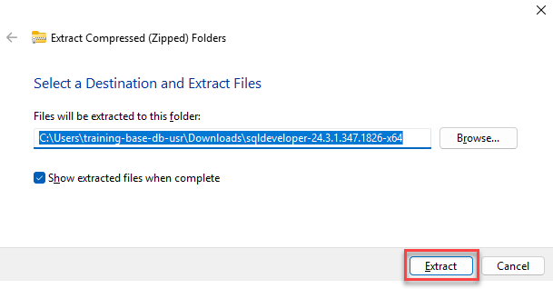  

4. The extracted file contents are displayed in the folder that you chose. In the top **sqldeveloper** folder, you can double-click the **`sqldeveloper.exe`** file to start SQL Developer.

    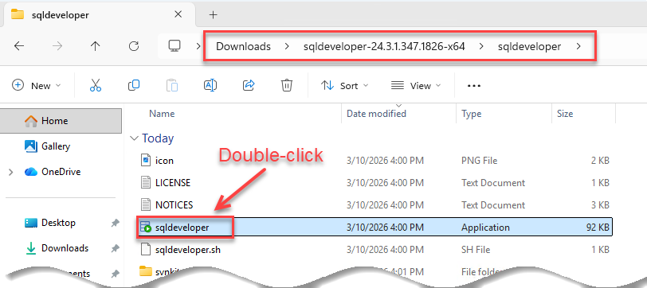  

    If the **Confirm Import Preferences** dialog box is displayed, click **No**. When the **Oracle Usage Tracking** dialog box is displayed, click **OK**.

5. Oracle SQL Developer is displayed.

    

## Task 4: Access the Database from the VM Using SQL Developer

Since your VM is now inside the private network, it can resolve the database's private URL.

  >**Note:** If you are connected to VPN, disconnect from it.

1. Create a new database connection. In the **Connections** pane, click the **New Connection** icon (green plus sign) on the toolbar, and then click **New Database Connection**.

    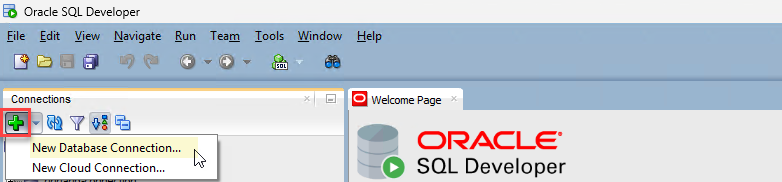

2. In the **New/Select Database Connection** dialog box, specify the following:

    * **Name:** `trainingbasedb-connection`.
    * **Database Type:** `Oracle`.
    * **Authentication Type:** `Default`.
    * **Username:** `sys`.
    * **Role:** `SYSDBA`.
    * **Password:** Enter your database password.
    * **Save Password:** Unchecked.
    * **Connection Type:** `Basic`.
    * **Hostname:** Paste the _hostname_ portion of the **Easy Connect** string that you copied to a text editor file in **Lab 4 > Task 2 > Step 4**.
    * **Service name:** Paste the _Service name_ portion of the **Easy Connect** string that you copied to a text editor file in **Lab 4 > Task 2 > Step 4**.

        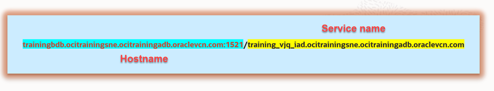

3. Click **Test** to test your connection. If the test is successful, the **Status: Success** message is displayed in the dialog box.

    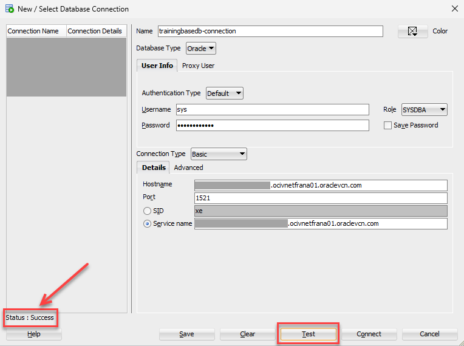

4. Click **Connect**. The **trainingbasedb-connection** schema is displayed in the **Oracle Connections** tree.

    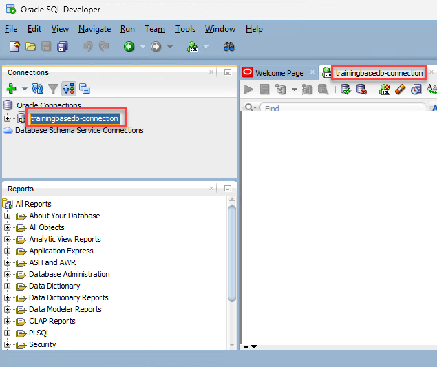

5. Copy the following query, paste it into the SQL Worksheet, and then click the **Run Statement** icon on the toolbar. The results are displayed in the **Query Result** tab.

    ```
    <copy>
    SELECT sysdate
    FROM dual;
    </copy>
    ```
    
    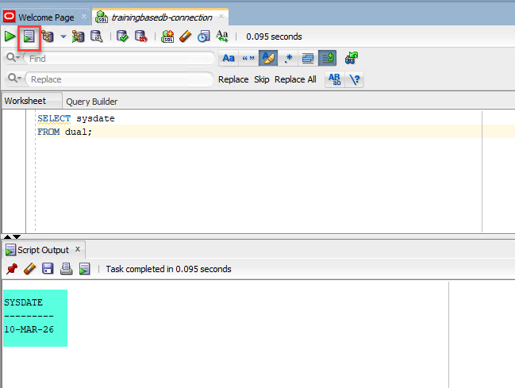

You may now proceed to the next lab.

## Learn More

* [SQL Developer Documentation](https://docs.oracle.com/en/database/oracle/sql-developer/)

## Acknowledgements
- **Author:** Lauran K. Serhal, Consulting User Assistance Developer, Oracle Autonomous AI Database and Multicloud
- **Contributors:** Devinder Singh, Senior Principal Solutions Architect - Multicloud
- **Last Updated By/Date:** Lauran K. Serhal, March 2026