# Get Started with the Azure Event Environment

## Introduction

In this lab, you retrieve the temporary event credentials, sign in to Azure, complete multifactor authentication (MFA), and connect to the assigned Windows virtual machine.

Estimated Time: 15 minutes

### Objectives

In this lab, you will:

- Retrieve your event credentials from LiveLabs
- Sign in to the Azure portal and configure MFA
- Download and open the RDP file for your assigned virtual machine

## Task 1: Retrieve Your Azure Event Credentials

1. On the LiveLabs workshop page, select **View Login Info**.

2. Locate the Azure event account details. Keep the panel open so you can copy the following values when prompted:

    - Azure user name
    - Azure password
    - Windows virtual machine password
    - Assigned user number or resource suffix

3. Open the [Azure portal](https://portal.azure.com) in a new browser tab.

    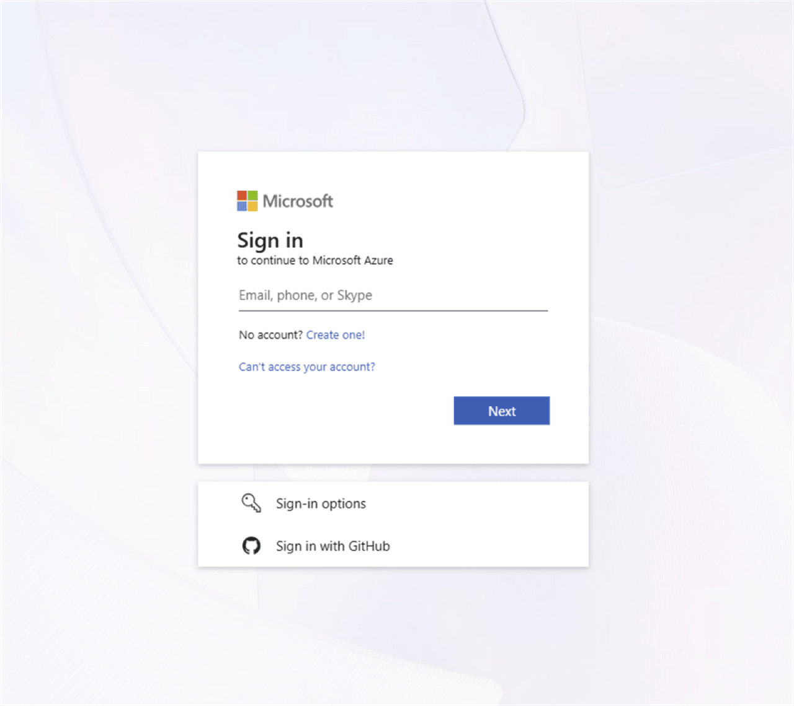

4. Copy the Azure user name from **View Login Info**, paste it into the sign-in page, and select **Next**.

    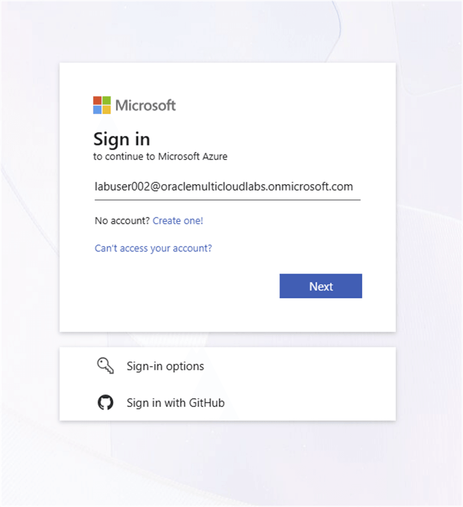

5. Copy the Azure password from **View Login Info**, paste it into the password field, and select **Sign in**.

    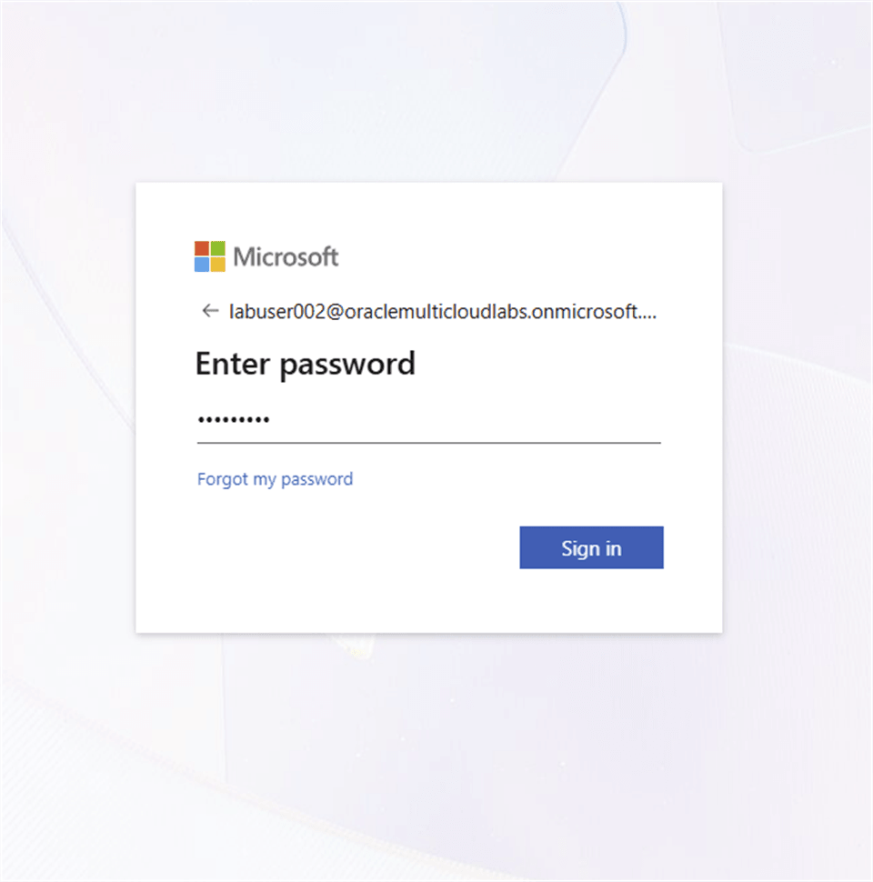

> **Note:** These event credentials are temporary. Use only the resources assigned to your account.

## Task 2: Configure Multifactor Authentication

1. On the **More information required** page, select **Next**.

    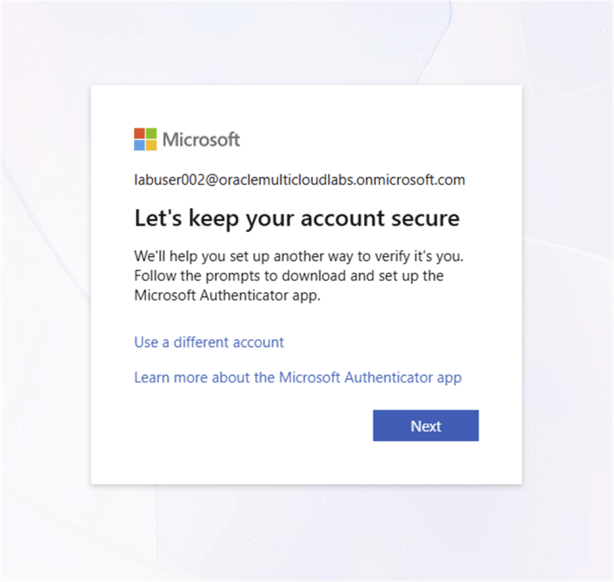

2. Install **Microsoft Authenticator** on your mobile device, and then select **Next** in the browser.

    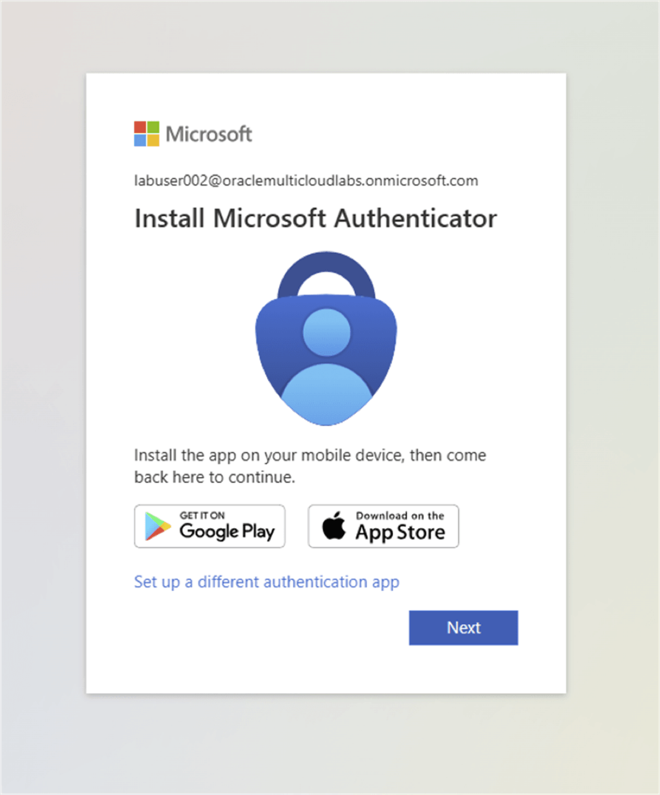

3. On the **Set up your account** page, select **Next**.

    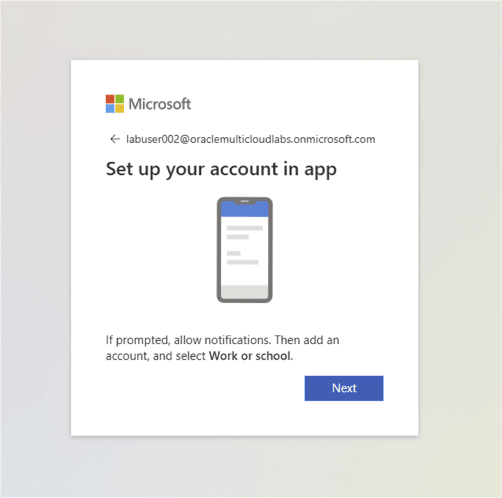

4. In Microsoft Authenticator, select the QR-code icon or **Add account**, choose **Work or school account**, and scan the QR code displayed in your own browser. Use your current enrollment code, not a code from a screenshot.

    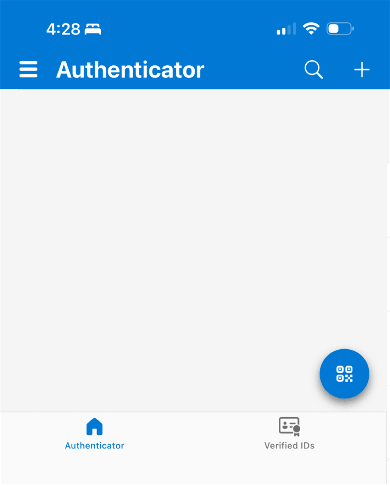

5. When the browser displays a number, enter that number in Microsoft Authenticator and approve the request.

    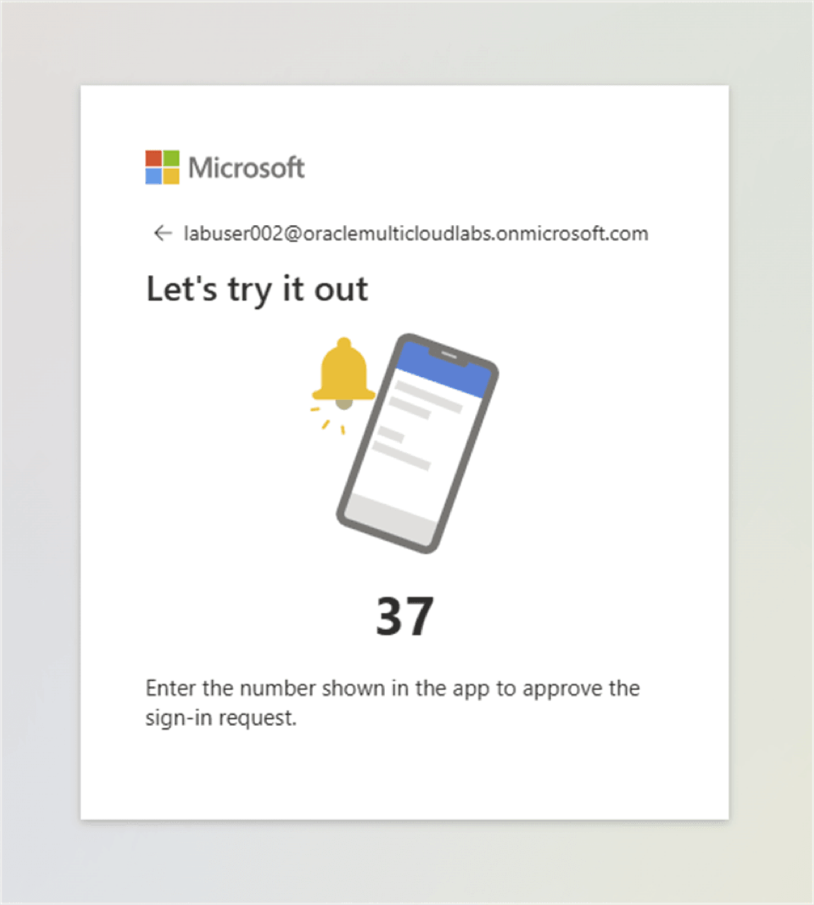

    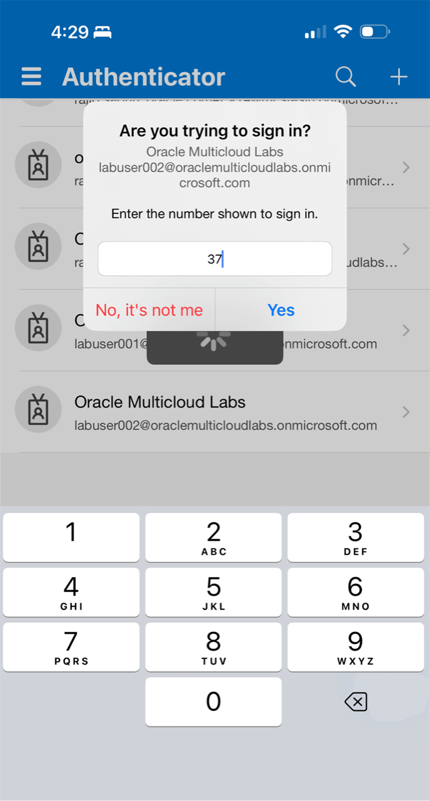

6. After the browser confirms that Microsoft Authenticator was added, select **Done**.

    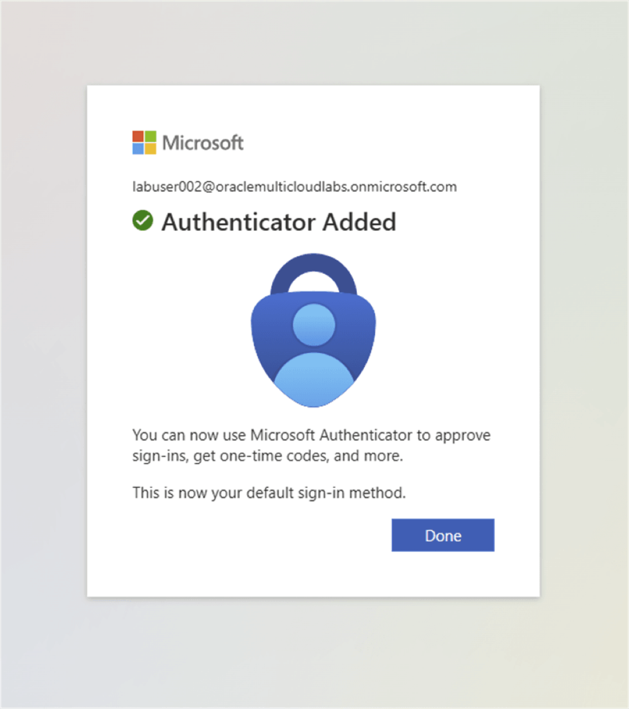

7. If prompted to stay signed in, select **Don't show this again**, and then select **Yes**.

    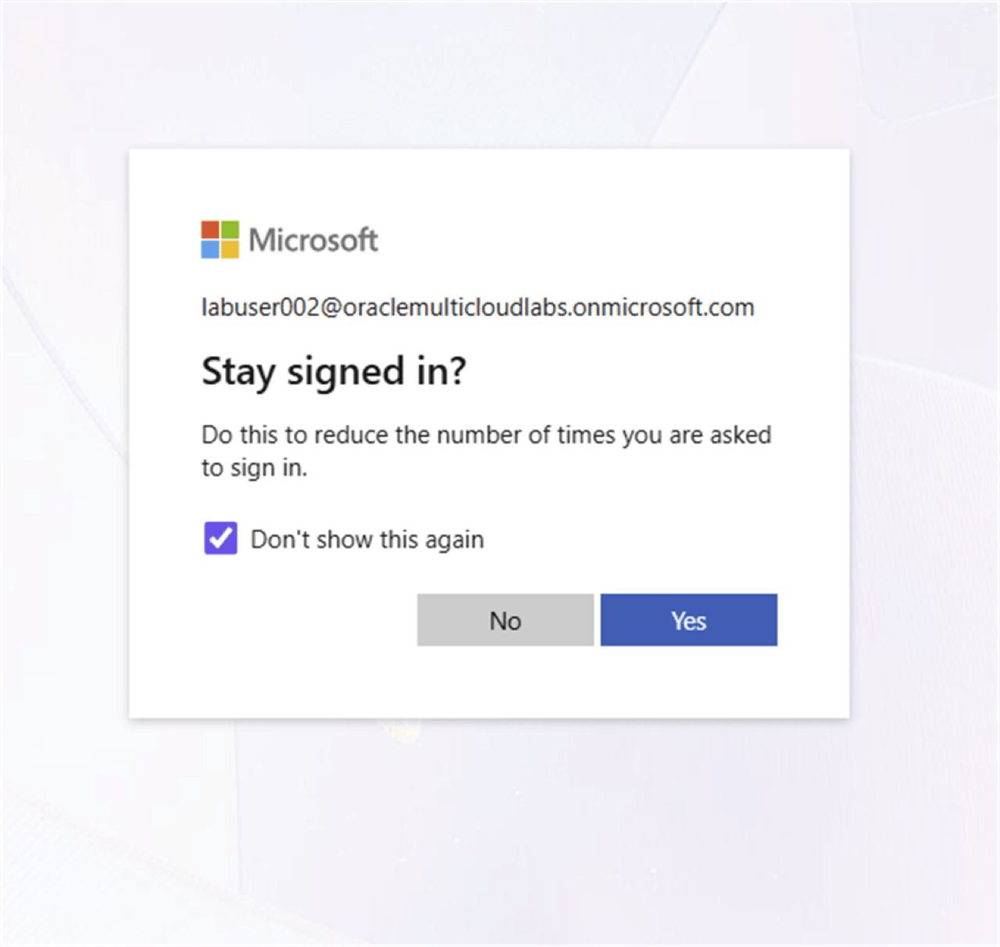

8. Confirm that the Azure portal opens.

    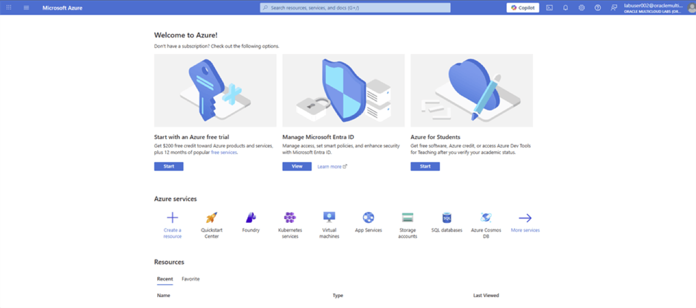

9. Record the resource values supplied by the facilitator for the shared labs: database name, storage account name, storage container name, Azure OpenAI resource name, and deployment name. Keep the `ADMIN`, `LAKE_DEMO`, and Windows passwords and the two service keys available through the event's credential process. Ask the facilitator for any value missing from **View Login Info**.

    Guide examples use `hollakehouse` / `lakehouse-data` for storage and `lab-lakehous-open-ai` / `lablakehouse-nlp` for Azure OpenAI. Use the resources assigned to your event if their names differ.

## Task 3: Connect to the Windows Virtual Machine

## Acknowledgements

- **Author** - Oracle Multicloud Team
- **Last Updated By/Date** - Oracle LiveLabs, September 2026
