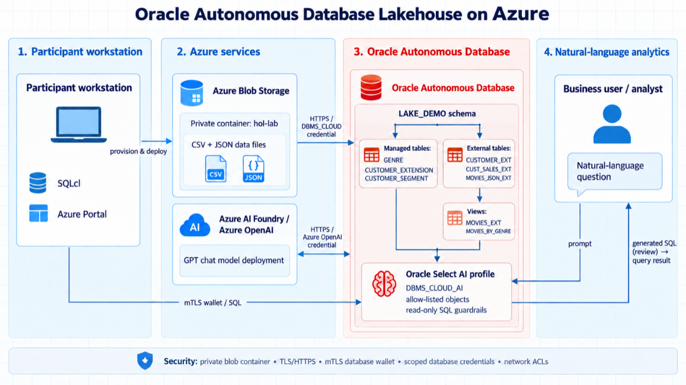
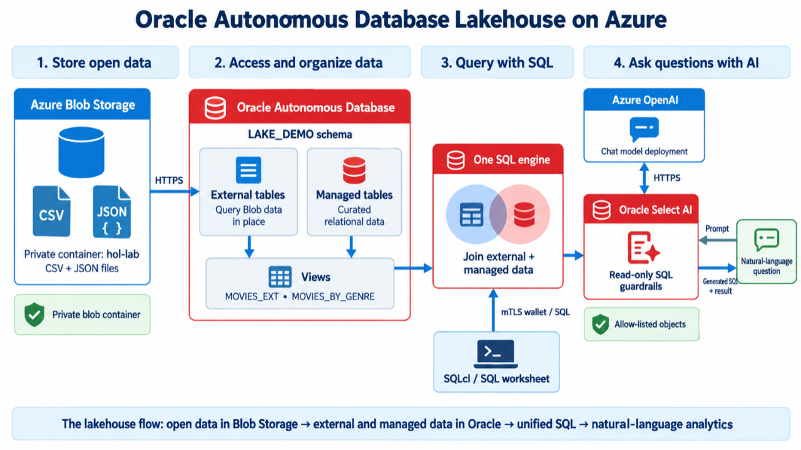

# Build a Data Lake with Autonomous AI Lakehouse

## Introduction

Oracle Autonomous AI Database Lakehouse on Oracle AI Database@Azure provides a governed lakehouse close to Azure applications. It combines Autonomous AI Database performance, security, and automated management with access to data in Azure Blob Storage.

In the customer-tenancy track, you first set up the Azure network, Windows VM, Blob Storage, Autonomous AI Database, reference data, and Azure OpenAI deployment in your own subscription. You then connect to Autonomous AI Database, expose CSV and JSON files in Azure Blob Storage as external tables, create relational views over JSON data, and use Select AI with Azure OpenAI to generate SQL from natural-language questions.

The completed workflow keeps source data in Azure Blob Storage while Oracle Autonomous AI Database supplies SQL access, governance, and AI-assisted analytics.

### Objectives

In this workshop, you will:

- Provision the workshop resources in your Azure subscription and connect to its Windows virtual machine
- Download an Autonomous AI Database wallet and configure Oracle SQL Developer
- Create a database credential for Azure Blob Storage
- Build external tables and views over CSV and JSON data
- Configure Select AI to use an Azure OpenAI deployment
- Generate, review, and run SQL from natural-language prompts

### Prerequisites

- An Azure subscription with permission and quota to create the resources in Getting Started
- Oracle AI Database@Azure onboarding completed for that subscription and BYOL eligibility for the database
- Access to Azure Cloud Shell in Bash mode and an RDP client for the Windows VM
- Availability and quota for the Azure OpenAI model specified during setup
- Familiarity with SQL and basic database concepts

Estimated Workshop Time: 1 hour 30 minutes for the shared labs, plus customer environment provisioning. Provisioning time depends on resource availability.

Resources created in your subscription incur charges. After preparing your environment, you follow the shared connection, storage, external-table, and Select AI labs.

## Acknowledgements

- **Author** - Oracle Multicloud Team
- **Last Updated By/Date** - Oracle LiveLabs, September 2026
