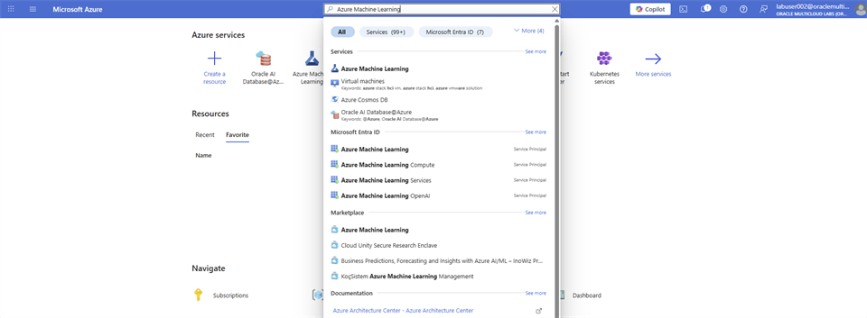
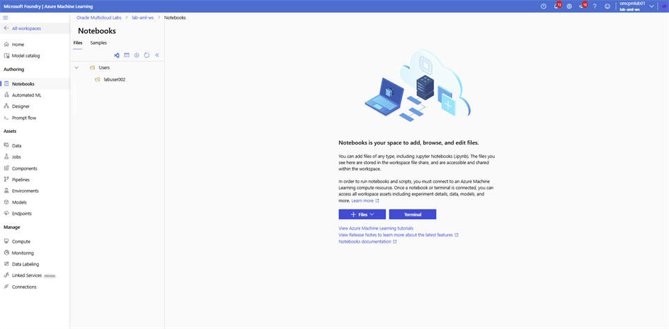
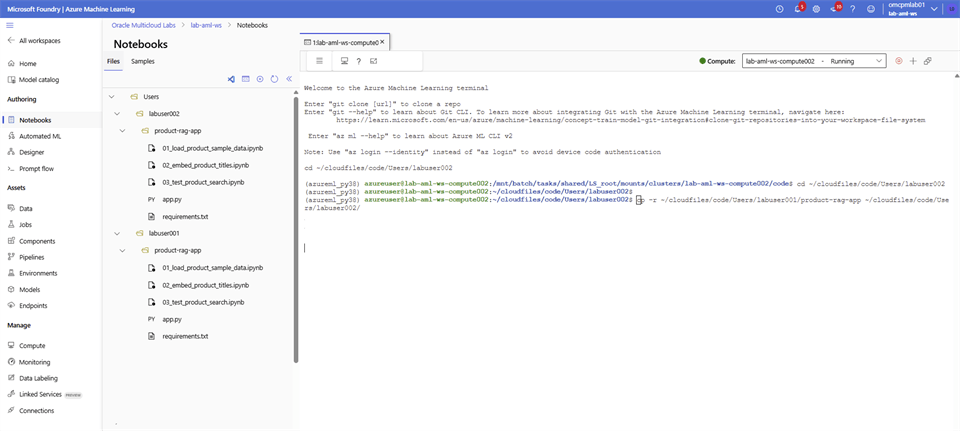

# Azure Machine Learning Studio

## Introduction

Open the pre-created Azure Machine Learning workspace and prepare your notebook environment.

### Objectives

* Open the Azure Machine Learning workspace.
* Copy the workshop files to your user folder.
* Create the Python environment and install dependencies.

Estimated Time: 20 minutes

## Task 1: Prepare Azure Machine Learning Studio

1. Login to Azure Portal, search for **Azure Machine Learning**.

    

2. Select on the **lab-aml-ws** workspace.

    

3. Select **Launch studio**. This opens a new tab.

    

4. On the **Microsoft Foundry** | **Azure Machine Learning** page select **Notebooks** and locate the folder with your **user name**.

    

5. Use the **(…)** Menu and select **Open terminal**.

    

6. Copy the below code block in the terminal and replace **<xxx>** with the last 3 digit of your user name, hit **Enter**. To see the folder and files in it, select your user name folder and select on the **Refresh** icon.

    ```bash
    <copy>
    cp -r ~/cloudfiles/code/Users/labuser001/product-rag-app ~/cloudfiles/code/Users/labuser<xxx>/
    </copy>
    ```

    

7. Copy the below code block in the terminal, hit **Enter**.

    ```bash
    <copy>
    cd product-rag-app/
    </copy>
    ```

8. Copy the below code block in the terminal, hit **Enter**. Its expected to take **20 minutes** to finish installing all the required Python libraries. **DO NOT close the Terminal window.**

    ```bash
    <copy>
    python -m venv .venv
    source .venv/bin/activate
    
    python -m pip install --upgrade pip
    python -m pip install -r requirements.txt
    </copy>
    ```

## Acknowledgements

* **Authors** - Rajib Sadhu
* **Source** - [Build a RAG App in 90 Minutes - Oracle AI Vector Search Meets Your Favorite LLM](https://docs.oracle.com/en/cloud/paas/multicloud/database-at-azure/latest/azlab/overview.html).
* **External assets** - Microsoft Azure interface screenshots and the referenced McAuley-Lab/Amazon-Reviews-2023 dataset material. Built with permission from the author(s).
* **Last Updated By/Date** - Rajib Sadhu, June 12, 2026
