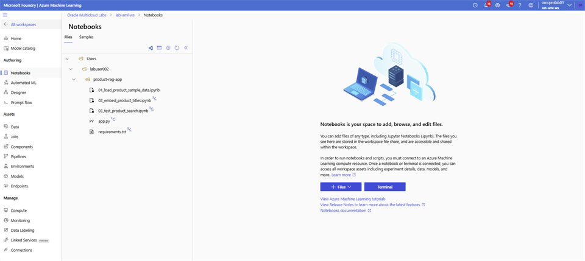

# Azure Machine Learning Studio

## Introduction

Open your Azure Machine Learning workspace and prepare the notebook environment.

### Objectives

* Open the Azure Machine Learning workspace.
* Create the workshop folder and files.
* Create the Python environment and install dependencies.

Estimated Time: 20 minutes

## Task 1: Prepare Azure Machine Learning Studio

1. Login to Azure Portal, search for **Azure Machine Learning**.

    

2. Select on the **lab-aml-ws** workspace.

    

3. Select **Launch studio**. This opens a new tab.

    

4. On the **Microsoft Foundry** | **Azure Machine Learning** page select **Notebooks** and locate the folder with your **user name**.

    

5. Use the **(…)** Menu and create the following project structure starting with **Create new folder** followed by **Create new file**.

    ```bash
    <copy>
    product-rag-app/
    |-- 01_load_product_sample_data.ipynb
    |-- 02_embed_product_titles.ipynb
    |-- 03_test_product_search.ipynb
    |-- app.py
    |-- requirements.txt
    </copy>
    ```

    

6. Verify the folder structure and confirm file types as below.

    

## Acknowledgements

* **Authors** - Rajib Sadhu and Bill Sawyer
* **Source** - [Build a RAG App in 90 Minutes - Oracle AI Vector Search Meets Your Favorite LLM](https://docs.oracle.com/en/cloud/paas/multicloud/database-at-azure/latest/azlab/overview.html).
* **External assets** - Microsoft Azure interface screenshots and the referenced McAuley-Lab/Amazon-Reviews-2023 dataset material. Built with permission from the author(s).
* **Last Updated By/Date** - Rajib Sadhu, June 12, 2026
