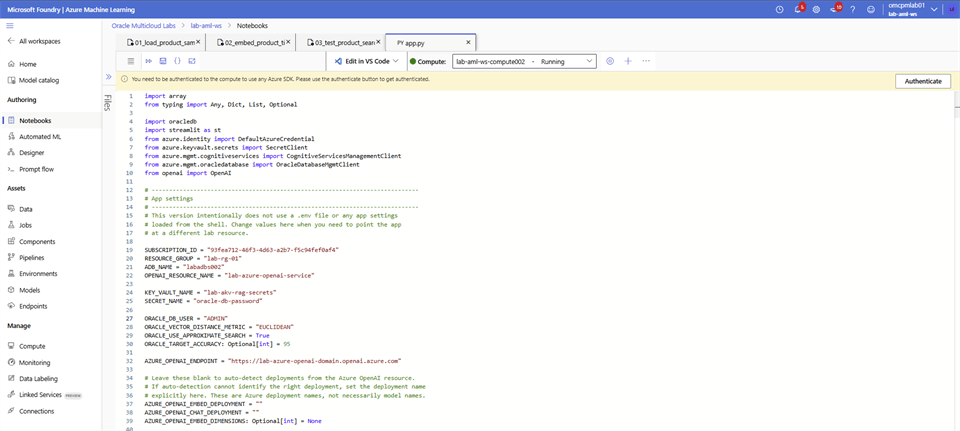
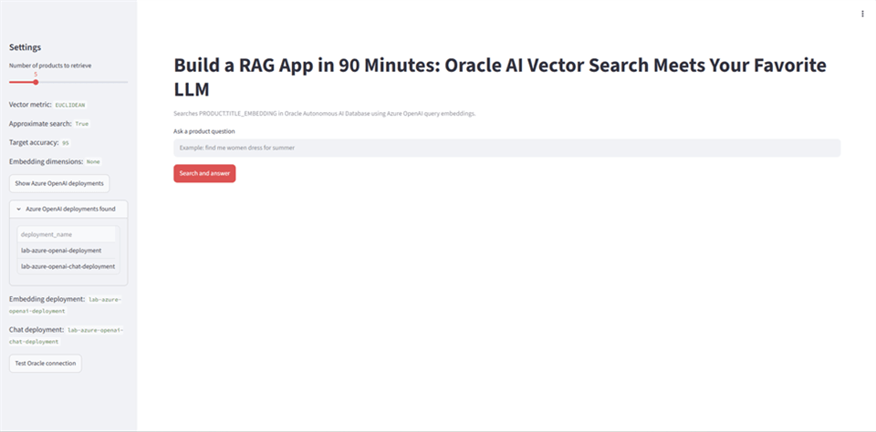
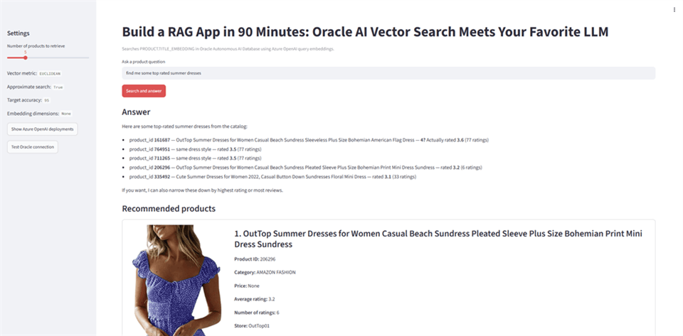
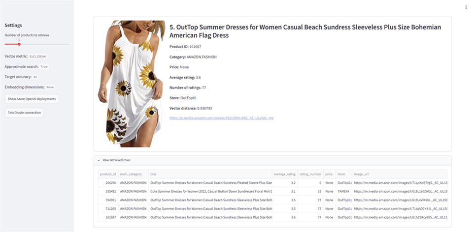

# Deploy a RAG Application

## Introduction

Run the Streamlit application, connect it to Oracle Autonomous AI Database, and test responses grounded in the retail product catalog.

### Objectives

* Start the Streamlit RAG application.
* Verify the Oracle database connection.
* Test catalog questions and an out-of-domain question.

Estimated Time: 15 minutes

## Task 1: Run and test the retail assistant

In this step, you build and deploy the RAG application. To complete the exercise, follow the steps:

1. Login to **Microsoft Foundry** | **Azure Machine Learning** studio and select **Notebooks**. Navigate to your folder and open the **app.py** file.

2. Update the **ADB_NAME** by replacing **<xxx>** with last 3 digit of your user name, select **Save**.

    

3. To run the app, use the **(…)** Menu next to the **product-rag-app** folder. Select **Open terminal**. Copy the following code blocks into the terminal and hit **Enter**.

    

    ```bash
    <copy>
    source .venv/bin/activate
    
    streamlit run app.py \
      --server.address 0.0.0.0 \
      --server.port 8501
    </copy>
    ```

    

    > **Note:** Use the suggested URL in Step 4. If you receive an error message that port 8501 is already in use, pick another port number.

4. To open the app, open another browser tab and paste the following URL. Replace **xxx** with the last 3 digit of your **Lab user name**. To test database connectivity, select **Test Oracle Connection**.

    [https://lab-aml-ws-compute**xxx**-8501.eastus.instances.azureml.ms/](https://lab-aml-ws-compute002-8501.eastus.instances.azureml.ms/)

    

5. Search for “*Show me floral summer dresses*”.

    

6. Search for “*find me some top rated summer dresses*”.

    

    

7. Now let’s put the RAG implementation to test. Search for “*looking to buy a house in Brentwood, Nashville area. Can you pull top 5 listings*”.

    

## Acknowledgements

* **Authors** - Rajib Sadhu and Bill Sawyer
* **Source** - [Build a RAG App in 90 Minutes - Oracle AI Vector Search Meets Your Favorite LLM](https://docs.oracle.com/en/cloud/paas/multicloud/database-at-azure/latest/azlab/overview.html).
* **External assets** - Microsoft Azure interface screenshots and the referenced McAuley-Lab/Amazon-Reviews-2023 dataset material. Built with permission from the author(s).
* **Last Updated By/Date** - Rajib Sadhu, June 12, 2026
