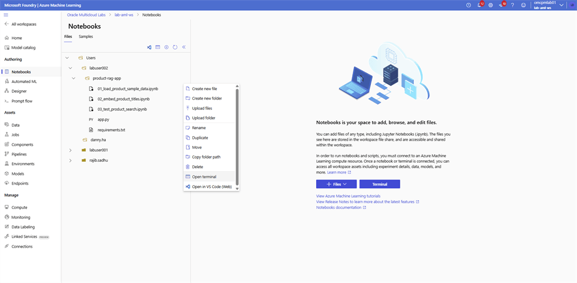
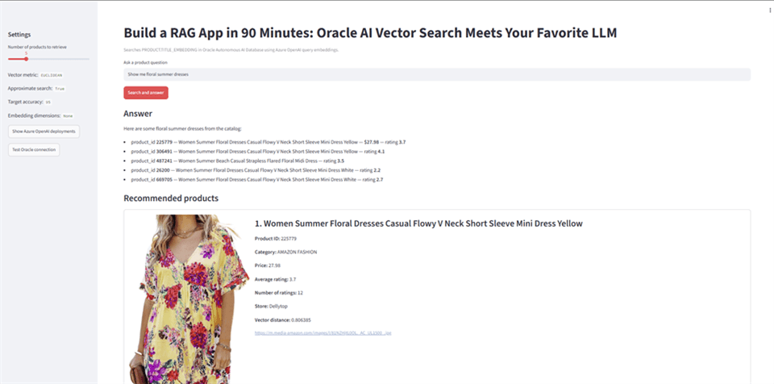
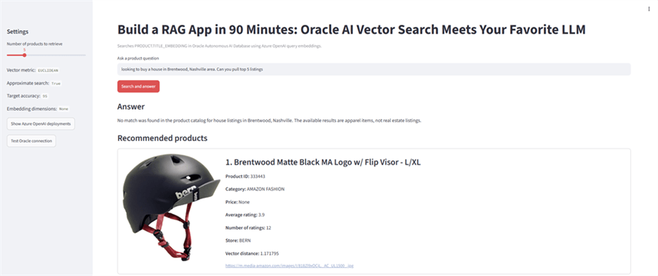
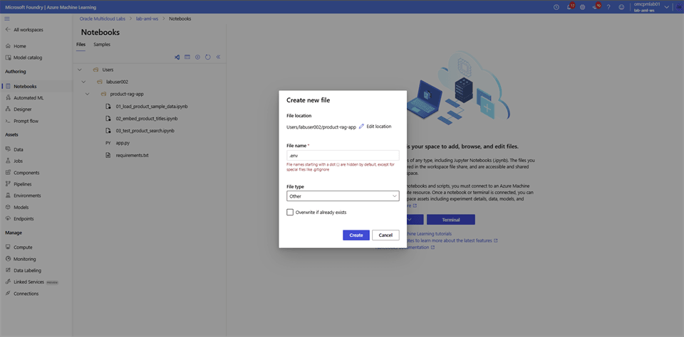
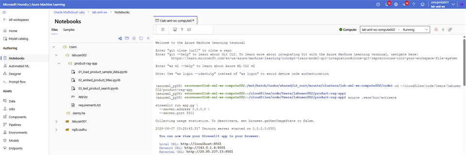
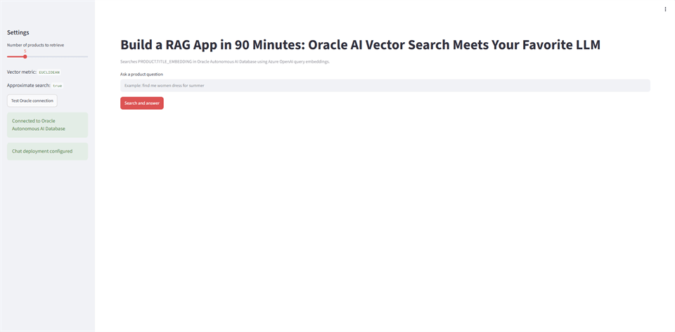
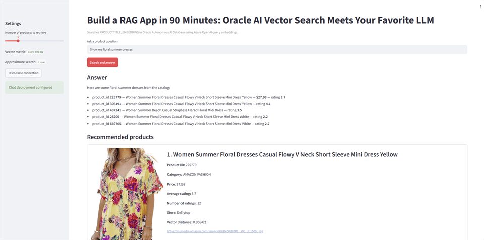
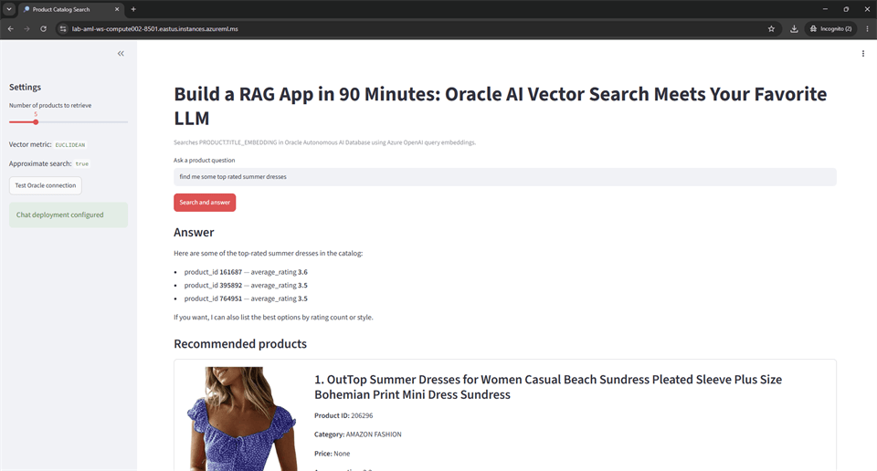
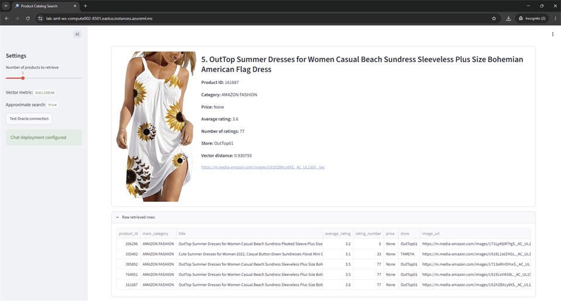
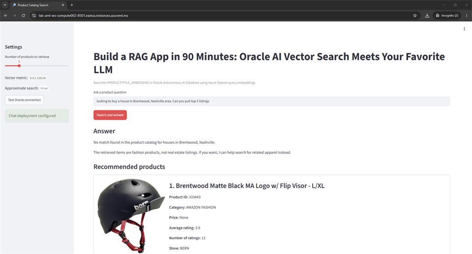

# Deploy a RAG Application

## Introduction

Run the Streamlit application, connect it to Oracle Autonomous AI Database, and test responses grounded in the retail product catalog.

### Objectives

* Start the Streamlit RAG application.
* Verify the Oracle database connection.
* Test catalog questions and an out-of-domain question.

Estimated Time: 15 minutes

## Task 1: Run and test the retail assistant

In this step, you build and deploy the RAG application. To complete the exercise, follow the steps:

### Azure Event Account

1. Login to **Microsoft Foundry** | **Azure Machine Learning** studio and select **Notebooks**. Navigate to your folder and open the **app.py** file.

2. Update the **ADB_NAME** by replacing **<xxx>** with last 3 digit of your user name, select **Save**.

    

3. To run the app, use the **(…)** Menu next to the **product-rag-app** folder. Select **Open terminal**. Copy the following code blocks into the terminal and hit **Enter**.

    

    ```bash
    source .venv/bin/activate
    
    streamlit run app.py \
      --server.address 0.0.0.0 \
      --server.port 8501
    ```

    

    > **Note:** Use the suggested URL in Step 4. If you receive an error message that port 8501 is already in use, pick another port number.

4. To open the app, open another browser tab and paste the following URL. Replace **xxx** with the last 3 digit of your **Lab user name**. To test database connectivity, select **Test Oracle Connection**.

    [https://lab-aml-ws-compute**xxx**-8501.eastus.instances.azureml.ms/](https://lab-aml-ws-compute002-8501.eastus.instances.azureml.ms/)

    

5. Search for “*Show me floral summer dresses*”.

    

6. Search for “*find me some top rated summer dresses*”.

    

    

7. Now let’s put the RAG implementation to test. Search for “*looking to buy a house in Brentwood, Nashville area. Can you pull top 5 listings*”.

    

### Azure Regular Account

1. On the **Microsoft Foundry | Azure Machine Learning** Studio, select **Notebooks** and locate the folder with your **user name**.

    

2. Use the **(…)** menu and select **Create new file**, enter **File name** -> **.env**, select **File type** -> **Other**, and select **Create**.

    

3. Copy the following content into the `.env` file. Update the `ORACLE_DSN` value with the Oracle Autonomous AI Database connection string retrieved earlier. Save the file, **DO NOT close the file!**

    ```bash
    # Azure OpenAI
    AZURE_OPENAI_ENDPOINT=https://lab-azure-openai-domain.openai.azure.com
    AZURE_OPENAI_API_KEY=01AEi0ugivUkp1e9qxe0xxxxxxxxxxxxxxxxxxBjFXJ3w3AAABACOGxm2K
    AZURE_OPENAI_EMBED_DEPLOYMENT=lab-azure-openai-deployment
    AZURE_OPENAI_CHAT_DEPLOYMENT=lab-azure-openai-chat-deployment
    
    
    # Oracle Autonomous Database - walletless TLS connection
    ORACLE_USER=ADMIN
    ORACLE_PASSWORD=YourStrongPassword123!
    
    # Copy the TLS connection string from Autonomous Database -> Database Connection -> TLS.
    # Keep it on one line inside quotes.
    ORACLE_DSN="(description= (retry_count=20)(retry_delay=3)(address=(protocol=tcps)(port=1521)(host=xxxxxxx.adb.us-ashburn-1.oraclecloud.com))(connect_data=(service_name=xxxxxxxxx_xxxxxxxx_high.adb.oraclecloud.com))(security=(ssl_server_dn_match=no)))"
    
    
    # Vector search settings
    ORACLE_VECTOR_DISTANCE_METRIC=EUCLIDEAN
    ORACLE_USE_APPROXIMATE_SEARCH=true
    
    # Optional
    # ORACLE_TARGET_ACCURACY=95
    ```

4. Open the `requirements.txt` file, add the following content, and save it.

    ```bash
    streamlit>=1.37.0
    openai>=1.0.0
    oracledb>=3.2.0
    python-dotenv>=1.0.1
    ```

5. Open the `app.py` file, add the following code, and save it.

    ```python
    import array
    import os
    from typing import Any, Dict, List
    
    import oracledb
    import streamlit as st
    from dotenv import load_dotenv
    from openai import OpenAI
    
    
    load_dotenv()
    
    
    ALLOWED_VECTOR_METRICS = {"EUCLIDEAN"}
    
    
    def get_required_env(name: str) -> str:
        value = os.getenv(name, "").strip()
        if not value:
            raise RuntimeError(f"Missing required environment variable: {name}")
        return value
    
    
    def get_optional_int_env(name: str) -> int | None:
        value = os.getenv(name, "").strip()
        if not value:
            return None
    
        try:
            return int(value)
        except ValueError:
            raise RuntimeError(f"{name} must be an integer.")
    
    
    def get_vector_metric() -> str:
        metric = os.getenv("ORACLE_VECTOR_DISTANCE_METRIC", "EUCLIDEAN").strip().upper()
    
        if metric not in ALLOWED_VECTOR_METRICS:
            allowed = ", ".join(sorted(ALLOWED_VECTOR_METRICS))
            raise RuntimeError(
                f"Invalid ORACLE_VECTOR_DISTANCE_METRIC={metric}. Use one of: {allowed}"
            )
    
        return metric
    
    
    def use_approximate_search() -> bool:
        value = os.getenv("ORACLE_USE_APPROXIMATE_SEARCH", "true").strip().lower()
        return value in {"1", "true", "yes", "y"}
    
    
    @st.cache_resource(show_spinner=False)
    def get_openai_client() -> OpenAI:
        endpoint = get_required_env("AZURE_OPENAI_ENDPOINT").rstrip("/")
    
        if endpoint.endswith("/openai/v1"):
            base_url = endpoint + "/"
        else:
            base_url = endpoint + "/openai/v1/"
    
        return OpenAI(
            api_key=get_required_env("AZURE_OPENAI_API_KEY"),
            base_url=base_url,
        )
    
    
    def get_oracle_connection_args() -> Dict[str, Any]:
        """
        Walletless Oracle Autonomous Database connection.
    
        ORACLE_DSN should be the TLS connection descriptor copied from:
        Autonomous Database -> Database Connection -> TLS.
        """
        return {
            "user": get_required_env("ORACLE_USER"),
            "password": get_required_env("ORACLE_PASSWORD"),
            "dsn": get_required_env("ORACLE_DSN"),
        }
    
    
    def test_oracle_connection() -> str:
        with oracledb.connect(**get_oracle_connection_args()) as connection:
            with connection.cursor() as cursor:
                cursor.execute("SELECT 'Connected to Oracle Autonomous AI Database' FROM dual")
                return cursor.fetchone()[0]
    
    
    def embed_query(text: str) -> array.array:
        client = get_openai_client()
    
        request: Dict[str, Any] = {
            "model": os.getenv(
                "AZURE_OPENAI_EMBED_DEPLOYMENT",
                "text-embedding-3-small",
            ).strip(),
            "input": text,
        }
    
        dimensions = get_optional_int_env("AZURE_OPENAI_EMBED_DIMENSIONS")
        if dimensions:
            request["dimensions"] = dimensions
    
        response = client.embeddings.create(**request)
        embedding = response.data[0].embedding
    
        return array.array("f", embedding)
    
    
    def search_products(query_vector: array.array, top_k: int) -> List[Dict[str, Any]]:
        top_k = max(1, min(int(top_k), 50))
        metric = get_vector_metric()
    
        approximate_word = "APPROXIMATE " if use_approximate_search() else ""
    
        target_accuracy = get_optional_int_env("ORACLE_TARGET_ACCURACY")
        target_accuracy_clause = ""
    
        if target_accuracy is not None:
            target_accuracy = max(1, min(target_accuracy, 100))
            target_accuracy_clause = f" WITH TARGET ACCURACY {target_accuracy}"
    
        sql = f"""
            SELECT
                product_id,
                main_category,
                title,
                average_rating,
                rating_number,
                price,
                store,
                JSON_VALUE(
                    images,
                    '$.hi_res[0]'
                    RETURNING VARCHAR2(4000)
                    NULL ON EMPTY
                    NULL ON ERROR
                ) AS image_url,
                VECTOR_DISTANCE(title_embedding, :query_vector, {metric}) AS distance
            FROM product
            WHERE title_embedding IS NOT NULL
            ORDER BY VECTOR_DISTANCE(title_embedding, :query_vector, {metric})
            FETCH {approximate_word}FIRST {top_k} ROWS ONLY{target_accuracy_clause}
        """
    
        rows: List[Dict[str, Any]] = []
    
        with oracledb.connect(**get_oracle_connection_args()) as connection:
            with connection.cursor() as cursor:
                cursor.execute(sql, query_vector=query_vector)
    
                column_names = [col[0].lower() for col in cursor.description]
    
                for db_row in cursor.fetchall():
                    row = dict(zip(column_names, db_row))
    
                    if row.get("distance") is not None:
                        row["distance"] = round(float(row["distance"]), 6)
    
                    rows.append(row)
    
        return rows
    
    
    def value_or_blank(value: Any) -> str:
        return "" if value is None else str(value)
    
    
    def build_product_context(rows: List[Dict[str, Any]]) -> str:
        lines = []
    
        for i, row in enumerate(rows, start=1):
            lines.append(
                f"[{i}] "
                f"product_id={value_or_blank(row.get('product_id'))}; "
                f"title={value_or_blank(row.get('title'))}; "
                f"category={value_or_blank(row.get('main_category'))}; "
                f"price={value_or_blank(row.get('price'))}; "
                f"average_rating={value_or_blank(row.get('average_rating'))}; "
                f"rating_number={value_or_blank(row.get('rating_number'))}; "
                f"store={value_or_blank(row.get('store'))}; "
                f"image_url={value_or_blank(row.get('image_url'))}; "
                f"vector_distance={value_or_blank(row.get('distance'))}"
            )
    
        return "\n".join(lines)
    
    
    def generate_answer(question: str, retrieved_products: List[Dict[str, Any]]) -> str:
        chat_deployment = os.getenv("AZURE_OPENAI_CHAT_DEPLOYMENT", "").strip()
    
        if not chat_deployment:
            return (
                "A chat model deployment was not configured. "
                "Set AZURE_OPENAI_CHAT_DEPLOYMENT to generate a natural-language answer. "
                "The retrieved products are shown below."
            )
    
        context = build_product_context(retrieved_products)
    
        system_message = """
    You are a helpful product search assistant.
    Answer only from the product context provided.
    If the context does not contain enough information, say that the no match found in the product catalog.
    When you recommend products, mention product_id values so the user can trace the answer.
    Keep the answer concise.
    """.strip()
    
        user_message = f"""
    User question:
    {question}
    
    Retrieved product context:
    {context}
    """.strip()
    
        client = get_openai_client()
    
        response = client.chat.completions.create(
            model=chat_deployment,
            temperature=0.2,
            messages=[
                {"role": "system", "content": system_message},
                {"role": "user", "content": user_message},
            ],
        )
    
        return response.choices[0].message.content or ""
    
    def display_product_recommendations(products: List[Dict[str, Any]]) -> None:
        st.subheader("Recommended products")
    
        for index, product in enumerate(products, start=1):
            image_url = value_or_blank(product.get("image_url"))
    
            with st.container(border=True):
                image_col, text_col = st.columns([1, 4])
    
                with image_col:
                    if image_url:
                        st.image(image_url, use_container_width=True)
                    else:
                        st.write("No image available")
    
                with text_col:
                    st.markdown(f"### {index}. {value_or_blank(product.get('title'))}")
    
                    st.write(f"**Product ID:** {value_or_blank(product.get('product_id'))}")
                    st.write(f"**Category:** {value_or_blank(product.get('main_category'))}")
                    st.write(f"**Price:** {value_or_blank(product.get('price'))}")
                    st.write(f"**Average rating:** {value_or_blank(product.get('average_rating'))}")
                    st.write(f"**Number of ratings:** {value_or_blank(product.get('rating_number'))}")
                    st.write(f"**Store:** {value_or_blank(product.get('store'))}")
                    st.write(f"**Vector distance:** {value_or_blank(product.get('distance'))}")
    
                    if image_url:
                        st.caption(image_url)
    
    def main() -> None:
        st.set_page_config(
            page_title="Product Catalog Search",
            page_icon="🔎",
            layout="wide",
        )
    
        st.title("Build a RAG App in 90 Minutes: Oracle AI Vector Search Meets Your Favorite LLM")
        st.caption(
            "Searches PRODUCT.TITLE_EMBEDDING in Oracle Autonomous AI Database "
            "using Azure OpenAI query embeddings."
        )
    
        with st.sidebar:
            st.header("Settings")
    
            top_k = st.slider(
                "Number of products to retrieve",
                min_value=1,
                max_value=20,
                value=5,
            )
    
            st.write(f"Vector metric: `{os.getenv('ORACLE_VECTOR_DISTANCE_METRIC', 'COSINE')}`")
            st.write(f"Approximate search: `{os.getenv('ORACLE_USE_APPROXIMATE_SEARCH', 'true')}`")
    
            if st.button("Test Oracle connection"):
                try:
                    message = test_oracle_connection()
                    st.success(message)
                except Exception as exc:
                    st.error("Oracle connection failed.")
                    st.exception(exc)
    
            if os.getenv("AZURE_OPENAI_CHAT_DEPLOYMENT", "").strip():
                st.success("Chat deployment configured")
            else:
                st.warning("No chat deployment configured")
    
        question = st.text_input(
            "Ask a product question",
            placeholder="Example: find me women dress for summer",
        )
    
        search_clicked = st.button("Search and answer", type="primary")
    
        if search_clicked:
            if not question.strip():
                st.warning("Enter a question first.")
                return
    
            try:
                with st.spinner("Creating query embedding with Azure OpenAI..."):
                    query_vector = embed_query(question)
    
                with st.spinner("Searching Oracle Autonomous AI Database..."):
                    products = search_products(query_vector, top_k)
    
                if not products:
                    st.info("No products found.")
                    return
    
                with st.spinner("Generating answer..."):
                    answer = generate_answer(question, products)
    
                st.subheader("Answer")
                st.write(answer)
    
                display_product_recommendations(products)
    
                with st.expander("Raw retrieved rows"):
                    st.dataframe(products, use_container_width=True)
    
            except Exception as exc:
                st.error("The app hit an error.")
                st.exception(exc)
    
    
    if __name__ == "__main__":
        main()
    ```

6. Run the app. Use the **(…)** menu next to the `product-rag-app` folder. Select **Open terminal**. Copy the following code block into the terminal window and press **Enter**.

    ```bash
    python -m venv .venv
    source .venv/bin/activate
    
    python -m pip install --upgrade pip
    python -m pip install -r requirements.txt
    ```

    ```bash
    source .venv/bin/activate
    
    streamlit run app.py \
      --server.address 0.0.0.0 \
      --server.port 8501
    ```

    

    

7. Open a new browser tab and paste the following URL. Replace **xxx** with the last 3 digit of your **Lab user name**. To test database connectivity, select **Test Oracle Connection**.

    [https://lab-aml-ws-compute**xxx**-8501.eastus.instances.azureml.ms/](https://lab-aml-ws-compute002-8501.eastus.instances.azureml.ms/)

    

8. Search for “*Show me floral summer dresses*”.

    

9. Search for “*find me some top rated summer dresses*”.

    

    

10. Now let’s put the RAG implementation to test. Search for “*looking to buy a house in Brentwood, Nashville area. Can you pull top 5 listings*”.

    

## Acknowledgements

* **Authors** - Rajib Sadhu and Bill Sawyer
* **Source** - [Build a RAG App in 90 Minutes - Oracle AI Vector Search Meets Your Favorite LLM](https://docs.oracle.com/en/cloud/paas/multicloud/database-at-azure/latest/azlab/overview.html).
* **External assets** - Microsoft Azure interface screenshots and the referenced McAuley-Lab/Amazon-Reviews-2023 dataset material. Built with permission from the author(s).
* **Last Updated By/Date** - Rajib Sadhu, June 12, 2026
