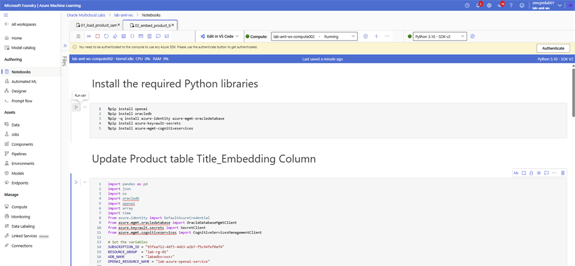
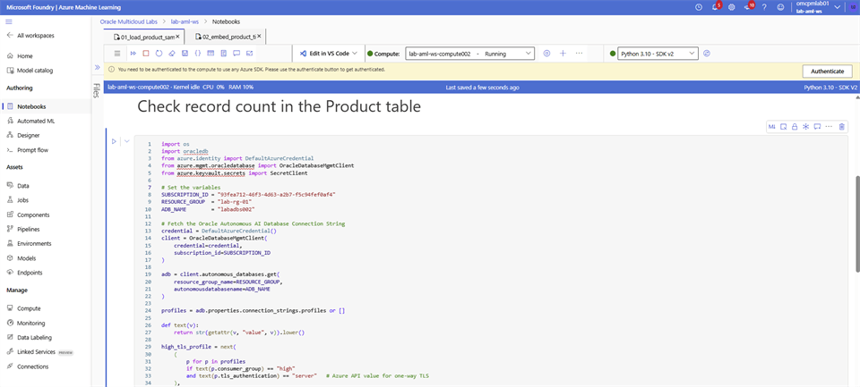

# Generate Vector Embeddings

## Introduction

Generate embeddings for the remaining product titles and store them with the catalog records in Oracle Autonomous AI Database.

### Objectives

* Run the product-title embedding notebook.
* Update the product table with the generated vectors.
* Verify the number of records that contain embeddings.

Estimated Time: 10 minutes

## Task 1: Generate and verify product embeddings

In this step, you simulate your production environment where you generate vector embeddings for your existing data. Follow these steps to complete the tasks:

The product table is pre-populated with `826,108` records and vector embeddings are generated for `825,000` records to save time. In this step you will be generating vector embeddings for the remaining `1,108` records.

1. Login to **Microsoft Foundry** | **Azure Machine Learning** studio and select **Notebooks**. Navigate to your folder and open the `02_embed_product_titles.ipynb` notebook.

2. Update the **ADB_NAME** by replacing **<xxx>** with last 3 digit of your user name, select save. Run each cell in the order they are on the file. Vector embedding generation and updating the Product table for 1,108 records is expected to complete in 4 minutes.

    

    

3. To verify the record count with vector embeddings, return to the `01_load_product_sample_data.ipynb` notebook. Run the **Check record count in the Product table** cell.

    

    

## Acknowledgements

* **Authors** - Rajib Sadhu
* **Source** - [Build a RAG App in 90 Minutes - Oracle AI Vector Search Meets Your Favorite LLM](https://docs.oracle.com/en/cloud/paas/multicloud/database-at-azure/latest/azlab/overview.html).
* **External assets** - Microsoft Azure interface screenshots and the referenced McAuley-Lab/Amazon-Reviews-2023 dataset material. Built with permission from the author(s).
* **Last Updated By/Date** - Rajib Sadhu, June 12, 2026
