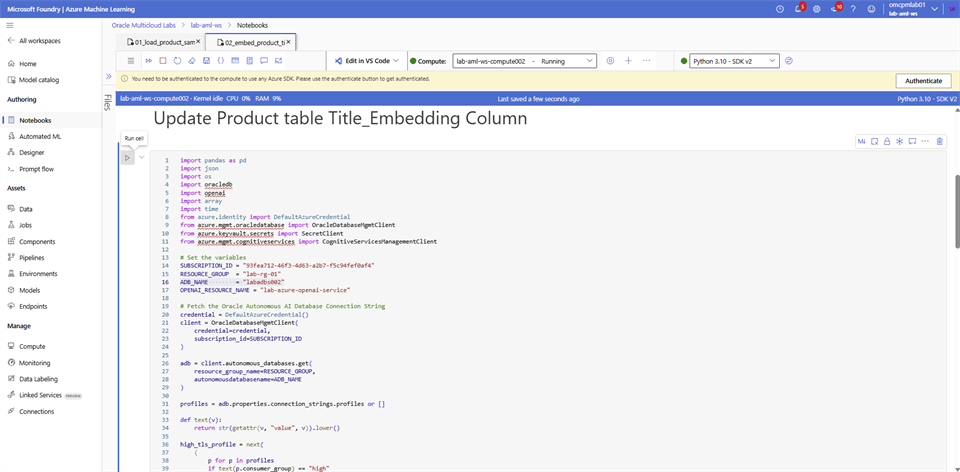
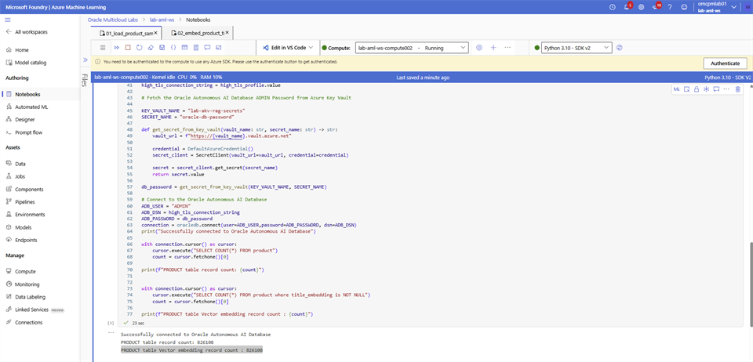

# Generate Vector Embeddings

## Introduction

Generate embeddings for the remaining product titles and store them with the catalog records in Oracle Autonomous AI Database.

### Objectives

* Run the product-title embedding notebook.
* Update the product table with the generated vectors.
* Verify the number of records that contain embeddings.

Estimated Time: 10 minutes

## Task 1: Generate and verify product embeddings

In this step, you simulate your production environment where you generate vector embeddings for your existing data. Follow these steps to complete the tasks:

### Azure Event Account

The product table is pre-populated with `826,108` records and vector embeddings are generated for `825,000` records to save time. In this step you will be generating vector embeddings for the remaining `1,108` records.

1. Login to **Microsoft Foundry** | **Azure Machine Learning** studio and select **Notebooks**. Navigate to your folder and open the `02_embed_product_titles.ipynb` notebook.

2. Update the **ADB_NAME** by replacing **<xxx>** with last 3 digit of your user name, select save. Run each cell in the order they are on the file. Vector embedding generation and updating the Product table for 1,108 records is expected to complete in 4 minutes.

    

    

3. To verify record count with Vector embedding, return to the **01_load_product_sample_data.ipynb** Notebook file. Run the **Check record count in the Product table** cell.

    

    

### Azure Regular Account

The product table is now loaded with `826,108` records. In this step you will be generating vector embedding for all the records which may take several hours.

1. Login to **Microsoft Foundry** | **Azure Machine Learning** studio and select **Notebooks**. Navigate to your folder and open the `02_embed_product_titles.ipynb` notebook.

2. Copy the following code block in the cell. Run the cell.

    ```python
    %pip install openai --upgrade
    %pip install oracledb --upgrade
    ```

3. Add a new code cell, copy the following code block. Update the `ADB_DSN` value with the Oracle Autonomous AI Database connection string retrieved earlier. Run the cell.

    ```python
    import pandas as pd
    import json
    import os
    import getpass
    import oracledb
    import openai
    import array
    import time
    
    # Set your OpenAI API Key
    api_type = "azure"
    api_key = "01AEi0ugivUkp1e9qxxxxxxxxxxxxxxxxxxxxxxxxxjFXJ3w3AAABACOGxm2K"
    azure_endpoint = "https://lab-azure-openai-domain.openai.azure.com/"
    api_version = "2024-02-01"
    
    client = openai.AzureOpenAI(
            azure_endpoint=azure_endpoint,
            api_key=api_key,
            api_version=api_version
        )
    
    # Function to Generate the Embeddings
    deployment = "lab-azure-openai-deployment"
    
    def generate_embeddings(text):
        response = client.embeddings.create(
            input=text,
            model=deployment
        )
        return response.data[0].embedding
    
    # Batch Size
    batch_size = 1000
    record_count = 826108
    start_id = 0
    end_id = 0
    
    # Load your dataset
    ADB_USER = "ADMIN"
    ADB_DSN = """(description= (retry_count=20)(retry_delay=3)(address=(protocol=tcps)(port=1521)(host=xxxxxxx.adb.us-ashburn-1.oraclecloud.com))(connect_data=(service_name=xxxxxxxxxx_labadbsxxx_high.adb.oraclecloud.com))(security=(ssl_server_dn_match=no)))"""
    ADB_PASSWORD = getpass.getpass("Enter Autonomous Database password: ")
    connection = oracledb.connect(user=ADB_USER,password=ADB_PASSWORD, dsn=ADB_DSN)
    print("Successfully connected to Oracle Autonomous AI Database")
    
    cursor = connection.cursor()
    
    select_query = """select product_id, title from product where product_id between :startid and :endid"""
    
    for i in range(start_id, record_count, batch_size):
        start_id = i
        end_id = i + batch_size
    
        # Generate embeddings for each row in the "title" column
        binds = []
        for product_id, title in cursor.execute(select_query, startid=start_id, endid=end_id):
            response = generate_embeddings(title)
    
            vec = array.array("f", response)
            binds.append([vec, product_id])
    
        print("Embedding completed for " + str(end_id))
    
        connection.autocommit = True
    
        # Update the database with Vector Embeddings
        cursor.executemany(
            """update product
            set title_embedding = :1
            where product_id = :2""",
            binds,
        )
    
        time.sleep(2)
    
    # Close the connection
    connection.commit()
    cursor.close()
    connection.close()
    ```

4. Follow the steps on [Oracle Autonomous AI Database Serverless Connect](https://docs.oracle.com/en-us/iaas/Content/database-at-azure/azucn-connect-c-autonomous-ai-database-serverless.html) and open **SQL Developer**.

5. Create the **Vector Index** on the **product** table, **title_embedding** column.

    ```sql
    CREATE VECTOR INDEX product_vec_idx
    ON product (title_embedding)
    ORGANIZATION INMEMORY NEIGHBOR GRAPH
    DISTANCE COSINE
    WITH TARGET ACCURACY 95
    PARAMETERS (
    TYPE HNSW,
    NEIGHBORS 64,
    EFCONSTRUCTION 800
    )
    PARALLEL 8;
    ```

## Acknowledgements

* **Authors** - Rajib Sadhu and Bill Sawyer
* **Source** - [Build a RAG App in 90 Minutes - Oracle AI Vector Search Meets Your Favorite LLM](https://docs.oracle.com/en/cloud/paas/multicloud/database-at-azure/latest/azlab/overview.html).
* **External assets** - Microsoft Azure interface screenshots and the referenced McAuley-Lab/Amazon-Reviews-2023 dataset material. Built with permission from the author(s).
* **Last Updated By/Date** - Rajib Sadhu, June 12, 2026
