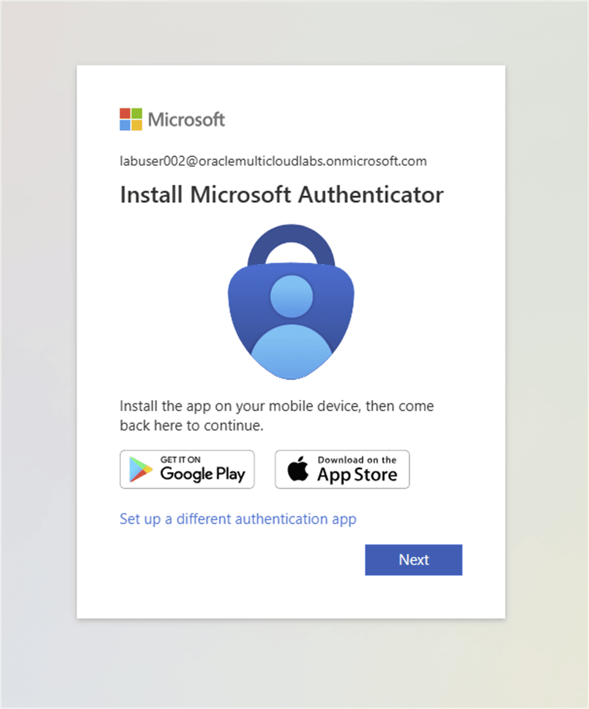
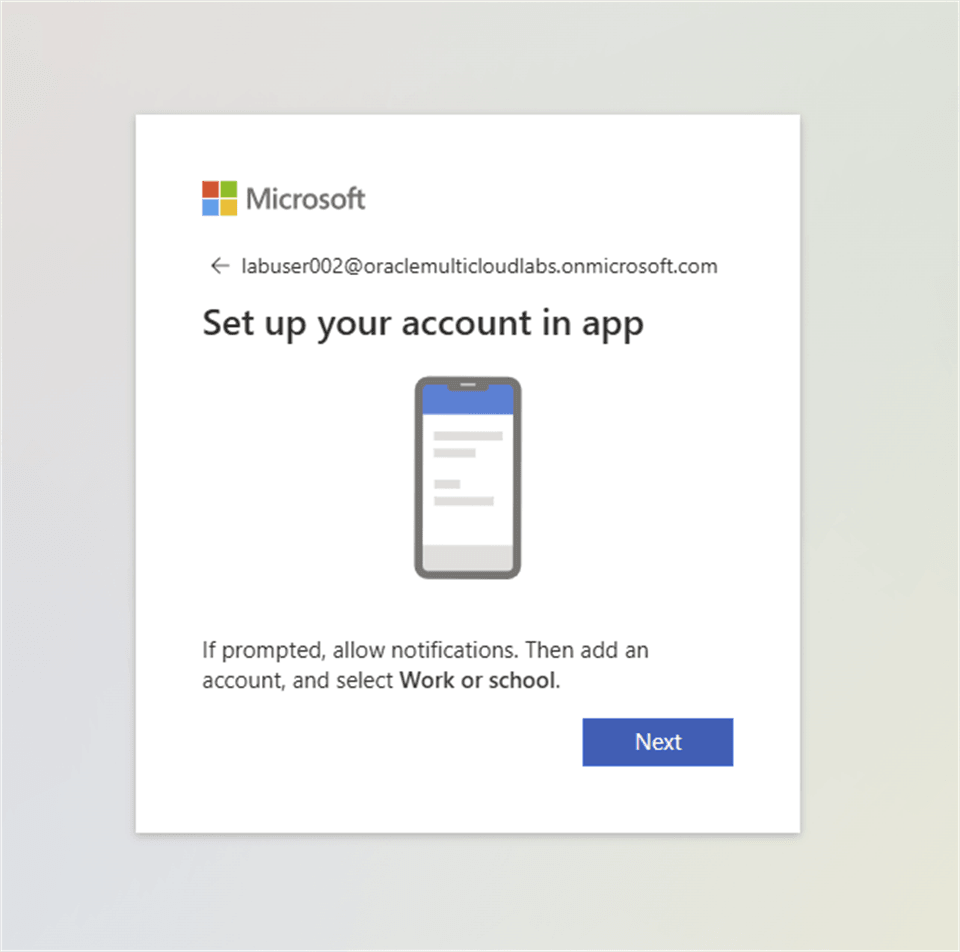
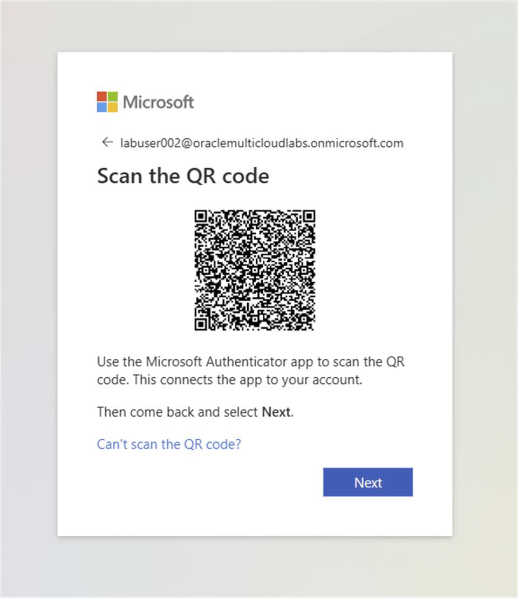
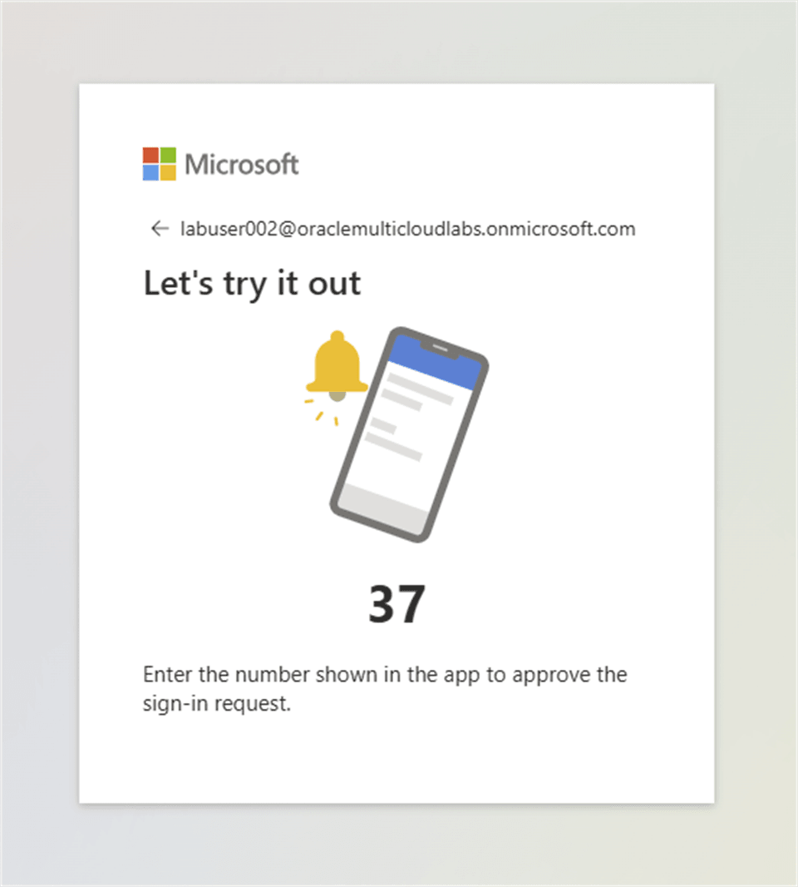
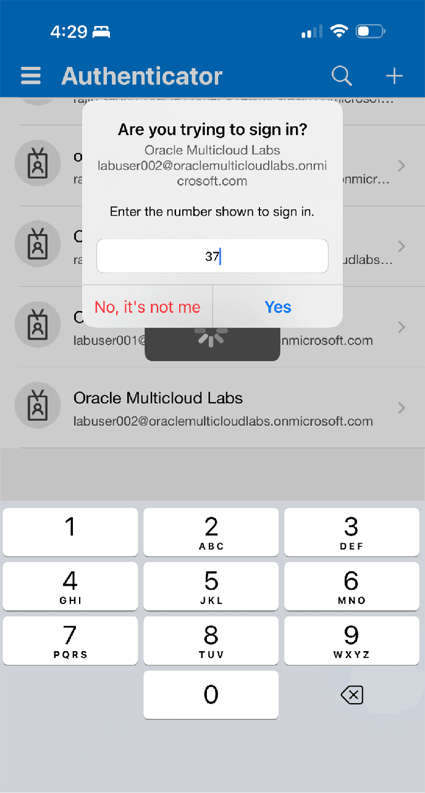
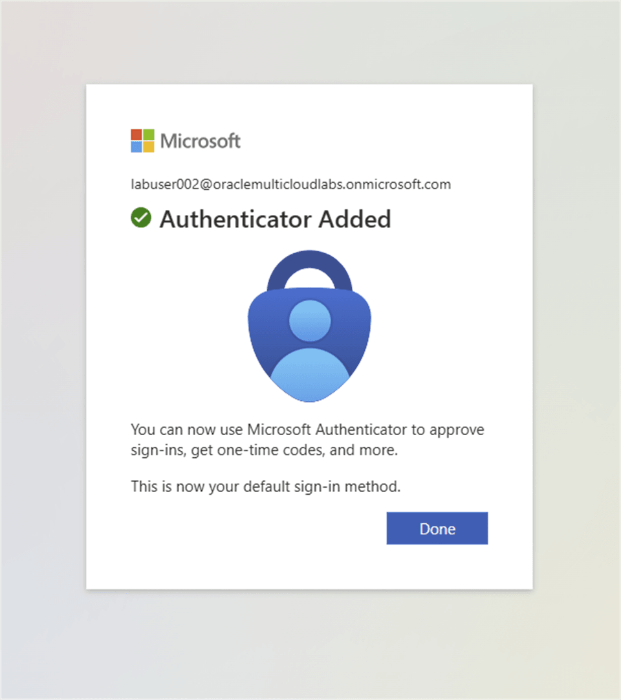
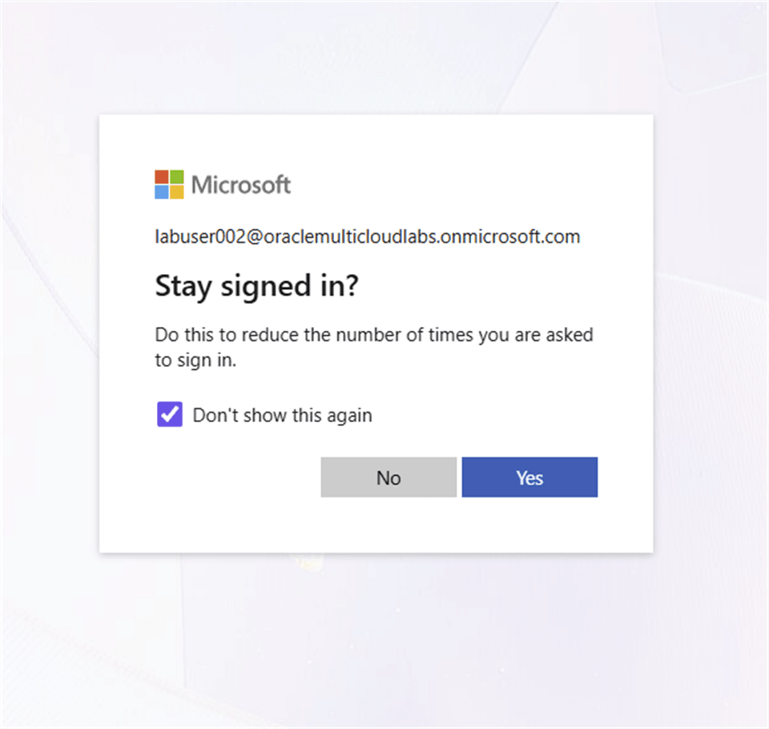
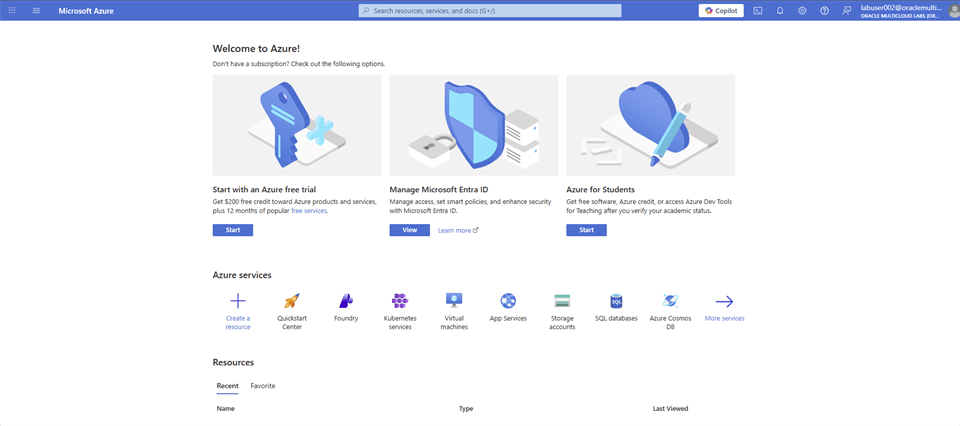

# Azure Event Account

## Introduction

Sign in with the temporary Azure subscription account supplied for an OCI-sponsored or OCI-staffed workshop.

### Objectives

* Sign in with the Oracle-provided Azure event account.
* Complete multifactor authentication.
* Confirm access to the Azure lab environment.

Estimated Time: 10 minutes

## Task 1: Sign in with an Azure Event Account

1. If you are running this workshop in an OCI-sponsored or OCI-staffed event, a temporary Azure subscription account is provided. This temporary account enables you to run the workshop without incurring usage fees. It also provides a clean environment with prerequisite resources pre-provisioned.

2. At the beginning of the workshop, you are provided **Workshop Credentials** (Email and Password). The credentials grant you permission to use an Azure subscription for this lab. Your lab instructor or lead presenter will share the Azure Region in which the workshop steps need to be performed.

3. Go to [Azure Portal Login](https://portal.azure.com/). You are prompted to sign in with **Email, phone, or Skype**.

    

4. Enter the Lab User email address ([labuserxxx@oraclemulticloudlabs.onmicrosoft.com](mailto:labuser001@oraclemulticloudlabs.onmicrosoft.com)) you received and select **Next**. Replace `xxx` with the 3 digit numbers associated with your lab users.

    

5. Enter the password you have received and select **Sign in**.

    

6. Read the Multifactor Authentication note and select **Next**.

    

7. On your mobile device (iPhone or Android), download the **Microsoft Authenticator** app and select **Next**.

    

8. On the **Set up your account in app** page, select **Next**.

    

9. Open the **Microsoft Authenticator** app to **Scan the QR code**.

    

10. On the **Microsoft Authenticator** app, tap the QR code icon and point the camera at the **QR code** displayed on the screen. This connects the app to your account.

    

11. On the **Microsoft Authenticator** app, enter the number shown on the validation page and select **Yes**.

    

    

12. **Congratulations!** You have successfully completed the Multifactor Authentication setup.

    

13. Select the **Don’t show this again** checkbox and select **Yes**.

    

    > **Note:** If you select **No**, you will be asked to sign in again at Step 4 of the Deploy a RAG Application lab.

14. You are logged into the Azure lab environment.

    

## Acknowledgements

* **Authors** - Rajib Sadhu and Bill Sawyer
* **Source** - [Build a RAG App in 90 Minutes - Oracle AI Vector Search Meets Your Favorite LLM](https://docs.oracle.com/en/cloud/paas/multicloud/database-at-azure/latest/azlab/overview.html).
* **External assets** - Microsoft Azure interface screenshots and the referenced McAuley-Lab/Amazon-Reviews-2023 dataset material. Built with permission from the author(s).
* **Last Updated By/Date** - Rajib Sadhu, June 12, 2026
