# Getting Started

## Introduction

Prepare the Azure account and confirm that the workshop resources are available. Use the event-account path when Oracle provides temporary credentials. Use the regular-account path when you run the workshop in your own Azure subscription.

### Objectives

* Choose the correct Azure account path.
* Sign in with an Oracle-provided event account or provision the regular-account prerequisites.
* Verify the Azure and Oracle resources used by the workshop.

Estimated Time: 15 minutes

## Task 1: Choose your Azure account path

1. If you are attending an OCI-sponsored or OCI-staffed event, continue to Task 2 and use the temporary Azure subscription supplied for the workshop.

2. If you are using your own Azure account, skip Task 2 and continue to Task 3.

3. After you complete the applicable account path, continue to Task 4 and verify the environment.

## Task 2: Sign in with an Azure Event Account

1. If you are **NOT** running this workshop in an OCI-sponsored or OCI-staffed event, go to [Azure Regular Account](https://docs.oracle.com/en/cloud/paas/multicloud/database-at-azure/latest/azlab/azure-regular-account.html).

2. If you are running this workshop in an OCI-sponsored or OCI-staffed event, a temporary Azure subscription account is provided. This temporary account enables you to run the workshop without incurring usage fees. It also provides a clean environment with prerequisite resources pre-provisioned.

3. At the beginning of the workshop, you are provided **Workshop Credentials** (Email and Password). The credentials grant you permission to use an Azure subscription for this lab. Your lab instructor or lead presenter will share the Azure Region in which the workshop steps need to be performed.

4. Go to [Azure Portal Login](https://portal.azure.com/). You are prompted to sign in with **Email, phone, or Skype**.

    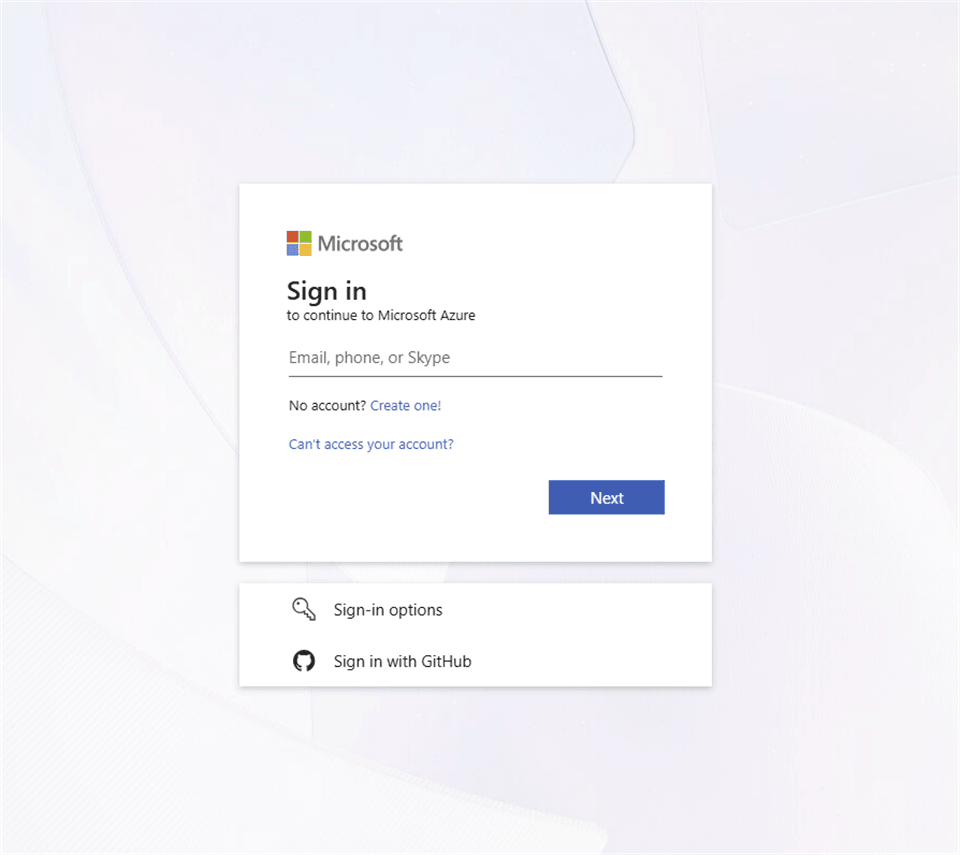

5. Enter the Lab User email address ([labuserxxx@oraclemulticloudlabs.onmicrosoft.com](mailto:labuser001@oraclemulticloudlabs.onmicrosoft.com)) you received and select **Next**. Replace `xxx` with the 3 digit numbers associated with your lab users.

    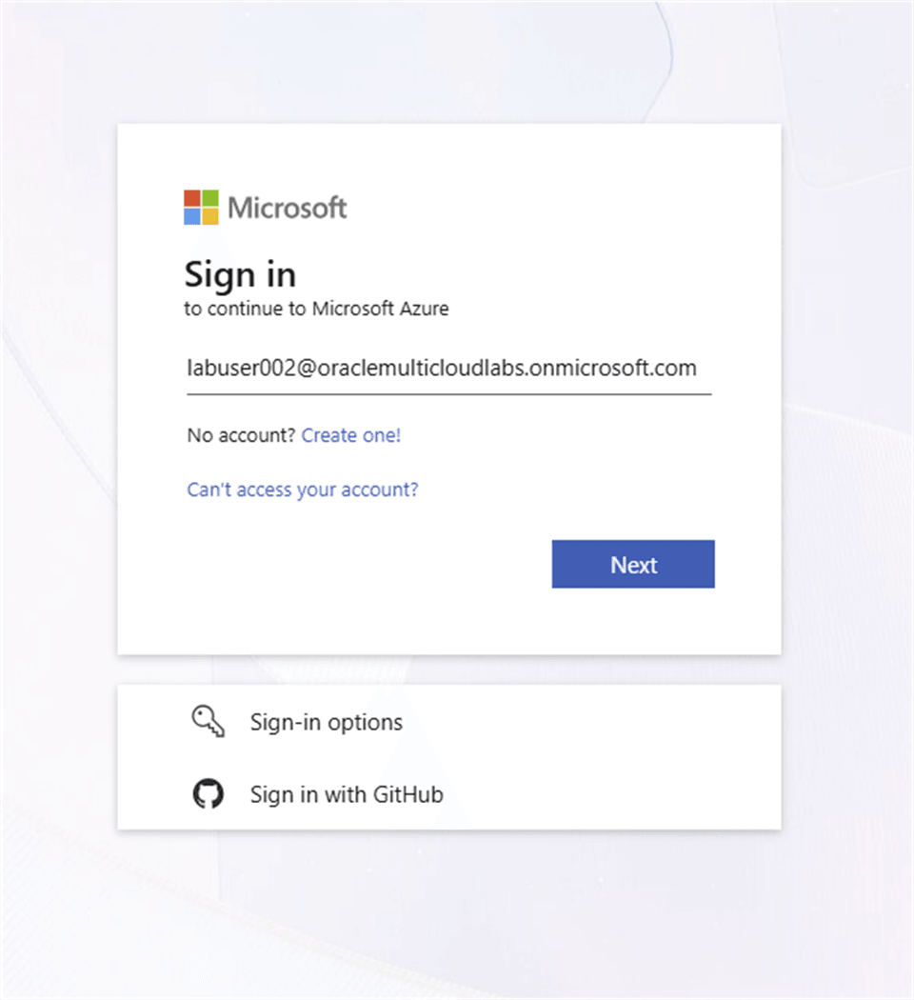

6. Enter the password you have received and select **Sign in**.

    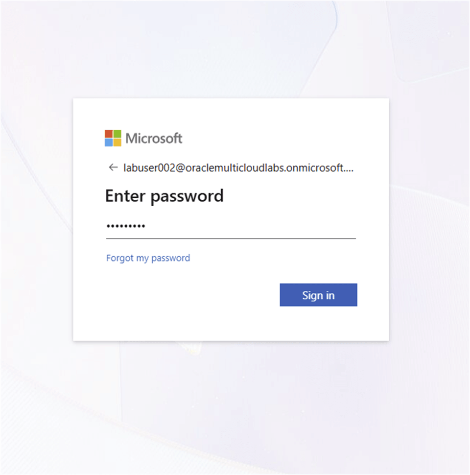

7. Read the Multifactor Authentication note and select **Next**.

    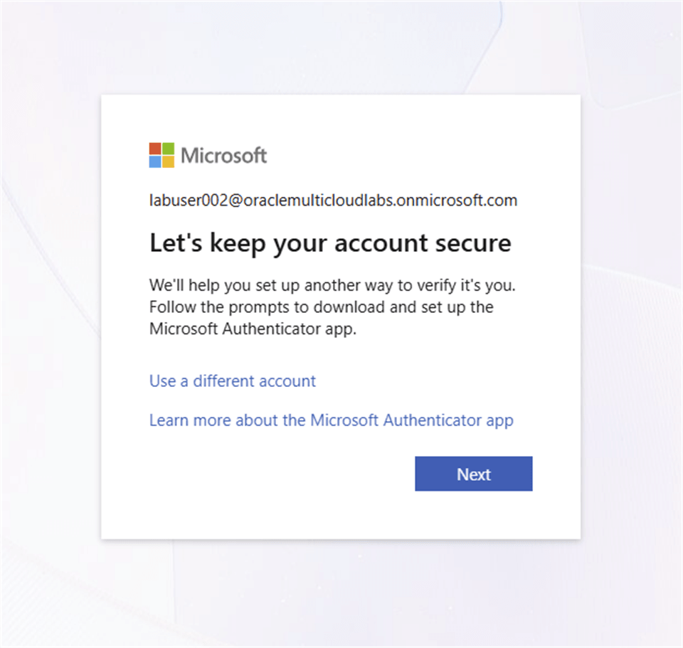

8. On your mobile device (iPhone or Android), download the **Microsoft Authenticator** app and select **Next**.

    

9. On the **Set up your account in app** page, select **Next**.

    

10. Open the **Microsoft Authenticator** app to **Scan the QR code**.

    

11. On the **Microsoft Authenticator** app, tap the QR code icon and point the camera at the **QR code** displayed on the screen. This connects the app to your account.

    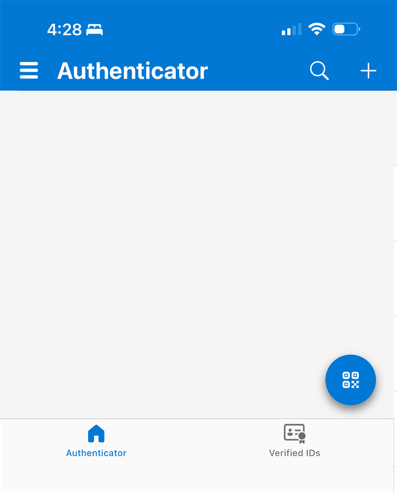

12. On the **Microsoft Authenticator** app, enter the number shown on the validation page and select **Yes**.

    

    

13. **Congratulations!** You have successfully completed the Multifactor Authentication setup.

    

14. Select the **Don’t show this again** checkbox and select **Yes**.

    

    > **Note:** If you select **No**, you will be asked to sign in again at Step 4 of the Deploy a RAG Application lab.

15. You are logged into the Azure lab environment.

    

16. Skip the [Azure Regular Account](https://docs.oracle.com/en/cloud/paas/multicloud/database-at-azure/latest/azlab/azure-regular-account.html) module and proceed to **[Verify Lab Environment](https://docs.oracle.com/en/cloud/paas/multicloud/database-at-azure/latest/azlab/verify-lab-environment.html)**.

## Task 3: Prepare an Azure Regular Account

If you’re using your own Azure account, or you are advised by OCI staff to configure the workshop environment, you need to setup resources in Azure that enable you to complete the lab. You need to check that your Azure account has the necessary permissions to create the resources needed for this workshop. The steps to provision the resources that are required for this lab are as follows:

The Azure CLI simplifies infrastructure provisioning allowing you to focus on the lab.

Complete the Oracle AI Database@Azure **[Onboarding](https://docs.oracle.com/en-us/iaas/Content/database-at-azure/oaaonboard.htm)** using either **Private** or **Public offer** as prerequisites. The following steps require that this has already been successfully completed.

1. Create your Azure Resource Group, VNET, and Delegated Subnet.

    ```bash
    # Define variables
    RESOURCE_GROUP="lab-rg-01"
    LOCATION="eastus"
    VNET_NAME="lab-vnet-01"
    ADDRESS_PREFIX="143.0.0.0/16"
    SUBNET_NAME="lab-application-subnet"
    SUBNET_PREFIX="143.0.1.0/24"
    DELEGATED_SUBNET_NAME="lab-client-subnet"
    DELEGATED_SUBNET_PREFIX="143.0.2.0/24"
    
    # Create a Resource Group
    az group create \
      --name $RESOURCE_GROUP \
      --location $LOCATION
    
    # Create the Virtual Network and the default subnet
    az network vnet create \
      --resource-group $RESOURCE_GROUP \
      --name $VNET_NAME \
      --address-prefixes $ADDRESS_PREFIX \
      --subnet-name $SUBNET_NAME \
      --subnet-prefixes $SUBNET_PREFIX
    
    # Required for subnet-based network rules in Azure OpenAI resource setup
    az network vnet subnet update \
      --resource-group $RESOURCE_GROUP \
      --vnet-name $VNET_NAME \
      --name $SUBNET_NAME \
      --service-endpoints Microsoft.CognitiveServices \
      --output table
    
    # Create the delegated subnet for Oracle Database@Azure
    az network vnet subnet create \
      --resource-group $RESOURCE_GROUP \
      --vnet-name $VNET_NAME \
      --name $DELEGATED_SUBNET_NAME \
      --address-prefixes $DELEGATED_SUBNET_PREFIX \
      --delegations "Oracle.Database/networkAttachments"
    ```

2. Create your Azure OpenAI Resource and Deployment.

    ```bash
    # Define variables
    AOAI_NAME="lab-azure-openai-service"
    RESOURCE_GROUP="lab-rg-01"
    LOCATION="eastus"
    AOAI_DOMAIN_NAME="lab-azure-openai-domain"
    VNET_NAME="lab-vnet-01"
    SUBNET_NAME="lab-application-subnet"
    DEPLOYMENT_NAME="lab-azure-openai-deployment"
    MODEL_NAME="text-embedding-3-small"
    MODEL_VERSION="1"
    DEPLOYMENT_SKU_NAME="GlobalStandard"
    DEPLOYMENT_SKU_CAPACITY="10000"
    CHAT_DEPLOYMENT_NAME="lab-azure-openai-chat-deployment"
    CHAT_MODEL_NAME=" gpt-5.4-mini"
    CHAT_MODEL_VERSION="2026-03-17"
    
    # Create Azure OpenAI resource
    az cognitiveservices account create \
      --name $AOAI_NAME \
      --resource-group $RESOURCE_GROUP \
      --location $LOCATION \
      --kind OpenAI \
      --sku S0 \
      --custom-domain $AOAI_DOMAIN_NAME \
      --yes \
      --output table
    
    AOAI_ID=$(
    az cognitiveservices account show \
      --name $AOAI_NAME \
      --resource-group $RESOURCE_GROUP \
      --query id \
      --output tsv
    )
    
    SUBNET_ID=$(
    az network vnet subnet show \
      --resource-group $RESOURCE_GROUP \
      --vnet-name $VNET_NAME \
      --name $SUBNET_NAME \
      --query id \
      --output tsv
    )
    
    # Add subnet allow rule.
    az cognitiveservices account network-rule add \
      --resource-group $RESOURCE_GROUP \
      --name $AOAI_NAME \
      --subnet $SUBNET_ID \
      --output table
    
    az cognitiveservices account deployment create \
      --name $AOAI_NAME \
      --resource-group $RESOURCE_GROUP \
      --deployment-name $DEPLOYMENT_NAME \
      --model-name $MODEL_NAME \
      --model-version $MODEL_VERSION \
      --model-format OpenAI \
      --sku-name $DEPLOYMENT_SKU_NAME \
      --sku-capacity $DEPLOYMENT_SKU_CAPACITY \
      --output table
    
    # Deploy gpt-5.4-mini
    az cognitiveservices account deployment create \
      --name $AOAI_NAME \
      --resource-group $RESOURCE_GROUP \
      --deployment-name $CHAT_DEPLOYMENT_NAME \
      --model-name $CHAT_MODEL_NAME \
      --model-version $CHAT_MODEL_VERSION \
      --model-format OpenAI \
      --sku-name $DEPLOYMENT_SKU_NAME \
      --sku-capacity $DEPLOYMENT_SKU_CAPACITY \
      --output table
    ```

3. Create your Azure Machine Learning Studio Workspace.

    ```bash
    Create Storage Account: labamlwsstorageaccount
    Create Key Vault: lab-aml-ws-key-vault
    Create Application Insights: lab-aml-ws-app-insights
    
    # Define variables
    WORKSPACE_NAME="lab-aml-ws"
    RESOURCE_GROUP="lab-rg-01"
    LOCATION="eastus"
    STORAGE_ACCOUNT_NAME="labamlwsstorageaccount"
    KEY_VAULT_NAME="lab-aml-ws-key-vault"
    APP_INSIGHTS_NAME="lab-aml-ws-app-insights"
    
    STORAGE_ACCOUNT_ID="$(
    az storage account show \
      --name $STORAGE_ACCOUNT_NAME \
      --resource-group $RESOURCE_GROUP \
      --query "id" \
      -o tsv
    )"
    
    KEY_VAULT_ID="$(
    az keyvault show \
      --name $KEY_VAULT_NAME \
      --resource-group $RESOURCE_GROUP \
      --query "id" \
      -o tsv
    )"
    
    APP_INSIGHTS_ID="$(
    az monitor app-insights component show \
      --app $APP_INSIGHTS_NAME \
      --resource-group $RESOURCE_GROUP \
      --query "id" \
      -o tsv
    )"
    
    # Create Azure Machine Learning Workspace
    az ml workspace create \
      --name $WORKSPACE_NAME \
      --resource-group $RESOURCE_GROUP \
      --location $LOCATION \
      --storage-account $STORAGE_ACCOUNT_ID \
      --key-vault $KEY_VAULT_ID \
      --application-insights $APP_INSIGHTS_ID \
      --output table
    ```

4. Create your Azure Machine Learning Compute.

    ```bash
    # Define variables
    WORKSPACE_NAME="lab-aml-ws"
    RESOURCE_GROUP="lab-rg-01"
    LOCATION="eastus"
    COMPUTE_NAME="lab-aml-ws-compute002"
    COMPUTE_SIZE="Standard_DS11_v2"
    VNET_NAME="lab-vnet-01"
    SUBNET_NAME="lab-application-subnet"
    
    # Get the full subnet resource ID
    SUBNET_ID=$(az network vnet subnet show \
      --resource-group $RESOURCE_GROUP \
      --vnet-name $VNET_NAME \
      --name $SUBNET_NAME \
      --query id \
      --output tsv)
    
    # Create Azure Machine Learning Workspace Compute
    az ml compute create \
      --name $COMPUTE_NAME \
      --type ComputeInstance \
      --size $COMPUTE_SIZE \
      --resource-group $RESOURCE_GROUP \
      --workspace-name $WORKSPACE_NAME \
      --subnet $SUBNET_ID \
      --output table
    ```

5. Grant permission to your Lab user (Optional).

    ```bash
    # Create lab access group in Entra ID (grp-odbaa-hol-attendees)
    # Create lab users in Entra ID (e.g., labuser002@oraclemulticloudlabs.onmicrosoft.com)
    # Add users in the lab group
    
    # Define variables
    SUBSCRIPTION_ID="93fea712-***********-f5c94fef0af4"
    RESOURCE_GROUP="lab-rg-01"
    ENTRA_GROUP_NAME="grp-odbaa-hol-attendees"
    ROLE_NAME="Oracle.Database Autonomous Database Administrator"
    WORKSPACE_NAME="lab-aml-ws"
    VNET_NAME="lab-vnet-01"
    OPENAI_RESOURCE_NAME="lab-azure-openai-service"
    
    ENTRA_GROUP_OBJECT_ID=$(az ad group show \
      --group $ENTRA_GROUP_NAME \
      --query id \
      --output tsv)
    
    # Grant permission to see the Azure Resource Group
    az role assignment create \
      --assignee-object-id $ENTRA_GROUP_OBJECT_ID \
      --assignee-principal-type Group \
      --role "Reader" \
      --scope "/subscriptions/$SUBSCRIPTION_ID/resourceGroups/$RESOURCE_GROUP" \
      --output table
    
    # Grant permission to create Oracle Autonomous AI Database
    ROLE_DEFINITION_ID=$(az role definition list \
      --name "$ROLE_NAME" \
      --query "[0].name" \
      --output tsv 2>/dev/null || true)
    
    az role assignment create \
      --assignee-object-id $ENTRA_GROUP_OBJECT_ID \
      --assignee-principal-type Group \
      --role $ROLE_DEFINITION_ID \
      --scope "/subscriptions/$SUBSCRIPTION_ID" \
      --output table
    
    # Grant permission to use Azure ML workspace and notebooks
    az role assignment create \
      --assignee-object-id $ENTRA_GROUP_OBJECT_ID \
      --assignee-principal-type Group \
      --role "AzureML Data Scientist" \
      --scope "/subscriptions/$SUBSCRIPTION_ID/resourceGroups/$RESOURCE_GROUP/providers/Microsoft.MachineLearningServices/workspaces/$WORKSPACE_NAME" \
      --output table
    
    # Grant permission to create/start/stop/manage AML compute
    az role assignment create \
      --assignee-object-id $ENTRA_GROUP_OBJECT_ID \
      --assignee-principal-type Group \
      --role "AzureML Compute Operator" \
      --scope "/subscriptions/$SUBSCRIPTION_ID/resourceGroups/$RESOURCE_GROUP/providers/Microsoft.MachineLearningServices/workspaces/$WORKSPACE_NAME"
    
    # Grant permission to edit notebook files in workspace storage
    az role assignment create \
      --assignee-object-id $ENTRA_GROUP_OBJECT_ID \
      --assignee-principal-type Group \
      --role "Storage File Data Privileged Contributor" \
      --scope "/subscriptions/$SUBSCRIPTION_ID/resourceGroups/$RESOURCE_GROUP/providers/Microsoft.Storage/storageAccounts/labamlwsstorageaccount"
    
    # Grant permission to read/write blob-backed AML artifacts/data
    az role assignment create \
      --assignee-object-id $ENTRA_GROUP_OBJECT_ID \
      --assignee-principal-type Group \
      --role "Storage Blob Data Contributor" \
      --scope "/subscriptions/$SUBSCRIPTION_ID/resourceGroups/$RESOURCE_GROUP/providers/Microsoft.Storage/storageAccounts/labamlwsstorageaccount"
    
    # Grant permission to create Compute in the Azure Machine Learning Workspace
    az role assignment create \
      --assignee-object-id $ENTRA_GROUP_OBJECT_ID \
      --assignee-principal-type Group \
      --role "Network Contributor" \
      --scope "/subscriptions/$SUBSCRIPTION_ID/resourceGroups/$RESOURCE_GROUP/providers/Microsoft.Network/virtualNetworks/$VNET_NAME"
    
    # Grant permission to grant permission to see the Azure OpenAI Keys
    OPENAI_RESOURCE_ID=$(az cognitiveservices account show \
      --name "$OPENAI_RESOURCE_NAME" \
      --resource-group "$RESOURCE_GROUP" \
      --query id \
      -o tsv)
    
    az role assignment create \
      --assignee-object-id $ENTRA_GROUP_OBJECT_ID \
      --assignee-principal-type Group \
      --role "Cognitive Services User"\
      --scope "$OPENAI_RESOURCE_ID"
    ```

## Task 4: Verify the lab environment

If you are using an Azure Event Account, required resources are pre-created for you. Follow the steps to verify those resources.

### Verify your Azure Resource Group

1. Login to [Azure Portal](https://portal.azure.com/#home), search for Resource Groups, and select **Resource Groups** from the list.

    

2. From the available list of **Resource Groups**, take a note of the Resource Group **lab-rg-01**.

    

### Verify your Azure VNET & Subnets

1. On the Azure Portal, search for **VNET**, and select **Virtual network** from the list.

    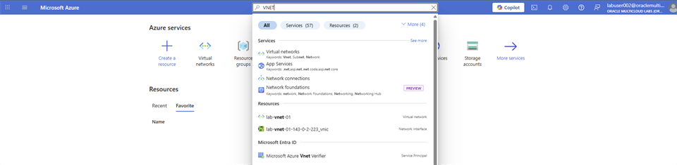

2. Take note of the available Virtual network **lab-vnet-01** name. Select the **lab-vnet-01** VNET and navigate to **Subnets**.

    

3. From the list of available **Subnets**, select **lab-client-subnet**.

    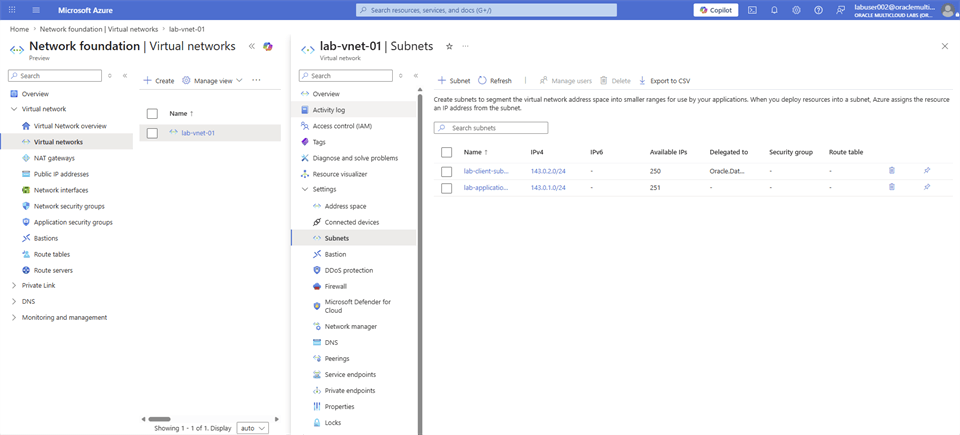

4. On the **Edit subnet** page, take note of the **Subnet Delegation** value, **Oracle.Database/networkAttachments**. Oracle Autonomous AI Database is created using this **Delegated Subnet**.

    

5. From the list of available **Subnets**, select **lab-application-subnet**. On the Edit subnet page, take note of the Service Endpoints list. **Microsoft.CognitiveServices** service endpoint policy is a prerequisite for the **Azure OpenAI** resource deployment.

    

### Oracle Autonomous AI Database

> **Note:** The following steps only apply to Azure Event Account users.

1. On the Azure Portal, search for Oracle AI Database, select Oracle AI Database@Azure from the list.

    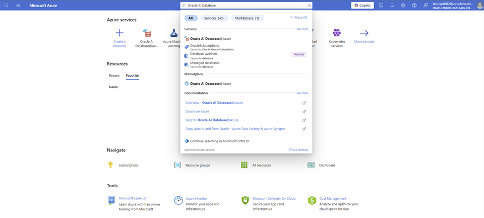

2. On the Oracle AI Database@Azure Dashboard, select Oracle Autonomous AI Database.

    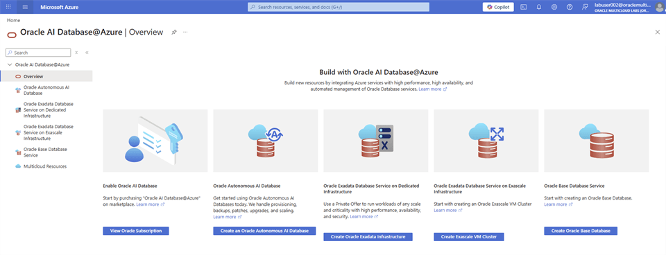

3. Filter the result with the last 3 digit of your lab username. Confirm the database status showing Available. Select on the database name.

    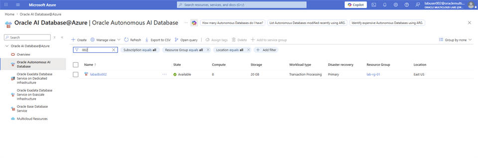

4. Expand the Settings from the menu and select on Connections.

    

5. Select on the **Connection string** value with **TNS name = <database_name>_high** and **TLS authentication = TLS**. Note the connection string.

    

### Azure OpenAI Resource and Deployment

1. On the [Azure Portal](https://portal.azure.com/#home), search for **Azure OpenAI** and select **Azure OpenAI** from the list.

    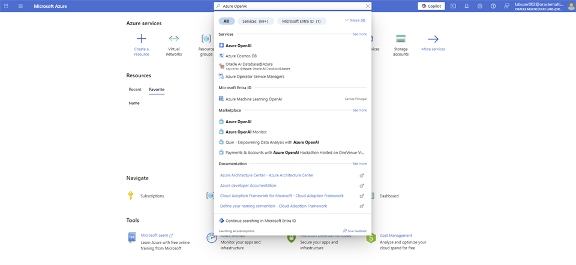

2. From the list of available Azure OpenAI instances, select **lab-azure-openai-service**.

    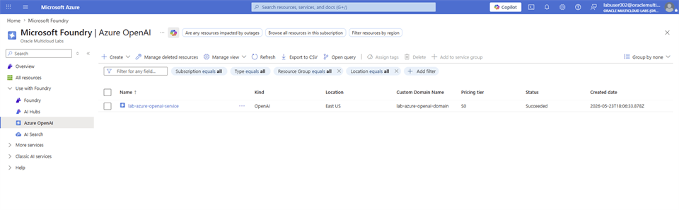

3. Expand the left-menu on the **Azure OpenAI** page and select **Keys and Endpoint**.

    

4. Take note of KEY 1, Location/Region, and Endpoint values, which are used to call the **OpenAI** API.

    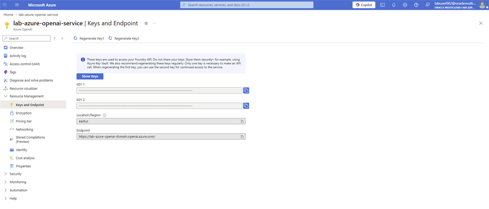

5. Navigate to the **Networking** section of the **lab-azure-openai-service**. Azure OpenAI resources are securely deployed within the lab-application-subnet to ensure secure communication.

    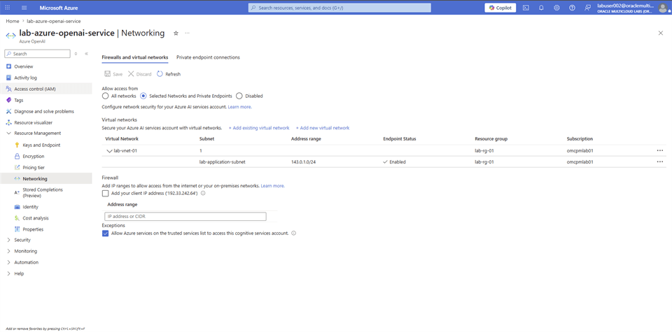

6. Select **Overview** to return to the main window, and select **Explore Foundry portal**.

    

7. This opens a new tab and takes you to the **Chat playground** page within the **Microsoft Foundry** | **Azure OpenAI** portal.

    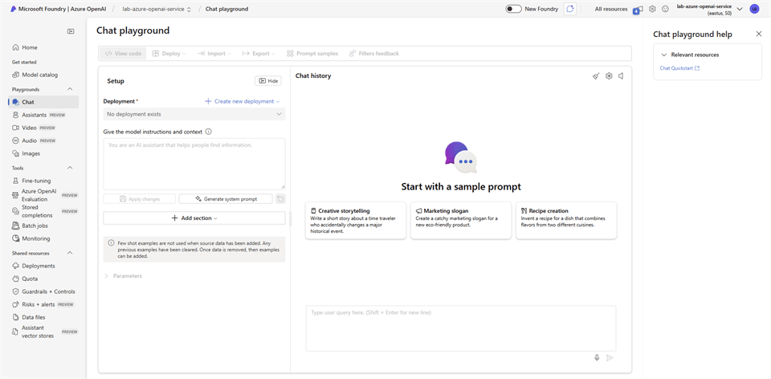

8. Select **Deployment** from the left-menu and select **lab-azure-openai-deployment** on the **Model deployments** page.

    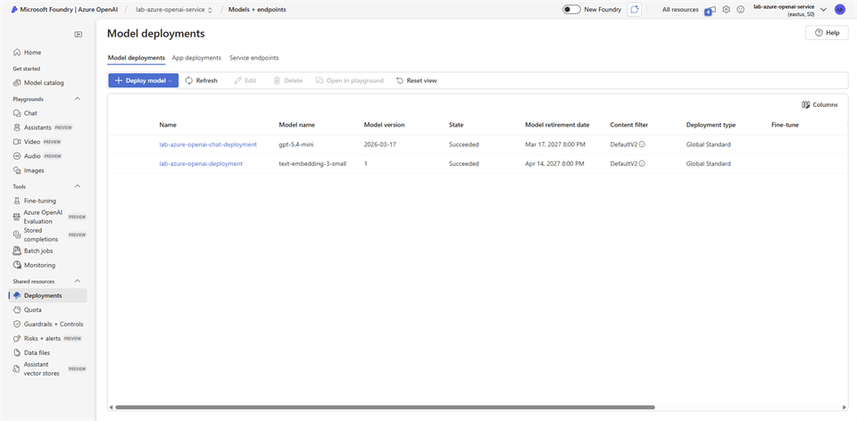

9. Take note of the **Model name** `text-embedding-3-small` and sample code to use with Python and other languages. Select the left arrow next to **lab-azure-openai-deployment** to return to the Deployments page.

    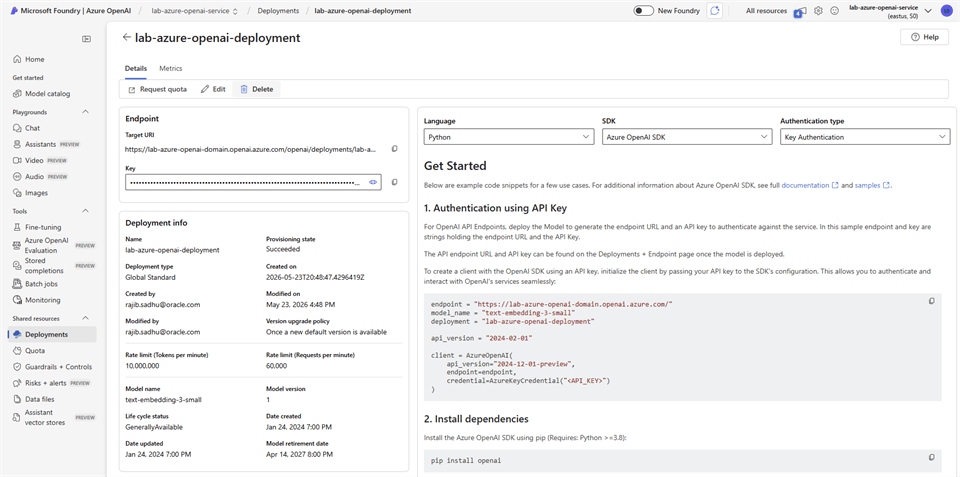

10. Select **lab-azure-openai-chat-deployment** on the **Model deployments** page. Take note of the **Model name** `gpt-5.4-mini` and sample code to use with Python and other languages.

    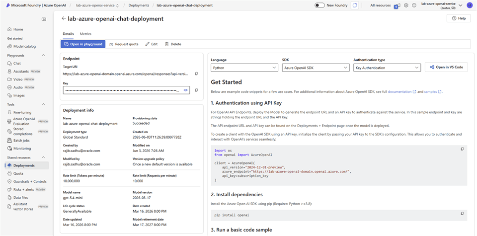

### Azure Machine Learning Workspace & Compute

1. On the [Azure Portal](https://portal.azure.com/#home), search for **Azure Machine Learning** and select it.

    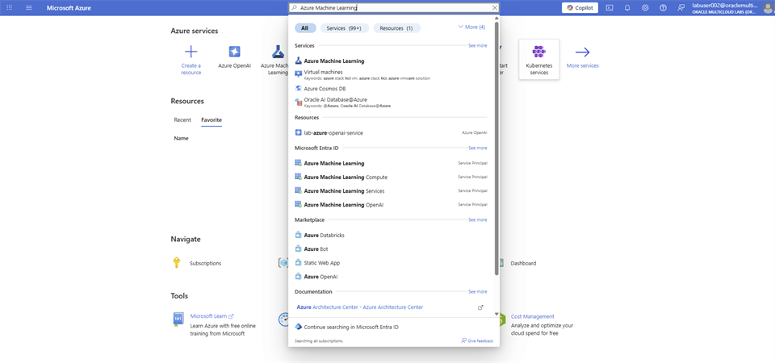

2. Select **lab-aml-ws** from the list of available Azure Machine Learning Workspaces.

    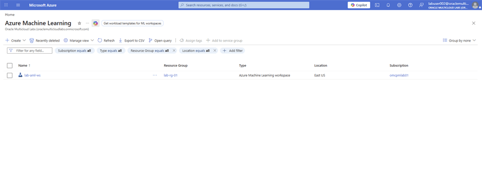

3. Take a note of the **Azure Key Vault**, **Application Insights**, and **Storage account**, which are created already as prerequisite. Select **Launch studio**.

    

4. A new tab opens with the **Microsoft Foundry** | **Azure Machine Learning** Dashboard. Using the left-menu, select **Model catalog**. You have the option to select from a list of available hosted models. You use **text-embedding-3-small** from **OpenAI** through **Azure OpenAI Service**.

    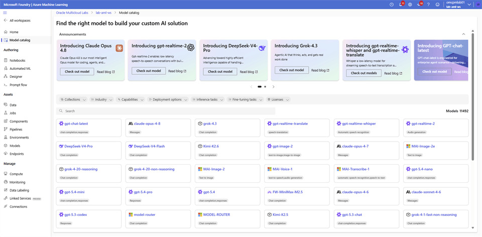

    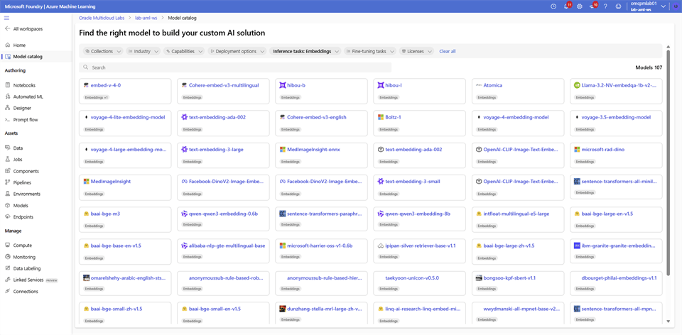

5. Navigate to the **Compute** page from the left-menu. Filter the list by typing the last 3 digit of your user name. Confirm it’s in **Running** state. Select the Compute **Name**.

    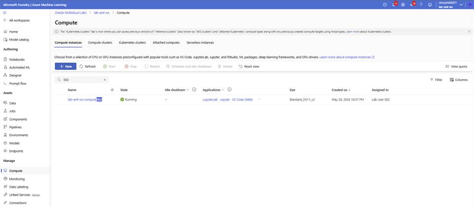

6. Azure Machine Learning Compute is created using the **lab-application-subnet** within the **lab-vnet-01 Azure** VNET to ensure secure communication between the database server and Azure ML compute.

    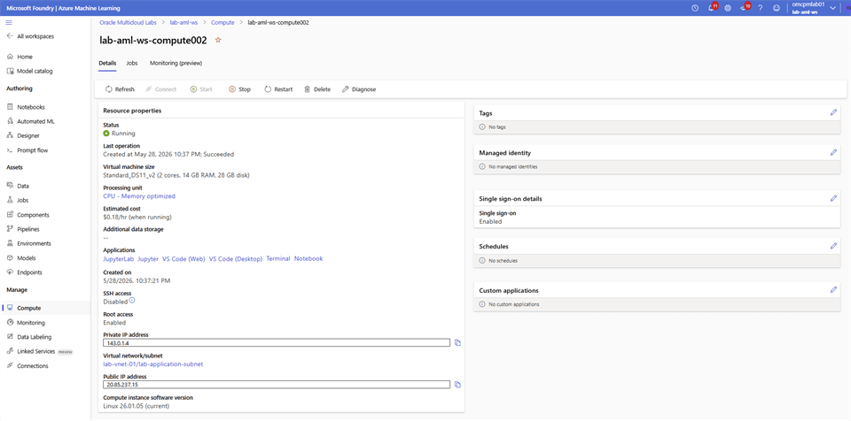

## Acknowledgements

* **Authors** - Rajib Sadhu and Bill Sawyer
* **Source** - [Build a RAG App in 90 Minutes - Oracle AI Vector Search Meets Your Favorite LLM](https://docs.oracle.com/en/cloud/paas/multicloud/database-at-azure/latest/azlab/overview.html).
* **External assets** - Microsoft Azure interface screenshots and the referenced McAuley-Lab/Amazon-Reviews-2023 dataset material. Built with permission from the author(s).
* **Last Updated By/Date** - Rajib Sadhu, June 12, 2026
