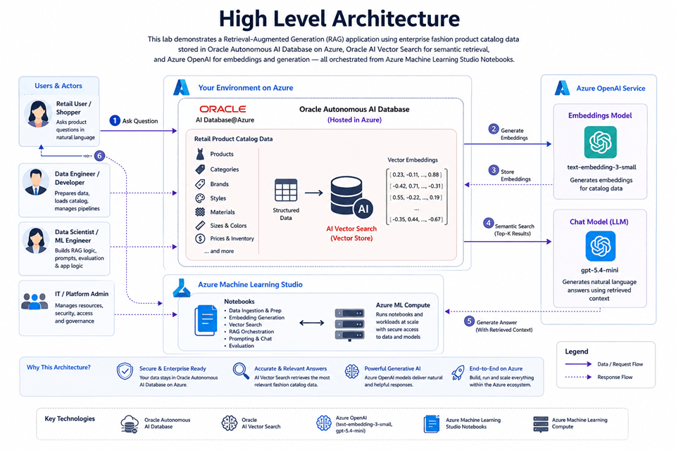

# Build a RAG App in 90 Minutes - Oracle AI Vector Search Meets Your Favorite LLM

## Introduction

**Turn your retail product catalog into an intelligent shopping assistant.**

In this 90-minute hands-on lab, you build a working RAG application using **Oracle Autonomous AI Database**, **Oracle AI Vector Search**, and **Azure OpenAI**. You use sample fashion catalog data as your knowledge base, generate vector embeddings, run semantic search, and connect everything to a natural language Q&A experience.

By the end of the lab, your app answers product questions such as *“Show me floral summer dresses”* using trusted enterprise data stored securely in Oracle Autonomous AI Database.

**Build it. Search it. Ask it. Take the code back to your business.**

### Architecture

**In this lab, you build an end-to-end retrieval-augmented generation (RAG) application that turns a retail fashion product catalog into a natural-language shopping assistant.** The product catalog, including products, categories, brands, styles, materials, sizes, colors, pricing, and inventory, is stored in **Oracle Autonomous AI Database** running in Azure through **Oracle AI Database@Azure**, giving you Oracle database capabilities directly inside the Azure ecosystem. Oracle AI Database@Azure is designed to bring Oracle database services into Azure and lets teams create and manage Autonomous AI Database resources from the Azure portal.

You use **Azure Machine Learning Studio Notebooks**, backed by **Azure Machine Learning Compute**, as the hands-on development environment for database access, data preparation, embedding generation, vector search, prompt orchestration, and chat testing. Azure Machine Learning compute instances provide managed cloud-based workstations for data science and ML development, and they can run notebooks and Python scripts in the Azure workspace.

The lab uses **Azure OpenAI** to generate vector embeddings with the `text-embedding-3-small` model and to power the chat experience with the lab’s `gpt-5.4-mini` deployment. Embeddings convert text into numerical vector representations that capture semantic meaning, so similar product descriptions, customer questions, and catalog attributes are located near each other in vector space.

Those embeddings are stored in **Oracle Autonomous AI Database** and searched using **Oracle AI Vector Search**, which enables semantic search over business data instead of relying only on exact keyword matches. This allows a shopper to ask questions like, “Show me floral summer dresses under $100 in size M,” and the application can retrieve the most relevant catalog records before sending that context to the chat model. Oracle AI Vector Search is designed for AI workloads and supports querying data by semantic similarity.

Together, these components implement a **RAG pattern**: retrieve trusted enterprise data first, then augment the LLM prompt with that data so the generated answer is grounded in the company’s own catalog rather than only the model’s general knowledge. RAG is commonly used to ground language-model responses in proprietary or domain-specific content.

**By the end of the lab, you will understand how Oracle Autonomous AI Database, Oracle AI Vector Search, Azure OpenAI, and Azure Machine Learning Studio work together to build secure, practical, enterprise-ready generative AI applications over business-critical data.**

### Objectives

* Create and connect to Oracle Autonomous AI Database through Oracle AI Database@Azure.
* Prepare the Azure Machine Learning notebook environment and load the retail catalog.
* Generate product-title embeddings with Azure OpenAI.
* Search the catalog with Oracle AI Vector Search.
* Run and test a retail RAG application.

Estimated Workshop Time: 90 minutes

## Acknowledgements

* **Authors** - Rajib Sadhu and Bill Sawyer
* **Source** - [Build a RAG App in 90 Minutes - Oracle AI Vector Search Meets Your Favorite LLM](https://docs.oracle.com/en/cloud/paas/multicloud/database-at-azure/latest/azlab/overview.html).
* **External assets** - Microsoft Azure interface screenshots and the referenced McAuley-Lab/Amazon-Reviews-2023 dataset material. Built with permission from the author(s).
* **Last Updated By/Date** - Rajib Sadhu, June 12, 2026
