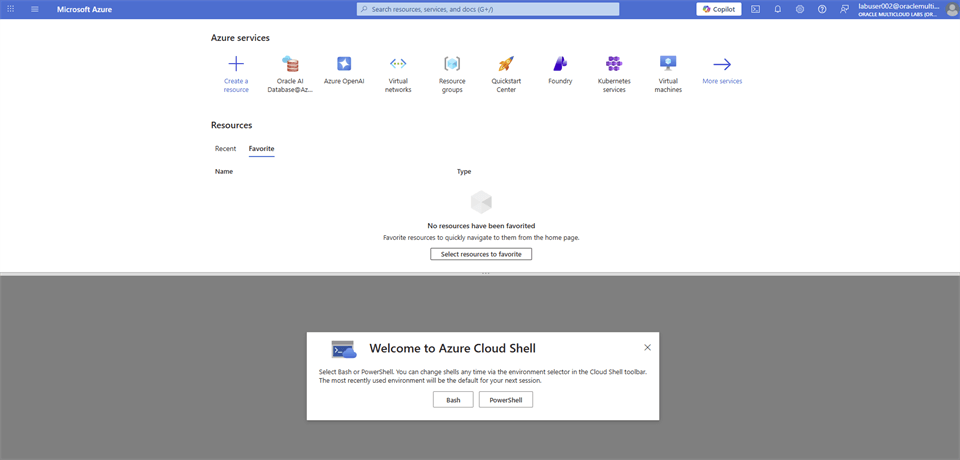
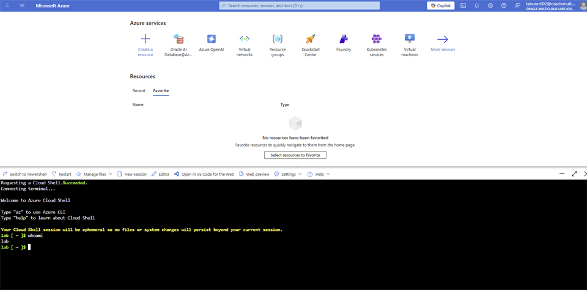
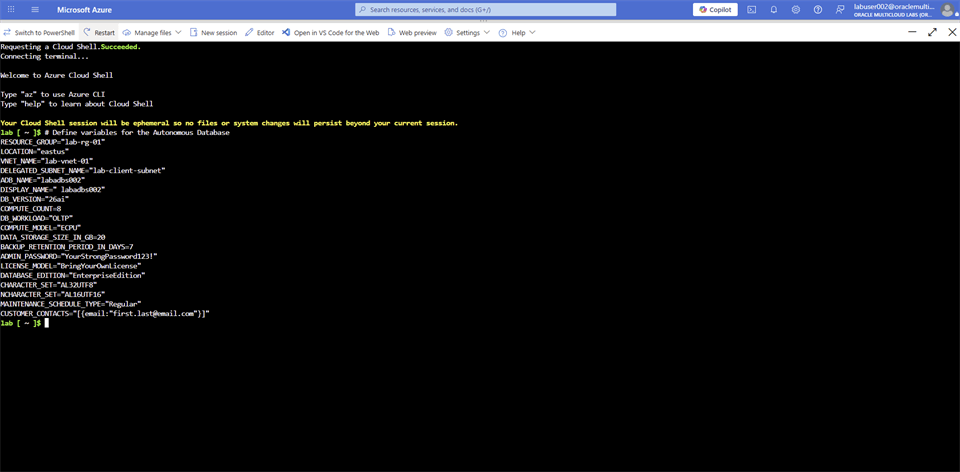
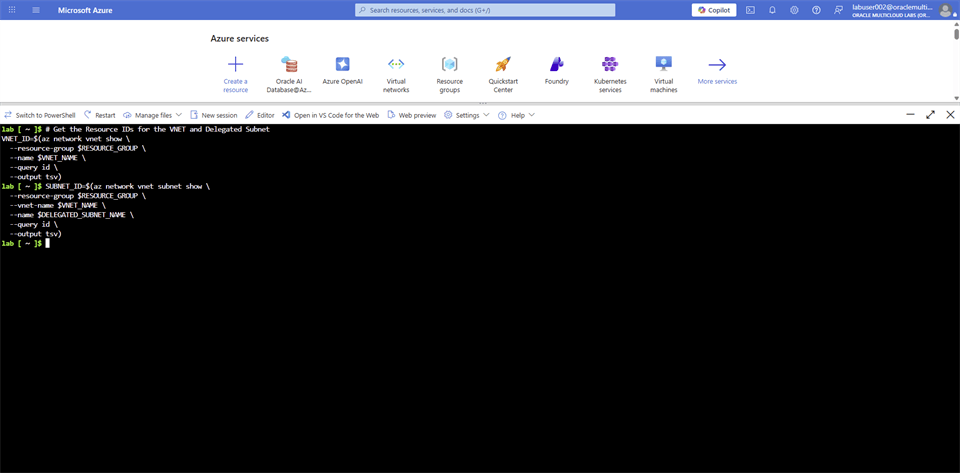
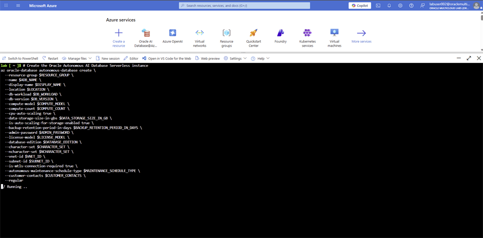

# Oracle Autonomous AI Database - CLI

## Introduction

Provision Oracle Autonomous AI Database from Azure Cloud Shell with the Azure CLI.

### Objectives

* Configure Azure Cloud Shell.
* Create Oracle Autonomous AI Database with the workshop network settings.
* Verify that the database is available.

Estimated Time: 15 minutes

## Task 1: Provision Oracle Autonomous AI Database with the Azure CLI

1. Login to Azure Portal, select **Cloud Shell**.

    

2. On the **Welcome to Azure Cloud Shell** window, select **Bash**.

    

3. On the **Getting started** window, select **No storage account required**. On the **Subscription** dropdown, select **omcpmlab01**. Leave the **Use an existing private virtual network** checkbox unchecked. Select **Apply**.

    

4. Your **Azure Cloud Shell** session will be initiated, and you will see a page similar to this.

    

5. Copy the following code block into a text editor. Update `ADB_NAME` and `DISPLAY_NAME` with values of your choice, `CUSTOMER_CONTACTS` with your personal email address, and `ADMIN_PASSWORD` with a strong password of your choice. After the Oracle Autonomous AI Database is successfully provisioned, you will receive an email. Copy the updated code block into the **Azure Cloud Shell** window and press **Enter**.

    ```bash
    <copy>
    # Define variables for the Autonomous Database
    RESOURCE_GROUP="lab-rg-01"
    LOCATION="eastus"
    VNET_NAME="lab-vnet-01"
    DELEGATED_SUBNET_NAME="lab-client-subnet"
    ADB_NAME="labadbsxxx"
    DISPLAY_NAME=" labadbsxxx"
    DB_VERSION="26ai"
    COMPUTE_COUNT=8
    DB_WORKLOAD="OLTP"
    COMPUTE_MODEL="ECPU"
    DATA_STORAGE_SIZE_IN_GB=20
    BACKUP_RETENTION_PERIOD_IN_DAYS=7
    ADMIN_PASSWORD="<YOUR_OWN_PASSWORD>"
    LICENSE_MODEL="BringYourOwnLicense"
    DATABASE_EDITION="EnterpriseEdition"
    CHARACTER_SET="AL32UTF8"
    NCHARACTER_SET="AL16UTF16"
    MAINTENANCE_SCHEDULE_TYPE="Regular"
    CUSTOMER_CONTACTS="[{email:"first.last@email.com"}]"
    </copy>
    ```

    

6. Copy the following code blocks and paste them into the **Azure Cloud Shell** window **one at a time** and press **Enter**.

    ```bash
    <copy>
    az config set extension.dynamic_install_allow_preview=true
    az extension add --name oracle-database
    </copy>
    ```

    ```bash
    <copy>
    # Get the Resource IDs for the VNET and Delegated Subnet
    VNET_ID=$(az network vnet show \
      --resource-group $RESOURCE_GROUP \
      --name $VNET_NAME \
      --query id \
      --output tsv)
    </copy>
    ```

    ```bash
    <copy>
    SUBNET_ID=$(az network vnet subnet show \
      --resource-group $RESOURCE_GROUP \
      --vnet-name $VNET_NAME \
      --name $DELEGATED_SUBNET_NAME \
      --query id \
      --output tsv)
    </copy>
    ```

    

7. Copy the following code block and paste into the **Azure Cloud Shell** window and press **Enter**. You are prompted install oracle-database extension. Type **Y** and press **Enter**.

    ```bash
    <copy>
    # Create the Oracle Autonomous AI Database Serverless instance
    az oracle-database autonomous-database create \
      --resource-group $RESOURCE_GROUP \
      --name $ADB_NAME \
      --display-name $DISPLAY_NAME \
      --location $LOCATION \
      --db-workload $DB_WORKLOAD \
      --db-version $DB_VERSION \
      --compute-model $COMPUTE_MODEL \
      --compute-count $COMPUTE_COUNT \
      --cpu-auto-scaling true \
      --data-storage-size-in-gbs $DATA_STORAGE_SIZE_IN_GB \
      --is-auto-scaling-for-storage-enabled true \
      --backup-retention-period-in-days $BACKUP_RETENTION_PERIOD_IN_DAYS \
      --admin-password $ADMIN_PASSWORD \
      --license-model $LICENSE_MODEL \
      --database-edition $DATABASE_EDITION \
      --character-set $CHARACTER_SET \
      --ncharacter-set $NCHARACTER_SET \
      --vnet-id $VNET_ID \
      --subnet-id $SUBNET_ID \
      --is-mtls-connection-required false \
      --autonomous-maintenance-schedule-type $MAINTENANCE_SCHEDULE_TYPE \
      --customer-contacts $CUSTOMER_CONTACTS \
      --regular
    </copy>
    ```

    

    > **Note:** You may receive this error while the database is being created: `The command failed with an unexpected error. Here is the traceback: Model 'AAZObjectType' has no field named 'data_base_type'`. The source states that you can ignore it.

8. Navigate to **Oracle AI Database@Azure** Dashboard. From the left-menu, select **Oracle Autonomous AI Database**. Filter the result with the database name you have used and confirm the **State** of the database is showing **Available**. Select on the name of the database.

    

9. From left-menu, select **Connections**. Select on **Download wallet**.

    

10. Follow the steps on **Oracle Autonomous AI Database Serverless Connect** and open **SQL Developer**.

11. Create the **product** table.

    ```sql
    <copy>
    CREATE TABLE product
    (
        product_id INT GENERATED ALWAYS AS IDENTITY(START WITH 1 INCREMENT BY 1),
        main_category VARCHAR2(255),
        title VARCHAR2(2000),
        average_rating FLOAT,
        rating_number INT,
        features CLOB,
        description CLOB,
        price VARCHAR2(256),
        images JSON,
        videos CLOB,
        store VARCHAR2(4000),
        categories CLOB,
        details CLOB,
        parent_asin VARCHAR2(255),
        bought_together CLOB
    );
    
    alter table product add constraint PK_PRODUCT_PRODUCTID primary key(product_id);
    </copy>
    ```

## Acknowledgements

* **Authors** - Rajib Sadhu
* **Source** - [Build a RAG App in 90 Minutes - Oracle AI Vector Search Meets Your Favorite LLM](https://docs.oracle.com/en/cloud/paas/multicloud/database-at-azure/latest/azlab/overview.html).
* **External assets** - Microsoft Azure interface screenshots and the referenced McAuley-Lab/Amazon-Reviews-2023 dataset material. Built with permission from the author(s).
* **Last Updated By/Date** - Rajib Sadhu, June 12, 2026
