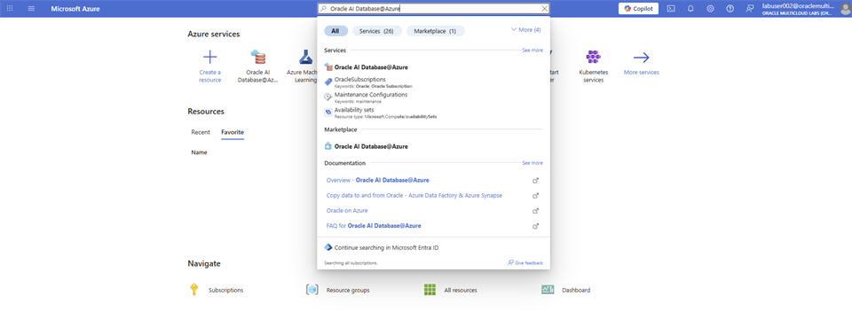
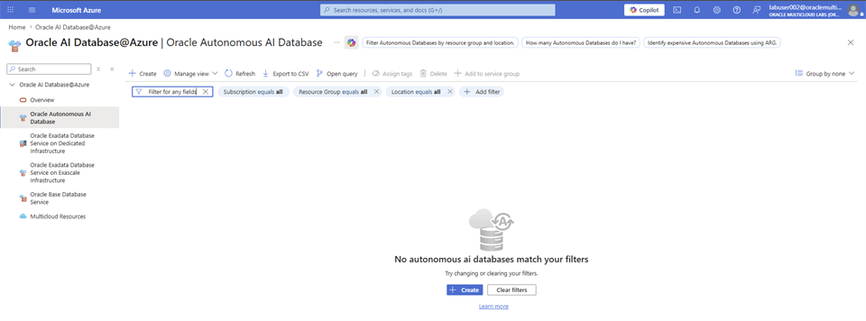
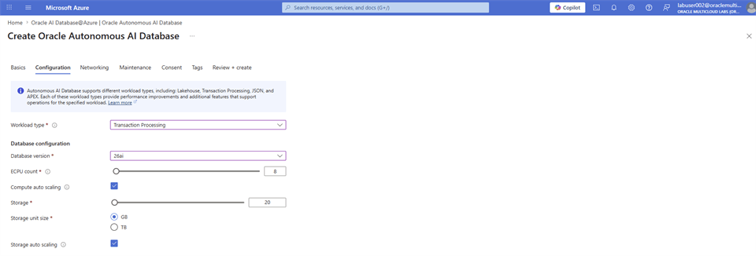
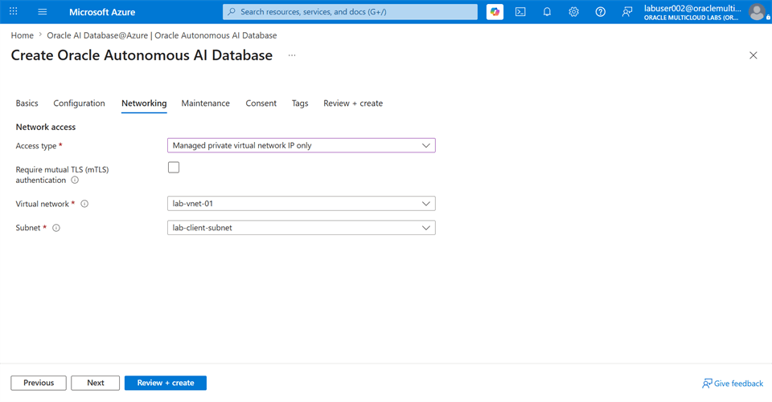
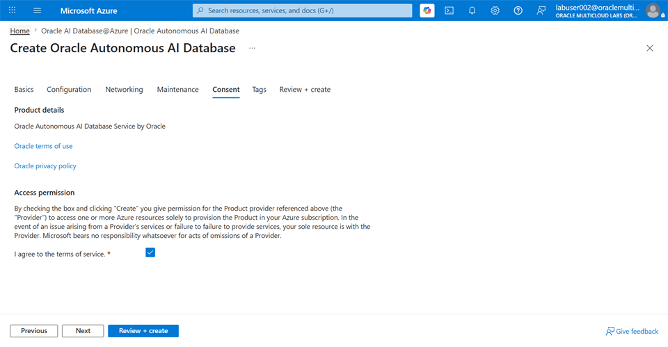
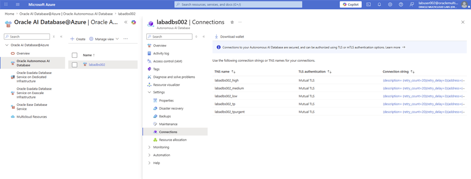

# Oracle Autonomous AI Database - Console

## Introduction

Provision Oracle Autonomous AI Database from the Oracle AI Database@Azure dashboard.

### Objectives

* Create Oracle Autonomous AI Database from the Azure portal.
* Configure database compute, storage, network, and authentication settings.
* Verify that the database is available.

Estimated Time: 15 minutes

## Task 1: Provision Oracle Autonomous AI Database from the Azure portal

Follow the steps to create your Oracle Autonomous AI Database.

1. Login to [Azure Portal](https://portal.azure.com/#home), and search for **Oracle AI Database@Azure**.

    

2. On the **Oracle AI Database@Azure** dashboard, navigate to **Oracle Autonomous AI Database**, and select **+ Create**.

    

3. On the **Basics** tab, enter the following values and select **Next**.

    * **Subscription**: Select **omcpmlab01** from the dropdown menu.

    * **Resource Group**: Select **lab-rg-01** from the dropdown menu.

    * **Name**: Enter a name of your choice.

    * **Region**: Select **(US) East US** from the dropdown menu.

    

4. On the **Configuration** tab, enter the following values and select **Next**.

    * **Workload type**: Select **Transaction Processing** from the dropdown menu.

    * **Database version**: Select **26ai** from the dropdown menu.

    * **ECPU count**: Enter **8** in the textbox.

    * **Compute auto scaling**: Keep the **Checkbox** selected.

    * **Storage**: Enter **20** in the textbox.

    * **Storage unit size**: Keep the **GB** radio button selected.

    * **Storage auto scaling**: Keep the **Checkbox** selected.

    * **Backup retention period in days**: Enter **1** in the textbox.

    * **Username**: This is **ADMIN** by default.

    * **Password**: Enter the password you selected for `ADMIN_PASSWORD` (for example, `<YOUR_OWN_PASSWORD>`).

    * **Confirm password**: Re-enter the password you selected for `ADMIN_PASSWORD`.

    * **License type**: Select **Bring your own license (BYOL)** from the dropdown menu.

    * **Oracle AI Database edition**: Select **Oracle AI Database Enterprise Edition (EE)** from the dropdown menu.

    * **Advanced options**: Keep the **Checkbox** unchecked.

    

    

5. On the **Networking** tab, enter the following values and select **Next**.

    * **Access type**: Select **Managed private virtual network IP only** from the dropdown menu.

    * **Require mutual TLS (mTLS) authentication**: Keep the checkbox **unchecked**.

    * **Virtual network**: Select **lab-vnet-01** from the dropdown menu.

    * **Subnet**: Select **lab-client-subnet** from the dropdown menu.

    

6. On the **Maintenance** tab, enter the following values and select **Next**.

    * **Maintenance patch level**: Select **Regular** from the dropdown menu.

    * **Email address**: Enter your work or personal email address to get notification on maintenance.

    

7. On the **Consent** tab, review the details and select **Next**.

    

8. On the **Tags** tab, select **Next**.

    

9. On the **Review + create** tab, review the inputs and select **Create**.

    

10. Navigate to **Oracle AI Database@Azure** Dashboard. From the left hand side panel, select **Oracle Autonomous AI Database**. Filter the result with the database name you used and confirm that the **State** of the database is **Available**. Select the database name.

    

11. From the left hand side menu, select **Connections**. Select **Download wallet**.

    

12. Follow the steps on [Oracle Autonomous AI Database Serverless Connect](https://docs.oracle.com/en-us/iaas/Content/database-at-azure/azucn-connect-c-autonomous-ai-database-serverless.html) and open **SQL Developer**.

13. Create the **product** table.

    ```sql
    <copy>
    CREATE TABLE product
    (
        product_id INT GENERATED ALWAYS AS IDENTITY(START WITH 1 INCREMENT BY 1),
        main_category VARCHAR2(255),
        title VARCHAR2(2000),
        average_rating FLOAT,
        rating_number INT,
        features CLOB,
        description CLOB,
        price VARCHAR2(256),
        images JSON,
        videos CLOB,
        store VARCHAR2(4000),
        categories CLOB,
        details CLOB,
        parent_asin VARCHAR2(255),
        bought_together CLOB
    );
    
    alter table product add constraint PK_PRODUCT_PRODUCTID primary key(product_id);
    </copy>
    ```

## Acknowledgements

* **Authors** - Rajib Sadhu and Bill Sawyer
* **Source** - [Build a RAG App in 90 Minutes - Oracle AI Vector Search Meets Your Favorite LLM](https://docs.oracle.com/en/cloud/paas/multicloud/database-at-azure/latest/azlab/overview.html).
* **External assets** - Microsoft Azure interface screenshots and the referenced McAuley-Lab/Amazon-Reviews-2023 dataset material. Built with permission from the author(s).
* **Last Updated By/Date** - Rajib Sadhu, June 12, 2026
