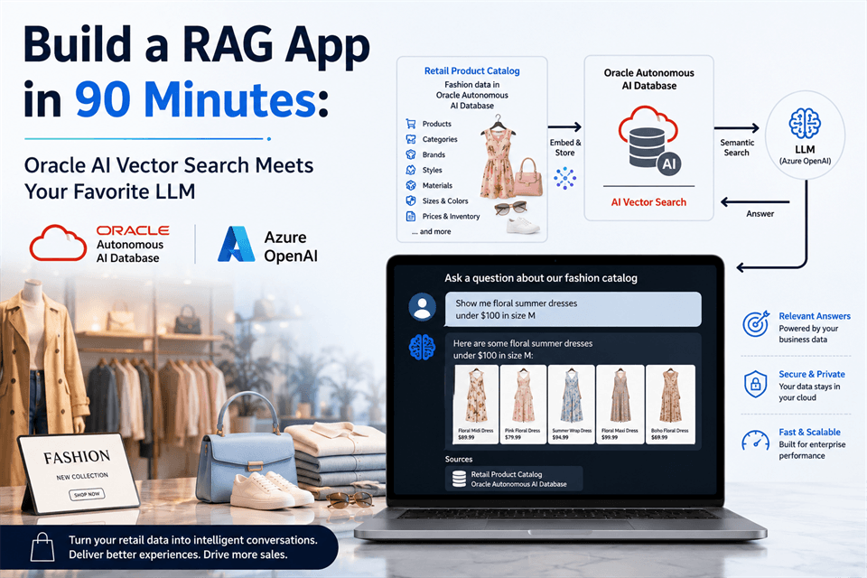

# Overview

## Introduction

**Turn your retail product catalog into an intelligent shopping assistant.**

In this 90-minute hands-on lab, you build a working RAG application using **Oracle Autonomous AI Database**, **Oracle AI Vector Search**, and **Azure OpenAI**. You use sample fashion catalog data as your knowledge base, generate vector embeddings, run semantic search, and connect everything to a natural language Q&A experience.

By the end of the lab, your app answers product questions such as *“Show me floral summer dresses”* using trusted enterprise data stored securely in Oracle Autonomous AI Database.

**Build it. Search it. Ask it. Take the code back to your business.**

### Objectives

* Connect to Oracle Autonomous AI Database through Oracle AI Database@Azure.
* Prepare the Azure Machine Learning notebook environment and load the retail catalog.
* Generate product-title embeddings with Azure OpenAI.
* Search the catalog with Oracle AI Vector Search.
* Run and test a retail RAG application.

Estimated Workshop Time: 90 minutes

## Acknowledgements

* **Authors** - Rajib Sadhu and Bill Sawyer
* **Source** - [Build a RAG App in 90 Minutes - Oracle AI Vector Search Meets Your Favorite LLM](https://docs.oracle.com/en/cloud/paas/multicloud/database-at-azure/latest/azlab/overview.html).
* **External assets** - Microsoft Azure interface screenshots and the referenced McAuley-Lab/Amazon-Reviews-2023 dataset material. Built with permission from the author(s).
* **Last Updated By/Date** - Rajib Sadhu, June 12, 2026
