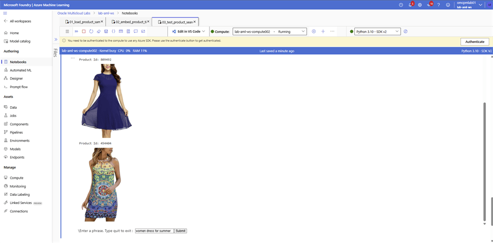

# Perform Semantic Search

## Introduction

Use the prepared notebook to search the product catalog by semantic similarity rather than exact keywords.

### Objectives

* Run the semantic-search notebook.
* Submit a natural-language product query.
* Review the products returned by vector similarity.

Estimated Time: 10 minutes

## Task 1: Search the retail catalog

In this step you will perform Semantic search. Follow the steps:

1. Login to **Microsoft Foundry** | **Azure Machine Learning** studio and select **Notebooks**. Navigate to your folder and open the `03_test_product_search.ipynb` notebook.

2. Update the **ADB_NAME** by replacing **<xxx>** with last 3 digit of your user name, select save. Run each cell in the order they are on the file.

3. Type a search phrase **women dress for summer** in the Textbox and select **Submit**.

    

4. Type **Quit** in the Textbox and select **Submit**.

## Acknowledgements

* **Authors** - Rajib Sadhu
* **Source** - [Build a RAG App in 90 Minutes - Oracle AI Vector Search Meets Your Favorite LLM](https://docs.oracle.com/en/cloud/paas/multicloud/database-at-azure/latest/azlab/overview.html).
* **External assets** - Microsoft Azure interface screenshots and the referenced McAuley-Lab/Amazon-Reviews-2023 dataset material. Built with permission from the author(s).
* **Last Updated By/Date** - Rajib Sadhu, June 12, 2026
