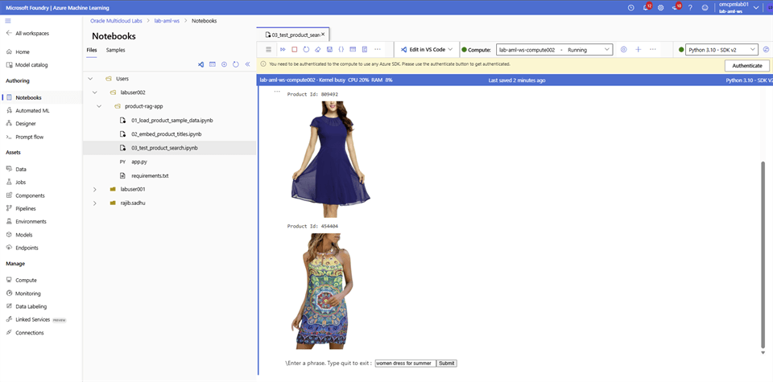

# Perform Semantic Search

## Introduction

Use the prepared notebook to search the product catalog by semantic similarity rather than exact keywords.

### Objectives

* Run the semantic-search notebook.
* Submit a natural-language product query.
* Review the products returned by vector similarity.

Estimated Time: 10 minutes

## Task 1: Search the retail catalog

In this step you will perform Semantic search. Follow the steps:

### Azure Event Account

1. Login to **Microsoft Foundry** | **Azure Machine Learning** studio and select **Notebooks**. Navigate to your folder and open the `03_test_product_search.ipynb` notebook.

2. Update the **ADB_NAME** by replacing **<xxx>** with last 3 digit of your user name, select save. Run each cell in the order they are on the file.

3. Type a search phrase **women dress for summer** in the Textbox and select **Submit**.

    

4. Type **Quit** in the Textbox and select **Submit**.

### Azure Regular Account

1. Login to **Microsoft Foundry** | **Azure Machine Learning** studio and select **Notebooks**. Navigate to your folder and open the `02_embed_product_titles.ipynb` notebook.

2. Copy the following code block into the cell. Run the cell.

    ```python
    %pip install openai --upgrade
    %pip install oracledb --upgrade
    ```

3. Add a new code cell, copy the following code block. Update the `ADB_DSN` value with the Oracle Autonomous AI Database connection string retrieved earlier. Run the cell.

    ```python
    import os
    import sys
    import getpass
    import array
    import oracledb
    import openai
    from skimage import io
    import matplotlib.pyplot as plt
    import requests
    
    
    # Set your OpenAI API Key
    api_type = "azure"
    api_key = "01AEi0ugivUkp1e9qxe0Fmxxxxxxxxxxxxxxxxxxxxxxx3w3AAABACOGxm2K"
    azure_endpoint = "https://lab-azure-openai-domain.openai.azure.com/"
    api_version = "2024-02-01"
    
    client = openai.AzureOpenAI(
            azure_endpoint=azure_endpoint,
            api_key=api_key,
            api_version=api_version
        )
    
    
    # Function to Generate the Embeddings
    deployment = "lab-azure-openai-deployment"
    
    def generate_embeddings(text):
        response = client.embeddings.create(
            input=text,
            model=deployment
        )
        return response.data[0].embedding
    
    
    # Create a connection to the database
    ADB_USER = "ADMIN"
    ADB_DSN = """(description= (retry_count=20)(retry_delay=3)(address=(protocol=tcps)(port=1521)(host=xxxxxx.adb.us-ashburn-1.oraclecloud.com))(connect_data=(service_name=xxxxxxxx_labadbsxxx_high.adb.oraclecloud.com))(security=(ssl_server_dn_match=no)))"""
    ADB_PASSWORD = getpass.getpass("Enter Autonomous Database password: ")
    connection = oracledb.connect(user=ADB_USER,password=ADB_PASSWORD, dsn=ADB_DSN)
    print("Successfully connected to Oracle Autonomous AI Database")
    
    
    cursor = connection.cursor()
    
    search_query = """select product_id,
                      json_value(images, '$.hi_res[0]') as image_url,
                      title
                      from product
                      where json_value(images, '$.hi_res[0]') is not null
                      order by vector_distance(title_embedding, :1, EUCLIDEAN)
                      fetch first 5 rows only"""
    
    
    while True:
        # Get the input text to vectorize
    
        text = input("\Enter a phrase. Type quit to exit : ")
    
        if (text == "quit") or (text == "exit"):
            break
    
        if text == "":
            continue
    
        sentence = [text]
        response = generate_embeddings(sentence)
    
        vec = array.array("f", response)
    
        print("vector embedding generated")
    
        cursor.execute(search_query, [vec])
    
        result = cursor.fetchall()
    
        image_urls = []
        plt.rcParams["figure.figsize"] = [7.50, 3.50]
        plt.rcParams["figure.autolayout"] = True
    
        for record in result:
            image_url = record[1]
            urldata = requests.get(image_url).content
            print("Product Id: " + str(record[0]))
            a = io.imread(image_url)
            plt.imshow(a)
            plt.axis('off')
            plt.show()
    
    
    
    # Close the connection
    connection.commit()
    cursor.close()
    connection.close()
    ```

4. Type a search phrase **women dress for summer** in the Textbox and select **Submit**.

    

5. Type **Quit** in the Textbox and select **Submit**.

## Acknowledgements

* **Authors** - Rajib Sadhu and Bill Sawyer
* **Source** - [Build a RAG App in 90 Minutes - Oracle AI Vector Search Meets Your Favorite LLM](https://docs.oracle.com/en/cloud/paas/multicloud/database-at-azure/latest/azlab/overview.html).
* **External assets** - Microsoft Azure interface screenshots and the referenced McAuley-Lab/Amazon-Reviews-2023 dataset material. Built with permission from the author(s).
* **Last Updated By/Date** - Rajib Sadhu, June 12, 2026
