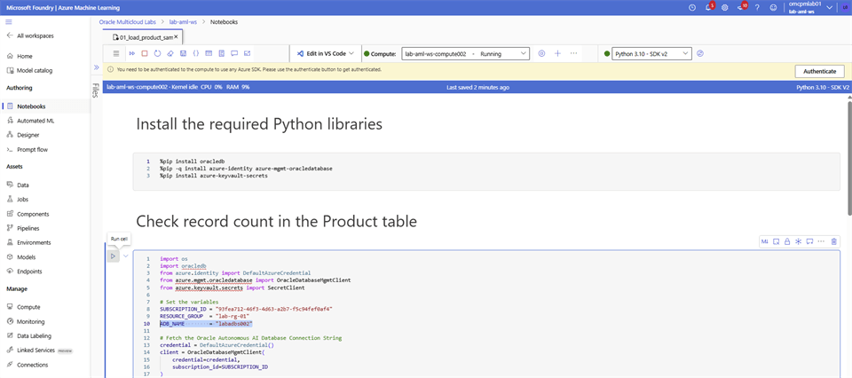

# Sample Data

## Introduction

Verify the sample product data preloaded in your workshop database.

### Objectives

* Open the sample-data notebook.
* Authenticate to the assigned database.
* Verify the preloaded product records.

Estimated Time: 5 minutes

## Task 1: Verify the sample data

**Verify Sample Data**

1. Login to **Microsoft Foundry** | **Azure Machine Learning** studio and select **Notebooks**. Navigate to your folder and open the **`01_load_product_sample_data.ipynb`** notebook.

2. Update `ADB_NAME` by replacing `<xxx>` with the last three digits of your username. Save the notebook, then complete the authentication checkpoint below.

    

    
⚠ Stop here — wait for authentication to succeed

    
Click <strong>Authenticate</strong> above the notebook and wait for the success confirmation. If authentication fails, wait briefly, then click <strong>Authenticate</strong> again. Do not skip this step or run notebook cells while authentication is incomplete.

    
<strong>Continue only when:</strong> authentication has succeeded. Then run the notebook cells in order.

    

    

## Acknowledgements

* **Authors** - Rajib Sadhu
* **Source** - [Build a RAG App in 90 Minutes - Oracle AI Vector Search Meets Your Favorite LLM](https://docs.oracle.com/en/cloud/paas/multicloud/database-at-azure/latest/azlab/overview.html).
* **External assets** - Microsoft Azure interface screenshots and the referenced McAuley-Lab/Amazon-Reviews-2023 dataset material. Built with permission from the author(s).
* **Last Updated By/Date** - Rajib Sadhu, June 12, 2026
