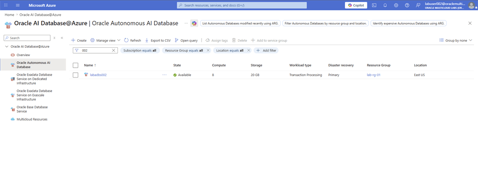
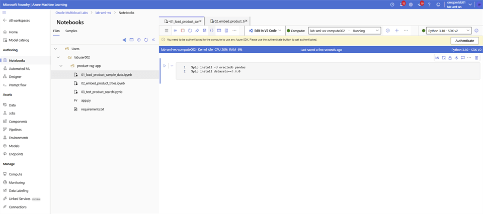
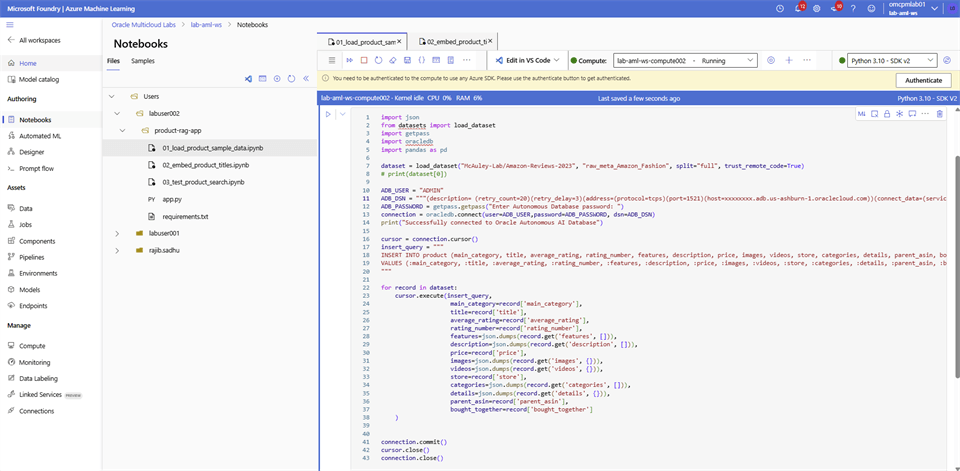
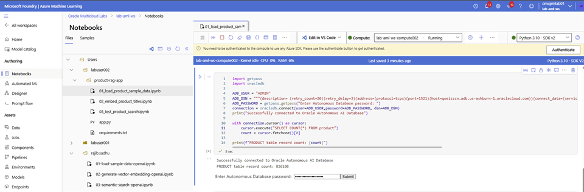

# Sample Data

## Introduction

Retrieve the Oracle Autonomous AI Database connection string, create the product table, and load the sample catalog.

### Objectives

* Retrieve the TLS connection string.
* Load the Amazon Fashion sample dataset.
* Create and populate the product table.

Estimated Time: 20 minutes

## Task 1: Load the sample data

**Retrieve Oracle Autonomous AI Database Connection String:**

Follow the steps to retrieve the Oracle Autonomous AI Database connection string information.

1. On the **Oracle AI Database@Azure** Dashboard, select on **Oracle Autonomous AI Database** from the left hand side panel and filter the list with the database name you have used. Select on the database name.

    

2. Expand the **Settings** from the menu and select on **Connections**.

    

3. Select on the **Connection string** value with **TNS name = <database_name>_high** and **TLS authentication = TLS**. Select on Copy to clipboard and save the connection string in a notepad.

    

    **Load the Sample Data**

1. Login to **Microsoft Foundry** | **Azure Machine Learning** studio and select **Notebooks**. Navigate to your folder and open the `01_load_product_sample_data.ipynb` notebook.

2. Add the following code block in the cell and run it.

    ```python
    <copy>
    %pip install -U oracledb pandas
    %pip install datasets==3.6.0
    </copy>
    ```

    

3. Add a new code cell, copy the following code block. Update the `ADB_DSN` value with the Oracle Autonomous AI Database connection string retrieved earlier. Run the cell.

    ```python
    <copy>
    import json
    from datasets import load_dataset
    import getpass
    import oracledb
    import pandas as pd
    
    dataset = load_dataset("McAuley-Lab/Amazon-Reviews-2023", "raw_meta_Amazon_Fashion", split="full", trust_remote_code=True)
    # print(dataset[0])
    
    ADB_USER = "ADMIN"
    ADB_DSN = """(description= (retry_count=20)(retry_delay=3)(address=(protocol=tcps)(port=1521)(host=xxxxxxxx.adb.us-ashburn-1.oraclecloud.com))(connect_data=(service_name=xxxxxxxxxx_xxxxxxxxx_high.adb.oraclecloud.com))(security=(ssl_server_dn_match=no)))"""
    ADB_PASSWORD = getpass.getpass("Enter Autonomous Database password: ")
    connection = oracledb.connect(user=ADB_USER,password=ADB_PASSWORD, dsn=ADB_DSN)
    print("Successfully connected to Oracle Autonomous AI Database")
    
    cursor = connection.cursor()
    insert_query = """
    INSERT INTO product (main_category, title, average_rating, rating_number, features, description, price, images, videos, store, categories, details, parent_asin, bought_together)
    VALUES (:main_category, :title, :average_rating, :rating_number, :features, :description, :price, :images, :videos, :store, :categories, :details, :parent_asin, :bought_together)
    """
    
    for record in dataset:
        cursor.execute(insert_query,
                        main_category=record['main_category'],
                        title=record['title'],
                        average_rating=record['average_rating'],
                        rating_number=record['rating_number'],
                        features=json.dumps(record.get('features', [])),
                        description=json.dumps(record.get('description', [])),
                        price=record['price'],
                        images=json.dumps(record.get('images', {})),
                        videos=json.dumps(record.get('videos', {})),
                        store=record['store'],
                        categories=json.dumps(record.get('categories', [])),
                        details=json.dumps(record.get('details', {})),
                        parent_asin=record['parent_asin'],
                        bought_together=record['bought_together']
        )
    
    connection.commit()
    cursor.close()
    connection.close()
    </copy>
    ```

    

4. To verify record count, add a new code cell, copy the following code block. Update the `ADB_DSN` value with the Oracle Autonomous AI Database connection string retrieved earlier. Run the cell.

    ```python
    <copy>
    import getpass
    import oracledb
    
    ADB_USER = "ADMIN"
    ADB_DSN = """(description= (retry_count=20)(retry_delay=3)(address=(protocol=tcps)(port=1521)(host=xxxxxxxx.adb.us-ashburn-1.oraclecloud.com))(connect_data=(service_name=xxxxxxxxxx_xxxxxxxxx_high.adb.oraclecloud.com))(security=(ssl_server_dn_match=no)))"""
    ADB_PASSWORD = getpass.getpass("Enter Autonomous Database password: ")
    connection = oracledb.connect(user=ADB_USER,password=ADB_PASSWORD, dsn=ADB_DSN)
    print("Successfully connected to Oracle Autonomous AI Database")
    
    with connection.cursor() as cursor:
        cursor.execute("SELECT COUNT(*) FROM product")
    
        count = cursor.fetchone()[0]
    
    print(f"PRODUCT table record count: {count}")
    </copy>
    ```

    

5. Follow the steps on [Oracle Autonomous AI Database Serverless Connect](https://docs.oracle.com/en-us/iaas/Content/database-at-azure/azucn-connect-c-autonomous-ai-database-serverless.html) and open **SQL Developer**.

6. Add a column to store the vector embeddings.

    ```sql
    <copy>
    alter table product add title_embedding VECTOR;
    </copy>
    ```

7. Update the NULL records in the product title.

    ```sql
    <copy>
    update product set title = 'Missing Title' where title is null;
    </copy>
    ```

## Acknowledgements

* **Authors** - Rajib Sadhu
* **Source** - [Build a RAG App in 90 Minutes - Oracle AI Vector Search Meets Your Favorite LLM](https://docs.oracle.com/en/cloud/paas/multicloud/database-at-azure/latest/azlab/overview.html).
* **External assets** - Microsoft Azure interface screenshots and the referenced McAuley-Lab/Amazon-Reviews-2023 dataset material. Built with permission from the author(s).
* **Last Updated By/Date** - Rajib Sadhu, June 12, 2026
