# Set Up Your Workshop Environment

## Introduction

Create or access Oracle Autonomous AI Database, prepare Azure Machine Learning Studio, and load the retail product data used by the RAG application. The source provides both Azure CLI and Azure portal provisioning paths.

### Objectives

* Create or access Oracle Autonomous AI Database.
* Prepare the Azure Machine Learning notebook workspace.
* Create the product table and load or verify the sample catalog data.

Estimated Time: 30 minutes

## Task 1: Review the setup sequence

1. If you use an Azure Event Account, skip the Autonomous AI Database provisioning tasks and continue to Task 4.

2. If you use an Azure Regular Account, complete either Task 2 for the Azure CLI path or Task 3 for the Azure portal path.

3. Complete Task 4 to prepare Azure Machine Learning Studio, and then complete Task 5 to load or verify the sample data.

## Task 2: Provision Autonomous AI Database with the Azure CLI

You will be using an Oracle Autonomous AI Database as a repository for your enterprise data. Follow the steps as outlined below depending on the type of Azure account you are using:

### Azure Event Account

For Azure Event Account users, we created your Oracle Autonomous AI Database with a sample dataset. Skip to the [Azure Machine Learning Studio](https://docs.oracle.com/en/cloud/paas/multicloud/database-at-azure/latest/azlab/azure-machine-learning-studio.html) step.

### Azure Regular Account

1. Login to Azure Portal, select **Cloud Shell**.

    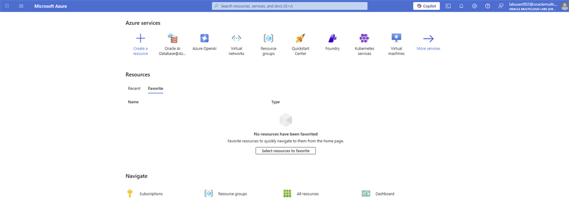

2. On the **Welcome to Azure Cloud Shell** window, select **Bash**.

    

3. On the **Getting started** window, select **No storage account required**. On the **Subscription** dropdown, select **omcpmlab01**. Leave the **Use an existing private virtual network** checkbox unchecked. Select **Apply**.

    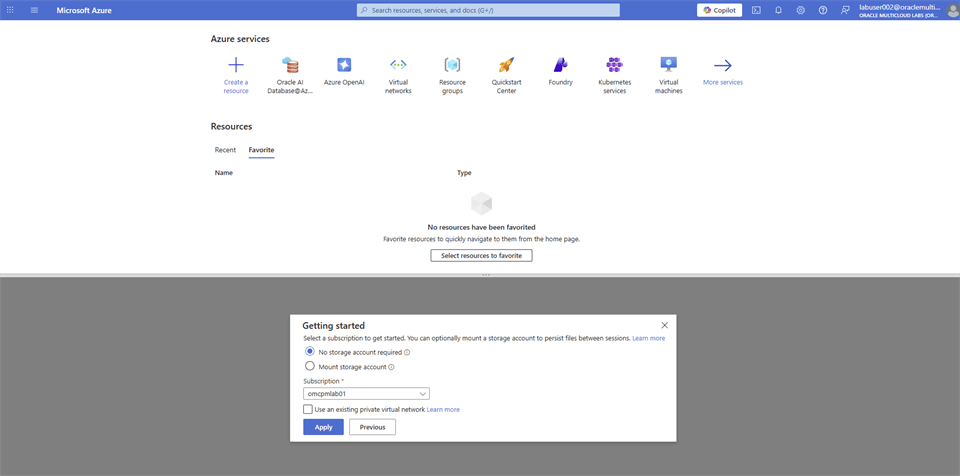

4. Your **Azure Cloud Shell** session will be initiated, and you will see a page similar to this.

    

5. Copy the following code block into a text editor. Update `ADB_NAME` and `DISPLAY_NAME` with values of your choice, `CUSTOMER_CONTACTS` with your personal email address, and `ADMIN_PASSWORD` with a strong password of your choice. After the Oracle Autonomous AI Database is successfully provisioned, you will receive an email. Copy the updated code block into the **Azure Cloud Shell** window and press **Enter**.

    ```bash
    # Define variables for the Autonomous Database
    RESOURCE_GROUP="lab-rg-01"
    LOCATION="eastus"
    VNET_NAME="lab-vnet-01"
    DELEGATED_SUBNET_NAME="lab-client-subnet"
    ADB_NAME="labadbsxxx"
    DISPLAY_NAME=" labadbsxxx"
    DB_VERSION="26ai"
    COMPUTE_COUNT=8
    DB_WORKLOAD="OLTP"
    COMPUTE_MODEL="ECPU"
    DATA_STORAGE_SIZE_IN_GB=20
    BACKUP_RETENTION_PERIOD_IN_DAYS=7
    ADMIN_PASSWORD="<YOUR_OWN_PASSWORD>"
    LICENSE_MODEL="BringYourOwnLicense"
    DATABASE_EDITION="EnterpriseEdition"
    CHARACTER_SET="AL32UTF8"
    NCHARACTER_SET="AL16UTF16"
    MAINTENANCE_SCHEDULE_TYPE="Regular"
    CUSTOMER_CONTACTS="[{email:"first.last@email.com"}]"
    ```

    

6. Copy the following code blocks and paste them into the **Azure Cloud Shell** window **one at a time** and press **Enter**.

    ```bash
    az config set extension.dynamic_install_allow_preview=true
    az extension add --name oracle-database
    ```

    ```bash
    # Get the Resource IDs for the VNET and Delegated Subnet
    VNET_ID=$(az network vnet show \
      --resource-group $RESOURCE_GROUP \
      --name $VNET_NAME \
      --query id \
      --output tsv)
    ```

    ```bash
    SUBNET_ID=$(az network vnet subnet show \
      --resource-group $RESOURCE_GROUP \
      --vnet-name $VNET_NAME \
      --name $DELEGATED_SUBNET_NAME \
      --query id \
      --output tsv)
    ```

    

7. Copy the following code block and paste into the **Azure Cloud Shell** window and press **Enter**. You are prompted install oracle-database extension. Type **Y** and press **Enter**.

    ```bash
    # Create the Oracle Autonomous AI Database Serverless instance
    az oracle-database autonomous-database create \
      --resource-group $RESOURCE_GROUP \
      --name $ADB_NAME \
      --display-name $DISPLAY_NAME \
      --location $LOCATION \
      --db-workload $DB_WORKLOAD \
      --db-version $DB_VERSION \
      --compute-model $COMPUTE_MODEL \
      --compute-count $COMPUTE_COUNT \
      --cpu-auto-scaling true \
      --data-storage-size-in-gbs $DATA_STORAGE_SIZE_IN_GB \
      --is-auto-scaling-for-storage-enabled true \
      --backup-retention-period-in-days $BACKUP_RETENTION_PERIOD_IN_DAYS \
      --admin-password $ADMIN_PASSWORD \
      --license-model $LICENSE_MODEL \
      --database-edition $DATABASE_EDITION \
      --character-set $CHARACTER_SET \
      --ncharacter-set $NCHARACTER_SET \
      --vnet-id $VNET_ID \
      --subnet-id $SUBNET_ID \
      --is-mtls-connection-required false \
      --autonomous-maintenance-schedule-type $MAINTENANCE_SCHEDULE_TYPE \
      --customer-contacts $CUSTOMER_CONTACTS \
      --regular
    ```

    

    > **Note:** You may receive this error while the database is being created: `The command failed with an unexpected error. Here is the traceback: Model 'AAZObjectType' has no field named 'data_base_type'`. The source states that you can ignore it.

8. Navigate to **Oracle AI Database@Azure** Dashboard. From the left-menu, select **Oracle Autonomous AI Database**. Filter the result with the database name you have used and confirm the **State** of the database is showing **Available**. Select on the name of the database.

    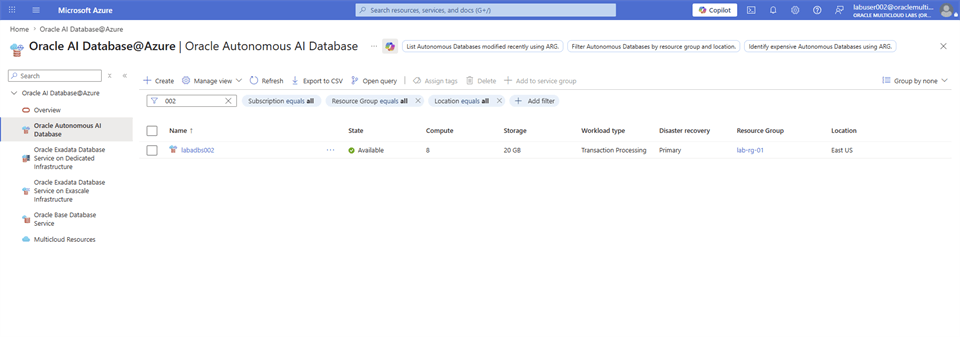

9. From left-menu, select **Connections**. Select on **Download wallet**.

    

10. Follow the steps on **Oracle Autonomous AI Database Serverless Connect** and open **SQL Developer**.

11. Create the **product** table.

    ```sql
    CREATE TABLE product
    (
        product_id INT GENERATED ALWAYS AS IDENTITY(START WITH 1 INCREMENT BY 1),
        main_category VARCHAR2(255),
        title VARCHAR2(2000),
        average_rating FLOAT,
        rating_number INT,
        features CLOB,
        description CLOB,
        price VARCHAR2(256),
        images JSON,
        videos CLOB,
        store VARCHAR2(4000),
        categories CLOB,
        details CLOB,
        parent_asin VARCHAR2(255),
        bought_together CLOB
    );
    
    alter table product add constraint PK_PRODUCT_PRODUCTID primary key(product_id);
    ```

## Task 3: Provision Autonomous AI Database from the Azure portal

You use an Oracle Autonomous AI Database as a repository for your enterprise data. Follow the steps as outlined below depending on the type of Azure account you are using:

### Azure Event Account

For Azure Event Account users, we created your Oracle Autonomous AI Database with a sample dataset. Skip to the Azure Machine Learning Studio step.

### Azure Regular Account

Follow the steps to create your Oracle Autonomous AI Database.

1. Login to [Azure Portal](https://portal.azure.com/#home), and search for **Oracle AI Database@Azure**.

    

2. On the **Oracle AI Database@Azure** dashboard, navigate to **Oracle Autonomous AI Database**, and select **+ Create**.

    

3. On the **Basics** tab, enter the following values and select **Next**.

    * **Subscription**: Select **omcpmlab01** from the dropdown menu.

    * **Resource Group**: Select **lab-rg-01** from the dropdown menu.

    * **Name**: Enter a name of your choice.

    * **Region**: Select **(US) East US** from the dropdown menu.

    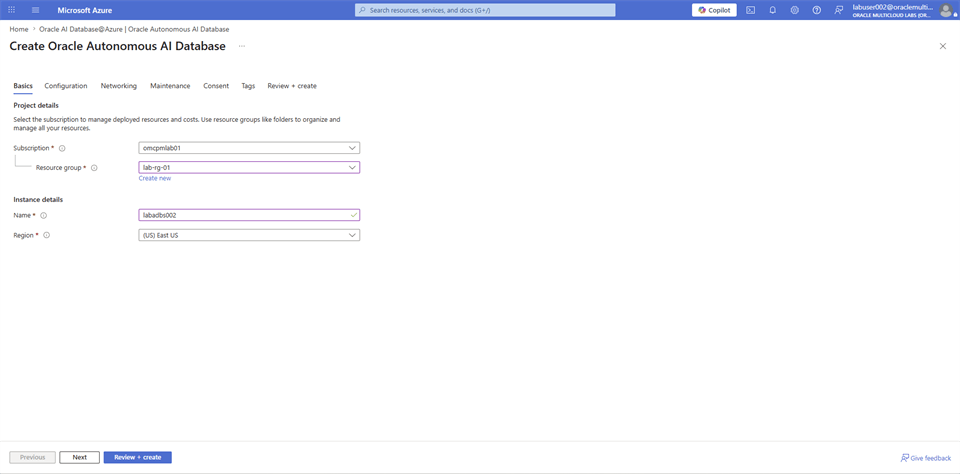

4. On the **Configuration** tab, enter the following values and select **Next**.

    * **Workload type**: Select **Transaction Processing** from the dropdown menu.

    * **Database version**: Select **26ai** from the dropdown menu.

    * **ECPU count**: Enter **8** in the textbox.

    * **Compute auto scaling**: Keep the **Checkbox** selected.

    * **Storage**: Enter **20** in the textbox.

    * **Storage unit size**: Keep the **GB** radio button selected.

    * **Storage auto scaling**: Keep the **Checkbox** selected.

    * **Backup retention period in days**: Enter **1** in the textbox.

    * **Username**: This is **ADMIN** by default.

    * **Password**: Enter the password you selected for `ADMIN_PASSWORD` (for example, `<YOUR_OWN_PASSWORD>`).

    * **Confirm password**: Re-enter the password you selected for `ADMIN_PASSWORD`.

    * **License type**: Select **Bring your own license (BYOL)** from the dropdown menu.

    * **Oracle AI Database edition**: Select **Oracle AI Database Enterprise Edition (EE)** from the dropdown menu.

    * **Advanced options**: Keep the **Checkbox** unchecked.

    

    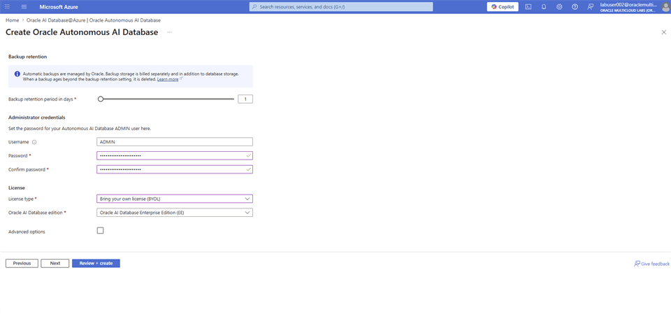

5. On the **Networking** tab, enter the following values and select **Next**.

    * **Access type**: Select **Managed private virtual network IP only** from the dropdown menu.

    * **Require mutual TLS (mTLS) authentication**: Keep the checkbox **unchecked**.

    * **Virtual network**: Select **lab-vnet-01** from the dropdown menu.

    * **Subnet**: Select **lab-client-subnet** from the dropdown menu.

    

6. On the **Maintenance** tab, enter the following values and select **Next**.

    * **Maintenance patch level**: Select **Regular** from the dropdown menu.

    * **Email address**: Enter your work or personal email address to get notification on maintenance.

    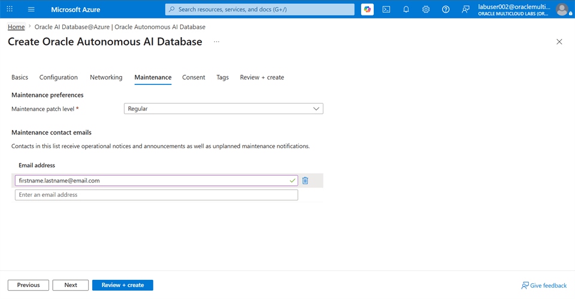

7. On the **Consent** tab, review the details and select **Next**.

    

8. On the **Tags** tab, select **Next**.

    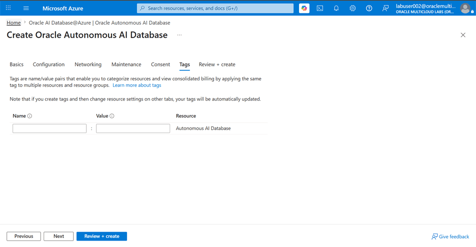

9. On the **Review + create** tab, review the inputs and select **Create**.

    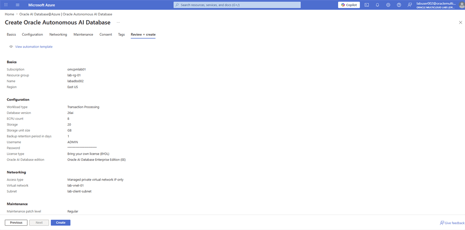

10. Navigate to **Oracle AI Database@Azure** Dashboard. From the left hand side panel, select **Oracle Autonomous AI Database**. Filter the result with the database name you used and confirm that the **State** of the database is **Available**. Select the database name.

    

11. From the left hand side menu, select **Connections**. Select **Download wallet**.

    

12. Follow the steps on [Oracle Autonomous AI Database Serverless Connect](https://docs.oracle.com/en-us/iaas/Content/database-at-azure/azucn-connect-c-autonomous-ai-database-serverless.html) and open **SQL Developer**.

13. Create the **product** table.

    ```sql
    CREATE TABLE product
    (
        product_id INT GENERATED ALWAYS AS IDENTITY(START WITH 1 INCREMENT BY 1),
        main_category VARCHAR2(255),
        title VARCHAR2(2000),
        average_rating FLOAT,
        rating_number INT,
        features CLOB,
        description CLOB,
        price VARCHAR2(256),
        images JSON,
        videos CLOB,
        store VARCHAR2(4000),
        categories CLOB,
        details CLOB,
        parent_asin VARCHAR2(255),
        bought_together CLOB
    );
    
    alter table product add constraint PK_PRODUCT_PRODUCTID primary key(product_id);
    ```

## Task 4: Prepare Azure Machine Learning Studio

You use Notebooks within Azure Machine Learning Studio to interact with the Oracle Autonomous AI Database and build the RAG application. To create the required folder structure, follow these steps:

### Azure Event Account

1. Login to Azure Portal, search for **Azure Machine Learning**.

    

2. Select on the **lab-aml-ws** workspace.

    

3. Select **Launch studio**. This opens a new tab.

    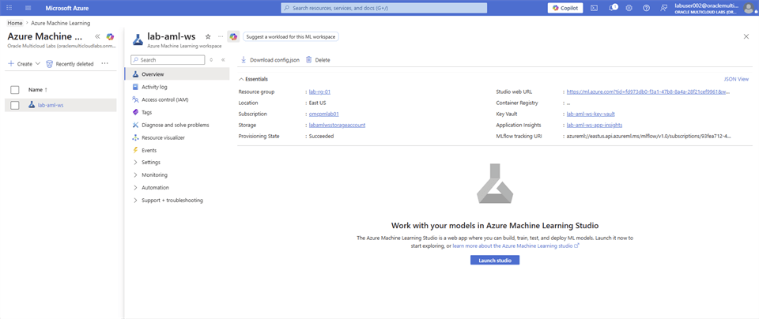

4. On the **Microsoft Foundry** | **Azure Machine Learning** page select **Notebooks** and locate the folder with your **user name**.

    

5. Use the **(…)** Menu and select **Open terminal**.

    

6. Copy the below code block in the terminal and replace **<xxx>** with the last 3 digit of your user name, hit **Enter**. To see the folder and files in it, select your user name folder and select on the **Refresh** icon.

    ```bash
    cp -r ~/cloudfiles/code/Users/labuser001/product-rag-app ~/cloudfiles/code/Users/labuser<xxx>/
    ```

    

7. Copy the below code block in the terminal, hit **Enter**.

    ```bash
    cd product-rag-app/
    ```

8. Copy the below code block in the terminal, hit **Enter**. Its expected to take **20 minutes** to finish installing all the required Python libraries. **DO NOT close the Terminal window.**

    ```bash
    python -m venv .venv
    source .venv/bin/activate
    
    python -m pip install --upgrade pip
    python -m pip install -r requirements.txt
    ```

### Azure Regular Account

1. Login to Azure Portal, search for **Azure Machine Learning**.

    

2. Select on the **lab-aml-ws** workspace.

    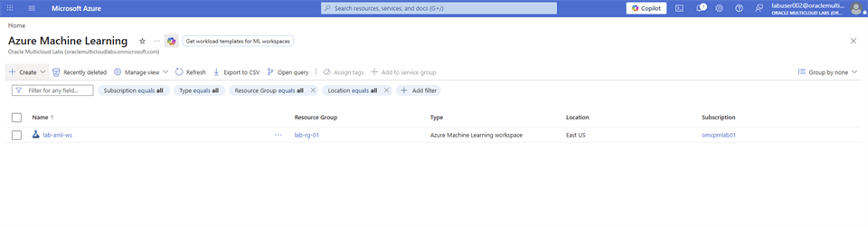

3. Select **Launch studio**. This opens a new tab.

    

4. On the **Microsoft Foundry** | **Azure Machine Learning** page select **Notebooks** and locate the folder with your **user name**.

    

5. Use the **(…)** Menu and create the following project structure starting with **Create new folder** followed by **Create new file**.

    ```bash
    product-rag-app/
    |-- 01_load_product_sample_data.ipynb
    |-- 02_embed_product_titles.ipynb
    |-- 03_test_product_search.ipynb
    |-- app.py
    |-- requirements.txt
    ```

    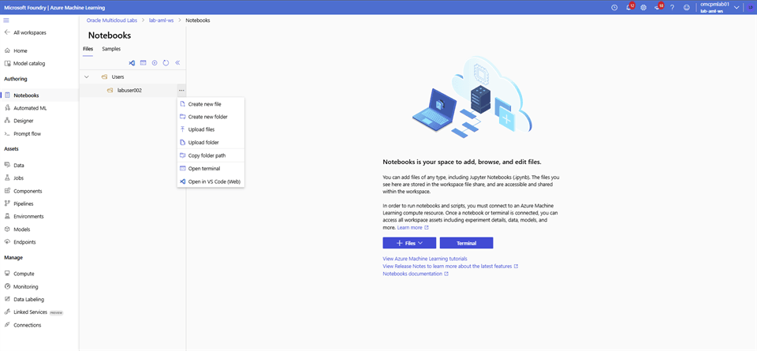

6. Verify the folder structure and confirm file types as below.

    

## Task 5: Load or verify the sample data

If you are using the Azure Event Account, we pre-loaded the database with sample data. For Azure Regular Account, follow the steps to load/verify sample data.

### Azure Event Account

**Verify Sample Data**

1. Login to **Microsoft Foundry** | **Azure Machine Learning** studio and select **Notebooks**. Navigate to your folder and open the **`01_load_product_sample_data.ipynb`** notebook.

2. Update `ADB_NAME` by replacing `<xxx>` with the last three digits of your username. Save the notebook, select **Authenticate**, and then run the cells in order.

    

### Azure Regular Account

**Retrieve Oracle Autonomous AI Database Connection String:**

Follow the steps to retrieve the Oracle Autonomous AI Database connection string information.

1. On the **Oracle AI Database@Azure** Dashboard, select on **Oracle Autonomous AI Database** from the left hand side panel and filter the list with the database name you have used. Select on the database name.

    

2. Expand the **Settings** from the menu and select on **Connections**.

    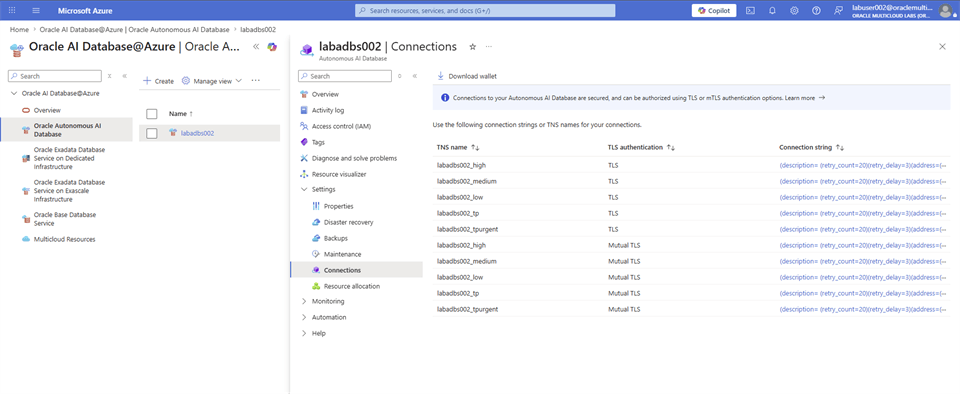

3. Select on the **Connection string** value with **TNS name = <database_name>_high** and **TLS authentication = TLS**. Select on Copy to clipboard and save the connection string in a notepad.

    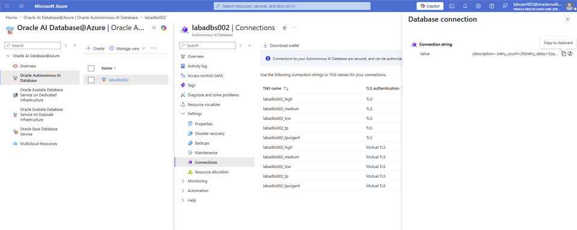

    **Load the Sample Data**

1. Login to **Microsoft Foundry** | **Azure Machine Learning** studio and select **Notebooks**. Navigate to your folder and open the `01_load_product_sample_data.ipynb` notebook.

2. Add the following code block in the cell and run it.

    ```python
    %pip install -U oracledb pandas
    %pip install datasets==3.6.0
    ```

    

3. Add a new code cell, copy the following code block. Update the `ADB_DSN` value with the Oracle Autonomous AI Database connection string retrieved earlier. Run the cell.

    ```python
    import json
    from datasets import load_dataset
    import getpass
    import oracledb
    import pandas as pd
    
    dataset = load_dataset("McAuley-Lab/Amazon-Reviews-2023", "raw_meta_Amazon_Fashion", split="full", trust_remote_code=True)
    # print(dataset[0])
    
    ADB_USER = "ADMIN"
    ADB_DSN = """(description= (retry_count=20)(retry_delay=3)(address=(protocol=tcps)(port=1521)(host=xxxxxxxx.adb.us-ashburn-1.oraclecloud.com))(connect_data=(service_name=xxxxxxxxxx_xxxxxxxxx_high.adb.oraclecloud.com))(security=(ssl_server_dn_match=no)))"""
    ADB_PASSWORD = getpass.getpass("Enter Autonomous Database password: ")
    connection = oracledb.connect(user=ADB_USER,password=ADB_PASSWORD, dsn=ADB_DSN)
    print("Successfully connected to Oracle Autonomous AI Database")
    
    cursor = connection.cursor()
    insert_query = """
    INSERT INTO product (main_category, title, average_rating, rating_number, features, description, price, images, videos, store, categories, details, parent_asin, bought_together)
    VALUES (:main_category, :title, :average_rating, :rating_number, :features, :description, :price, :images, :videos, :store, :categories, :details, :parent_asin, :bought_together)
    """
    
    for record in dataset:
        cursor.execute(insert_query,
                        main_category=record['main_category'],
                        title=record['title'],
                        average_rating=record['average_rating'],
                        rating_number=record['rating_number'],
                        features=json.dumps(record.get('features', [])),
                        description=json.dumps(record.get('description', [])),
                        price=record['price'],
                        images=json.dumps(record.get('images', {})),
                        videos=json.dumps(record.get('videos', {})),
                        store=record['store'],
                        categories=json.dumps(record.get('categories', [])),
                        details=json.dumps(record.get('details', {})),
                        parent_asin=record['parent_asin'],
                        bought_together=record['bought_together']
        )
    
    connection.commit()
    cursor.close()
    connection.close()
    ```

    

4. To verify record count, add a new code cell, copy the following code block. Update the `ADB_DSN` value with the Oracle Autonomous AI Database connection string retrieved earlier. Run the cell.

    ```python
    import getpass
    import oracledb
    
    ADB_USER = "ADMIN"
    ADB_DSN = """(description= (retry_count=20)(retry_delay=3)(address=(protocol=tcps)(port=1521)(host=xxxxxxxx.adb.us-ashburn-1.oraclecloud.com))(connect_data=(service_name=xxxxxxxxxx_xxxxxxxxx_high.adb.oraclecloud.com))(security=(ssl_server_dn_match=no)))"""
    ADB_PASSWORD = getpass.getpass("Enter Autonomous Database password: ")
    connection = oracledb.connect(user=ADB_USER,password=ADB_PASSWORD, dsn=ADB_DSN)
    print("Successfully connected to Oracle Autonomous AI Database")
    
    with connection.cursor() as cursor:
        cursor.execute("SELECT COUNT(*) FROM product")
    
        count = cursor.fetchone()[0]
    
    print(f"PRODUCT table record count: {count}")
    ```

    

5. Follow the steps on [Oracle Autonomous AI Database Serverless Connect](https://docs.oracle.com/en-us/iaas/Content/database-at-azure/azucn-connect-c-autonomous-ai-database-serverless.html) and open **SQL Developer**.

6. Add a column to store the vector embeddings.

    ```sql
    alter table product add title_embedding VECTOR;
    ```

7. Update the NULL records in the product title.

    ```sql
    update product set title = 'Missing Title' where title is null;
    ```

## Learn More

* [Connect to Oracle Autonomous AI Database Serverless](https://docs.oracle.com/en-us/iaas/Content/database-at-azure/azucn-connect-c-autonomous-ai-database-serverless.html)

## Acknowledgements

* **Authors** - Rajib Sadhu and Bill Sawyer
* **Source** - [Build a RAG App in 90 Minutes - Oracle AI Vector Search Meets Your Favorite LLM](https://docs.oracle.com/en/cloud/paas/multicloud/database-at-azure/latest/azlab/overview.html).
* **External assets** - Microsoft Azure interface screenshots and the referenced McAuley-Lab/Amazon-Reviews-2023 dataset material. Built with permission from the author(s).
* **Last Updated By/Date** - Rajib Sadhu, June 12, 2026
