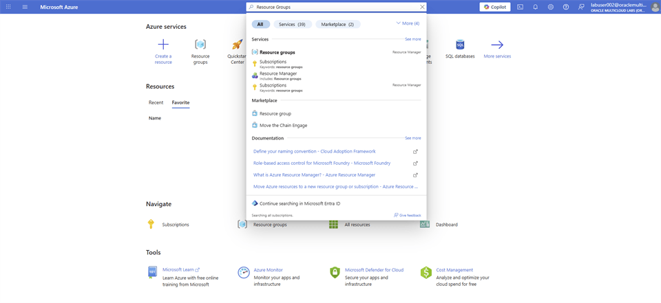
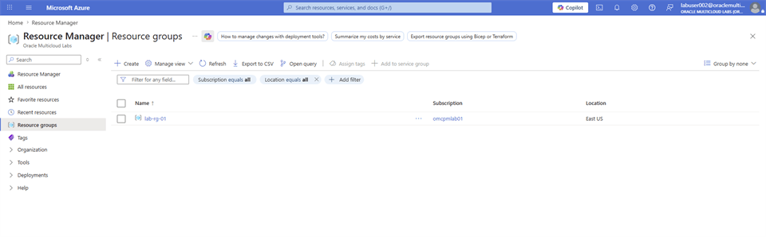
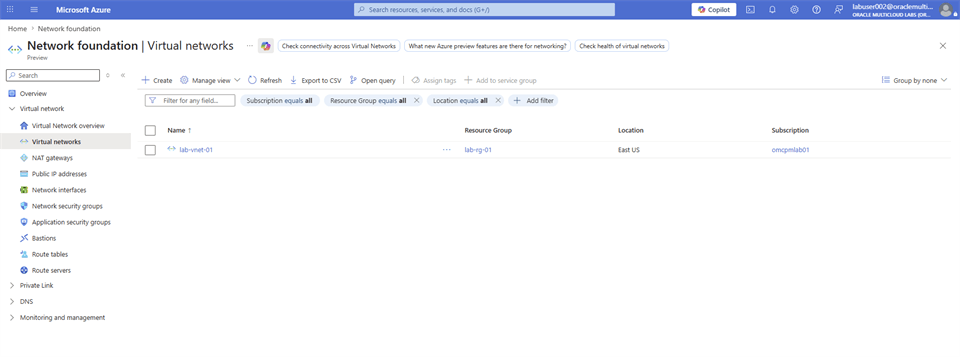
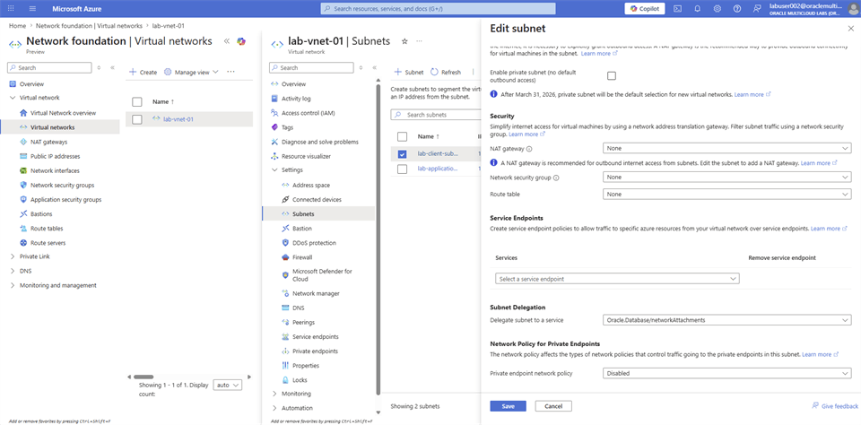
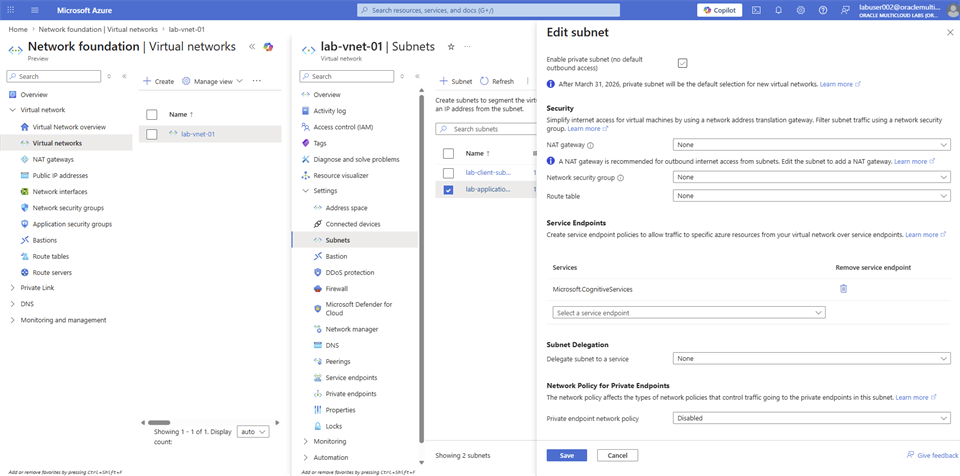
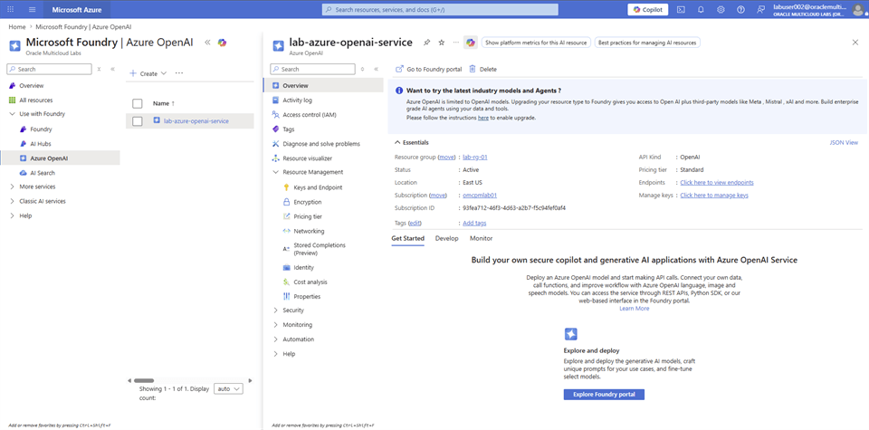
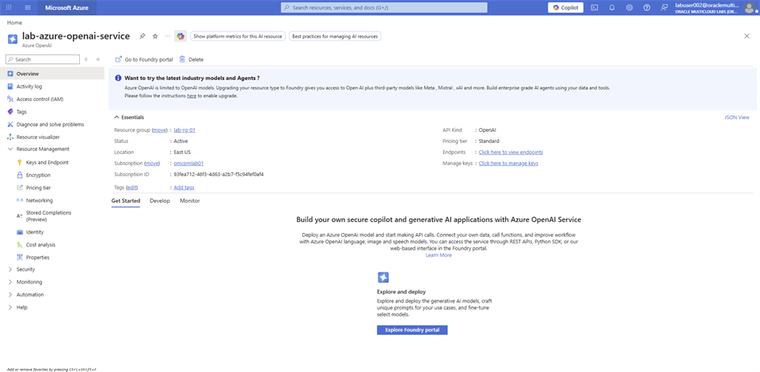
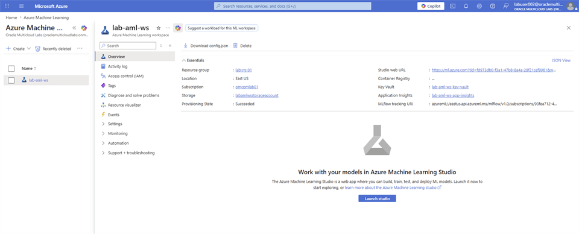

# Verify Lab Environment

## Introduction

Verify the Azure networking, Azure OpenAI, and Azure Machine Learning resources you provisioned.

### Objectives

* Verify the resource group, virtual network, and subnets.
* Verify the Azure OpenAI deployments.
* Verify the Azure Machine Learning workspace and compute.

Estimated Time: 10 minutes

## Task 1: Verify the lab environment

Verify each resource before you provision Oracle Autonomous AI Database.

### Verify your Azure Resource Group

1. Login to [Azure Portal](https://portal.azure.com/#home), search for Resource Groups, and select **Resource Groups** from the list.

    

2. From the available list of **Resource Groups**, take a note of the Resource Group **lab-rg-01**.

    

### Verify your Azure VNET & Subnets

1. On the Azure Portal, search for **VNET**, and select **Virtual network** from the list.

    

2. Take note of the available Virtual network **lab-vnet-01** name. Select the **lab-vnet-01** VNET and navigate to **Subnets**.

    

3. From the list of available **Subnets**, select **lab-client-subnet**.

    

4. On the **Edit subnet** page, take note of the **Subnet Delegation** value, **Oracle.Database/networkAttachments**. Oracle Autonomous AI Database is created using this **Delegated Subnet**.

    

5. From the list of available **Subnets**, select **lab-application-subnet**. On the Edit subnet page, take note of the Service Endpoints list. **Microsoft.CognitiveServices** service endpoint policy is a prerequisite for the **Azure OpenAI** resource deployment.

    

### Azure OpenAI Resource and Deployment

1. On the [Azure Portal](https://portal.azure.com/#home), search for **Azure OpenAI** and select **Azure OpenAI** from the list.

    

2. From the list of available Azure OpenAI instances, select **lab-azure-openai-service**.

    

3. Expand the left-menu on the **Azure OpenAI** page and select **Keys and Endpoint**.

    

4. Take note of KEY 1, Location/Region, and Endpoint values, which are used to call the **OpenAI** API.

    

5. Navigate to the **Networking** section of the **lab-azure-openai-service**. Azure OpenAI resources are securely deployed within the lab-application-subnet to ensure secure communication.

    

6. Select **Overview** to return to the main window, and select **Explore Foundry portal**.

    

7. This opens a new tab and takes you to the **Chat playground** page within the **Microsoft Foundry** | **Azure OpenAI** portal.

    

8. Select **Deployment** from the left-menu and select **lab-azure-openai-deployment** on the **Model deployments** page.

    

9. Take note of the **Model name** `text-embedding-3-small` and sample code to use with Python and other languages. Select the left arrow next to **lab-azure-openai-deployment** to return to the Deployments page.

    

10. Select **lab-azure-openai-chat-deployment** on the **Model deployments** page. Take note of the **Model name** `gpt-5.4-mini` and sample code to use with Python and other languages.

    

### Azure Machine Learning Workspace & Compute

1. On the [Azure Portal](https://portal.azure.com/#home), search for **Azure Machine Learning** and select it.

    

2. Select **lab-aml-ws** from the list of available Azure Machine Learning Workspaces.

    

3. Take a note of the **Azure Key Vault**, **Application Insights**, and **Storage account**, which are created already as prerequisite. Select **Launch studio**.

    

4. A new tab opens with the **Microsoft Foundry** | **Azure Machine Learning** Dashboard. Using the left-menu, select **Model catalog**. You have the option to select from a list of available hosted models. You use **text-embedding-3-small** from **OpenAI** through **Azure OpenAI Service**.

    

    

5. Navigate to the **Compute** page from the left-menu. Filter the list by typing the last 3 digit of your user name. Confirm it’s in **Running** state. Select the Compute **Name**.

    

6. Azure Machine Learning Compute is created using the **lab-application-subnet** within the **lab-vnet-01 Azure** VNET to ensure secure communication between the database server and Azure ML compute.

    

## Acknowledgements

* **Authors** - Rajib Sadhu and Bill Sawyer
* **Source** - [Build a RAG App in 90 Minutes - Oracle AI Vector Search Meets Your Favorite LLM](https://docs.oracle.com/en/cloud/paas/multicloud/database-at-azure/latest/azlab/overview.html).
* **External assets** - Microsoft Azure interface screenshots and the referenced McAuley-Lab/Amazon-Reviews-2023 dataset material. Built with permission from the author(s).
* **Last Updated By/Date** - Rajib Sadhu, June 12, 2026
