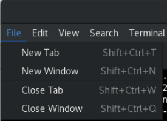

# Explore Python, JavaScript and Go Clients

## Introduction

This lab walks you through accessing Coherence from Python, JavaScript and Go clients.

Coherence provides the ability for clients in various languages to connect to a cluster 
using [gRPC](https://grpc.io/) as the network transport.

For Java clients, connecting using gRPC provides an alternative to **Coherence*Extend** connections and can be advantageous when you need to connect through a load balancer as gRPC uses HTTP/2 under the covers and is more load balancer friendly.

If you want to connect to Coherence from JavaScript, Python, or Go clients, then gRPC is the only protocol supported.

For any of the language options, from a cluster perspective, you must include the **`coherence-grpc-proxy`** module, with which the server-side gRPC proxy will accept the gRPC connections and carry out work on behalf of the clients.       

> Note: You can inspect the source code for each of the clients in the last lab.

Estimated time: 10 minutes

### Objectives

In this lab, you will:

* Use the Python client to monitor prices
* Use the JavaScript client to add trades
* Use the Go client to issue a stock-split

### Prerequisites

* You should have completed the previous labs.

## Task 1: Monitor Prices Using Python

> Note: Ensure you have enabled price updated in the primary cluster.

1. Open a new terminal by using **`File`** -> **`New Tab`** in the existing terminal.

   

2. Change to the following directory:
      ```bash
      <copy>cd coherence-demo/clients/py</copy>
      ```
                     
3. Run the python command to monitor prices:
      ```bash
      <copy>python3.8 main.py monitor</copy>
      ```       
   
   Because prices updates are still on via the dashboard, you should see the updates prices being displayed similar to below:

      ```bash   
      2024-11-25 09:08:49,674 - coherence - INFO - Session [ce32beb1-604e-49d3-bf00-b6d3b7f827a7] connected to [localhost:1408].
      Listening for price changes. Press CTRL-C to finish.
      Price changed for NFLX, new=$20.13, old=$20.11, change=$0.02  
      Price changed for NFLX, new=$19.53, old=$20.13, change=$-0.60
      Price changed for GOOG, new=$21.09, old=$21.13, change=$-0.04
      Price changed for AAPL, new=$18.59, old=$19.30, change=$-0.71
      ```
    
## Task 2: Add Stocks using the JavaScript

1. Open a new terminal by using **`File`** -> **`New Tab`** in the existing terminal.

2. Change to the following directory:
      ```bash
      <copy>cd coherence-demo/clients/js</copy>
      ```
                              
3. Issue the following to view the options applicable to the JavaScript client:
      ```bash
      <copy>node main.js</copy>
      ```     
        
   You should see output similar to the following:
     
      ```bash
      Usage: main.js command
      The following commands are supported:
      size        - display the cache sizes
      monitor     - monitor prices
      add-trades  - add random trades, specify symbol and count
      stock-split - stock split, specify symbol and factor
      ```                                                    

      > Note: Each of the clients has the same command line arguments which allows us to see how Coherence is accessed from a variety of clients.
   
4. Add 5,000 ORCL trades by issuing the following command:
      ```bash
      <copy>node main.js add-trades ORCL 5000</copy>
      ``` 
   
      You should see output similar to the following:
   
      ```bash
      2024-11-25 09:13:49,674: Adding 5000 random trades for ORCL...
      2024-11-25 09:13:50,604: Trades cache size is now 111000
      ```      
   
      > Note: Confirm in the primary and secondary cluster dashboards that the trade count has increased for the `ORCL` stock.
   
## Task 3: Issue a Stock Spit using Go

1. Click on the checkbox next to  **`Real-time Price Updates`** to disable random stock price updates.
          
2. Open a new terminal by using **`File`** -> **`New Tab`**  in the existing terminal.

3. Change to the following directory:
      ```bash
      <copy>cd coherence-demo/clients/go</copy>
      ```

4. Create an Executable Go Binary using the following:
      ```bash
      <copy>go build -o go-demo .  
      ls -l go-demo</copy>
      ```

      You should see output similar to the following:
      ```bash
      -rwxrwxr-x. 1 opc opc 17663730 Nov 25 01:23 go-demo
      ```       

5. Run the following to issue a **3:1** stock split for **`ORCL`** shares which will update the quantity by a factor of 3 and divide the price by a factor of 3.
         
      ```bash
      ./go-demo stock-split ORCL 3
      2024/11/25 01:24:53 session: aacdcd08-01a8-4954-8bab-76123e45708f connected to address localhost:1408
      2024/11/25 01:24:55 Updated quantity for 27622 trades
      2024/11/25 01:24:56 Updated price for 27622 trades
      2024/11/25 01:24:56 Updated price for ORCL from $22.21 to $7.40
      ```
          
      > Note: If you have time you can explore the three clients and run various commands in each of the clients.

## Learn More
                                                                        
* [Developing Remote Clients using gRPC](https://docs.oracle.com/en/middleware/standalone/coherence/14.1.2.0/develop-remote-clients/getting-started-grpc.html)
* [Coherence Python Client](https://github.com/oracle/coherence-py-client)
* [Coherence JavaScript Client](https://github.com/oracle/coherence-js-client)
* [Coherence Go Client](https://github.com/oracle/coherence-go-client)

## Acknowledgements

* **Author** - Tim Middleton
* **Contributors** - Ankit Pandey, Sid Joshi
* **Last Updated By/Date** - Ankit Pandey, November 2024