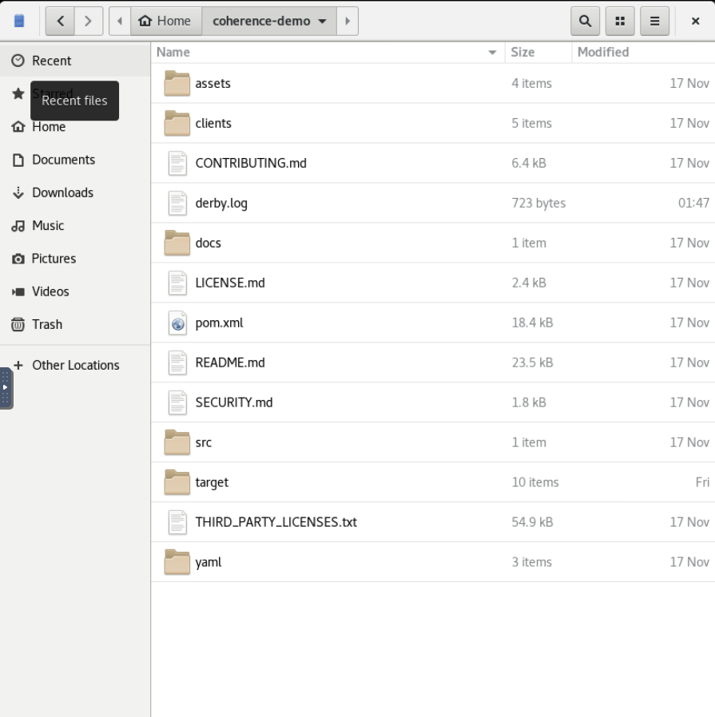

# Explore the Application Code

## Introduction

This lab walks you through the application code allowing you to gain an understanding of how the code works.

> Note: You can choose any of the languages you wish to inspect.

Estimated time: 10 minutes

### Objectives

In this lab, you will:

* Explore Java code
* Explore Python Code
* Explore JavaScript Code
* Explore Go Code

### Prerequisites

* You should have completed the previous labs.

## Task 1: Open the code in the "Files" application

1. In the remote session, choose **`Activities`** and select the **`Files`** icon to open the **"Files"** application.
     
   
        
2. Double click **`coherence-demo`** to change to that directory.

   

## Task 2: Explore the pom.xml, configuration and startup
                  
1. Application Startup

   The application is started using the following command:

      ```bash
      mvn -P grid-edition exec:exec
      ```

      This starts the application using the exec-maven-plugin which sets the following arguments in the project in [pom.xml](https://github.com/coherence-community/coherence-demo/blob/b632f832fe9860e9eb6fb454f13a4158367d0f23/pom.xml#L351):
 
      | Argument                                            | Usage                                                                                 |
      |-----------------------------------------------------|---------------------------------------------------------------------------------------|
      | -Dcoherence.log.level=7                             | Set the Coherence log level to 7 to provide more verbose output that the default of 5 |
      | -Dcoherence.management=all                          | Enables management for the cluster                                                    |
      | -Dcoherence.wka=127.0.0.1                           | Scopes the cluster to the localhost only                                              |
      | -Dcoherence.ttl=0                                   | Ensures cluster traffic does not go outside this VM                                   |
      | -Dcoherence.grpc.server.port=1408                   | Enable the gRPC Proxy on port 1408                                                    |
      | -Dcoherence.metrics.http.enabled=${metrics.enabled} | If set to true, enabled Coherence metrics, see the                                    |
                                                                                                                                                     
   The startup class is [com.oracle.coherence.demo.application.Launcher](https://github.com/coherence-community/coherence-demo/blob/1412/src/main/java/com/oracle/coherence/demo/application/Launcher.java) which does the following:
   
      * Determines the time zone and sets sensible primary and secondary cluster names using system properties, as well as Jaegar endpoint
      * Sets the following system property which indicates the cache configuration file to load:

         `System.setProperty("coherence.cacheconfig", "cache-config.xml")`
      * Calls Coherence.main(args) which is the main entry point for starting coherence

 
2. Configuration Files

   As part of the build, the relevant cache configuration file (cache-config-grid-edition.xml) and override file (tangosol-coherence-override-grid-edition.xml) 
   are copied from `src/main/resources/` to the target directory. See [here](https://github.com/coherence-community/coherence-demo/blob/b632f832fe9860e9eb6fb454f13a4158367d0f23/pom.xml#L469).

   **Cache Configuration**

      The cache configuration file (cache-config.xml in our case) defines caches and other services, for the cluster. A few areas of particular interest are:

      * An interceptor shown below, or on [GitHub](https://github.com/coherence-community/coherence-demo/blob/b632f832fe9860e9eb6fb454f13a4158367d0f23/src/main/resources/cache-config-grid-edition.xml#L46), 
         which is run on startup of the Coherence cluster: 
         ```xml  
         <interceptors>
           <interceptor>
             <instance>
               <class-name>com.oracle.coherence.demo.application.BootstrapInterceptor</class-name>
             </instance>
           </interceptor>
         </interceptors>
         ```
         In this context, interceptors allow us to write code to react to various lifecycle events such as when the cache configuration is activated or disposed. In this case we are running the `BootstrapInterceptor` class, explained below, to boostrap the application. Other interceptors can be created to respond to other events such as member left, partition events and cache mutation events.
      * Cache Scheme Mapping, shown below or on [GitHub](https://github.com/coherence-community/coherence-demo/blob/b632f832fe9860e9eb6fb454f13a4158367d0f23/src/main/resources/cache-config-grid-edition.xml#L51)
         defines the mapping from the cache name to a caching scheme and shows the domain classes for each cache, which are explained further below.
         ```xml
         <caching-scheme-mapping>
           <cache-mapping>
             <cache-name>Trade</cache-name>
             <scheme-name>federated-scheme</scheme-name>
             <key-type>java.lang.String</key-type>
             <value-type>com.oracle.coherence.demo.model.Trade</value-type>
           </cache-mapping>
           <cache-mapping>
             <cache-name>Price</cache-name>
             <scheme-name>federated-scheme</scheme-name>
             <key-type>java.lang.String</key-type>
             <value-type>com.oracle.coherence.demo.model.Price</value-type>
           </cache-mapping>
         </caching-scheme-mapping>
         ```
      * Federated Service Definitions, shown in part below or on [GitHub](https://github.com/coherence-community/coherence-demo/blob/b632f832fe9860e9eb6fb454f13a4158367d0f23/src/main/resources/cache-config-grid-edition.xml#L71)
         which defines the actual federated scheme with its read-write backing map to write through to a database (in memory database for convenience in our case). We can also see the topology is defined as `Active`, which is a reference to the topology in the override file below. 
         ```xml
           <federated-scheme>
             <scheme-name>federated-scheme</scheme-name>
              <backing-map-scheme>
                <read-write-backing-map-scheme>
                    <internal-cache-scheme>
                        <local-scheme>
                            <unit-calculator>BINARY</unit-calculator>
                        </local-scheme>
                    </internal-cache-scheme>
                    <write-max-batch-size>5000</write-max-batch-size>
                    <!-- Define the cache scheme. -->
                    <cachestore-scheme>
                        <class-scheme>
                            <class-name>
                                com.oracle.coherence.demo.cachestore.JpaCacheStore
                            </class-name>
                            <init-params>
                                ...
                            </init-params>
                        </class-scheme>
                    </cachestore-scheme>
                    <write-delay>2s</write-delay>
                </read-write-backing-map-scheme>
              </backing-map-scheme>
              <autostart>true</autostart>
              ...
              <topologies>
                <topology>
                   <name>Active</name>
                </topology>
            </topologies>
         </federated-scheme>
         ```
      * A Http Proxy server which has the JAX-RS resources [ApplicationResourceConfig](https://github.com/coherence-community/coherence-demo/blob/1412/src/main/java/com/oracle/coherence/demo/application/ApplicationResourceConfig.java) 
         which serves the static application and [ServiceResourceConfig](https://github.com/coherence-community/coherence-demo/blob/1412/src/main/java/com/oracle/coherence/demo/application/ServiceResourceConfig.java) which serves various REST endpoints through which the HTML/JavaScript application interacts.

   **Operational Override**

     The tangosol-coherence.xml operational deployment descriptor, or its override, specifies the operational and run-time settings that control clustering, communication, and data management services.
     For this demonstration we are configuring federation cluster members in the override file shown below, or on [GitHub](https://github.com/coherence-community/coherence-demo/blob/b632f832fe9860e9eb6fb454f13a4158367d0f23/src/main/resources/tangosol-coherence-override-grid-edition.xml#L38)
     or `src/main/resources/tangosol-coherence-override-grid-edition.xml`.

     ```xml
      <federation-config>
          <participants>   <!-- defines each participant or cluster in the federation setup -->
            <participant>
              <name system-property="primary.cluster">PrimaryCluster</name>
              <initial-action>start</initial-action>
              <remote-addresses>
                <socket-address>
                  <address system-property="primary.cluster.host">127.0.0.1</address>
                  <port    system-property="primary.cluster.port">7574</port>
                </socket-address>
              </remote-addresses>
            </participant>
            <participant>
              <name system-property="secondary.cluster">SecondaryCluster</name>
              <initial-action>pause</initial-action>
              <remote-addresses>
                <socket-address>
                  <address system-property="secondary.cluster.host">127.0.0.1</address>
                  <port    system-property="secondary.cluster.port">7575</port>
                </socket-address>
              </remote-addresses>
            </participant>
          </participants>
          <topology-definitions>
            <active-active>
              <name>Active</name> <!-- active/ active configuration -->
              <active system-property="primary.cluster">PrimaryCluster</active>
              <active system-property="secondary.cluster">SecondaryCluster</active>
            </active-active>
          </topology-definitions>
      </federation-config>
      ```

## Task 3: Explore the Java Code

**Domain Classes**

   There are two classes that hold the main data for the application:
        
   * `Price` - holds information regarding symbols and their current price
   
      Source code: `src/main/java/com/oracle/coherence/demo/model/Price.java` or on [GitHub](https://github.com/coherence-community/coherence-demo/blob/1412/src/main/java/com/oracle/coherence/demo/model/Price.java)
   
      Class definition (excluding getters/ setters, etc)
   
      ```java
      @Entity
      @XmlRootElement(name = "price")
      @XmlAccessorType(XmlAccessType.PROPERTY)
      @PortableType(id = 1003)
      public class Price {
    
          /**
           * The symbol (ticker code) of the equity for the {@link Price}.
           */
          @Id
          private String symbol;

          /**
           * The price of the symbol.
          */
          private double price;
     
          ...
      }
      ```      
     
      The `Entity` and `Id` annotations are for JPA persistence and the `PortableType` annotation is used at compile time to instrument the class to
      enable Portable Object Format serialization which is a fast and compact serialization format used by Coherence. 

   * `Trade` - holds individual trades and the price they traded for
        
      Source Code: `src/main/java/com/oracle/coherence/demo/model/Trade.java` or on [GitHub](https://github.com/coherence-community/coherence-demo/blob/1412/src/main/java/com/oracle/coherence/demo/model/Trade.java)
      
      Class definition (excluding getters/ setters, etc)
   
      ```java
      @Entity
      @XmlRootElement(name = "trade")
      @XmlAccessorType(XmlAccessType.PROPERTY)
      @PortableType(id = 1004)
      public class Trade {
          /**
           * The unique identifier for this trade.
           */
          @Id
          private String id;
      
          /**
           * The symbol (ticker code) of the equity for the {@link Trade}.
           */
          private String symbol;
      
          /**
           * The number of shares for the {@link Trade}.
           */
          private int quantity;
      
          /**
           * The price at which the shares in the {@link Trade} were acquired.
           */
          private double price;
          
          ...
      }
      ```     

**Bootstrap Interceptor and Utilities classes**

   Available at `src/main/java/com/oracle/coherence/demo/application/BootstrapInterceptor.java` or on [GitHub](https://github.com/coherence-community/coherence-demo/blob/1412/src/main/java/com/oracle/coherence/demo/application/BootstrapInterceptor.java).
   This class contains code run at startup of the cluster member to determine if it should load the initial data, and then opens the main dashboard. The main part of this code runs the following:
           
      ```java
      if (loadData) {
          Utilities.addIndexes();
          Utilities.populatePrices();
          Utilities.createPositions();
      }
      ```      
   
   The `Utilities` class available at `src/main/java/com/oracle/coherence/demo/application/Utilities.java` or on [GitHub](https://github.com/coherence-community/coherence-demo/blob/1412/src/main/java/com/oracle/coherence/demo/application/Utilities.java)
   has various methods that the application calls. We have included some relevant snippets below, which extra tracing code removed, for viewing.
                      
      * getPricesCache()

        ```java
        public static NamedCache<String, Price> getPricesCache() {
            return Coherence.getInstance().getSession().getCache(PRICE_CACHE);
        }
        ```

        The above code retrieves the coherence session from the Coherence instance and uses the session to get a reference to a cache. Similar code is used for all the caches.  

      * addIndexes()

        ```java
        public static void addIndexes() {
            NamedCache<String, Trade> tradesCache = getTradesCache();
 
            tradesCache.addIndex(Trade::getSymbol, true, null);
            tradesCache.addIndex(Trade::getPurchaseValue, false, null);
            tradesCache.addIndex(Trade::getQuantity, false, null);
            
            System.out.println(" Done");
        }
        ``` 
        
        The above code adds three indexes using value extractors, such as `Trade::getSymbol`, which extract the specified method value
        and stores a deserialized version of this for fast access when issuing queries and aggregations.

      * populatePrices()
   
        ```java
        public static void populatePrices() {
            NamedCache<String, Price> pricesCaches = getPricesCache();
            for (String symbol : SYMBOLS) {
                Price price = new Price(symbol, INITIAL_PRICE);
                pricesCaches.put(price.getSymbol(), price);
            }
        }
        ``` 
        
        The above code loops through the `SYMBOLS`, which is an array of stock symbols, and inserts initial prices.

      * createPositions() , which calls `createPositions(null, NR_POSITIONS_TO_CREATE)`
   
        ```java
        public static void createPositions(String symbolToInsert, int count) {
            Logger.out(String.format("Creating %d Positions...", count));

            NamedCache<String, Trade> tradesCache = getTradesCache();
            NamedCache<String, Price> priceCache  = getPricesCache();

            boolean singleSymbol = symbolToInsert != null;

            Map<String, Price>     localPrices = new HashMap<>(priceCache.getAll(priceCache.keySet()));
            HashMap<String, Trade> trades      = new HashMap<>();
            Random                 random      = ThreadLocalRandom.current();

            for (int i = 0; i < count; i++) {
                // create a random position
                String symbol = singleSymbol ? symbolToInsert : SYMBOLS[random.nextInt(SYMBOLS.length)];
                int    amount = random.nextInt(1000) + 1;
                double price  = localPrices.get(symbol).getPrice();

                Trade trade = new Trade(symbol, amount, price);

                trades.put(trade.getId(), trade);

                // batch the putAll's at 100,000
                if (i % 100_000 == 0) {
                    Logger.out("Flushing trades from HashMap to Coherence cache...");
                    tradesCache.putAll(trades);
                    trades.clear();
                }
            }

            // insert any remaining trades not previously flushed
            if (!trades.isEmpty()) {
                tradesCache.putAll(trades);
            } 
            Logger.out(String.format("Creation Complete! (Cache contains %d positions) ", tradesCache.size()));
        }
        ``` 
        
        The above code creates positions for a single symbol, or if `symbol` is null for random symbols.
        It utilizes a more efficient `putAll` of a `Map` to quickly add the number of positions required.

**Other Classes**

    There are various other components to the Java based JAX-RS application. You can explore the various classes and packages below via the explorer or via the direct GitHub links.

    * ChartDataResource.java in `src/main/java/com/oracle/coherence/demo/application` or on [GitHub](https://github.com/coherence-community/coherence-demo/blob/1412/src/main/java/com/oracle/coherence/demo/application/ChartDataResource.java)
      
      This class contains a JAX-RS endpoint that is called from the HTML/ JavaScript application, that will do aggregation, get prices and invoke code across all 
      members, to determine the number of Trades each member has. Some relevant code below is:

      ```java
      @GET
      @Path("{updatePrices}")
      @Produces( {APPLICATION_JSON, APPLICATION_XML, TEXT_PLAIN})
      public Response getChartData(@PathParam("updatePrices") boolean updatePrices) {
          ...
          // retrieve the trade summary using a custom aggregator across the members
          Map<String, TradeSummary> mapTradesBySymbol = trades.aggregate(GroupAggregator.createInstance(Trade::getSymbol,
                new TradeSummaryAggregator()));   
         
          InvocationService invocationService = (InvocationService) CacheFactory.getService("InvocationService");

          // determine the storage enabled members for the membership query
          Set<Member> storageEnabledMembers =
                 ((DistributedCacheService) trades.getCacheService()).getOwnershipEnabledMembers();
          
           // determine the member information
          Map<Member, MemberInfo> memberInfoMap =
                invocationService.query(new GetMemberInfo(trades.getCacheName()), storageEnabledMembers);

          // establish the chart data
          ChartData data = new ChartData(CacheFactory.getCluster().getTimeMillis(),
                mapTradesBySymbol,
                symbolPrice,
                memberInfoMap.values(),
                stopWatch.getElapsedTimeIn(TimeUnit.MILLISECONDS));
      }
      ```
   
   * EventsResource.java in `src/main/java/com/oracle/coherence/demo/application` or on [GitHub](https://github.com/coherence-community/coherence-demo/blob/1412/src/main/java/com/oracle/coherence/demo/application/EventsResource.java)
      
     This class contains methods to set up a Server Sent Events (SSE) broadcaster and uses Coherence Map Events to send any changes to the SSE channel.
     Some relevant methods are shown below:
   
     ```java
     @PostConstruct
     void createBroadcaster() {
        this.broadcaster = sse.newBroadcaster();
        this.prices = Utilities.getPricesCache();
                   
        // add a MapListener on the Price cache on startup to push event changes to the event broadcaster
        prices.addMapListener(new SimpleMapListener<String, Price>()
                .addUpdateHandler(e->broadcaster.broadcast(createEvent("priceUpdate",
                        e.getNewValue().getSymbol(), e.getOldValue().getPrice(), e.getNewValue().getPrice()))));
     }

     private OutboundSseEvent createEvent(String name, String symbol, double oldPrice, double newPrice) {
        return sse.newEventBuilder()
                  .name(name)
                  .data(Price.class, new PriceUpdate(symbol, oldPrice, newPrice))
                  .mediaType(APPLICATION_JSON_TYPE)
                  .build();
     }

     /**
      * Registers an event listener for the specified {@link SseEventSink}.
      *
      * @param eventSink  provided {@link SseEventSink}
      */
     @GET
     @Path("subscribe")
     @Produces(MediaType.SERVER_SENT_EVENTS)
     public void registerEventListener(@Context SseEventSink eventSink) {
         broadcaster.register(eventSink);
         eventSink.send(sse.newEvent("begin", new Date().toString()));
     }
     ``` 

## Task 4: Explore the Application HTML and JavaScript

Since the focus of this lab is Coherence, we have not included detailed information about the HTML and Angular components.

The main components are highlight below:

   | Directory / File                                | Description                            | GitHub Link                                                                                                               |
   |-------------------------------------------------|----------------------------------------|---------------------------------------------------------------------------------------------------------------------------|
   | src/main/resource/web                           | Base directory for the Web application | [Link](https://github.com/coherence-community/coherence-demo/tree/1412/src/main/resources/web)                            |
   | src/main/resources/web/index.html               | Main application entry point           | [Link](https://github.com/coherence-community/coherence-demo/tree/1412/src/main/resources/web/index.html)                 |
   | src/main/resources/web/javscripts/controller.js | Angular Controller                     | [Link](https://github.com/coherence-community/coherence-demo/blob/1412/src/main/resources/web/javascripts/controllers.js) |

  
## Task 5: Explore the Python Code
               
**Code and Serialization**

   The **Python** code is available in the following location:
  
   **clients/py/main.py**</br>
   **[main.py](https://github.com/coherence-community/coherence-demo/blob/1412/clients/py/main.py)**

   For all the clients, by default, data is serialized into JSON and stored as native JSON objects in the cluster. 
   In this demo we have chosen to convert them to a Java representation so we can execute server side Java code. This is done different ways in each of the clients, but at a high level we set an attribute `@class` in the client data structure and this maps to the server-side `type-aliases.properties` which then converts the JSON objects to their relevant Java class.

      ```bash
      Trade=com.oracle.coherence.demo.model.Trade
      Price=com.oracle.coherence.demo.model.Price
      ```

   If you are using the one client to access data, you do not have to have a Java representation.

   A few of the main areas of code have been included below:

**Define the domain classes**

   The `@serialization.proxy("Price")` defines the Java class that this object will serialize to.

      ```python
      @dataclass
      @serialization.proxy("Price")
      class Price:
         symbol: str
         price: float

      @dataclass
      @serialization.proxy("Trade")
      class Trade:
         id: str
         symbol: str
         quantity: int
         price: float

      session: Session
      prices: NamedCache[str, Price]
      trades: NamedCache[str, Trade]
      ``` 
   
**Connect to the Coherence cluster and setup caches**
   
      ```python
      async def init_coherence() -> None:
         """
         Initialize Coherence.

         :return: None
         """
         global session
         global prices
         global trades
                                             
         # Uses default of localhost:1408
         session = await Session.create()   
         prices = await session.get_cache("Price")
         trades = await session.get_cache("Trade")
      ```
**Display the cache size**
    
      ```python
      async def display_cache_size() -> None:
         """
         Displays the size for both the Trade and Price caches.

         :return: None
         """
         global prices
         global trades

         tradesize = await trades.size()
         pricesize = await prices.size()

         print(f"Trade cache size: {tradesize}")
         print(f"Price cache size: {pricesize}")
      ```

**Monitor prices**

      ```python
      async def monitor_prices() -> None:
         """
         Monitors the Price cache for any changes and displays them.
      
         :return: None
         """
         global prices
      
         listener: MapListener[str, Price] = MapListener()
         listener.on_updated(lambda e: handle_event(e))
         await prices.add_map_listener(listener)
      
         print("Listening for price changes. Press CTRL-C to finish.")
         await asyncio.sleep(10000)
      
      def handle_event(e) -> None:
         """
         Event handler to display the event details
      
         :return: None
         """
         symbol = e.key
         old_price = e.old.price
         new_price = e.new.price
         change = new_price - old_price
      
         print(
               f"Price changed for {symbol}, new=${new_price:.2f}, old=${old_price:.2f}, change=${change:.2f}")
      ```
    
**Add trades**

      ```python 
      async def add_trades(symbol: str, count: int) -> None:
      """
      Add trades for a symbol.

      :param symbol the symbol to add trades to
      :param count the number of trades to add
      :return: None
      """
      global prices
      global trades

      if count <= 0:
         print("count must be supplied and be positive")
         return
                     
      # Return a list of the valid symbols from Coherence
      symbols: List[str] = await prices.aggregate(Aggregators.distinct("symbol"))

      if symbol in symbols:
         current_price: Price = await prices.get(symbol)

         buffer: dict[str, Trade] = {}
         print()

         print(f"{get_time()}: Adding {count} random trades for {symbol}")

         for i in range(0, count):
               trade_id = str(uuid.uuid1())
               new_trade: Trade = Trade(trade_id, symbol, random.randint(1, 1000), current_price.price)
               buffer[trade_id] = new_trade
               if i % 1000 == 0:
                  await trades.put_all(buffer)
                  buffer.clear()

         # Write anything left
         if len(buffer) != 0:
               await trades.put_all(buffer)

         size = await trades.size()
         print(f"{get_time()}: Size of Trade cache is now {size}")
      else:
         print(f"Unable to find {symbol}, valid symbols are {symbols}")
      ```

**Stock split**

      ```python 
      async def stock_split(symbol: str, factor: int) -> None:
      """
      Do a stock split.

      :param symbol the symbol to split
      :param factor the factor to use for the split, e.g. 2 = 2 to 1
      :return: None
      """
      global prices
      global trades

      if factor <= 0 or factor > 10:
         print("factor must be supplied and be positive and less than 10")
         return

      symbols: List[str] = await prices.aggregate(Aggregators.distinct("symbol"))

      if symbol in symbols:
         current_price: Price = await prices.get(symbol)

         # the process for the stock split is:
         # 1. Update each trade and multiply the quantity by thr factor
         # 2. Update each trade and divide the price by the factor (or multiply by 1/factor)
         # 3. Update the price cache for the symbol and divide the price by the factor (or multiply by 1/factor)

         print()
         print(f"{get_time()}: Splitting {symbol} using factor of {factor}")

         print(f"{get_time()}: Update quantity for {symbol}")
         async for _ in trades.invoke_all(Processors.multiply("quantity", factor), None, Filters.equals("symbol", symbol)):
               break  # ignore

         print(f"{get_time()}: Update price for {symbol}")
         async for _ in trades.invoke_all(Processors.multiply("price", 1 / factor), None, Filters.equals("symbol", symbol)):
               break  # ignore

         await prices.invoke(symbol, Processors.multiply("price", 1 / factor))

         new_price = (current_price.price / factor)

         print(f"{get_time()}: Updating price for {symbol} to ${new_price:.2f}")
      else:
         print(f"Unable to find {symbol}, valid symbols are {symbols}")
      ```

## Task 6: Explore the Javascript Code

The **JavaScript** code is available in the following location:
  
   **clients/js/main.js**</br>
   **[main.js](https://github.com/coherence-community/coherence-demo/blob/1412/clients/js/main.js)**       
    
**Define the domain classes**
      ```javascript
      // create a Trade
      function createTrade(symbol, qty, price) {
         const trade = {
            '@class': 'Trade',
            id: uuid.v4().toString(),
            symbol: symbol,
            quantity: qty,
            price: price
         }

         return trade
      }
      ```

   No actual classes / objects are required in JavaScript, as you can work directly with JSON.   

**Connect to the Coherence cluster and setup caches**

      ```javascript
      // setup session to Coherence
      const session = new Session()
      const prices = session.getCache('Price')
      const trades = session.getCache('Trade')
      ```

**Display the cache size**

      ```javascript
      if (command === "size") {
          console.log("Trade cache size = " + (await trades.size))
          console.log("Price cache size = " + (await prices.size)) 
      }
      ```
 
**Monitor prices**

      ```javascript
      // monitor any price changes
      async function monitor() {
         console.log("Listening for price changes. Press CTRL-C to finish.")
         const handler = (event) => {
            let oldPrice = event.oldValue.price;
            let newPrice = event.newValue.price;
            let change = newPrice - oldPrice;
      
            console.log("Price changed for " + event.key + ", new=" + formatter.format(newPrice) +
                  ", old=" + formatter.format(oldPrice) + ", change=" + formatter.format(change))
         }
         const listener = new MapListener().on(MapEventType.UPDATE, handler)
      
         await prices.addMapListener(listener)
         await sleep(100_000_000)
      }
   ```

**Add trades**

      ```javascript
      // add a number of trades for a symbol
      async function addTrades(symbol, count) {
         if (count < 0) {
            console.log("Count must not be negative")
            return
         }
         
         // get the distinct list of symbols
         let symbols = await prices.aggregate(Aggregators.distinct('symbol'))
      
         if (!symbols.includes(symbol, 0)) {
            console.log("Unable to find " + symbol + ", valid values are " + symbols)
            return
         }
      
         console.log(new Date().toISOString() + ": Adding %d random trades for %s...", count, symbol)
      
         // get the current price for the trade
         let currentPrice = await prices.get(symbol)
                        
         // use efficient setAll (equivalent of putAll)
         let buffer = new Map()
         for (let i = 0; i < count; i++) {
            let trade = createTrade(symbol, Math.floor(Math.random() * 1000), currentPrice.price)
            buffer.set(trade.id, trade)
            if (i % 1000 === 0) {
                  await trades.setAll(buffer)
                  buffer.clear()
            }
         }
         
         if (buffer.size !== 0) {
            await trades.setAll(buffer)
         }
      
         let size = await trades.size
         console.log(new Date().toISOString() + ": Trades cache size is now " + size)
      }
      ```

**Stock split**

      ```javascript
      // split a stock using a given factor
      async function stockSplit(symbol, factor) {
         if (factor < 0) {
            console.log("Factor must not be negative")
            return
         }
      
         let symbols = await prices.aggregate(Aggregators.distinct('symbol'))
      
         if (!symbols.includes(symbol, 0)) {
            console.log("Unable to find " + symbol + ", valid values are " + symbols)
               return
         }
      
         console.log(new Date().toISOString() + ": Splitting %s using factor of %d...", symbol, factor)
      
         // get the current price for the trade
         let currentPrice = await prices.get(symbol)
      
         // the process for the stock split is:
         // 1. Update each trade and multiply the quantity by thr factor
         // 2. Update each trade and divide the price by the factor (or multiply by 1/factor)
         // 3. Update the price cache for the symbol and divide the price by the factor (or multiply by 1/factor)
      
         let filter = Filters.equal("symbol", symbol)
      
         console.log(new Date().toISOString() + ": Updating quantity for " + symbol + " trades...")
         await trades.invokeAll(filter, Processors.multiply("quantity", factor))
      
         console.log(new Date().toISOString() + ": Updating price for " + symbol + " trades...")
         await trades.invokeAll(filter, Processors.multiply("price", 1 / factor))
      
         let newPrice = (currentPrice.price / factor)
      
         console.log(new Date().toISOString() + ": Updating price for " + symbol + " to " + formatter.format(newPrice))
         await prices.invoke(symbol, Processors.multiply("price", 1 / factor))
      }
      ```

## Task 7: Explore the Go Code

The **Go code** is available in the following location:
  
   **clients/go/main.go**</br>
   **[main.go](https://github.com/coherence-community/coherence-demo/blob/1412/clients/go/main.go)**

**Define the domain classes**

      ```go
      type Trade struct {
         Class    string  `json:"@class"`
         ID       string  `json:"id"`
         Symbol   string  `json:"symbol"`
         Quantity int     `json:"quantity"`
         Price    float32 `json:"price"`
      }
      
      type Price struct {
         Class  string  `json:"@class"`
         Symbol string  `json:"symbol"`
         Price  float32 `json:"price"`
      }
      ```

**Connect to the Coherence cluster and setup caches**

      ```go
      // create a new Session
      session, err := coherence.NewSession(ctx, coherence.WithPlainText(), coherence.WithRequestTimeout(time.Duration(120)*time.Second))
      err != nil {
         panic(err)
      }
      defer session.Close()

      trades, err = coherence.GetNamedCache[string, Trade](session, "Trade")
      if err != nil {
         panic(err)
      }

      prices, err = coherence.GetNamedCache[string, Price](session, "Price")
      if err != nil {
         panic(err)
      }
      ```   

**Display the cache size**
    
      ```go
      func displaySize(trades coherence.NamedCache[string, Trade], prices coherence.NamedCache[string, Price]) error {
         size, err := trades.Size(ctx)
         if err != nil {
            return err
         }
         fmt.Printf("Trade cache size = %d\n", size)
         
         size, err = prices.Size(ctx)
         if err != nil {
            return err
         }
         fmt.Printf("Price cache size = %d\n\n", size)
         return nil
      }
      ```

**Monitor prices**
 
      ```go
      func listenPrices(prices coherence.NamedCache[string, Price]) error {
         fmt.Println("Listening for price changes. Press CTRL-C to finish.")
         fmt.Println()

         // Create a listener and add to the cache
         listener := coherence.NewMapListener[string, Price]().OnUpdated(func(e coherence.MapEvent[string, Price]) {
            key, err := e.Key()
            if err != nil {
               panic(err)
            }
            newValue, err := e.NewValue()
            if err != nil {
               panic(err)
            }
            oldValue, err := e.OldValue()
            if err != nil {
               panic(err)
            }

            newPrice := newValue.Price
            oldPrice := oldValue.Price
            change := newPrice - oldPrice
            log.Printf("Price changed for %s, new=$%3.2f, old=$%3.2f, change=$%3.2f\n", *key, oldPrice, newPrice, change)
         })

      if err := prices.AddListener(ctx, listener); err != nil {
         return err
      }

      select {}
      ```

**Add trades**
 
      ```go
      func addTrades(trades coherence.NamedCache[string, Trade], prices coherence.NamedCache[string, Price], options ...string) error {
         if len(options) != 2 {
            return fmt.Errorf("you must specify a symbol and count")
         }

         symbol := options[0]
         count, err := strconv.Atoi(options[1])
         if err != nil {
            return fmt.Errorf("invalid value for count of %v", options[1])
         }

         if count < 0 {
            return errors.New("count cannot be negative")
         }

         symbols, err := getSymbols(prices)
         if err != nil {
            return err
         }

         if !isSymbolValid(symbol, symbols) {
            return fmt.Errorf("unable to find symbol %s, valid values are %v\n", symbol, symbols)
         }

         // get the price for the symbol
         currentPrice, err := prices.Get(ctx, symbol)
         if err != nil {
            return err
         }

         // add using efficient PutAll
         buffer := make(map[string]Trade, 0)

         log.Printf("Adding %d random trades for %s...\n", count, symbol)

         for i := 0; i < count; i++ {
            trade := newTrade(symbol, rand.Intn(1000)+1, currentPrice.Price)
            buffer[trade.ID] = trade
            if i%1000 == 0 {
               err = trades.PutAll(ctx, buffer)
               if err != nil {
                  return err
               }
               buffer = make(map[string]Trade, 0)
            }
         }

         // if anything left in buffer save to Coherence
         if len(buffer) > 0 {
            err = trades.PutAll(ctx, buffer)
            if err != nil {
               return err
            }
         }

         size, err := trades.Size(ctx)
         if err == nil {
            log.Printf("Trades cache size is now %d\n", size)
            fmt.Println()
         }

         return nil
      }
      ```

**Stock split**

      ```go
      func stockSplit(trades coherence.NamedCache[string, Trade], prices coherence.NamedCache[string, Price], options ...string) error {
         if len(options) != 2 {
            return fmt.Errorf("you must specify a symbol and factor")
         }

         symbol := options[0]
         factor, err := strconv.Atoi(options[1])
         if err != nil {
            return fmt.Errorf("invalid value for factor of %v", options[1])
         }

         if factor < 1 || factor > 10 {
            return errors.New("factor must be between 1 and 10")
         }

         symbols, err := getSymbols(prices)
         if err != nil {
            return err
         }

         if !isSymbolValid(symbol, symbols) {
            return fmt.Errorf("unable to find symbol %s, valid values are %v\n", symbol, symbols)
         }

         // get the price for the symbol
         currentPrice, err := prices.Get(ctx, symbol)
         if err != nil {
            return err
         }

         // the process for the stock split is:
         // 1. Update each trade and multiply the quantity by the factor
         // 2. Update each trade and divide the price by the factor (or multiply by 1/factor)
         // 3. Update the price cache for the symbol and divide the price by the factor (or multiply by 1/factor)

         symbolExtractor := extractors.Extract[string]("symbol")

         ch := coherence.InvokeAllFilter[string, Trade, string](ctx, trades, filters.Equal(symbolExtractor, symbol),
            processors.Multiply("quantity", factor))

         count := 0
         for v := range ch {
            if v.Err != nil {
               return v.Err
            }
            count++
         }

         log.Printf("Updated quantity for %d trades", count)

         count = 0
         ch2 := coherence.InvokeAllFilter[string, Trade, string](ctx, trades, filters.Equal(symbolExtractor, symbol),
            processors.Multiply("price", float32(1)/float32(factor)))

         for v := range ch2 {
            if v.Err != nil {
               return v.Err
            }
            count++
         }

         log.Printf("Updated price for %d trades", count)

         _, err = coherence.Invoke[string, Price, float32](ctx, prices, symbol, processors.Multiply("price", float32(1)/float32(factor)))

         log.Printf("Updated price for %s from $%3.2f to $%3.2f\n\n", symbol, currentPrice.Price, currentPrice.Price/float32(factor))
         // update the price cache
         return nil
      }
      ```

## Acknowledgements

* **Author** - Tim Middleton
* **Contributors** - Ankit Pandey, Sid Joshi
* **Last Updated By/Date** - Ankit Pandey, November 2024