# Explore the Demonstration Application

## Introduction

This lab walks you through starting the fictitious stock application and exploring application functionality.

The application is web-based, using Angular and Bootstrap, with the UI accessing Coherence via JAX-RS endpoints.
For this Lab it is run standalone on a VM but can also be deployed to Kubernetes via the [Coherence Operator](https://github.com/oracle/coherence-operator).

The application uses the “Oracle Bedrock” framework to start/stop additional Coherence processes as well as a secondary cluster for Federation.

By default, the application uses Coherence Community Edition (CE), but for the purposes of this demonstration we are running it using Grid Edition (14.1.2.0.0) 
to showcase Federation capabilities.

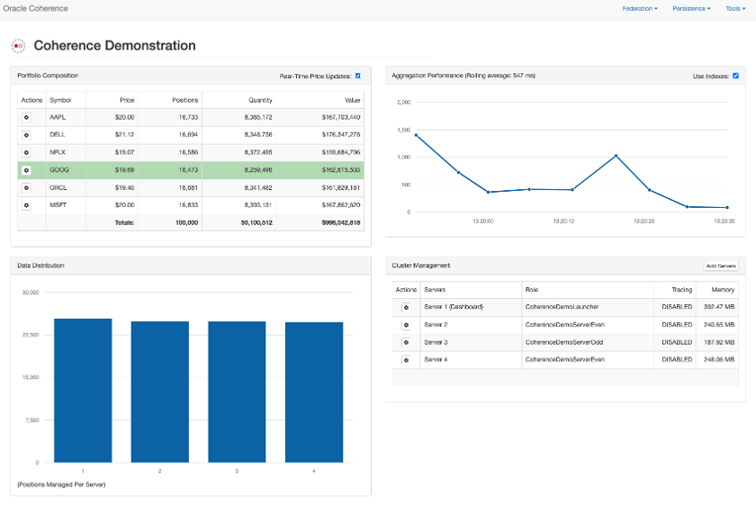

Estimated time: 10 minutes

### Objectives

In this lab, you will:

* Start the application
* Explore application “Insight”
* Add and split trades 
* Scale and shrink the Coherence cluster
* Listen for events

### Prerequisites
     
This lab assumes you have:

* An Oracle Free Tier(Trial), Paid or LiveLabs Cloud Account
* You have completed:
  * Lab: Prepare Setup (Free-tier and Paid Tenants only)
     
The following has already been setup in this VM:

1. The application has been cloned from the GitHub repository `https://github.com/coherence-community/coherence-demo`.
2. JDK21 and Maven version 3.8.8 has already been installed
3. The application has already been built using Maven

## Task 1: Start the Application
 
1. Open a new terminal and change to the `coherence-demo` directory and verify the environment.

      ```bash
      <copy>cd ~/coherence-demo
      mvn -v</copy>
      ```   
   
   You will have output similar to the following:

      ```bash
      Apache Maven 3.8.8 (4c87b05d9aedce574290d1acc98575ed5eb6cd39)
      Maven home: /home/opc/Downloads/apache-maven-3.8.8
      Java version: 21.0.5, vendor: Oracle Corporation, runtime: /usr/lib/jvm/jdk-21.0.5-oracle-x64
      Default locale: en_US, platform encoding: UTF-8
      OS name: "linux", version: "5.15.0-104.119.4.2.el8uek.x86_64", arch: "amd64", family: "unix"
      ```   

2. In the same terminal, issue the following command to start the application:

    ```bash
   <copy>mvn exec:exec -P grid-edition</copy>
   ```
   
   You should see a screen similar to the following showing the welcome message. Click `Close` to continue.

   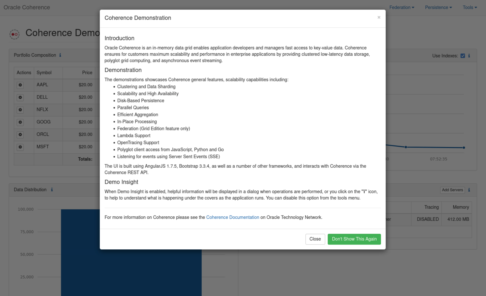

3. View the application home page. In the browser window, you will see four application panels.</br>

   **Portfolio Composition** shows the different stock symbols with fictitious prices.</br>
   **Aggregation Performance** shows the time taken to retrieve the aggregated data for the first panel.</br>
   **Data Distribution** shows the data distribution of the stock data amongst members.</br>
   **Cluster Management** shows the current members and allows you to start and stop members.</br> 
   
4. There are also three menus, **`Federation`**, **`Persistence`** and **`Tools`** that we explore later.

5. Use the **`Tools`** menu and select **`About`**. This will show a screen similar to the following with information about the application including the Coherence version.
   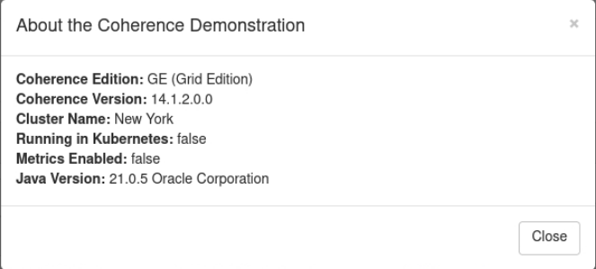


## Task 2: Explore application “Insight”

1. **"Insight"** Icons   
   Throughout the application, there are small **i** icons which allows you to view "Insight" into different application aspects.
   For example, the following insight icon on the "Portfolio Composition" panel, shows the code that is run to aggregate the portfolio.

   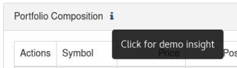

2. After each operation, such as adding trades or starting servers for example, "Insight" is also displayed to explain the operation or show relevant code.

3. If you wish to disable "Insight" entirely, choose **`Tools`** -> **`Disable Insight`**. You can re-enable it in the same menu.

## Task 3: Add and split trades
   
In this task we will add and split trades. 

1. Click the **`gear`** icon next to the **`ORCL`** stock and click **`Add Trades`**.

   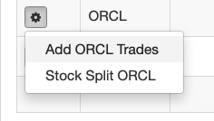

   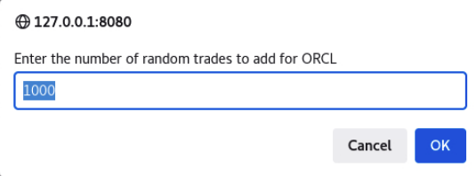

   You should see the number of trades increase to 101,000. 

2. In the same way, do a stock split for **`ORCL`** enter **`2`** as the factor. When this is complete, you will see a popup dialog showing the code that was run to split the trades. 

## Task 4: Scale and shrink the Coherence cluster
       
In this step we will scale the Coherence by an addition 3 members to a total of four members. When new storage members are added the cache data is automatically and transparently balanced amongst the available servers for high-availability and scalability. 

As this scaling is taking place, we can see that the data stays consistent and available when it is being balanced.

Each cache entry has a primary and at least one backup which is stored as far away from the primary as possible and always on a separate cache node. 

Depending upon your topology it may also be on a separate machine, rack or site to provide additional high-availability.
             
As more cache servers are added there is additional memory capacity as well as processing capacity allowing parallel queries to more efficiently run.

1. On the bottom right panel click **`Add Servers`** and enter **3** as the number of addition servers to add.
 
   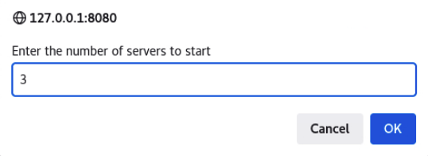

2. You will notice the data distribution changing and then finally stabilizing at 4 servers with each server holding an almost equal portion of the data.

   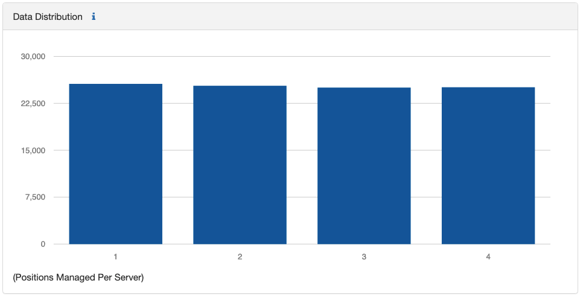
   
3. You will also see the time to perform the aggregation will reduce due to the addition cache server resources available to process the aggregations. 
      > Note: If you scale the servers too high in this VM environment, the times will not continue increasing due to CPU constraints.

4. Select **`Server 4`** on the bottom right panel and select **`Stop Server`**. This will terminate the server immediately simulating a failure. Coherence will automatically detect this failre and re-balance the data while the application is continuing without interruption keeping the data consistent. Any missing primary data will have their backups promoted to primary and new backups made for missing backups.

   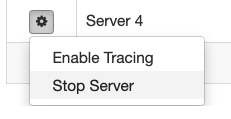
  
5. The updated distribution is shown below:

   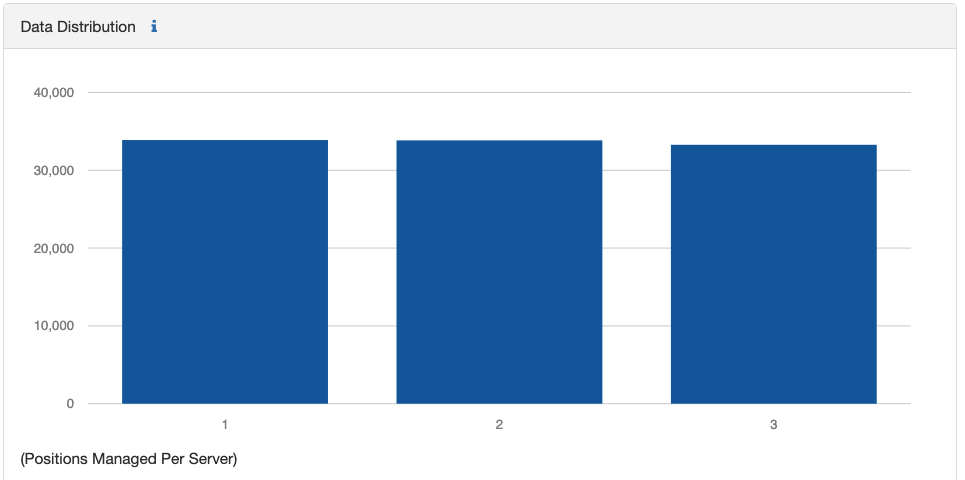

## Task 5: Listen for events
   
Coherence allows you to listen and response to cache entry inserts, updates and deletes for a specific key, a filter or all entries.

In the demo we enable random price updates and listen via a **"Map Listener"** and expose this over Server Sent Events (SSE) to the web client.

Map Listeners, in this example are written in Java code, but can also be applied using JavaScript, Python or Go.

See [here](https://github.com/coherence-community/coherence-demo/blob/cacf32ca2550032862cdf20bcef2b43c145b7794/src/main/java/com/oracle/coherence/demo/application/EventsResource.java#L66) for the source code for this event registration.
   
1. Click on the checkbox next to **`Real-time Price Updates`** to enable random stock price updates.
   
   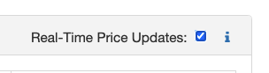

   You should now see the prices changing.

2. From **`Tools Menu`** choose **`Monitor Prices`**, this will open a new windows using **“Server Sent Events”**. You should see a window similar to the following:

   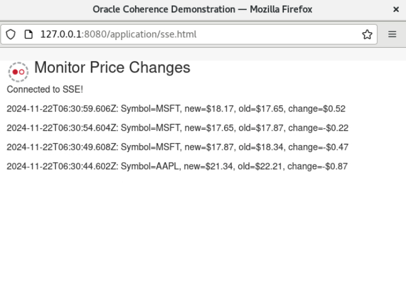

## Learn More
            
* [Coherence Demo Source](https://github.com/coherence-community/coherence-demo)
* [Coherence Operator for Kubernetes](https://github.com/oracle/coherence-operator)
* [Oracle Bedrock framework](https://github.com/coherence-community/oracle-bedrock)  

## Acknowledgements

* **Author** - Tim Middleton
* **Contributors** - Ankit Pandey, Sid Joshi
* **Last Updated By/Date** - Ankit Pandey, November 2024