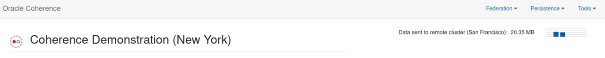
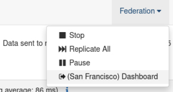
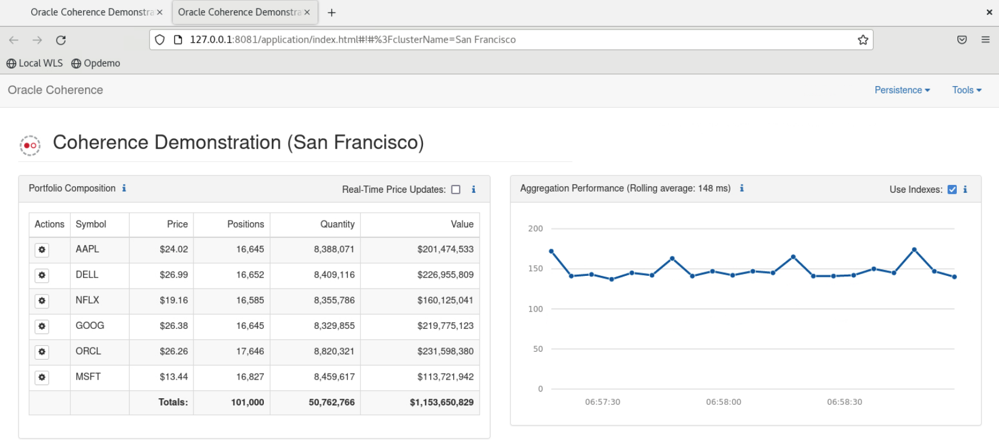
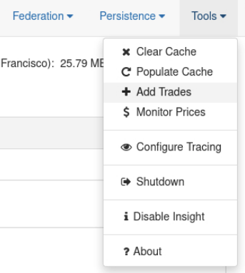
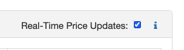

# Federate Data Between Clusters

## Introduction

This lab walks you through starting a secondary cluster and using federation to replicate data between the two clusters.

Federated caching federates cache data asynchronously across multiple geographically dispersed clusters. Cached data is federated across clusters to **provide redundancy**, **off-site backup**, and **multiple points of access** for application users in different geographical locations.

Estimated time: 10 minutes

### Objectives

In this lab, you will:

* Enable federation
* Open the secondary cluster
* Add data in both clusters 
* Enable price updates

### Prerequisite

* You should have completed the previous labs.

## Task 1: Start Federation

> *Note: Ensure you have disabled price updates before continuing*.

1. From the **`Federation`** menu, select **`Start Federation`**. After a short time you should see “Data sent to remote cluster..” and a cluster name appearing at the top as show here. The cluster name is chosen based upon your region location.
   
      > If you have **"Insight"** enabled, a dialog will be displayed showing how federation is setup in configuration only. No actual application code changes are required.

2. Select **`Dashboard`** on the **`Federation`** menu to open the secondary cluster dashboard. In our case the secondary cluster is "San Francisco".
   
   
      > You should see the same data on the secondary dashboard. Stop the price updates on the first cluster and see it should match.
 
      

## Task 2: Add Trades to the Primary Cluster

1. Switch back to the primary cluster dashboard and use **`Tools`** -> **`Add Trades`** to add 10,000 trades. You will see these be added to the secondary cluster.

   

2. Switch to the secondary cluster dashboard, and you will see the trades replicated to this cluster.

## Task 3: Add Trades to the Secondary Cluster

1. On the secondary cluster dashboard, use **`Tools`** -> **`Add Trades`** to add 5,000 trades. Because we have configured federation to be active-active, 
you will see these trades added to the primary cluster as well.

## Task 4: Enable Price Updates in the Primary Cluster

1. On the primary cluster, Click on the checkbox next to `Real-time Price Updates` to enable random stock price updates.
   
   

   You should now see the prices changing and also being replicated to the secondary cluster.

## Learn More

* [Federation Documentation](https://docs.oracle.com/en/middleware/standalone/coherence/14.1.1.2206/administer/federating-caches-clusters.html)

## Acknowledgements

* **Author** - Tim Middleton
* **Contributors** - Ankit Pandey, Sid Joshi
* **Last Updated By/Date** - Ankit Pandey, November 2024