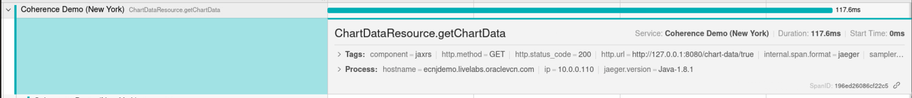

# Gain Insight through OpenTelemetry or OpenTracing APIs

## Introduction
      
This lab will walk you through using OpenTracing to gain visibility in cache operations from the UI, to the cache server and all the way through to the cache store write.

Coherence does not include any tracing implementation libraries. Therefore, the developer needs to provide the desired tracing runtime. Since OpenTracing is no longer maintained, Oracle recommends that you use OpenTelemetry. A minimum version of OpenTelemetry for Java version 1.29 is recommended. Even though OpenTracing is deprecated in Coherence, it is still a supported option when using the latest OpenTracing 0.33.0.

Estimated time: 10 minutes

### Objectives

In this lab, you will:

* Start the Jaegar Docker image
* Enable tracing in the primary cluster
* Trace the update price operation from the JAX-RS endpoint through the cache and to the Database

### Prerequisites

* You should have completed the previous labs.

## Task 1: Start the Jaegar Docker Image 
   
1. Click on the checkbox next to **`Real-time Price Updates`** to enable random stock price updates.

2. Open a new terminal by using **`File`** -> **`New Tab`** in the existing terminal.

3. Start the Jaegar image using the following command:

      ```bash
      <copy>docker run --rm -d --name jaeger \
         -e COLLECTOR_ZIPKIN_HTTP_PORT=9411 \
         -p 5775:5775/udp \
         -p 6831:6831/udp \
         -p 6832:6832/udp \
         -p 5778:5778 \
         -p 16686:16686 \
         -p 14268:14268 \
         -p 9411:9411 \
         jaegertracing/all-in-one:1.20</copy>
      ```
   
## Task 2: Configure Tracing on the Primary Cluster
  
1. Access the primary cluster console and choose **`Tools`** -> **`Configure Tracing`**, and then choose **`Enable Tracing for Cluster`**.

   
      
2. You should see in the bottom right panel that tracing has been enabled for each cluster member. 

   
      
      > Note: Wait a few minutes to ensure tracing has been picked up by the Docker image.
   
## Task 3: Search for Traces

1. Open the Jaegar console at `http://localhost:16686`.
      ```bash
      <copy>http://localhost:16686</copy>
      ```

      

2. Select your primary cluster service (Cluster) name and choose operation **`CharDataSource.getChartData`** and click **`Find Traces`**:
      
   The **`CharDataSource.getChartData`** is the JAX-RS endpoint that will update prices on each refresh when real-time price updates are enabled. 
  
   

3. Select the first trace in the list:

   
   
4. Narrow down the time by dragging and selecting the light blue panel just below the **"Trace Start"** message.
    
   

## Task 4: Inspect and Understand the Traces

> *Note: If you don't see the traces as described below, wait a few minutes and ensure you have enabled price updates.*
  
For this task there is a number, e.g.`[1]` in a square bracket on the image below the corresponds to each of the steps below:

   

1. Select **`CharDataSource.getChartData`** and this will show the details of the JAX-RS endpoint request as shown below:

  
 
2. Click on **`Utilities.UpdatePrices`** and then **`Invoke.request`** and expand the **`Tags`** on the **`Invoke.request`**. This shows</br>
   The invocation of the entry processor to do the price updates. Entry processors allow you to send processing to where
   the data is rather than retrieving the data. This is much more efficient as you are not sending and receiving the data, just the logic to process it.
  
   

   From the above you can see the invoke request was processed on member 1. This may be different in your environment.

3. Click on the **`Invoke.process`** and expand the **`Tags`**. This shows where the invocation actually executed and is where the primary data resides. This may be any of the members but in our case is also member 1:

  

4. Expand the **`BackupAll.request`** and the **`BackupAll.process`**. 

      > The **`BackupAll.request`** is the member on which the primary data resides and this member requests the backup. In our case, member 1. 
      The **`BackupAll.process`** is where the backup is processed and located, which in our case is member 2. </br>
      This shows how Coherence will not locate the primary and backup data in the same place to ensure high-availability.
      
      

5. Expand the **`cachestore.store`** and **`Udpate`** which shows the cache entries being written to a database.</br>
      For this cache we have a **`Cache Store`** defined, which allows us to keep the database and cache in sync. In this case we have
      an in memory DB for convenience, but this could be any JDBC compliant database.
      
      

      > Note: We can see the SQL statement being executed on member 1 where the primary data resides. 

## Learn More

* [Peek into Coherence using OpenTracing - Blog](https://blogs.oracle.com/oraclecoherence/post/peek-inside-coherence-with-opentracing)
* [Coherence and OpenTracing - Documentation](https://docs.oracle.com/en/middleware/standalone/coherence/14.1.2.0/develop-applications/debugging-coherence.html)
* [Caching Data Sources](https://docs.oracle.com/en/middleware/standalone/coherence/14.1.2.0/develop-applications/caching-data-sources.htm)   

## Acknowledgements

* **Author** - Tim Middleton
* **Contributors** - Ankit Pandey, Sid Joshi
* **Last Updated By/Date** - Ankit Pandey, December 2024