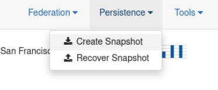

# Work with Persistence

## Introduction

This lab will walk you through using Persistence with Coherence.

Coherence persistence is a set of tools and technologies that manage the persistence and recovery of 
Coherence distributed caches. Cached data is persisted so that it can be quickly recovered after a 
catastrophic failure or after a cluster restart due to planned maintenance. Persistence and federated caching can be used together as required.

Estimated time: 10 minutes

### Objectives

In this lab, you will:

* Create a snapshot of the cache data
* Clear the cache data
* Recover the snapshot
* Replicate data to the secondary cluster

### Prerequisites

* You should have completed the previous labs.

## Task 1: Create a Snapshot
 
1. Switch to the primary cluster dashboard and use **`Persistence`** -> **`Create Snapshot`** to create a snapshot of the current cache data.
   Wait for confirmation that the snapshot has been created before continuing.  Note the count of the `Positions`.

      

      > Note: Coherence will ensure that the data in the snapshot is consistent.

## Task 2: Clear the primary data

1. Use **`Tools`** -> **`Clear Cache`** to remove the cache data from the primary cluster. As we have federation configured, this will be replicated to the secondary cluster.

   

      > Note: Confirm that the data has also been removed from the secondary cluster.

## Task 3: Recover the Snapshot

1. Switch to the primary cluster dashboard and use **`Persistence`** -> **`Recover Snapshot`** to recover the snapshot data.
     
   Once the data has been recovered, you will see the updated data in the dashboard.

2. To ensure that the secondary cluster is updated after recovering a snapshot, you need to re-enable federation by selecting **`Federation`** -> **'Replicate All`**.

   Confirm that the secondary cluster data has also been updated.            

## Learn More

* [Coherence Persistence Documentation](https://docs.oracle.com/en/middleware/standalone/coherence/14.1.2.0/administer/persisting-caches.html)

## Acknowledgements

* **Author** - Tim Middleton
* **Contributors** - Ankit Pandey, Sid Joshi
* **Last Updated By/Date** - Ankit Pandey, November 2024