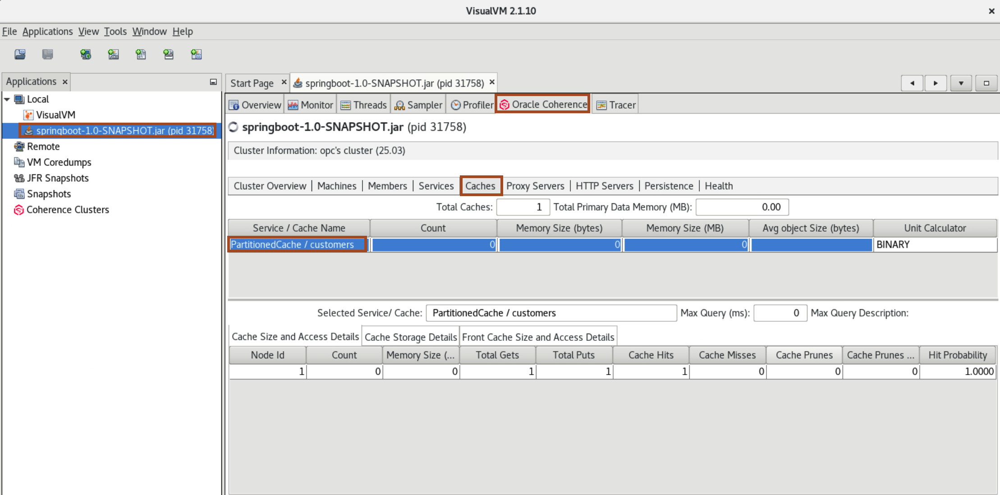
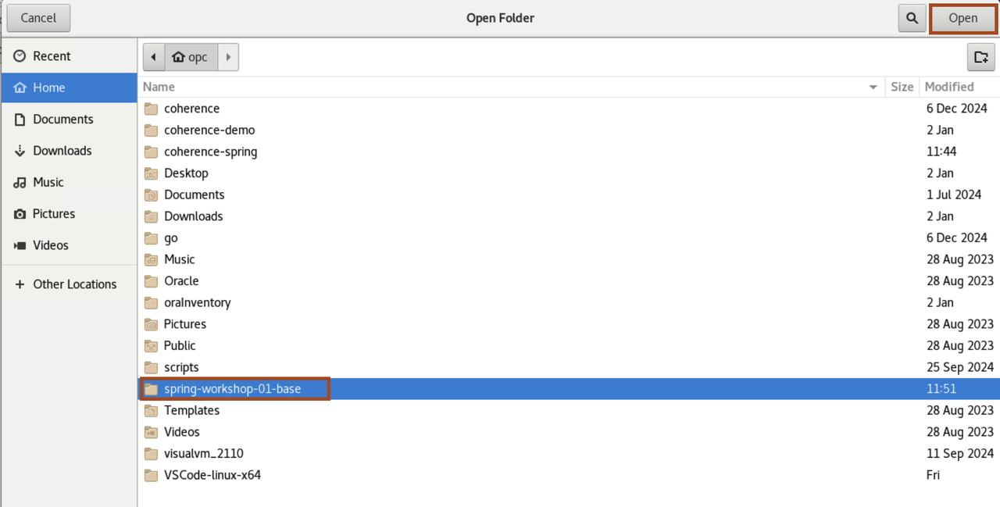

# Coherence application with Spring Framework

## Introduction

This section starts with a simple application configured with Coherence using the [Spring Framework](https://spring.io/projects/spring-framework).
We will extend this application with various Coherence features and explain how they are used.

Estimated time: 30 minutes

### Objectives

In this lab, you will:

* Run the simple REST application
* Understand the configuration and code

### Prerequisites

* You should have completed the previous labs.

    > Note: Make sure you have stopped all Java processes from the previous lab.

## Task 1: Build and run the simple example

1. Open a new terminal and change to the `spring-workshop` directory and verify the environment.

    ```bash
    <copy>cd ~/spring-workshop-01-base/
    mvn -v</copy>
    ```   
   
    You will have output similar to the following:

    ```bash
    Apache Maven 3.8.8 (4c87b05d9aedce574290d1acc98575ed5eb6cd39)
    Maven home: /home/opc/Downloads/apache-maven-3.8.8
    Java version: 21.0.5, vendor: Oracle Corporation, runtime: /usr/lib/jvm/jdk-21.0.5-oracle-x64
    Default locale: en_US, platform encoding: UTF-8
    OS name: "linux", version: "5.15.0-104.119.4.2.el8uek.x86_64", arch: "amd64", family: "unix"
    ```   

2. In the same terminal, issue the following command to build the application:
    ```bash
    <copy>mvn clean install -DskipTests</copy>
    ```

3. In the same terminal, run the following command to start the application:

    ```bash
    <copy>java -jar target/springboot-1.0-SNAPSHOT.jar</copy>
    ```

    You should see output similar to the following indicating that the sample is running:

    ```bash
    2025-01-21T10:12:51.315+08:00  INFO 12338 --- [           main] o.s.b.a.e.web.EndpointLinksResolver      : Exposing 1 endpoint beneath base path '/actuator'
    2025-01-21T10:12:51.353+08:00  INFO 12338 --- [           main] o.s.b.w.embedded.tomcat.TomcatWebServer  : Tomcat started on port 8080 (http) with context path '/'
    2025-01-21T10:12:51.366+08:00  INFO 12338 --- [           main] c.o.c.d.f.springboot.DemoApplication     : Started DemoApplication in 8.858 seconds (process running for 9.422)
    ``` 

4. In a new terminal window, run the following command to insert a customer.

    ```bash
    <copy>curl -X POST -H "Content-Type: application/json" -d '{"id": 1, "name": "Tim", "balance": 1000}' http://localhost:8080/api/customers</copy>
    ```

5. Run the following command to retrieve a customer.

    ```bash
    <copy>curl http://localhost:8080/api/customers/1</copy>
    ```   
   
    You should see an output similar to the following indicating that the customer has been retrieved:

    ```json 
    {"id":1,"name":"Tim","balance":1000.0}
    ```  
     
6. Run the following command to delete a customer.

    ```bash
    <copy>curl -X DELETE http://localhost:8080/api/customers/1</copy>
    ```   
   
    You should see an output similar to the following showing the deleted customer.

    ```json 
    {"id":1,"name":"Tim","balance":1000.0}
    ```  
   
    > Note: You can verify the customer's cache by using VisualVM as we did in the previous lab. Ensure that you close the tab you opened with the previous process and double-click on the new (`springboot-1.0-SNAPSHOT.jar`) process.
      
   
7. Use `CTRL-C` to quit the Spring Boot application before you move to the next task.

    > Note: In this simple example we are running the application as a single storage-enabled member meaning that the application is serving JAX-RS endpoints as well as storing data. This is fine for a demo application, but typical applications usually have a separate tier of storage-enabled clients, and the application is storage-disabled and allows for scaling of both the client and coherence cluster tiers.

## Task 2: Understand the simple application dependencies

 In this task, we will cover the dependencies required for the simple application. You can refer to the file `~/spring-workshop-01-base/pom.xml` for the full contents.

1. Click **Activites** and Click icon for **Visual Studio Code**.
    

2. In **VS Code**, click **File** -> **Open Folder**.

3. Select **spring-workshop-01-base** and click **Open**.
    

4. Click **Yes, I trust the authors**, to open the folder.


5. In the **`pom.xml`** we define the parent pom to be **`spring-boot-starter-parent`**, as this will bring in the required spring boot dependencies.

      ```xml
      <parent>
       <groupId>org.springframework.boot</groupId>
       <artifactId>spring-boot-starter-parent</artifactId>
        <version>3.4.3</version>
       <relativePath/>
      </parent>
      ```
    
2. We then define the name of this project and the **`properties`** for other dependencies:

      ```xml
      <groupId>com.oracle.coherence.demo.workshops</groupId>
      <artifactId>springboot</artifactId>
      <version>1.0-SNAPSHOT</version>
      <name>demo</name>
      <description>Demo project for Spring Boot and Coherence</description>

      <properties>
        <java.version>21</java.version>
        <coherence.version>25.03</coherence.version>
        <coherence.group.id>com.oracle.coherence.ce</coherence.group.id>
        <coherence-spring.version>4.3.0</coherence-spring.version>
      </properties>
     ```
 
3. The **`spring-boot-starter-web`** artifact is included to provide the basic REST and Tomcat app server.

    ```xml
      <dependency>
        <groupId>org.springframework.boot</groupId>
        <artifactId>spring-boot-starter-web</artifactId>
      </dependency>
    ```          
      
4. Include the Coherence dependencies:

    ```xml
      <dependency>
        <groupId>com.oracle.coherence.spring</groupId>
        <artifactId>coherence-spring-boot-starter</artifactId>
        <version>${coherence-spring.version}</version>
      </dependency>
      <dependency>
        <groupId>${coherence.group.id}</groupId>
        <version>${coherence.version}</version>
        <artifactId>coherence</artifactId>
      </dependency>
      <dependency>
        <groupId>${coherence.group.id}</groupId>
        <version>${coherence.version}</version>
        <artifactId>coherence-json</artifactId>
      </dependency>
    ``` 
      
    > Note: **`coherence-spring-boot-starter`** is required for autoconfiguration and Coherence spring boot support, **`coherence`** is the core component and **`coherence-json`** is not technically required, but is needed to enable management API over REST.   

5. Finally, we include the plugin dependencies for **`spring-boot-maven-plugin`** and the **`pof-maven-plugin`** that automatically instruments the POJO's with Coherence POF serialization. 

    ```xml
      <build>
        <plugins>
          <plugin>
            <groupId>org.springframework.boot</groupId>
            <artifactId>spring-boot-maven-plugin</artifactId>
          </plugin>

          <plugin>
            <groupId>${coherence.group.id}</groupId>
            <version>${coherence.version}</version>
            <artifactId>pof-maven-plugin</artifactId>
            <executions>
              <execution>
                <id>instrument</id>
                <goals>
                  <goal>instrument</goal>
                </goals>
              </execution>
              <execution>
                <id>instrument-tests</id>
                <goals>
                  <goal>instrument-tests</goal>
                </goals>
              </execution>
            </executions>
          </plugin>
        </plugins>
      </build>
    ```
      
## Task 3: Understand the simple application config and code

In this task, we will cover the application configuration and code.

1. The file **`src/main/resources/application.properties`** contains any system properties we want the application to use:

    ```properties 
    # Common Coherence system properties
    # Enables POF serialization
    coherence.pof.enabled=true
    # Confine Coherence to the current server
    coherence.wka=127.0.0.1
    # Enable management
    coherence.management.http=all
    ```
  
 The three properties are explained below: 

  **`coherence.pof.enabled=true`** enables serialization using Coherence's Portable Object Format (POF). POF is a language-agnostic binary format. POF is efficient in both space and time and is a cornerstone technology in Coherence. See [the documentation](https://docs.oracle.com/en/middleware/fusion-middleware/coherence/14.1.2/develop-applications/using-portable-object-format.html) for more information.</br>
  **`coherence.wka=127.0.0.1`** restricts the Coherence cluster traffic to the localhost only. The loopback address is just used for demonstration purposes and would not be used in production.</br>
  **`coherence.management.http=all`** This is not mandatory, but if set to `all`, enables Coherence management over REST api.</br>

2. The Customer class **(`./src/main/java/com/oracle/coherence/demo/frameworks/springboot/Customer.java`)** is used to store customer information in the cache. The getter/setter and object methods have been left out for brevity.

    ```java 
     @PortableType(id = 1000)
     @JsonIgnoreProperties(value = { "evolvable", "evolvableHolder", "empty" })
      public class Customer {
     @JsonProperty("id")
          private int id;

     @JsonProperty("name")
          private String name;

     @JsonProperty("balance")
          private double balance;

         public Customer() {}
    ```
      
      > Note: The `@PortableType` annotation indicates that this class should be instrumented by the `pof-maven-plugin` during build to use POF serialization.

3. Demonstration application and Controller

    The **`./src/main/java/com/oracle/coherence/demo/frameworks/springboot/DemoApplication.java`** is a standard Spring Boot application entry point.

    ```java
     @SpringBootApplication
      public class DemoApplication {
        public static void main(String[] args) {
          SpringApplication.run(DemoApplication.class, args);
      }
    } 
    ```  
      
   The **`./src/main/java/com/oracle/coherence/demo/frameworks/springboot/controller/DemoController.java`** class is a JAX-RS application using Coherence.

    ```java
      @RestController
      @RequestMapping(path = "/api/customers")
        public class DemoController {
      
      @CoherenceCache
            private NamedCache<Integer, Customer> customers;

      @GetMapping
            public Collection<Customer> getCustomers() {
                return customers.values();
      }

      @PostMapping
            public ResponseEntity<Void> createCustomer(@RequestBody Customer customer) {
                customers.put(customer.getId(), customer);
                return ResponseEntity.accepted().build();
      }

      @GetMapping("/{id}")
            public ResponseEntity<Customer> getCustomer(@PathVariable int id) {
                Customer customer = customers.get(id);
                return customer == null ? ResponseEntity.notFound().build() : ResponseEntity.ok(customer);
      }

      @DeleteMapping("/{id}")
            public void removeCustomer(@PathVariable int id) {
                customers.remove(id);
      }
    }
    ```

    > Note: The **`@CoherenceCache`** annotation injects and **`NamedCache**`** with key of **`Integer`** and value of **`Customer`**. When using basic cache operations they are the same as **`Map`** operations. For example **`values()`**, **`put()`** and **`remove()`**.

## Learn More
            
* [Using Portable Object Format](https://docs.oracle.com/en/middleware/fusion-middleware/coherence/14.1.2/develop-applications/using-portable-object-format.html)

## Acknowledgements

* **Author** - Tim Middleton
* **Contributors** - Ankit Pandey, Sid Joshi
* **Last Updated By/Date** - Ankit Pandey, April 2025