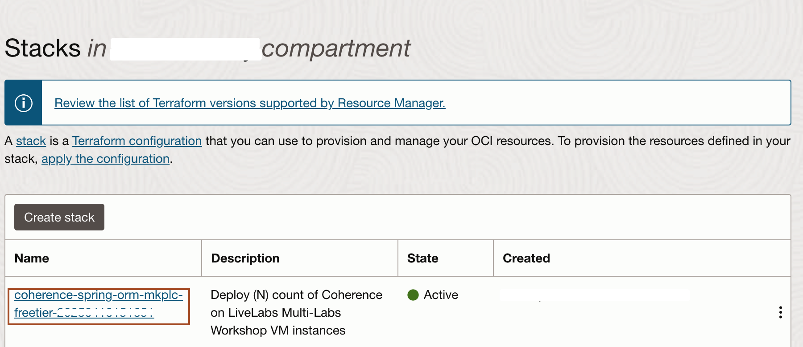
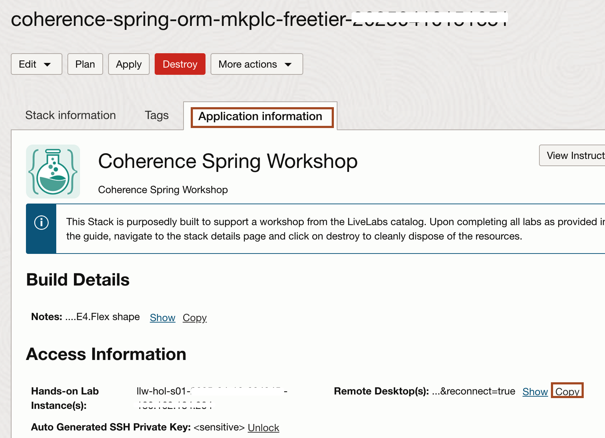

# Prepare Setup

## Introduction
This lab will show you how to download the Oracle Resource Manager (ORM) stack zip file needed to setup the resource needed to run this workshop. Then you creates a compute instance and a Virtual Cloud Network (VCN) which provides you access to a remote desktop.

Estimated Time: 10 minutes

### Objectives
* Download ORM stack
* Create Compute + Networking using Resource Manager Stack

### Prerequisites
This lab assumes you have:
- An Oracle Free Tier or Paid Cloud account

## Task 1: Download Oracle Resource Manager (ORM) stack zip file

1.  Click on the link below to download the Resource Manager zip file you need to build your environment:

    *Note 1:* If providing a single Stack download for the workshop, use this simple expression.

    - [coherence-spring-orm-mkplc-freetier.zip](https://objectstorage.uk-london-1.oraclecloud.com/p/kMBsZA_MflmKFonXrY-f6jv24vCuuXwML9tH1UG5tc0gJcqspUctypgj1v12Tc0i/n/lrv4zdykjqrj/b/ankit-bucket/o/coherence-spring-orm-mkplc-freetier.zip)

2.  Save in your downloads folder.

## Task 2: Create Stack: Compute + Networking

1. Identify the ORM stack zip file downloaded in **Task 1: Download Oracle Resource Manager (ORM) stack zip file**.

2. Open up the hamburger menu in the top left corner. Click **Developer Services**, and choose **Resource Manager** > **Stacks**. Choose the compartment in which you would like to install the stack. Click **Create Stack**.
    
    


3. Select **My Configuration**, choose the **.Zip** file button, click the **Browse** link, and select the zip file that you downloaded or drag-n-drop for the file explorer. Click **Next**.
    

4. Enter or select the following and click **Next**.

    **Instance Count:** Accept the default, 1.

    **Select Availability Domain:** Select an availability domain from the dropdown list.

    **Need Remote Access via SSH?** Keep Unchecked for Remote Desktop only Access - The Default.

    **Use Flexible Instance Shape with Adjustable OCPU Count?:** Keep the default as checked (unless you plan on using a fixed shape).

    **Instance Shape:** Keep the default or select from the list of Flex shapes in the dropdown menu (e.g VM.Standard.E4.Flex).

    **Select OCPUs Count per Instance:** Accept the default shown. e.g. (2) will provision 2 OCPUs and 32GB of memory. 

    **Use Existing VCN?:** Accept the default by leaving this unchecked. This will create a new VCN.
    
    


7. Select **Run Apply** and click **Create**.
    


## Task 3: Access the Graphical Remote Desktop

For ease of execution of this workshop, your VM instance has been pre-configured with a remote graphical desktop accessible using any modern browser on your laptop or workstation. Proceed as detailed below to log in.

1. Open up the hamburger menu in the top left corner. Click **Developer Services**, and choose **Resource Manager** > **Stacks**.

2. Click on the stack name which you have createed in Task 2.
    

3. Navigate to **Application Information** tab, and copy **Remote Desktop URL** and paste it in new browser tab.
    
    
    > Now you need to follow all the instruction inside this remote desktop.


## Task 4: Download and Install the required resources for the workshop

In this task, we download the required softwares and application source code for this workshop.

1. To open terminal in the Remote Desktop, Click **Activities** -> **Terminal**.
    

2. Copy and paste the following commands in the terminal, It will download the basic coherence-spring application source code, clone the **coherence-community** git repository, download and launch the **visualVM**, download and launch the **Visual Studio Code** in this Machine.
    ```bash
    <copy>cd ~
    curl -O https://objectstorage.uk-london-1.oraclecloud.com/p/2XfYETeWU9wsyxHXqkEr3Tx_YUh-70R1spaEhqbH_g6Rr2J4msOX11V_KC5lqhGH/n/lrv4zdykjqrj/b/ankit-bucket/o/spring-workshop.zip
    unzip ~/spring-workshop.zip
    git clone https://github.com/coherence-community/coherence-spring.git
    cd ~/coherence-spring
    git checkout coh-spring-lab
    wget https://github.com/oracle/visualvm/releases/download/2.1.10/visualvm_2110.zip
    unzip ~/visualvm_2110.zip
    ./visualvm_2110/bin/visualvm > visual_log.txt 2>&1 &
    curl -L -o vs-code.tar.gz "https://code.visualstudio.com/sha/download?build=stable&os=linux-x64"
    tar -xvf ~/vs-code.tar.gz
    ./VSCode-linux-x64/bin/code > vs-code_log.txt 2>&1 &
    cd ~</copy>
    ```

3. In the **VisualVM License Agreement**, Click **I Accept**.
    

4. For the **Visual Studio Code**, Enter the password **welcome1** to unlock.
    


## Task 5: Install VisualVM-Coherence Plugin in the VisualVM

1. In the VisualVM, Click **Tools** -> **Plugins** from the menu.


2. The Plugin will be displayed as **VisualVM-Coherence**. If it is not present in the list then click on the Check for Newest button.


3. In the **Available Plugins** tab, select the **Install** checkbox for the **VisualVM-Coherence**. Click **Install**.
    

4. Step through and complete the plugin installer.
    

5. Select **Restart Now** and click **Finish**.
    

    > For more information about using the Coherence VisualVM plugin see the official [Coherence Documentation](https://docs.oracle.com/en/middleware/standalone/coherence/14.1.1.2206/manage/using-jmx-manage-oracle-coherence.html).

You may now proceed to the next lab.

## Acknowledgements
* **Author** -  Ankit Pandey
* **Contributors** - Maciej Gruszka, Sid Joshi
* **Last Updated By/Date** - Ankit Pandey, January 2025
