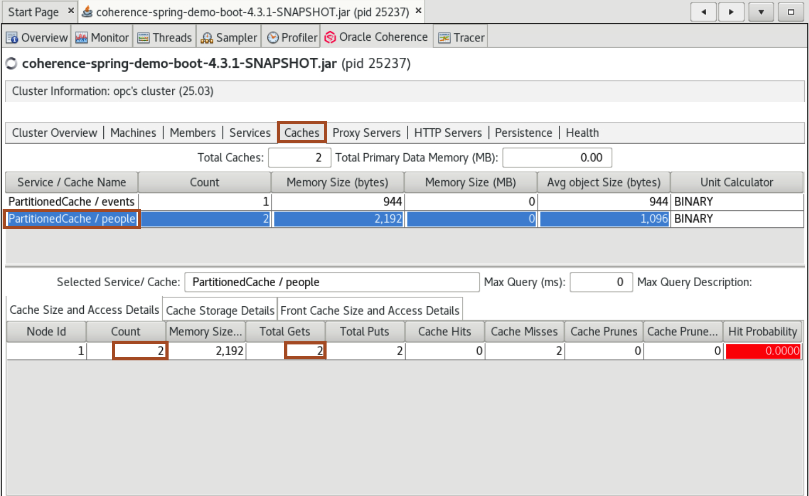

# Run the Spring Boot Quick Start Demo
         

## Introduction

This lab walks you through getting setup with Coherence Spring and running the quick start demo application 
which uses Spring's [Cache Abstraction](https://docs.spring.io/spring-framework/reference/integration/cache.html) for result caching. 

In this lab, we will look at a demo to illustrate the basic usage of Oracle Coherence when using it with Spring. This demo provides an example of using **Coherence Spring’s Cache Abstraction**.

The demo application is basically a super-simple event manager. We can create Events and assign People to them using an exposed REST API. 
The data is saved in an **embedded HSQL database**. The caching is implemented at the service layer.

When an Event is created, it is not only persisted in the database but also put into the Coherence Cache. 
Therefore, whenever an Event is retrieved, it will be returned from the Coherence Cache. You can also delete Events, in which case the Event will be evicted from the cache. You can perform the same CRUD operations for people as well.

Estimated time: 15 minutes

### Objectives

In this lab, you will:

* Build the coherence-spring-demo
* Understand how Spring Cache Abstraction is implemented
* Run the Spring Boot demo application
      
      > Note: There are more efficient ways to integrate Coherence with databases using cache stores, but this is just to show how the out-of-the-box Cache Abstraction works with Spring and Coherence.

### Prerequisites
     
This lab assumes you have the following:

* An Oracle  Account
* You have completed Lab 1: Prepare Setup (Free-tier and Paid Tenants only)


## Task 1: Build the Coherence Spring Demo Sample

1. Open a new tab in the terminal and change to the **`coherence-spring/samples/coherence-spring-demo`** directory and verify the environment.
      ```bash
      <copy>cd ~/coherence-spring/samples/coherence-spring-demo
      mvn -v</copy>
      ```   
   
      You will have output similar to the following:

      ```bash
      Apache Maven 3.8.8 (4c87b05d9aedce574290d1acc98575ed5eb6cd39)
      Maven home: /home/opc/Downloads/apache-maven-3.8.8
      Java version: 21.0.5, vendor: Oracle Corporation, runtime: /usr/lib/jvm/jdk-21.0.5-oracle-x64
      Default locale: en_US, platform encoding: UTF-8
      OS name: "linux", version: "5.15.0-104.119.4.2.el8uek.x86_64", arch: "amd64", family: "unix"
      ```   

2. In the same terminal, issue the following command to **start the application**:
      ```bash
      <copy>mvn clean install -DskipTests</copy>
      ```
   
      You should see output similar to the following indicating that the sample has been built:

      ```bash
      [INFO] Reactor Summary for Coherence Spring Demo - Parent 4.3.1-SNAPSHOT:
      [INFO]
      [INFO] Coherence Spring Demo - Parent ..................... SUCCESS [  1.754 s]
      [INFO] Coherence Spring Demo - Core ....................... SUCCESS [  4.057 s]
      [INFO] Coherence Spring Demo - Classic Spring Framework ... SUCCESS [ 16.670 s]
      [INFO] Coherence Spring Demo - Spring Boot ................ SUCCESS [ 24.166 s]
      [INFO] ------------------------------------------------------------------------
      [INFO] BUILD SUCCESS
      [INFO] ------------------------------------------------------------------------
      [INFO] Total time:  47.823 s
      [INFO] Finished at: 2025-01-15T10:32:35+08:00
      [INFO] ------------------------------------------------------------------------
      ``` 
     
3. In the above output you can see **three submodules**: 
            
   * **Coherence Spring Demo - Core (coherence-spring-demo-core)** - Contains common code shared between the following two apps
   * **Coherence Spring Demo - Spring Boot (coherence-spring-demo-boot)** - Provides a demo using Spring Boot
   * **Coherence Spring Demo - Classic Spring Framework (coherence-spring-demo-classic)** - Provides a demo using Spring Framework without Spring Boot - **We will not be running this demo**
                     

## Task 2: Run The Spring Boot Demo Application

1. In the existing terminal, ensure you are in the **`~/coherence-spring/samples/coherence-spring-demo`** directory and run the application.

      ```bash
      <copy>java -Dcoherence.wka=127.0.0.1 -jar coherence-spring-demo-boot/target/coherence-spring-demo-boot-4.3.1-SNAPSHOT.jar</copy>
      ```                            
   
      > Note: We specify **`-Dcoherence.wka=127.0.0.1`** to ensure the Coherence cluster is confined to the local machine.

## Task 3: Add events and verify the Coherence cache

1. Open a new terminal tab by using **`File`** -> **`New Tab`** and use **`curl`** to create an event

      ```bash
     <copy>curl --request POST 'http://localhost:8080/api/events?title=First%20Event&date=2025-01-30'</copy>
      ```   

      You should see output similar to the following indicating that the Event has been stored.

      ```json
         {
            "id" : 1,
            "title" : "First Event",
            "date" : "2025-01-30T00:00:00.000+00:00"
         }
      ```  
   
      This call will create and persist an Event in the database. However, there is more going on. 
      The created Event is also added to the Coherence Cache. The magic is happening in the Service layer, 
      specifically in [DefaultEventService#createAndStoreEvent()](https://github.com/coherence-community/coherence-spring/blob/b285ad6ff3eb80e4d6530f91aae991fb69f6dd65/samples/coherence-spring-demo/coherence-spring-demo-core/src/main/java/com/oracle/coherence/spring/demo/service/impl/DefaultEventService.java#L43), shown below, which is annotated with `@CachePut(cacheNames="events", key="#result.id")`.

      ```java
         @CachePut(cacheNames="events", key="#result.id")
         @Override
            public Event createAndStoreEvent(String title, Date date) {
               final Event event = new Event();
      event.setTitle(title);
      event.setDate(date);

      final Event savedEvent = this.eventRepository.save(event);
      return savedEvent;
      }
      ```  
   
      The cacheNames attribute of the **`@CachePut`** annotation indicates the name of the underlying cache to use. 
      As caches are basically just a Map (partitioned across many nodes), we also need a key. In this case, we 
      use the expression **`#result.id`** to retrieve the primary key of the Event as it persisted. Thus, 
      the saved Event is added to the cache named events and ultimately also returned and printed to the console.
     
      > Note: We will cover the code in more detail further down in this lab.
   
2. Verify the data is in the Coherence cache by the VisualVM tool. You should see a screen similar to the following: 
      

3. Open **`Tools`** -> **`Options`** and click on the **`Coherence`** tab. Confirm the **`Data Refresh Time`** is 7 seconds and click on **`OK`**. Setting this value to a lower value than the default of 30 seconds, means the VisualVM plugin retrieves data more often from the Coherence cluster. In production environments, the default of 30 is sufficient so as not to place additional load on the cluster. 
      

3. Double-click the **`coherence-spring-demo-boot-4.3.1-SNAPSHOT.jar`** process, and select the **`Coherence Tab`**.  You may need to expand the window to see the full tab.
      

4. Click on the **`Caches`** sub-tab and then select **`PartitionedCache / events`** and you will see there is **one entry** and there has been one put which was done automatically via the Cache Abstraction API.
      


5. Retrieve the event using the following:
  
      ```bash
      <copy>curl --request GET 'http://localhost:8080/api/events/1'</copy>
      ```   

      You should see an output similar to the following indicating that the Event has been retrieve.

      ```json
      {
         "id" : 1,
         "title" : "First Event",
         "date" : "2025-01-30T00:00:00.000+00:00"
      }
      ```   
   
      If you check VisualVM, you will see that the number of gets is now **one**, which means it was retrieved from the Cache. 
      You should also see no SQL statement being shown on the **application log** as well confirming this.
 
      > Note: For this example, we are only using an **in-memory database**, but you can imagine if your database call takes 10-20ms, then returning the data from the cache instead of the database, significantly reduces the access time and takes a load off the backend database.
      

6. Delete or evict the event using the following:
  
      ```bash
      <copy>curl --request DELETE 'http://localhost:8080/api/events/1'</copy>
      ```
   
      If you check VisualVM, you will see that the count of entries in the cache is now **zero**.
      

7. Retrieve the entry again, and you will see that the number of cache entries is now one, and you can see the SQL to load the event from the DB and then it is placed in the cache.
  
      ```bash
      <copy>curl --request GET 'http://localhost:8080/api/events/1'</copy>
      ```
   
      If you check VisualVM, you will see that the count of entries in the cache is now **one**.
      
      

## Task 4: Add people and verify the Coherence cache

1. In an existing terminal, run the following two curl commands to add two people:

      ```bash
      <copy>curl --request POST 'http://localhost:8080/api/people?firstName=Conrad&lastName=Zuse&age=85'
      curl --request POST 'http://localhost:8080/api/people?firstName=Alan&lastName=Turing&age=41'</copy>
      ```   

      > Note: Only the `GET /api/people/id` method is cached (unlike the events API). This can be seen in the code [DefaultPersonService#getPerson()](https://github.com/coherence-community/coherence-spring/blob/b285ad6ff3eb80e4d6530f91aae991fb69f6dd65/samples/coherence-spring-demo/coherence-spring-demo-core/src/main/java/com/oracle/coherence/spring/demo/service/impl/DefaultPersonService.java#L51) as shown below.

      ```java
      @Cacheable(cacheNames="people", key="#personId")
      @Override
         public Person getPerson(Long personId) {
            return this.personRepository.findById(personId).get();
      }
      ```

2. Issue the following two curl requests to get both people:

      ```bash
      <copy>curl --request GET 'http://localhost:8080/api/people/1'
      curl --request GET 'http://localhost:8080/api/people/2'</copy>
      ```   
   
3. Check VisualVM and confirm that there are two entries for the people cache.
      

4. In an existing terminal, run the following curl command to add a third person:

      ```bash
      <copy>curl --request POST 'http://localhost:8080/api/people?firstName=James&lastName=Bond&age=66'</copy>
      ```     
         
5. To show how caching will improve application performance, issue the following to time and get third person thrice:

      ```bash
      <copy>time curl --request GET 'http://localhost:8080/api/people/3'
      time curl --request GET 'http://localhost:8080/api/people/3'
      time curl --request GET 'http://localhost:8080/api/people/3'</copy>
      ```  
   
      You will see output similar to the following showing the time to get the subsequent entries is lower as they are already cached:

      ```bash 
      time curl --request GET 'http://localhost:8080/api/people/3'
     {
      "id" : 3,
      "age" : 66,
      "firstname" : "James",
      "lastname" : "Bond",
      "emailAddresses" : [ ]
     }
     real   0m0.016s
     user   0m0.003s
     sys    0m0.003s  
   
      time curl --request GET 'http://localhost:8080/api/people/3'
     {
      "id" : 3,
      "age" : 66,
      "firstname" : "James",
      "lastname" : "Bond",
      "emailAddresses" : [ ]
     }
     real   0m0.013s
     user   0m0.003s
     syS    0m0.004s
   
      time curl --request GET 'http://localhost:8080/api/people/3'
     {
      "id" : 3,
      "age" : 66,
      "firstname" : "James",
      "lastname" : "Bond",
      "emailAddresses" : [ ]
     }
     real   0m0.009s
     user   0m0.003s
     sys    0m0.003s
      ```

      > Note: The time difference is not a great deal as we are using in memory database, but as mentioned before you can imagine with the database calls taking much longer, in the 10's of milliseconds, the saving of time and offloading could be significant. 

## Task 5: The code behind the scenes

What is involved to make this all work? Using Spring Boot, the setup is incredibly simple. We take advantage of Spring Boot’s AutoConfiguration capabilities, and the sensible defaults provided by Coherence Spring.

In order to activate AutoConfiguration for Coherence Spring you need to add the coherence-spring-boot-starter dependency as well as the desired dependency for Coherence.

1. **POM Configuration**

   We Activate Autoconfiguration by adding the **coherence-spring-boot-starter** dependency, as well as the desired version of Coherence (CE or Commercial).

      ```xml
            <dependency>
            <groupId>com.oracle.coherence.spring</groupId>
            <artifactId>coherence-spring-boot-starter</artifactId> 
            <version>4.1.3</version>
            </dependency>
            <dependency>
            <groupId>com.oracle.coherence.ce</groupId>
            <artifactId>coherence</artifactId>                     
            <version>25.03</version>
            </dependency>
      ```   
   
      The above complete pom.xml for the `coehrence-spring-demo-boot` project, can be found on [GitHub](https://github.com/coherence-community/coherence-spring/blob/b285ad6ff3eb80e4d6530f91aae991fb69f6dd65/samples/coherence-spring-demo/coherence-spring-demo-boot/pom.xml#L41).

2. POM configuration for Spring Cache Abstraction

 In this quickstart example we are using Spring’s Caching abstraction and therefore, we use the **spring-boot-starter-cache** dependency as well:
    
      ```xml
      <dependency>
        <groupId>org.springframework.boot</groupId>
        <artifactId>spring-boot-starter-cache</artifactId>
      </dependency>
      ```
   
3. Spring Boot App configuration

 For caching, you also must activate caching using the @EnableCaching annotation.

      ```java 
      @SpringBootApplication
      @EnableCaching                                             
         public class CoherenceSpringBootDemoApplication {
            public static void main(String[] args) {
               SpringApplication.run(CoherenceSpringBootDemoApplication.class, args);
      }
      }
      ```  
   
   The code for the above can be found on [GitHub](https://github.com/coherence-community/coherence-spring/blob/b285ad6ff3eb80e4d6530f91aae991fb69f6dd65/samples/coherence-spring-demo/coherence-spring-demo-boot/src/main/java/com/oracle/coherence/spring/demo/CoherenceSpringBootDemoApplication.java#L1).    
   
   Please see the relevant chapter on [Caching](https://docs.spring.io/spring-boot/reference/io/caching.html#io.caching) in the Spring Boot reference guide.

   With **`@EnableCaching`** in place, Coherence’s autoconfiguration will also provide a **`CoherenceCacheManager`** bean to the application context.
   
## Learn More
            
* [Coherence Spring on GitHub](https://github.com/coherence-community/coherence-spring)
* [Spring Cache Abstraction](https://docs.spring.io/spring-framework/reference/integration/cache.html)
* [Coherence VisualVM Plugin](https://github.com/oracle/coherence-visualvm)

## Acknowledgements

* **Author** - Tim Middleton
* **Contributors** - Ankit Pandey, Sid Joshi
* **Last Updated By/Date** - Ankit Pandey, April 2025