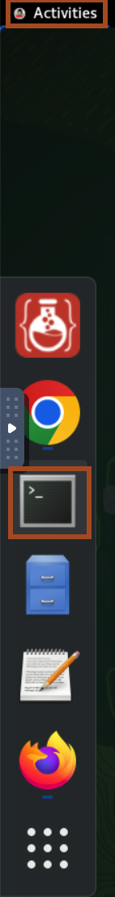
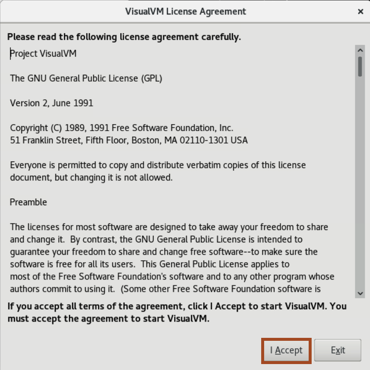
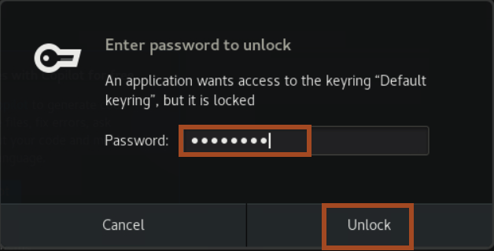
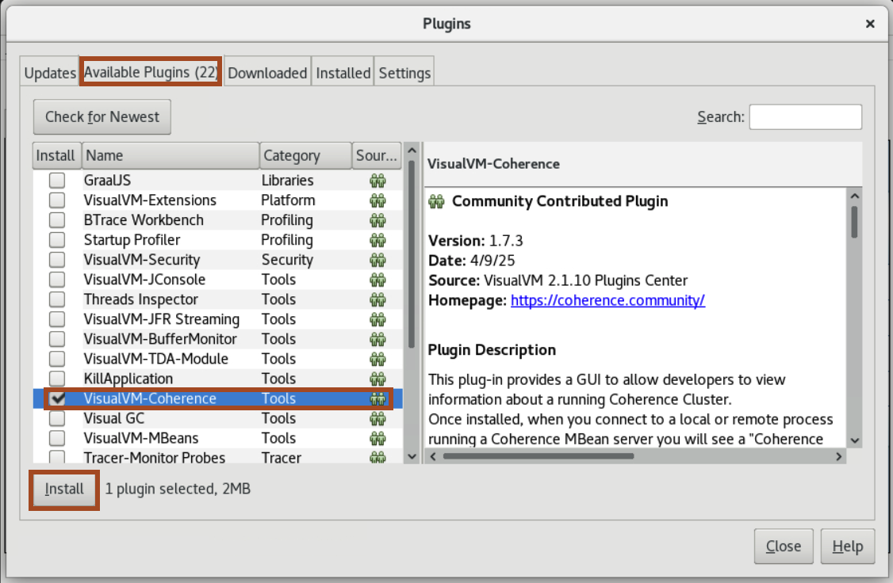
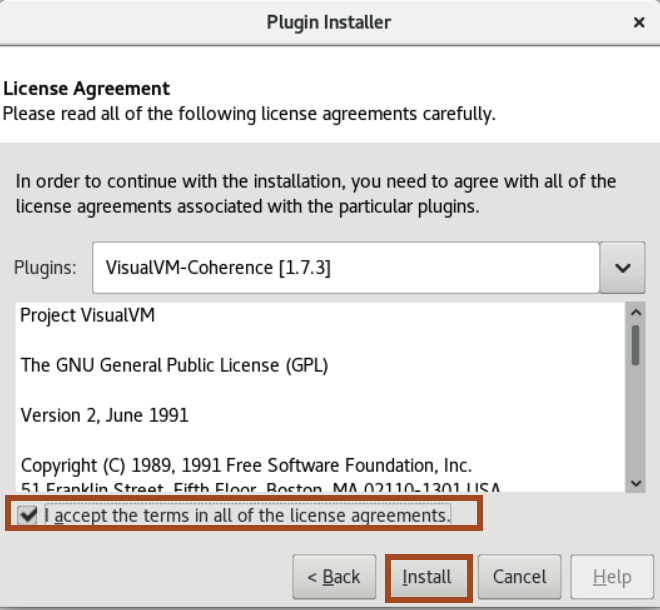
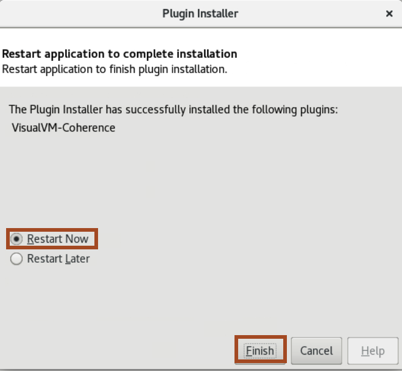

# Prepare Setup

## Introduction
In this lab, you will download and install required software like VisualVM, Basic spring application, VisualVM-Coherence plugin in VisualVM and Visual Studio Code.

Estimated Time: 10 minutes

### Objectives
* Download and Install the required resources for the workshop
* Install VisualVM-Coherence Plugin in the VisualVM

### Prerequisites
This lab assumes you have:
- An Oracle account to request the reservation for this workshop


## Task 1: Download and Install the required resources for the workshop

In this task, we download the required softwares and application source code for this workshop.

1. To open terminal in the Remote Desktop, Click **Activities** -> **Terminal**.
    

2. Copy and paste the following commands in the terminal, It will download the basic coherence-spring application source code, clone the **coherence-community** git repository, download and launch the **visualVM**, download and launch the **Visual Studio Code** in this Machine.
    ```bash
    <copy>cd ~
    curl -O https://objectstorage.uk-london-1.oraclecloud.com/p/2XfYETeWU9wsyxHXqkEr3Tx_YUh-70R1spaEhqbH_g6Rr2J4msOX11V_KC5lqhGH/n/lrv4zdykjqrj/b/ankit-bucket/o/spring-workshop.zip
    unzip ~/spring-workshop.zip
    git clone https://github.com/coherence-community/coherence-spring.git
    wget https://github.com/oracle/visualvm/releases/download/2.1.10/visualvm_2110.zip
    unzip ~/visualvm_2110.zip
    ./visualvm_2110/bin/visualvm > visual_log.txt 2>&1 &
    curl -L -o vs-code.tar.gz "https://code.visualstudio.com/sha/download?build=stable&os=linux-x64"
    tar -xvf ~/vs-code.tar.gz
    ./VSCode-linux-x64/bin/code > vs-code_log.txt 2>&1 &
    cd ~</copy>
    ```

3. In the **VisualVM License Agreement**, Click **I Accept**.
    

4. For the **Visual Studio Code**, Enter the password **welcome1** to unlock.
    


## Task 2: Install VisualVM-Coherence Plugin in the VisualVM

1. In the VisualVM, Click **Tools** -> **Plugins** from the menu.


2. The Plugin will be displayed as **VisualVM-Coherence**. If it is not present in the list then click on the Check for Newest button.


3. In the **Available Plugins** tab, select the **Install** checkbox for the **VisualVM-Coherence**. Click **Install**.
    

4. Step through and complete the plugin installer.
    

5. Select **Restart Now** and click **Finish**.
    

    > For more information about using the Coherence VisualVM plugin see the official [Coherence Documentation](https://docs.oracle.com/en/middleware/standalone/coherence/14.1.1.2206/manage/using-jmx-manage-oracle-coherence.html).

You may now proceed to the next lab.

## Acknowledgements
* **Author** -  Ankit Pandey
* **Contributors** - Maciej Gruszka, Sid Joshi
* **Last Updated By/Date** - Ankit Pandey, January 2025
