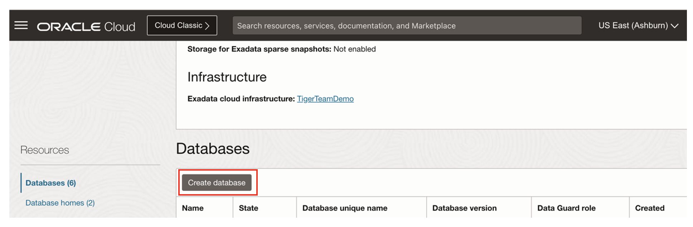
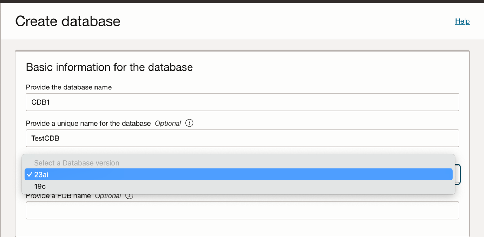
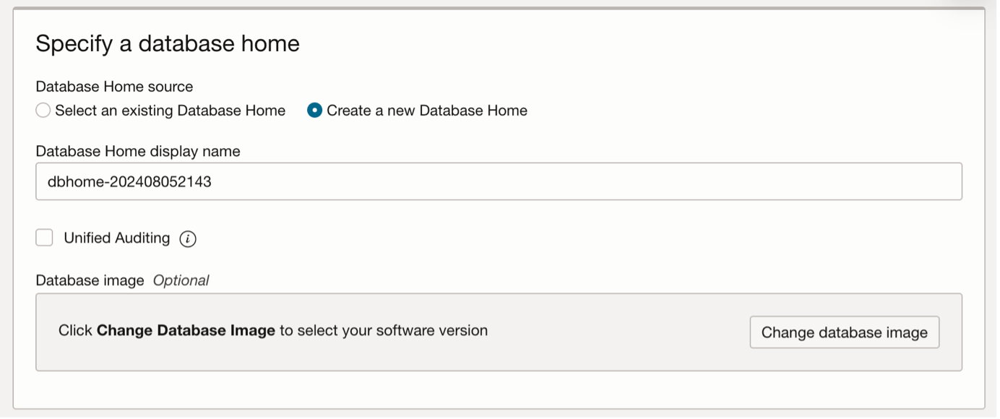
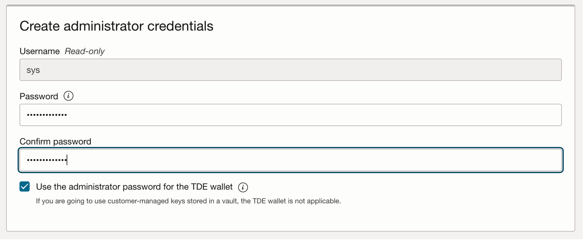
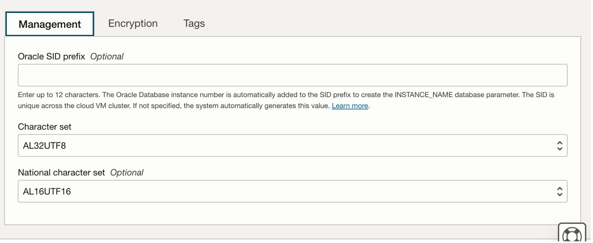
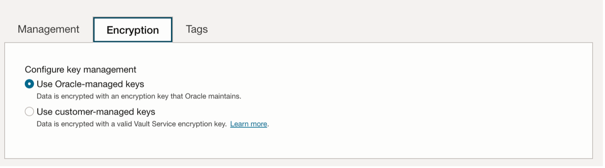
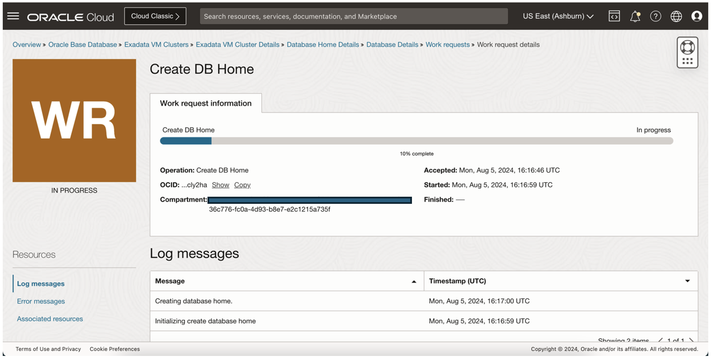

# Create Oracle Database on Exadata Database Service@Azure

## Introduction

This lab walks you through the steps to provision exadata cloud infrastructure, create a Vm cluster from Azure interface and then deploy container database (CDB) and plugable database (PDB) from OCI console. 

Estimated Time:  30 Minutes

### Objectives
In this lab, you will learn to :
* Create Oracle Database on Exadata Database Service@Azure

### Prerequisites  

This lab assumes you have:
- Created Oracle Exadata Cloud Infrastructure resource
- Created Oracle Exadata VM Cluster resource

##  Task 1: Deploy CDB and PDB Database
1. Login to Azure Portal (https://portal.azure.com) and navigate to All services. Then click on **Oracle Database@Azure**.
    Navigate to **Oracle Exadata Database Service** and select Exadata Infrastructure and then click on the VM Cluster resource created in Lab 3.
    Then click on **Go to OCI** hyperlink. 
    It will open OCI cloud console.

    

2. On OCI cloud console, scroll down to **Databases** tab and click on **Create database** button.
    It will open a window to create a new database deploymnet - CDB and PDB.

    

3. Provide name for the container database(CDB) and unique name, which is optional. 

    We have a choice to select latest version of databases i.e. 19c and 23ai.

    

4. Specify database home, either a new database home or existing one. 

    
  
5. For database deployment, there are two options for database software image.

    * **Oracle Database Software Images** and
    * **Custom Database Software Images**

    

  You can select database version from the available database versions.

    
    

6. Provide administrator password for the database. 

    You can use same password for the TDE wallet.
    
    

7. While provisioining database, you have an option to enable automatic backups on the database.  

    You can eighter use **Autonomous Recovery Service** or an **Object Storage** for the database backups.

    

    * Provide inputs for the database backup retention window. 
    
    * You can specify deletion option for backups as well after the database is terminated. 

    * Select schedule for full backup and incremental backup as per requirements. 

    * You can also specify to initiate an immediate backup after database is provisioned. 

    

8. In **Advanced-options** you can select, **Character set** and **National character set** if required. 

    

    In **Encryption** tab, please select an option for **Oracle-manged** or **Customer-managed keys**.

    Data will be encrypted with the key selected in this option. You can select customer-managed keys option , if you wan't to use your own keys for data encryption.

    

9. Click on **Create** button after providing all inputs to deploy CDB and PDB. 
    You will be able to see the statu as **Provisioining** on cloud console. 

    

    Scroll-down and click on the **Log messages** to monitor the work reuest. 

    

10. After provisioning is completed, you can see the status of CDB and PDB as available. 

    

You may now **proceed to the next lab**.

## Learn More
- You can find more information about Oracle Exadata Database @Azure [here](https://docs.oracle.com/en-us/iaas/Content/multicloud/oaa.htm)

## Acknowledgements
* **Author** - Sanjay Rahane, Principal Cloud Architect, North America Cloud Engineering
* **Contributors** -  Bhaskar Sudarshan, Director, North America Cloud Engineering
* **Last Updated By/Date** - Sanjay Rahane, August 2024