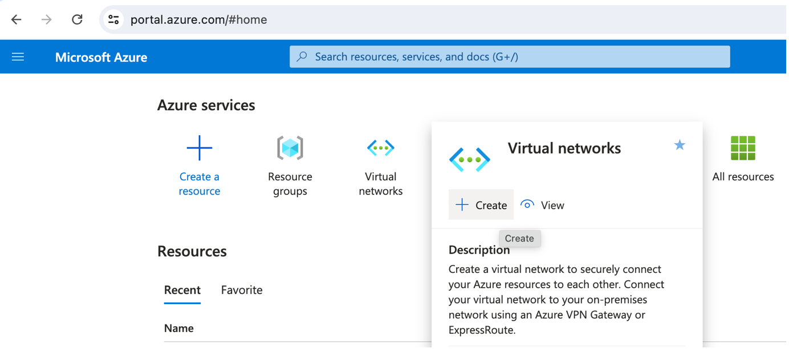
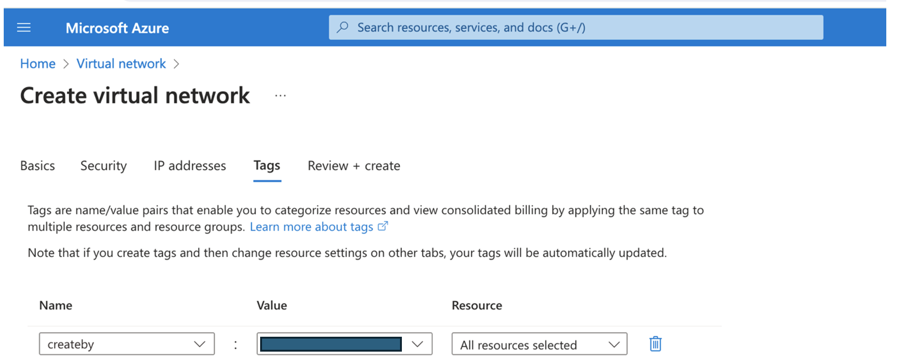

# Create Resource Group, VNet and Subnet for Oracle Exadata Database Service @Azure

## Introduction

This lab walks you through the steps required as a pre-requisites for provisioning exadata infrastructure, vm-cluster through Azure portal. It involves creating a resource group, Vnet and adding subnet in Azure as a pre-requisite steps. Subnet needs to be delegated for the Oracle Database @Azure service. Post provisioining exadata VM Cluster, PDBs and CDBs needs to be created from OCI console.

Estimated Time:  30 Minutes

### Objectives
In this lab, you will learn about, how to :
* Create a Resource Group in Azure Cloud
* Create a VNet in Azure Cloud
* Add Subnet and Delegate to Oracle Database @Azure Service

### Prerequisites  

This lab assumes you have:
- An existing Azure subscription
- Received and Accepted private offer for Oracle Database @Azure
- Created identity federation using Azure's Identity service (Microsoft Entra ID)

##  Task 1: Create a Resource Group in Azure Cloud

1. Login to Azure Portal (https://portal.azure.com) and navigate to **All services**. Then click on **Resource groups** icon. 

    

2. On ‘Resource groups’ page, click on **+Create** button.

   

3. On **'Create resource groups'** page provide details in each tab.

    * **Subscription** – select your billing subscription in directory you selected
  	* **Resource group** – Enter the name for resource group to be created
    * **Region** – Select region from the drop-down list

    

  Provide inputs to organize your resource with tagging
  * **Name** – Created By
  * **Value** – Select your email or Name

   

  On **Review + create** page, it will validate the inputs provided in previous steps. Once Validation is passed, it will create a resource group.

    

  Navigate to **Resource groups** on **Home screen** and search for the Resource group created to validate the details.

    

##  Task 2: Create a VNet in Azure Cloud

1. Navigate to **Azure Services** and select **Virtual networks**. Then click on **Create** button

   

2. On **Create Virtual Network** page, provide all required details for each tab.

    Project Details:
    * **Subscription** – select your billing subscription in directory you selected
    * **Resource group** – Enter the name for resource group created in **Task 1**

    Instance Details:
    * **Virtual network name** – Enter the name for VNet to be created
    * **Region** – Select region from the drop-down list

      

    Security: 
    * **Virtual Network encryption** - Select Virtual Network Encryption checkbox to enable the encryption of the traffic traveling within the VNet

    * **Azure Bastian** - Select Enable Azure Bastian checkbox if Bastian Server is required to connect to specific resource later.

    * **Azure Firewall** - Similar to traffic encryption and Bastian service, you can enable the Azure Firewall if required.

        

    * **IP Addresses** - There is an option to choose IPV4/IPV6 addresses for your network resources. 
Select default IP Address range or provide new Ip range based on the requirement. Here we are using default IP range for IP addresses as shown in below screenshot.

      

  Provide inputs to organize your resource with tagging
  * **Name** – Created By
  * **Value** – Select your email or Name    

      

 On **Review + create** page, it will validate the inputs provided. Once Validation is passed, it will create virtual network. 
      

  Once all required resources are created for virtual network, deployment status will get changed to **Complete**.

      

  Navigate to Virtual Network and search for the name of the VNet created to see details about it.

      

##  Task 3: Add Subnet and Delegate to Oracle Database @Azure Service
    
1. Select VNet created in Task 2 and click on **‘Add a subnet'**. It will open a page to provide inputs. 

    
      

      Provide name for the subnet to be created and then select Ip address range based on the size of network required for the deployment.

      

      You need to delegate this subnet to Oracle Database @Azure service. 
      Under Subnet Delegation option, select **Oracle.Database/networkAttachments** from the drop down list.

      

      Click on **Add** button to add this subnet to the VNet.

      

You may now **proceed to the next lab**.

## Learn More
- You can find more information about Oracle Exadata Database @Azure [here](https://docs.oracle.com/en-us/iaas/Content/multicloud/oaa.htm)

## Acknowledgements
* **Author** - Sanjay Rahane, Principal Cloud Architect, North America Cloud Engineering
* **Contributors** -  Bhaskar Sudarshan, Director, North America Cloud Engineering
* **Last Updated By/Date** - Sanjay Rahane, August 2024