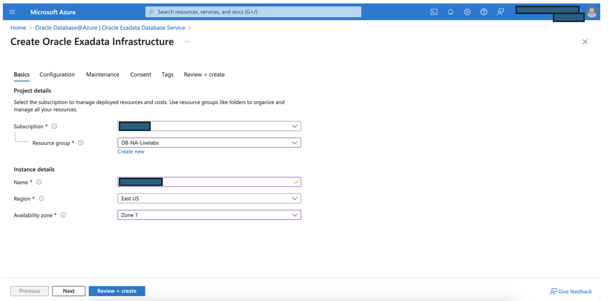
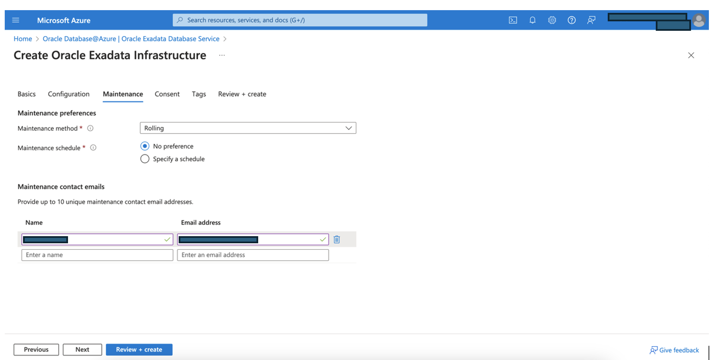
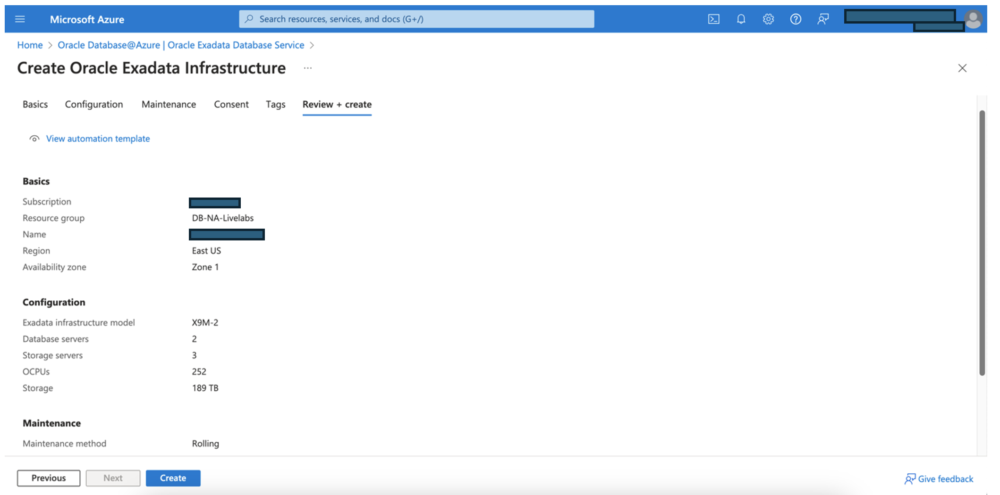

# Create Oracle Exadata  Infrastructure resource

## Introduction

This lab walks you through the steps to provision exadata cloud infrastructure resource. 

Estimated Time:  45 Minutes

### Objectives
In this lab, you will learn to :
* Provision an Exadata Cloud Infrastructure resource using Azure interface

### Prerequisites  

This lab assumes you have:
- A resorce group created
- VNet created and delegated client, backup subnets added for Oracle Database

##  Task 1: Provision an Exadata Cloud Infrastructure resource

1. Login to Azure Portal (https://portal.azure.com) and navigate to All services. Then click on **Oracle Database@Azure**.

    

2. On Oracle Database Services @Azure overview page, please click on **Oracle Exadata Database Service**.
   It ill open a new page with an option to create Exadata Cloud Infrastructure instance.

    

3. Click on the **+Create** button to start with provisioining exadata infrastructure.

    

4. On **Create Exadatada Infrastructure** page, provide inputs for each tab.

    Project Details:
    * **Subscription** – select your billing subscription in directory you selected
    * **Resource group** – Select the name for resource group
    
    Instance Details:
    * **Name** – Enter the name for Exadata Infrastructure instance
    * **Region** – Select region name
    * **Availability Zone** - Select availability zone

    

5. Provide Exadata Infrastructure configuration details as below:

    * **Exadata Infrastructure Model** – Only X9M-2 model of Exadata Infrastructure is available for DB@Azure
    * **Database Servers** – Minimum two database servers are mandatory to provisioing exadata infrastructure which support Real Application Cluster (RAC) 
    * **Storage Servers** - Be default threee storage servers will be created. Additional storage server can be added later.
    * **OCPUs** - Select number of OCPUs to enable.
    * **Storage** - Enter the required storage in terrabytes(TB). 

    

6. In **Maintenance** Tab input parameters as below:

      * **Maintenance method** : You can choose rolling or non-rolling type based on your preference.
      * **Maintenance schedule** : You can specify the scredule preference if any.
      * **Maintenance contact** :  Provide contact person email address who will receive updated on maintenance on the exadata infrastructure.
  

  

7. Provide consent to create an exadata infrastructure resource.

    

8. Provide inputs to organize your resource with tagging
      * **Name** – Created By
      * **Value** – Select your email or Name   

   

9. On **Review + create** page, it will validate the inputs provided. Once Validation is passed, click on **Create** button. 
   It will create exadata infrastructure. 

    

You may now **proceed to the next lab**.

## Learn More
- You can find more information about Oracle Exadata Database @Azure [here](https://docs.oracle.com/en-us/iaas/Content/multicloud/oaa.htm)

## Acknowledgements
* **Author** - Sanjay Rahane, Principal Cloud Architect, North America Cloud Engineering
* **Contributors** -  Bhaskar Sudarshan, Director, North America Cloud Engineering
* **Last Updated By/Date** - Sanjay Rahane, August 2024