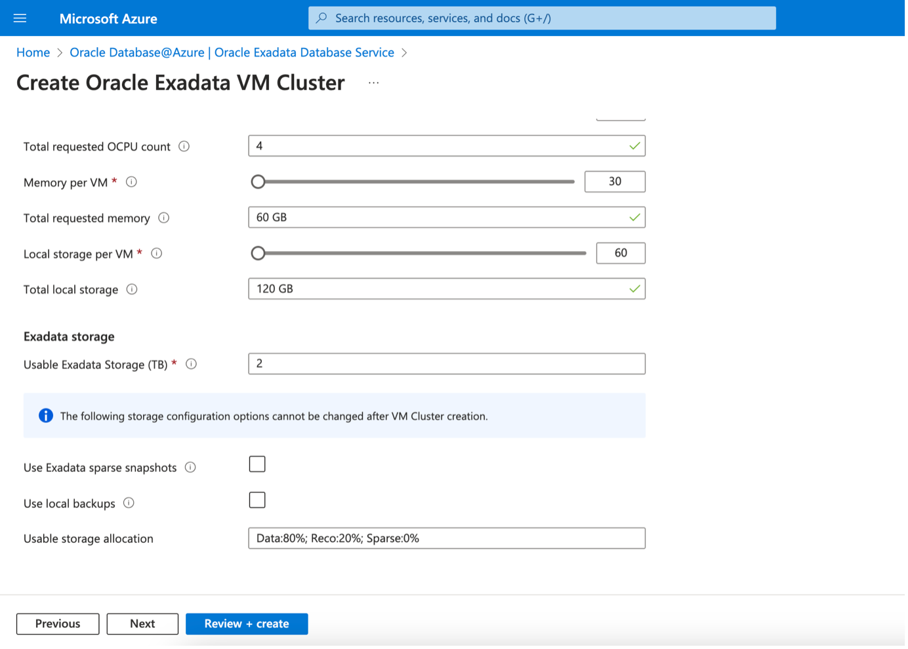
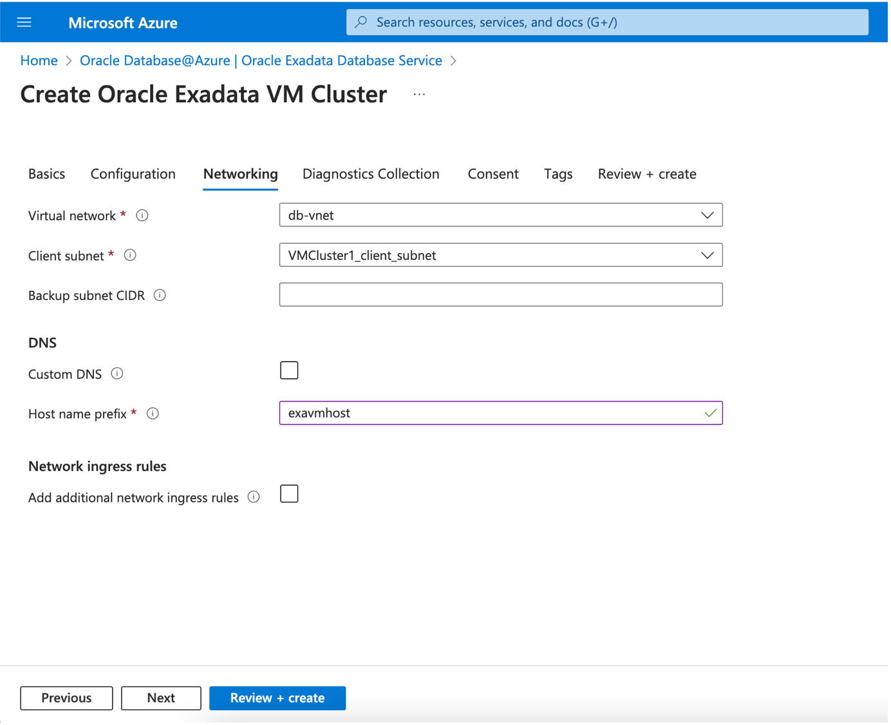
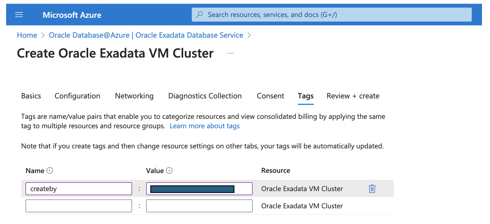

# Create Oracle Exadata VM Cluster resource

## Introduction

This lab walks you through the steps to provision exadata cloud infrastructure Vm cluster from Azure interface.

Estimated Time:  45 Minutes

### Objectives
In this lab, you will learn to :
* Create Exadata VM Cluster using Azure interface

### Prerequisites  

This lab assumes you have:
- Exadata Cloud Infrastructure resource created
- A resorce group created
- VNet created and delegated client, backup subnets added for Oracle Database

##  Task 1: Create Exadata VM Cluster

1. Login to Azure Portal (https://portal.azure.com) and navigate to All services. Then click on **Oracle Database@Azure**.
    Navigate to **Oracle Exadata Database Service** and select Exadata Infrastructure to create a VM cluster.
    Click on **+Create** which will open a page to provide inputs for creating a VM Cluster.

      

2. On **Create Oracle Exadatada VM Cluster** page, provide inputs for each tab.

    Project Details:
    * **Subscription** – select your billing subscription in directory you selected
    * **Resource group** – Select the name for resource group
    
    Vm Cluster Details:
    * **Name** – Enter the name for Vm Cluster
    * **Region** – Select region name
    * **Cluster name** - ENter name for the VM cluster
    * **Exadata Infrastructure** - Select exadata infrastructure created in **Task 1**
    * **License type** - You can choose licence type as **BYOL** or **Licence included** option
    * **Time zone** - Select time zone as applicable, default is UTC.

      

    For ssh key, provide name to create a new key or you can provide existing key.

      

      
  3. Provide inputs for **Configuration** as shown in screenshot to configure the VM cluster instance.

      
      

      You can update the storage configuration details if want to setup sparse snapshots and local backups. Data, reco and sparce disk groups will be allocated accordingly. By default, Data diskgroup allocation is 80%, Reco - 20% and Sparse - 0% of total available disk group storage capacity.

      
  
  4. In **Networking** tab, provide inputs for below:

      * **Virtusl network** - VNet created in Lab1 of this workshop.
      * **Client subnet** - A delegated subnet for Oracle Database @Azure
      * **Host name prefix** - Host name prefix for the VM cluster hosts

     

  5. Choose approapriate option to enable diagnostics and logs on the VM cluster resource. 

   
       

  6. Select the check-box to aggree on the terms of service.
    
    

  7. Provide inputs to organize your resource with tagging
      * **Name** – Created By
      * **Value** – Select your email or Name 

    

  8. On **Review + create** page, it will validate the inputs provided. Once Validation is passed, click on **Create** button. 
   It will create exadata VM cluster resource. 

    

You may now **proceed to the next lab**.

## Learn More
- You can find more information about Oracle Exadata Database @Azure [here](https://docs.oracle.com/en-us/iaas/Content/multicloud/oaa.htm)

## Acknowledgements
* **Author** - Sanjay Rahane, Principal Cloud Architect, North America Cloud Engineering
* **Contributors** -  Bhaskar Sudarshan, Director, North America Cloud Engineering
* **Last Updated By/Date** - Sanjay Rahane, August 2024