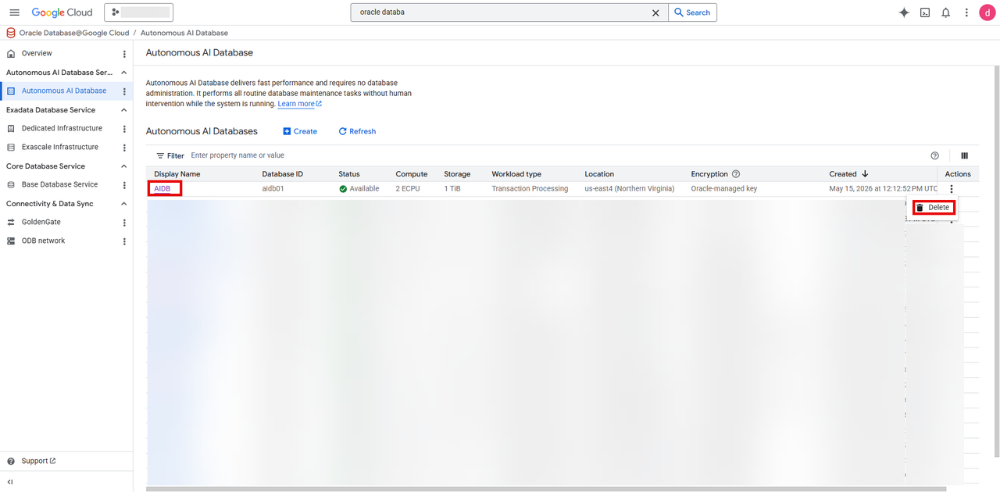
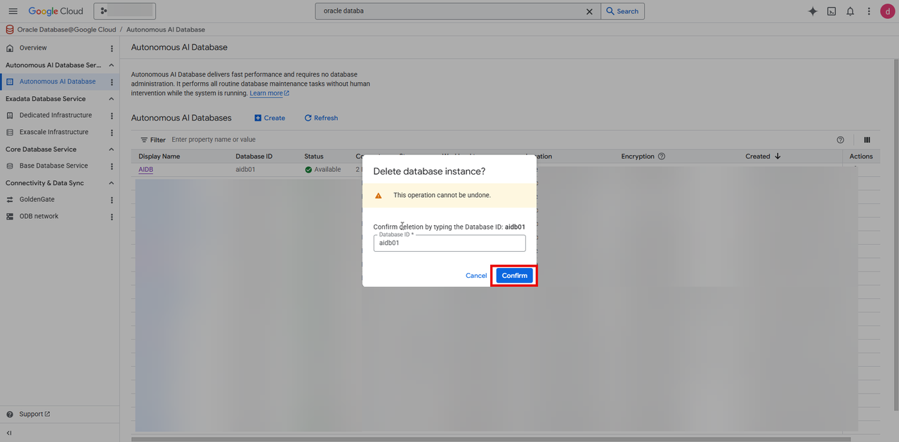

# Clean Up Resources

## Introduction

In this lab, you will delete the resources created in the previous labs.

Estimated Time: About an 10 minutes.

### Objectives

- Delete resources created during the workshop.

### Prerequisites

This lab assumes you have successfully completed all previous labs.

## Task 1: Delete Autonomous AI Databases (Serverless) 
1. From the Oracle AI Database@Google Cloud dashboard, select your Autoomous AI Datatbase

    

2. From the three dot menu under Actions  click on Delete

 

The deletion will take about 5 minutes

 **Congratulations! You have completed the workshop!**

## Acknowledgements
- **Author:** Devinder Singh, Sr Principal Soltiuons Architect, Multicloud
- **Last Updated By/Date:** Devinder Singh, May 2026
